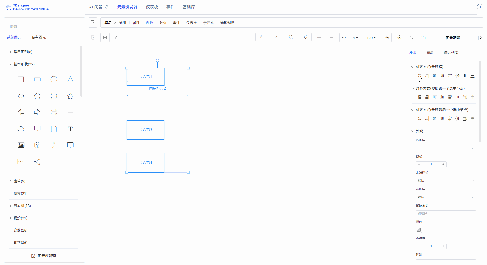

# 画布

## 设置画布属性

1. **默认颜色**：预先设置默认颜色，拖拽到画布的图元（基础图形、文字、icon）自动统一默认颜色。
2. **背景**：背景图片、背景颜色
3. **网格**：背景网格、网格颜色、网格大小、网格角度
4. **标尺**：开启标尺、标尺颜色

## 设置画布布局

选择多个图元时，你可以设置画布的布局，可以进行对齐操作：左对齐、右对齐、顶部对齐、底部对齐、垂直居中、水平居中、等距分布左右对齐、等距分布上下对齐、相同大小、格式刷。

## 查看图元列表

这里列出了整个画布上的所有图元，如果点击其中一个，这个图元就被选中，而且在画布上居中显示。

1. **可编辑**：可以编辑属性事件
2. **被锁定**：可以执行事件和交互
3. **被禁用**：不能选中，完全不触发任何事件，可以当背景底图。
