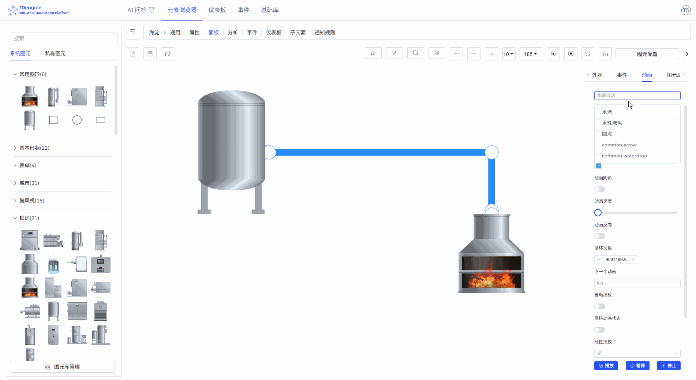

# 组态面板

## 总体介绍

TDengine IDMP 支持 Grafana 风格的面板之外，还支持工业场景流行的组态，让业务人员通过“拖拉拽”的形式“零代码”实现 Web 组态、SCADA 等解决方案，可视化的呈现设备、流程的当前运行状态。目前它支持 2D 与 2.5D，今后将支持 3D。它与 IDMP 的资产模型无缝结合，能快速交付方案、降低开发成本。它具有如下的特点：

1. **直观易用的拖拽编辑**：无需技术背景，像搭积木一样轻松创建监控画面
2. **智能数据驱动**：配置一次即可让实时数据自动更新画面，减少重复操作
3. **丰富的动画效果**：内置多种动画，支持自定义，让监控画面生动直观
4. **灵活的状态管理**：通过数据变化自动切换设备状态，如运行/停止/报警
5. **可扩展的图形库**：支持上传自定义图形（JS、SVG、图片等），满足特殊需求
6. **强大的性能表现**：单画面可支持上万个图元，满足大型工业场景需求

下面是一个典型的组态编辑界面：

整个编辑画面由几大块组成：

1. **画布**：画布即中央的绘画区域，将图元拖拽到画布进行编辑，绘制组态图。画布有各种属性，比如背景颜色、网格、标尺等，他们都可以个性化配置。
2. **图元**：它是画布的基本单元，图形表达的基本元素，图上的各种设备、组件都是图元。图元有各种属性，比如颜色、背景颜色、大小、显示的文本、进度 (Progress)、值 (value)、状态 (State)等。
3. **工具箱**：顶部工具箱，可使用钢笔、铅笔、放大镜、鹰眼地图（缩略图）、连线起点、连线终点、连线线宽、视图比例、自动锚点、禁用锚点等画图工具。
4. **图元库**：有基础图形库和行业图形库，而且容许用户自己上传绘制的图形。
5. **配置**：对画布、画布上的各个图元进行配置，比如颜色、背景颜色、字体、事件、动画等、可以修改其显示、交互行为等。

本文档仅对基本概念以及基本操作做一简单介绍，更多的细节需要自己多用才能发现。

## 创建组态

选择元素，然后选择面板，点击`新建面板`，然后选择`组态`即进入组态编辑界面。

设计组态，分为如下步骤：

1. 设置画布的属性，包括布局、颜色、背景颜色、网格等
   
2. 从图元库选择图元，拖拽到画布
3. 编辑、配置图元，包括：
   - 给图元配置文本、颜色、背景颜色等
   - 给图元配置事件，设置事件类型（比如点击、图元值变化）、事件行为（比如设置图元属性、播放动画）、触发条件（比如阈值判断），让数据驱动图元的展示效果
   - 给图元加上动画效果，系统内置了上下跳动、左右跳动、心跳、旋转等多种动画效果，你可以自定义动画。
   - 配置图元属性，包括值、进度、进度颜色、状态等，并且与 IDMP 元素的属性绑定，这样采集的数据就能实时驱动图元的展示。

4. 把有关系的图元连线起来，可以配置连线类型以及连线动画
5. 编辑过程中，可以预览，编辑完后，保存即可

这些步骤不是需要固定按照顺序执行，可以打乱。

## 图元

图元是构成监控画面的基本元素，就像乐高积木一样，每个设备图标、封闭图形都是一个图元。通过组合不同的图元，您可以构建出完整的工业监控系统。

### 外观设置

#### 图元样式

角度：设置尖角与圆角，值的范围：0~1

旋转：设置图形的旋转角度

进度：任意封闭图形，都可以当进度条：矩形、圆、svg、封闭连线、或其他任意封闭图形，值的范围：0~1

#### 图片外观样式

可以上传图片作为图元的外观或者背景图片。

#### 字体图标外观样式

可设置图元上显示文字的字体、大小、颜色、样式、粗细、行高、所在位置等。

### 事件

创建组态的关键一步是事件的定义，包括事件类型、事件动作与触发条件。事件类型有鼠标移入、鼠标移出、选中等，但最重要的是“图元属性值变化”。图元的属性可以与 IDMP 元素的一个属性绑定，当这个值的某个触发条件满足时，就可以触发指定的事件动作。而事件动作包括开始动画、停止动画等，但最重要的动作是“设置图元属性”，可以改变图元的展现形式，比如图元的颜色、背景颜色、显示的文本等。下面挨个进行详细说明。

#### 添加事件

添加相应事件，即可实现相应的事件行为。tip: 部分事件行为只有在查看时才展示效果，编辑时无法展示。

事件类型：鼠标移入、鼠标移出、选中、取消选中、鼠标按下、鼠标弹起、单击、双击、图元属性值变化。

事件行为：打开链接、设置图元属性、执行动画、暂停动画、停止动画、执行 JavaScript、执行 Window 函数、自定义消息。

如下图，为画布中图元设置了两个事件：当鼠标移入时，将背景色设置为绿色，当鼠标移出时，恢复背景色。

#### 条件触发器

可以为事件添加触发条件。触发条件最常用的是“关系运算”，可以对图元的属性，包括值、进度、状态、文本进行逻辑判断（其他属性不提供逻辑判断的支持）。

如下图，设置当图元文本大于 30 时鼠标移入才会触发事件。图中演示，文本为 40 的图元满足条件，会触发背景变绿，而文本为 20 的图元不满足，鼠标移入时并不触发背景变绿。

### 动效

IDMP 内置很多种图元动画效果，也容许逐帧自定义动画。

#### 图元动画

给图元添加动画、鼠标提示，设置动画时长、动画效果、循环次数、下个动画 tag、是否自动播放、是否保持动画状态。

#### 内置动画

无、上下跳动、左右跳动、心跳、成功、警告、错误、炫耀、旋转、自定义。

#### 自定义动画

通过新增动画帧，逐帧自定义动画。

#### 鼠标提示

鼠标悬浮在图元上时，显示鼠标提示信息。支持两种方式：

1. 参考 Markdown 语法编写鼠标提示
2. 编写 Mark 函数，显示函数的返回值

### 图元组合、状态

在画布中可选择多个图形，然后右键菜单选择组合/组合为状态，可拼接组合为任意想要的方式，可以对组合图元中的任意子图元进行图元的处理操作，有利于图元复用。

两个或更多图元组合为状态，是极为有效的表现方式。例如开和关，风机的转动与停止就可以组合为一个状态。不同颜色的报警灯，比如红、黄、绿，可以组合为一个状态。可以通过事件或绑定IDMP元素属性来驱动状态的修改，实现动效。

### 图元属性

图元有很多属性，包括颜色、文本字体、字体颜色、进度等，这些通用属性都可以在外观设置里直接手动进行设置。但你可以通过配置，自动控制如下图元属性：背景颜色、颜色、文本颜色、文本、X、Y、高度、宽度、可见、进度值、进度颜色、值、状态、旋转、禁用等。

上述的属性里，其中的文本、进度值、状态、值四个属性，还可以在事件的事件触发条件里进行逻辑判断。

事件的设置里，你可以通过选择“设置图元属性”事件行为来自动控制图元的属性。还有一种方式，就是将这些属性与IDMP的元素属性进行绑定。

绑定变量，能快速实现实时数据动态展示。如下图所示，添加属性绑定，将图元的 “文本” 绑定到元素 “em-1” 的电压。当元素电压采集值变化时，图元的文本在刷新数据时，也会跟着实时变化。

TIPS: 绑定变量之前，建议选择合适的输入方式，手动输入属性值，测试自己想要的效果，比如进度条的变化，状态的改变，事件的触发等。等测试达到自己想要的效果后，再将属性绑定到IDMP某个元素的属性。投入生产运营的组态，图元的属性一定是与元素的属性进行绑定了的。

## 连线

连线用于表示设备之间的物料流动、信号传递或逻辑关系。例如：

1. 管道连接表示物料输送
2. 虚线连接表示信号传输
3. 不同颜色的连线表示不同介质

通过连线动画，您可以直观展示物料的实时流动状态。

### 连线的绘制

#### 钢笔绘制连线

选择线型，再点击钢笔，可激活使用某一个线型的绘制。

开始：单击左键；

暂停：单击右键 或 enter；

结束：esc。

##### 曲线、线段、直线、脑图曲线

可以使用钢笔绘制不同类型的曲线，也可以选中一条连线，修改其线型。

##### 横线

按下快捷键shift，点击鼠标左键绘制，右键结束绘制(连线类型选择直线)。

##### 竖线

按下快捷键ctrl，点击鼠标左键绘制，右键结束绘制（连线类型选择直线）。

##### 斜线

连线类型选择直线，选择钢笔，鼠标左键点击绘制起点，按住快捷键ctrl+shift，鼠标移动角度
（以15°为递增角度），左键单击绘制第二个点，右键结束绘制。

#### 铅笔绘制连线

使用铅笔可以绘制任意线型。点击“铅笔”激活铅笔工具，在画布上按下左键开启绘制，将会按照鼠标移动轨迹绘制连线，松开鼠标结束绘制。

#### 连接图元

鼠标悬浮在某一个图元上，激活锚点，在某一个锚点上按下鼠标拖拽到另一个图元的锚点上，松开鼠标，即可在两个图元的锚点间绘制一条曲线。

#### 连线变图元

在连线上点击鼠标右键，选择“转换为节点”。

### 切割/合并连线

切割连线：选中线，鼠标移入要断开的线锚点，点击，按下 S 键。

合并连线：线连接线时，拖动当前选中连线连接端，对齐另一条连线连接端，按下 alt 键，鼠标抬起，结束 alt 键。

### 连线样式

选中连线后，在右侧属性配置区域可设置连线的外观样式：

- 线条样式：实线、虚线
- 连线类型：曲线、折线、直线
- 连接样式：斜角、圆角、默认
- 线条渐变：无、线性渐变
- 线条颜色、浮动颜色、选中颜色
- 线条宽度
- 背景：纯色背景、线性渐变、径向渐变
- 背景颜色、浮动背景颜色、选中背景颜色
- 透明度：0-1
- 锚点颜色、锚点半径（≥0）
- 阴影颜色、阴影模糊、阴影X偏移、阴影Y偏移
- 边框颜色、边框宽度（≥0）

### 连线动画

IDMP 为连线内置了三种动画效果，让画面更有动效。

- 动画效果：水流、水珠流动、圆点。
- 动画线宽（≥0），动画颜色，动画速度，反向流动，循环次数。
- 下个动画：tag，自动播放，保持动画状态，线性播放：是/否。

## 锚点

锚点是保持设备连接的"魔术扣"，确保当您移动设备图元时，连接的管线会自动跟随调整，保持画面整洁。

### 添加/删除锚点（A）

图元和连线都可以添加/删除锚点。

键盘按下快捷键“A”，鼠标移入图元，点击鼠标左键即可添加锚点。

键盘按下快捷键"A"，鼠标移入锚点，呈现如下状态，点击鼠标左键，可以删除锚点。

### 移动锚点（G）

将光标移动到锚点上，按一下快捷键 G，拖动鼠标完成锚点移动。

### 手柄

#### 手柄的作用

手柄可以精准调整局部形态，不会破坏曲线其他区段的形状，支持对曲线细节进行精细化微调。

1. **控制曲线弯曲方向**：手柄的指向决定曲线在该锚点处的进出方向，曲线会沿手柄延长线自然过渡，避免生硬折角。
2. **调节曲线弧度与曲率**：拖动手柄改变长度与角度，可直接调整曲线的弯曲程度：手柄越长，曲率越平缓；手柄越短，曲率越陡峭。
3. **实现平滑过渡与尖角切换**：双侧对称手柄：可制作连续、流畅的平滑曲线；单侧独立调节：可在同一锚点处实现折线 + 曲线的混合效果，满足复杂造型需求。

#### 添加手柄（H）/ 删除手柄（D）

点击连线上的锚点，键盘按下快捷键 H 可以添加手柄，来调节连线。

激活手柄状态下，键盘按下快捷键 D 可以删除手柄

激活手柄状态下，键盘按一下 Shift 键，切换三种不同的手柄类型：

1. 两端手柄完全对称
2. 一端手柄可以任意伸缩长度
3. 一端手柄可以任意伸缩长度和变换角度

### 自动锚点

在工具箱中点击“自动锚点”按钮，激活自动锚点。此时在画布中连线，此连线两端如果没有锚点，则自动找最近的锚点自动连接。

### 禁用锚点

禁用锚点，即不显示锚点。

## 画布

### 设置画布属性

1. **默认颜色**：预先设置默认颜色，拖拽到画布的图元（基础图形、文字、icon）自动统一默认颜色。
2. **背景**：背景图片、背景颜色
3. **网格**：背景网格、网格颜色、网格大小、网格角度
4. **标尺**：开启标尺、标尺颜色

### 设置画布布局

选择多个图元时，你可以设置画布的布局，可以进行对齐操作：左对齐、右对齐、顶部对齐、底部对齐、垂直居中、水平居中、等距分布左右对齐、等距分布上下对齐、相同大小、格式刷。

### 查看图元列表

这里列出了整个画布上的所有图元，如果点击其中一个，这个图元就被选中，而且在画布上居中显示。

1. **可编辑**：可以编辑属性事件
2. **被锁定**：可以执行事件和交互
3. **被禁用**：不能选中，完全不触发任何事件，可以当背景底图。

## 工具箱

### 钢笔

1. 开始：单击左键
2. 暂停：单击右键 或 enter
3. 结束：esc
4. 闭合/取消闭合：enter

### 铅笔

1. 开始：连续拖动左键
2. 暂停：释放左键
3. 结束：esc
4. 闭合/取消闭合：enter

### 放大镜

用来观察图中细节

### 鹰眼地图（缩略图）

组态图的全局视图，鼠标点击鹰眼地图，可以在画布中快速切换中心位置。

## 图元库

IDMP 系统已经包含了基础图形库和一些行业的图元库。在您使用过程中如果有更多需求，可以自己制作图元上传，也可联系 IDMP 团队，我们可以提供相应的设计支持。

### 系统图元库

IDMP 内置的图元库，能满足大部分行业的基本需求。 格式有三种：原生代码（JS）、阿里字体（iconfont）、图片（svg、gif），video 标签支持 MP4、WebM、Ogg 三种格式。

### 私有图元库

IDMP 组态软件图形库是一种可扩展、开放性的图形库，可根据不同的需求定制各种酷炫的组件效果和场景。支持创建图元库，上传图元等。

### 图元库管理

图元库管理可以配置是否显示图元库，可以仅显示您所需要的图元库。

## 优秀案例

