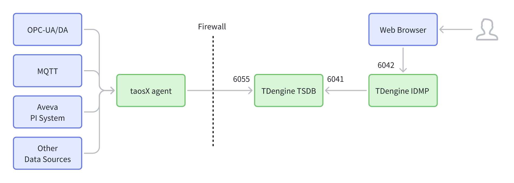
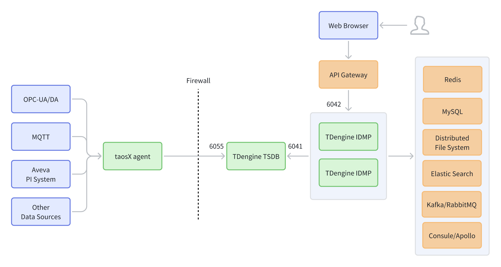

# 部署架构

本文按三种典型形态介绍 TDengine IDMP 部署：**单实例部署**、**高可用最简部署**、**高可用最复杂部署**。内容包含总体说明、具体介绍、组件说明、端口说明与部署建议。

---

## 1. 总体说明

TDengine IDMP 的部署通常由以下部分组成：

- **数据采集侧**：对接 OPC-UA/DA、MQTT、Aveva PI、其他数据源，通过 **taosX agent** 统一采集与转发数据。
- **服务侧**：**TDengine IDMP**（可高可用和多实例）提供业务能力；**TDengine TSDB** 承载时序数据写入与查询。
- **接入与治理层（可选）**：**API Gateway** 作为对外统一入口，提供路由、鉴权与流量治理。
- **外部基础依赖（按场景）**：Redis、MySQL、分布式文件系统，以及可选的检索、消息队列、配置中心等。
- **网络边界**：图中虚线 **Firewall** 表示隔离边界；跨边界通信应最小化开放端口并明确放通策略。

---

## 2. 具体介绍

### 2.1 单实例部署

**部署介绍：**  
单实例部署形态以“快速交付、低复杂度”为目标，通常用于 PoC、演示验证、小规模交付或封闭网络环境。TDengine IDMP 以单实例方式对外提供 Web/API 服务，采集侧通过 taosX agent 将数据写入 TDengine TSDB，IDMP 通过内部端口访问 TSDB 完成数据管理与查询。该形态组件最少、链路最短、部署与运维成本最低，但对外暴露面相对更大且存在单点风险，生产场景一般会进一步引入网关与多实例以增强安全与可用性。

**链路概览：**

- Web Browser →（穿越 Firewall）→ **TDengine IDMP（6042）**
- taosX agent →（穿越 Firewall）→ **TDengine TSDB（6055）**
- **TDengine IDMP → TDengine TSDB（6041）**

**特点：**

- 组件更少、链路更短，适合 PoC/小规模/封闭网络。
- 对外暴露面相对更大（浏览器直连 IDMP），统一鉴权/限流/审计需要在服务侧或外部设施分别实现。
- 扩展到多实例与灰度发布时，通常需要引入额外的接入层（如网关或负载均衡）。

---

### 2.2 高可用最简部署

**部署介绍：**  
高可用最简部署以“生产可用的最小闭环”为目标，在保持较低部署复杂度的同时引入 API Gateway 作为统一入口与治理层，对外仅暴露网关并将请求路由到后端 IDMP，从而减少 IDMP 直接暴露并便于统一鉴权、限流与审计；同时按常见生产需求配套 Redis、MySQL 与分布式文件系统等基础依赖，IDMP 可按需扩展为高可用多实例以提升可用性与吞吐，适合从 PoC 平滑过渡到生产并为后续能力扩展预留空间。

**链路概览：**

- Web Browser →（穿越 Firewall）→ **API Gateway** → **TDengine IDMP（6042）**
- taosX agent →（穿越 Firewall）→ **TDengine TSDB（6055）**
- **TDengine IDMP ↔ TDengine TSDB（6041）**
- IDMP 依赖（最简展示）：**Redis / MySQL / Distributed File System**

**特点：**

- 对外统一入口：外部仅需访问网关，减少 IDMP 直接暴露。
- 保留最常见的三类基础依赖，便于快速落地生产最小闭环。
- 适合希望“先规范入口治理、再逐步扩展周边能力”的部署路径。

---

### 2.3 高可用最复杂部署

**部署介绍：**  
高可用最复杂部署面向中大型生产环境与企业级集成需求，在“带网关统一接入”的基础上将 TDengine IDMP 规划为高可用多实例以获得更高吞吐与可用性，并按业务规模与治理要求引入更完整的周边能力（如检索、消息队列、配置中心等）以支撑异步解耦、统一检索分析、动态配置与服务治理；该形态部署与运维复杂度更高，但在稳定性、扩展性、审计与可观测性方面更完善，适合多系统集成、并发与容量持续增长、对可靠性和治理能力要求较高的场景。

**链路概览：**

- Web Browser →（穿越 Firewall）→ **API Gateway** → **TDengine IDMP（多实例）**
- taosX agent →（穿越 Firewall）→ **TDengine TSDB（6055）**
- **TDengine IDMP → TDengine TSDB（6041）**
- IDMP 外部依赖（完整展示）：**Redis、MySQL、Distributed File System、Elastic Logdash Search、Kafka/RabbitMQ、Consule/Apollo** 等

**特点：**

- 网关承接统一接入与治理；IDMP 多实例提升吞吐与高可用。
- 周边依赖更完整，可满足检索分析、异步解耦、动态配置/服务发现等企业级能力。
- 适用于中大型生产环境、审计与稳定性要求高、需要多系统集成的场景。

---

## 3. 重点组件说明

### 3.1 API Gateway

**定位：**外部访问与内部服务之间的统一入口与治理层。

**典型职责：**

- **统一入口**：对外暴露单一地址/端口，减少后端服务直接暴露。
- **路由与负载均衡**：将请求分发至 IDMP 实例和 TSDB 实例（支持水平扩展）。
- **安全控制**：TLS 安全证书、统一鉴权（Token/SSO）、IP 访问控制等。
- **流量治理**：限流、熔断、重试、超时、灰度发布。
- **观测与审计**：统一接入日志、指标与链路追踪，便于排障与审计。

---

### 3.2 外部依赖组件

- **Redis**：缓存与短期状态（也常用于分布式锁、计数器等）。
- **MySQL**：关系型元数据（用户与权限、配置、任务定义、业务元信息等）。
- **Distributed File System**：文件/对象持久化（元数据、上传图元、导入导出文件、上传文件、设备文档等）。
- **Elastic Search**：集中索引管理和搜索。
- **Kafka/RabbitMQ**：异步消息与事件总线（解耦、削峰、任务编排、通知）。
- **Consule/Apollo**：服务治理/配置中心（服务发现、动态配置、配置版本管理）。

---

## 4. 端口说明

实际端口以部署配置与版本为准；下列为图示中表达的典型访问关系：

- **6042**：Web/网关 → **TDengine IDMP** 的访问端口（API/管理入口）。
- **6041**：**TDengine IDMP → TDengine TSDB** 的内部交互 websocket 端口。
- **6055**：**taosX agent → TDengine TSDB** 的数据写入端口。

---

## 5. 部署建议

1. **PoC/演示选单实例，生产建议高可用部署**  
   单实例部署适合快速验证；生产环境优先选择"高可用最简部署"并视需求演进到"高可用最复杂部署"。

2. **最小暴露面原则**  
   外网/跨防火墙访问优先仅开放网关入口；内部端口（如 6041）仅内网放通。

3. **IDMP 建议可横向扩展**  
   需要高可用/高并发时使用多实例，并在网关层完成负载均衡与会话策略（按实际鉴权方式选择）。

4. **外部依赖按可用性规划**  
   Redis/MySQL/DFS 建议配置备份与高可用；启用 MQ/配置中心/检索后需纳入监控告警与容量规划。

5. **统一观测**  
   建议对网关、IDMP、TSDB 与关键依赖统一采集日志与指标，建立告警与追踪链路，避免故障定位困难。
