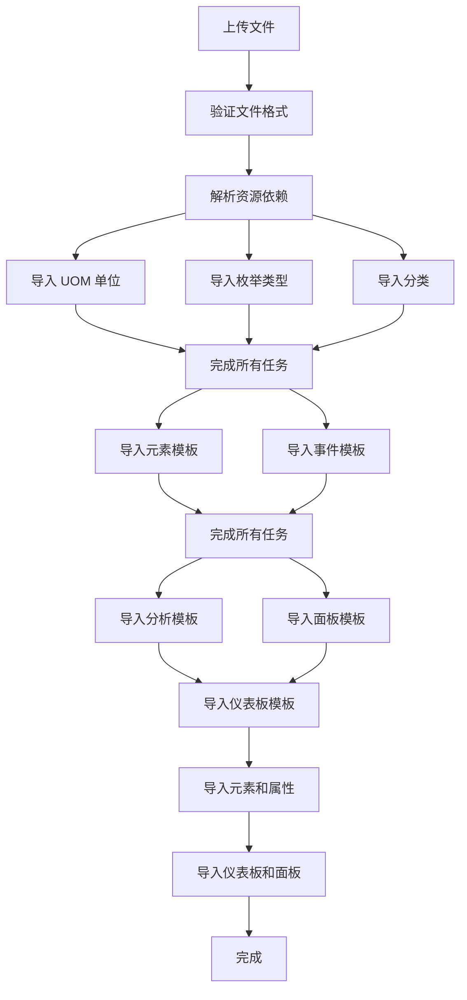

# 导入/导出

## 功能概述

导入导出功能用于在不同环境或系统之间迁移和共享 IDMP 数据，确保数据的一致性和完整性。

### 支持的资源类型

- 元素 (Elements)
- 元素模板 (Element Templates)
- 属性模板 (Attribute Templates)
- 事件模板 (Event Templates)
- 通知规则 (Notify Rules)
- 仪表板 (Dashboards)
- 面板 (Panels)
- 枚举集 (Enumeration Sets)
- 分类 (Categories)
- 计量单位 (UOM)

## 导出功能

### 访问路径

管理后台 > 导入/导出 > 导出按钮

### 操作步骤

1. **选择元素**：在树形选择器中选择需要导出的元素。支持多选，默认选中第一层所有元素。
2. **选择其他资源**（开发中）：可选择元素模板、事件模板、枚举集、分类、计量单位等资源。
3. **确认导出**：点击"确认"按钮后自动下载 ZIP 压缩包。

### 导出文件结构

导出的 ZIP 文件包含：

```
export_时间戳.zip
├── metadata.json         # 元数据文件，包含所有资源定义
└── taosgen.yaml          # TaosGen 配置文件（数据引用配置，可选）
```

**metadata.json**示例：

```json
{
  "elementTemplates": [...],
  "panelTemplateMap": {...},
  "dashboardTemplateMap": {...},
  "eventTemplates": [...],
  "eventTemplateAttrs": {...},
  "enums": [...],
  "categories": [...],
  "uomClass": [...],
  "uomMap": {...},
  "elements": {...},
  "panels": {...},
  "dashboards": {...}
}
```

**taosgen.yaml** 配置文件：

- **连接信息**：TDengine 数据库连接参数
- **数据库配置**：目标数据库设置
- **表结构定义**：超级表和子表配置
- **字段映射**：列定义和数据类型

查看更多关于 [Taosgen 配置](https://docs.taosdata.com/reference/tools/taosgen/)

## 导入功能

### 访问路径

管理后台 > 导入/导出 > 导入按钮

### 操作步骤

#### 1. 上传 JSON 文件（必填）

点击"选择 JSON 文件"按钮，选择导出的 JSON 文件，支持格式：`.json`。

#### 2. 上传 TaosGen 配置（可选）

如需导入数据，需提供 TaosGen 配置文件，支持格式：`.yaml`, `.yml`。

#### 3. 选择连接（必填）

从下拉列表选择目标 TDengine 连接。

#### 4. 选择联系点（必填）

选择通知联系点以接收分析、告警等任务的通知。

#### 5. 提交导入

点击"确认"。

### 导入流程与依赖处理

系统按以下顺序自动处理资源依赖关系：



## 任务管理

### 任务列表

任务列表显示所有导入记录。

| 列名     | 说明                                                                        |
| -------- | --------------------------------------------------------------------------- |
| 创建时间 | 任务创建的时间戳                                                            |
| 状态     | 任务执行状态（执行中、执行成功、执行失败）                                  |
| 名称     | 任务名称（自动生成）                                                        |
| 原因     | 失败时的错误原因                                                            |
| 操作     | 下载结果文件（对于上传的任务，点击"下载"按钮可下载包含详细结果的 ZIP 文件） |

---

## 未来规划

- 支持更多资源类型的选择性导出（元素模板、事件模板、分析模板、面板等）。
- 支持冲突处理策略（覆盖、跳过、重命名）。
- 支持新版本 TaosGen，增加数据回放功能。
