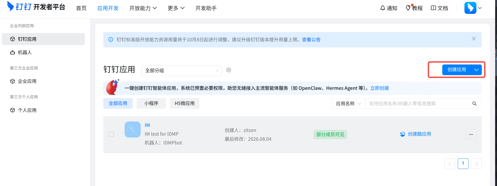
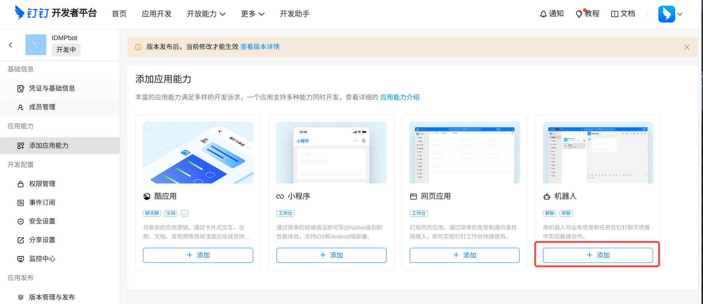
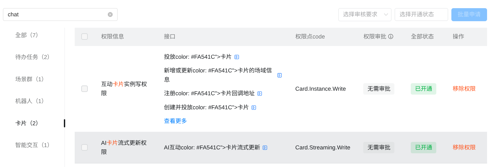

# 8.12 AI Agent 消息通道

AI Agent 支持通过即时通讯工具与您交互。配置消息通道后，您可以在飞书、Telegram、微信或 Slack 上与 AI Agent 对话，而无需始终打开 IDMP Web 界面。系统管理员配置通道后，每个用户需将自己的 IM 账号与 IDMP 用户账号绑定，以建立安全的对话通道。

## 8.12.1 通道概览

消息通道涉及三层概念：

1. **管理员配置通道**：在管理后台为每个 IM 平台配置 Bot 凭证。
2. **用户绑定**：每个用户将自己的 IM 账号与 IDMP 用户绑定。
3. **日常使用**：绑定后，您可以直接在 IM 中与 AI Agent 对话。

IDMP 目前支持五种消息通道：

| 通道               | Bot 配置                | 用户绑定方式                            | 特点                                     |
| ------------------ | ----------------------- | --------------------------------------- | ---------------------------------------- |
| **飞书**     | App ID + App Secret     | 二维码扫码后发送任意消息获取 6 位绑定码 | 企业用户常用，需创建飞书应用             |
| **Telegram** | Bot Token（± Proxy）   | 打开 Bot 链接发送指令获取 6 位绑定码    | 个人用户常用，需通过 @BotFather 创建 Bot |
| **微信**     | 系统开关，无需 Bot 凭证 | 二维码扫码 + 手机确认                   | 个人微信绑定，用户扫码后自动完成         |
| **钉钉**     | Client ID + Client Secret + Bot 名称 | 在钉钉中搜索 Bot 发送消息获取 6 位绑定码 | 企业用户常用，需在钉钉开放平台创建 Stream 模式机器人 |
| **Slack**    | Bot Token + App Token   | 在 Slack 中向 Bot 发送消息获取 6 位绑定码 | 海外企业常用，需在 Slack API 控制台创建 App 并启用 Socket Mode |

## 8.12.2 配置消息通道（管理员）

在**管理后台 → 智能AI → 通道管理**中集中管理消息通道的 Bot 配置。


### 通道列表

通道列表以表格形式展示五个通道，每行包含通道名称、启用开关、运行状态和「详情」操作：

| 列             | 说明                                                                      |
| -------------- | ------------------------------------------------------------------------- |
| **名称** | 通道图标 + 名称（飞书 / Telegram / WeChat / 钉钉 / Slack）                   |
| **启用** | 切换开关。飞书/Telegram/钉钉/Slack 在未保存 Bot 配置时不可用；微信直接控制系统级开关 |
| **状态** | 飞书/Telegram/钉钉/Slack 显示运行中 / 已停止；微信不显示                      |
| **操作** | 「详情」按钮，进入该通道的详细配置页                                      |

### 飞书通道配置

在通道管理列表中点击飞书行的「详情」进入飞书通道配置页。

**首次配置：**

1. 访问飞书开放平台（[https://open.feishu.cn/page/launcher](https://open.feishu.cn/page/launcher)）创建企业自建应用。
2. 在应用凭证中获取 **App ID** 和 **App Secret**。
3. 在 IDMP 飞书配置页填入 App ID 和 App Secret，点击**保存**。
4. 保存后启用通道开关。
5. 点击**启动**按钮启动消息监听。

**修改配置：** 点击编辑图标，App Secret 留空表示保持原值不变。

**查看绑定用户：** 配置页下半部分展示已绑定的用户列表，包含邮箱、姓名、绑定时间，管理员可直接解除绑定。

### Telegram 通道配置

在通道管理列表中点击 Telegram 行的「详情」进入 Telegram 通道配置页。

**首次配置：**

1. 在 Telegram 中搜索 @BotFather，按照指引创建新 Bot 并获取 Bot Token。
2. 在 IDMP Telegram 配置页填入 Token。
3. 可选：如果您的网络环境需要代理，填写 **Proxy** 字段（如 `http://proxy.example.com:8080`）。
4. 点击**保存**。
5. 保存后启用通道开关。
6. 点击**启动**按钮启动消息监听。

**修改配置：** 点击编辑图标，Token 留空表示保持原值不变。您也可以随时删除 Telegram 配置。

**查看绑定用户：** 配置页下半部分展示已绑定的用户列表。

### 钉钉通道配置

在通道管理列表中点击钉钉行的「详情」进入钉钉通道配置页。

**首次配置（在钉钉开放平台创建应用）：**

1. 访问钉钉开放平台（[https://open.dingtalk.com](https://open.dingtalk.com)），登录后进入「开发者后台」，点击**创建应用**，选择**企业内部应用**。

   

2. 在应用开发页面，选择**应用能力 → 机器人**，点击**添加机器人**，消息接收模式选择 **Stream 模式**。

   

3. 在机器人配置中填写机器人名称等信息，保存后应用即具备 Stream 模式机器人能力。

   

4. 在**权限管理**中申请以下权限：
   - **互动卡片（qyapi_im_card）**——用于消息处理时显示「思考中」卡片；
   - **消息发送（qyapi_robot_sendmsg）**——用于回复用户消息与主动推送。

   

   

5. 在**版本管理与发布**中创建版本并发布应用，使其在组织内生效。

   

6. 在**凭证与基础信息**中获取 **Client ID**（AppKey）和 **Client Secret**（AppSecret）。

   

**在 IDMP 中配置：**

1. 在 IDMP 钉钉配置页填入 **Client ID**、**Client Secret** 和**机器人名称**（与钉钉后台一致，用于绑定提示），点击**保存**。
2. 保存后启用通道开关。
3. 点击**启动**按钮启动消息监听。

**修改配置：** 点击编辑图标，Client Secret 留空表示保持原值不变。

**查看绑定用户：** 配置页下半部分展示已绑定的用户列表。

### 微信通道配置

微信通道无需配置 Bot 凭证。在通道管理列表中点击 WeChat 行的「详情」进入微信配置页，仅展示绑定用户列表。

在通道列表页通过**启用**开关控制该通道的全局可用性。

### Slack 通道配置

在通道管理列表中点击 Slack 行的「详情」进入 Slack 通道配置页。

**首次配置（在 Slack API 控制台创建 App）：**

1. 访问 Slack API 控制台（[https://api.slack.com/apps](https://api.slack.com/apps)），点击 **Create New App**，选择 **From a manifest** 或 **From scratch**。

2. 在应用配置页面，进入 **OAuth & Permissions**，添加以下 Bot Token Scopes：
   - `app_mentions:read` — 读取 @提及
   - `chat:write` — 发送消息
   - `im:history` — 读取 DM 历史
   - `im:read` — 读取 DM 频道信息
   - `im:write` — 创建 DM 对话
   - `users:read` — 读取用户信息

3. 进入 **Event Subscriptions**，启用事件订阅并添加以下 Bot Events：
   - `app_mention` — @提及事件
   - `message.im` — DM 消息事件

4. 进入 **Socket Mode**，启用 Socket Mode 并创建 App-Level Token，勾选 `connections:write` scope。记下生成的 **App Token**（格式 `xapp-`）。

5. 回到 **OAuth & Permissions**，点击 **Install to Workspace** 安装应用，记下生成的 **Bot Token**（格式 `xoxb-`）。

**在 IDMP 中配置：**

1. 在 IDMP Slack 配置页填入 **Bot Token**（`xoxb-`）和 **App Token**（`xapp-`），点击**保存**。
2. 保存后启用通道开关。
3. 点击**启动**按钮启动消息监听（通过 Socket Mode 建立 WebSocket 长连接）。

**修改配置：** 点击编辑图标，Bot Token 和 App Token 留空表示保持原值不变。您也可以随时删除 Slack 配置。

**查看绑定用户：** 配置页下半部分展示已绑定的用户列表。

## 8.12.3 用户绑定 IM 账号

### 查看通道状态

在个人设置页的 **IM 绑定**区域，始终显示五个通道的状态卡片，无论您是否已绑定：

```text
[飞书图标]  飞书     状态：正常监听  |  ID: ou_xxxx  [解除绑定]
[Telegram]  Telegram  状态：监听未启动  |  [启动监听]
[微信图标]  WeChat    状态：未绑定  |  [绑定用户]
[钉钉图标]  钉钉      状态：正常监听  |  [绑定用户]
[Slack图标] Slack     状态：正常监听  |  [绑定用户]
```

各状态的含义：

| 状态                 | 说明                                     |
| -------------------- | ---------------------------------------- |
| **未启用**     | 管理员尚未配置该通道                     |
| **监听未启动** | 通道已配置但 Bot 监听未启动              |
| **正常监听**   | 通道已配置且监听正常运行                 |
| **未绑定**     | 您的 IM 账号未与 IDMP 绑定               |
| **已绑定**     | 您的 IM 账号已绑定，可接收 AI Agent 消息 |

### 绑定飞书

1. 确保管理员已配置飞书通道且监听正常运行。
2. 点击页面右上角个人头像，在 IM 绑定区域，飞书行状态为「正常监听」时，点击**绑定用户**。
3. 弹出飞书二维码，使用飞书客户端扫码。
4. 扫码后打开 Bot 会话，发送任意消息获取 6 位绑定码。
5. 在对话框中输入 6 位绑定码，点击**绑定**。
6. 绑定成功后，页面自动刷新，状态变为「已绑定」。

### 绑定 Telegram

1. 确保管理员已配置 Telegram 通道且监听正常运行。
2. 点击页面右上角个人头像，在 IM 绑定区域，Telegram 行状态为「正常监听」时，点击**绑定用户**。
3. 系统新窗口打开 Telegram Bot 链接。
4. 在 Telegram Bot 中发送消息获取 6 位绑定码。
5. 返回 IDMP 对话框，输入 6 位绑定码，点击**绑定**。

### 绑定微信

1. 确保管理员已在系统设置中启用「个人微信绑定」。
2. 点击页面右上角个人头像，在 IM 绑定区域，微信行点击**绑定用户**。
3. 弹出二维码，使用微信扫码。
4. 在手机上确认登录。
5. 系统自动轮询二维码状态，确认后自动完成绑定。
6. 绑定成功后弹窗自动关闭，状态更新为「已绑定」。
7. 在手机微信中点击刚完成添加的微信 Clawbot，可以进行备注名修改、消息置顶或更改头像等个性化配置


### 绑定钉钉

1. 确保管理员已配置钉钉通道且监听正常运行。
2. 点击页面右上角个人头像，在 IM 绑定区域，钉钉行状态为「正常监听」时，点击**绑定用户**。
3. 对话框中提示在钉钉中搜索管理员配置的**机器人名称**（如 `IDMPbot`）或在群组中添加该机器人开始聊天。
4. 在钉钉中向机器人发送任意消息，机器人回复 6 位绑定码。
5. 返回 IDMP 对话框，输入 6 位绑定码，点击**绑定**。
6. 绑定成功后，状态更新为「已绑定」。

### 绑定 Slack

1. 确保管理员已配置 Slack 通道且监听正常运行。
2. 点击页面右上角个人头像，在 IM 绑定区域，Slack 行状态为「正常监听」时，点击**绑定用户**。
3. 对话框中提示在 Slack 中找到 IDMP Bot 并向其发送任意消息。
4. 在 Slack 中向 Bot 发送 DM，Bot 回复 6 位绑定码和 IDMP 系统地址。
5. 返回 IDMP 对话框，输入 6 位绑定码，点击**绑定**。
6. 绑定成功后，状态更新为「已绑定」。您可以在 Slack 中直接向 Bot 发送消息与 AI 助手对话。

### 解除绑定

对于已绑定的通道，点击**解除绑定**按钮。在确认弹窗中点击确定后，系统即解除您的 IM 账号与 IDMP 账号的绑定关系。

## 8.12.4 数据与安全

- **绑定信息**存储在 `channel_user_binding` 表中，包括 IM 平台的用户开放 ID、绑定时间和绑定码。
- **绑定码**为 6 位临时码，5 分钟有效期，过期后需重新获取。
- **AI Agent 缓存**：解绑时系统自动清除缓存的 API Key，避免旧的凭证被继续使用。
- Bot 配置中的 Secret 和 Token 在管理后台查看时脱敏显示（`********`），编辑时留空保持原值。

## 8.12.5 常见问题

**Q：飞书 Bot 创建后无法收到消息？**

A：飞书应用发布后需要等待数分钟生效。请确认在飞书开放平台中已正确配置事件订阅和权限，并且 Bot 已启用。然后检查 IDMP 通道配置页中 **App ID** 和 **App Secret** 是否正确，并点击**启动**按钮启动监听。

**Q：Telegram Bot 如何创建？**

A：在 Telegram 中搜索 @BotFather，发送 `/newbot` 命令并按指引设置 Bot 名称和用户名。创建成功后 @BotFather 会返回 Bot Token，将其填入 IDMP 的 Telegram 通道配置页即可。

**Q：绑定码过期了怎么办？**

A：绑定码有效期为 5 分钟。过期后重新在 Bot 中发送消息获取新的 6 位绑定码，然后在对话框中输入新码即可。

**Q：钉钉机器人无法回复或主动推送消息？**

A：请在钉钉开放平台确认应用已申请并发布以下权限：**互动卡片（qyapi_im_card）** 和 **消息发送（qyapi_robot_sendmsg）**。权限申请后需要发布新版本才生效。同时确认 IDMP 钉钉配置页中的 Client ID 和 Client Secret 正确。

**Q：钉钉绑定提示中显示的机器人名称不对？**

A：绑定提示使用管理员在 IDMP 钉钉配置页填写的**机器人名称**。请确认该名称与钉钉后台中的机器人名称一致（如 `IDMPbot`），便于用户在钉钉中搜索到机器人。

**Q：解除绑定后 AI Agent 还能通过 IM 联系我吗？**

A：不能。解除绑定后，AI Agent 将不再向您的 IM 账号发送消息。如需恢复，重新绑定即可。

**Q：Slack App 创建后 Bot 无法收到消息？**

A：请确认以下配置：

1. 在 Slack API 控制台中已启用 **Socket Mode** 并创建了 App-Level Token（`xapp-`，需 `connections:write` scope）。
2. 已在 **Event Subscriptions** 中订阅了 `app_mention` 和 `message.im` 事件。
3. 已在 **OAuth & Permissions** 中添加了所有必需的 Bot Token Scopes（`chat:write`、`im:history`、`im:read`、`im:write`、`users:read`）。
4. 已通过 **Install to Workspace** 安装应用到工作区。
5. IDMP Slack 配置页中的 Bot Token（`xoxb-`）和 App Token（`xapp-`）正确无误，且 Bot 已启动。

**Q：Slack Bot Token 和 App Token 有什么区别？**

A：**Bot Token**（`xoxb-`）用于 API 调用（发送消息、读取用户信息等），在 OAuth & Permissions 页面安装应用后生成。**App Token**（`xapp-`）用于建立 Socket Mode WebSocket 连接，在 Socket Mode 页面创建时生成。两者缺一不可。

**Q：Slack 绑定码过期了怎么办？**

A：绑定码有效期为 10 分钟。过期后重新在 Slack 中向 Bot 发送消息获取新的 6 位绑定码，然后在 IDMP 中输入新码即可。
