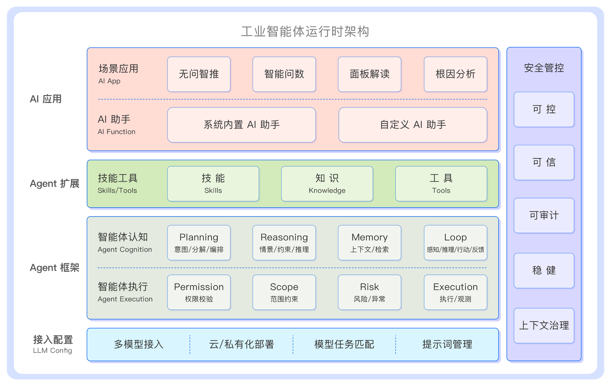

# 8. AI 智能洞察

TDengine IDMP 将 AI 智能贯穿于整个平台，让数据自己说话——系统从被动的数据存储转变为主动的运营顾问。本章涵盖所有 AI 驱动的功能：从主动推送的可视化面板生成，到异常检测、预测、根因分析和自然语言查询。

## 两种 AI 智能模式

IDMP 以两种互补的模式提供 AI 洞察：

**主动推送模式。** 如无问智推功能，这是从 Pull 到 Push 的转变。系统自动感知应用场景、主动分析您的数据并将发现推送给您，无需等待您主动询问。当您打开元素的面板标签页时，AI 生成的可视化面板已经在等待您；当您导航到元素的实时分析标签页时，AI 已经推荐了相关实时分析。这就是无问智推的核心理念：系统持续在后台工作，对您的资产层次结构和时序数据应用大模型推理，在您想到之前就将洞察呈现出来。

**手工拉取模式。** 如 AI 问答功能。您提问，系统回答。您可以用自然语言描述一个面板或分析——"以柱状图显示每日平均电压"或"计算每小时最大电流并在超出正常范围时告警"——AI 为您构建。AI 问答界面也接受关于您数据的自由格式问题——"em-1 上周的平均电流是多少？"——并返回基于您实际 TDengine 数据的答案。根因分析可在事件详情页按需运行，生成结构化的调查报告。

这两种 AI 智能模式共同大幅降低了运营智能门槛。传统 BI 工具要求使用者具备 SQL 能力、熟悉数据结构、掌握可视化技巧，门槛极高。无问智推彻底改变了这一局面：非数据科学家背景的工程师无需编写 SQL 或掌握复杂工具，即可构建仪表板、配置分析、检测异常并调查事件。我们相信，先进的工业分析能力不应只属于拥有专职数据分析师的大企业——中小型企业同样可以用上它。

## AI 组件

IDMP 的 AI 能力建立在两个底层引擎之上：

**大语言模型（LLM）。** 外部大语言模型（通过 OpenAI 兼容接口配置）负责自然语言理解、可视化与分析生成、洞察叙述以及根因推理。IDMP 内置了 15 天的试用连接，您无需任何配置即可立即探索 AI 功能。

**TDgpt。** TDengine 内核内置的时序 AI 引擎，负责直接对时序数据执行计算密集型分析任务——通过 `forecast()`、`anomaly_window()` 等函数，实现异常检测、预测和缺失数据填补。TDgpt 是需要与 IDMP 一同安装的独立模块，一旦安装完成，它独立于大语言模型连接运行，无需外部 AI 配置。

在这两个底层引擎的基础上，IDMP 构建了工业智能体运行时 **Industrial Agent Runtime (IAR)**。

**工业智能体运行时**架构自底向上分为：大模型接入、Agent 框架、Agent 能力扩展、AI 应用与安全管控等核心模块。

IAR 底层是开放的大模型配置管理，TDengine 支持所有业界主流大模型的接入，支持云端或本地私有化部署的大模型，支持对不同任务配置使用不同大模型，实现模型与任务的最优化匹配，并提供提示词管理功能。

TDengine IAR 是一个功能完整的 AI Agent 运行时，包括 AI 智能体的执行、认知与能力扩展框架。

- **智能体执行框架**：IAR 内置 AI 智能体的执行与观测框架，支持完善的调用者权限管理，智能体权限完全等同于发起用户的系统权限，支持智能体的工作范围控制，对智能体可执行的任务与内容有明确限制，并支持全方位的风险管控策略，包括熔断、限流、重试等机制。TDengine IAR 支持标准 ACP 协议，这意味着用户不仅可以使用 TDengine 内置的智能体，也可以随时引入外部智能体，构建开放的智能体生态。

- **智能体认知框架**：在执行与观测框架基础上，IAR 建立了适配工业场景的智能体认知框架，包括 Planning（意图识别、任务规划与编排、任务路由），Reasoning（情景感知、推理、约束），Memory（短期记忆、中长期记忆、摘要压缩与检索），Agent Loop（智能体的感知、推理、行动、反馈回路），让智能体在大模型的加持下更加聪明地执行复杂任务。

- **智能体扩展框架**：TDengine IAR 内置了技能 Skills、知识管理以及工具 Tools 等智能体能力扩展模块，大幅增强了智能体的复杂任务执行能力，让智能体更懂工业场景。

在 AI 智能体运行时基础上，TDengine 预置了数十项系统级 Skills，构建了 13 个开箱即用的 AI 助手，支持用户基于智能体能力扩展框架自定义个性化的智能体助手。TDengine 还在应用层围绕最常见的工业数据分析场景，打造了无问智推、智能问数、面板解读、根因分析等典型 AI 场景应用。

贯穿以上所有组件，TDengine 构建了完整的企业级 AI 安全管控，覆盖可控、可信、可审计、稳健四个维度和上下文治理。在工业场景中，AI 安全不是一个可有可无的功能选项——它直接关系到产线能不能开、事故能不能避免、合规审计能不能通过。

## 本章内容

- **[连接大语言模型](./01-connecting-to-llm.md)** — 配置 AI 连接（大语言模型端点、模型、身份验证）
- **[AI 生成面板](./02-ai-generated-panels.md)** — 在元素面板标签页上由 AI 自动生成和建议的面板
- **[AI 面板洞察](./03-ai-panel-insights.md)** — 为单个面板生成的自然语言摘要和解读
- **[AI 生成分析](./04-ai-generated-analyses.md)** — 在元素实时分析标签页上由 AI 自动建议和创建的实时分析
- **[AI 复合指标](./05-ai-composite-metrics.md)** — AI 推荐的公式和复合属性定义
- **[AI 问答](./06-natural-language-queries.md)** — 用自然语言查询您数据的 AI 问答界面
- **[异常检测](./07-anomaly-detection.md)** — 由 TDgpt 驱动的异常检测分析触发类型
- **[预测](./08-forecasting.md)** — 由 TDgpt 驱动的元素属性时序预测
- **[缺失数据填补](./09-missing-data-imputation.md)** — 由 TDgpt 驱动的时序数据缺口填充
- **[根因分析](./10-root-cause-analysis.md)** — AI 生成的事件根因调查报告
- **[AI Functions](./11-ai-functions.md)** — 分布在各页面的统一 AI 入口，结合当前页面上下文执行分析

import DocCardList from '@theme/DocCardList';

<DocCardList />
