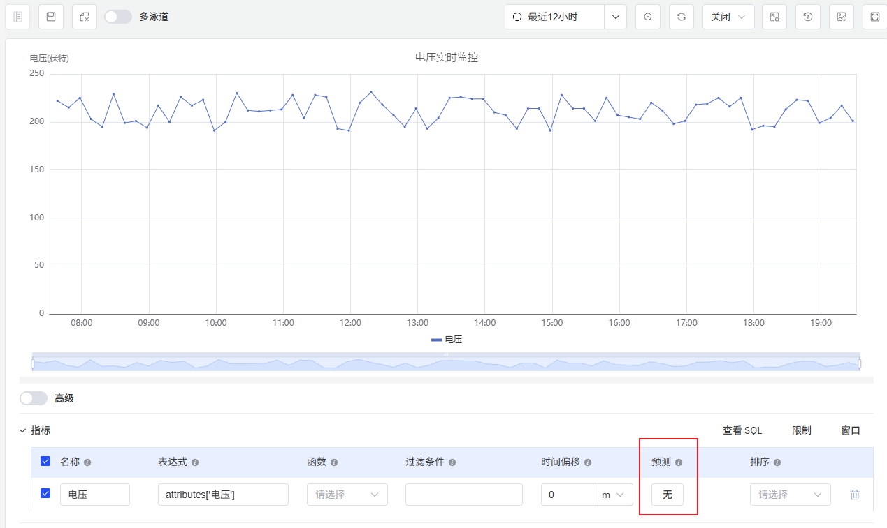
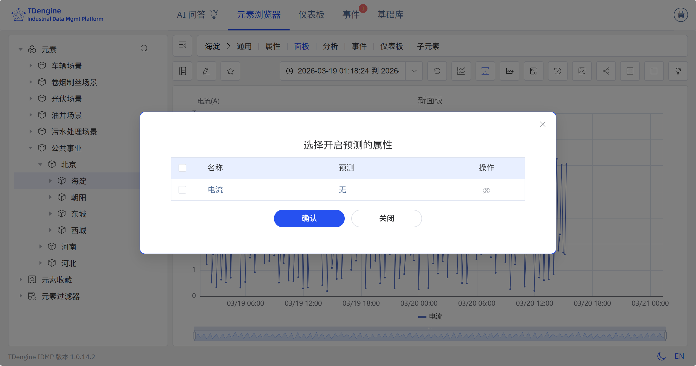

# 9.1 时序预测

时序预测是工业数据分析中应用最广的能力之一。IDMP 支持由 **TDgpt** 驱动的 AI 时序预测，帮助用户基于历史数据对未来趋势做出定量估算，从而实现从被动响应到主动运营的转变。

## 预测原理

时序预测的基本逻辑是：**观察历史，外推未来**。

预测算法首先对一段历史时序数据进行分析，从中提炼出数据的变化规律——包括趋势方向、周期性波动、季节性模式、噪声水平等特征。在此基础上，算法假定这些规律在未来一段时间内仍然成立，并据此对未来的数据点进行估算，生成预测值序列。

这一过程并不是简单的直线外推。现代时序预测算法能够捕捉复杂的非线性规律，例如每日的用电峰谷、设备随运行时间的渐进老化、季节性的生产负荷变化等。预测结果的准确性取决于历史数据的质量、数据量以及所选择的预测算法与数据规律的匹配程度。

## 应用场景

时序预测在工业领域有广泛的应用价值：

**能源与电力**

- 预测未来 24 小时或更长周期的电力消耗，辅助电力调度和负荷平衡
- 预测光伏或风电的发电量，提前安排储能或备用电源

**设备工况指标**

- 预测温度、振动、压力等关键指标的趋势，提前判断何时可能突破报警阈值
- 预测设备能耗或效率指标的变化趋势，辅助节能优化与绩效管理

**生产与供应链**

- 预测储罐液位或仓库库存，提前安排补货或调拨
- 预测生产线的产出速率和产量，辅助排产计划

**环境与公用事业**

- 预测污水处理厂的进水量，提前调节处理能力
- 预测工厂内的温湿度变化，提前启动空调或除湿设备

**流程工业**

- 预测化工反应过程中的关键参数变化
- 预测锅炉、压缩机等设备的运行参数趋势

## 支持的算法

TDgpt 内置了丰富的预测算法，覆盖统计模型、机器学习和深度学习三大类，适用于不同类型的时序数据：

| 算法 | 类型 | 特点 |
|---|---|---|
| **HoltWinters** | 统计模型 | 带趋势和季节性分解的指数平滑，对规律性周期模式表现优秀，计算开销低（默认算法） |
| **ARIMA** | 统计模型 | 经典的差分自回归移动平均模型，适用于具有趋势和季节性成分的平稳时间序列，可解释性强 |
| **CES** | 统计模型 | 复指数平滑（Complex Exponential Smoothing），对含有复杂季节性模式的序列有较好表现 |
| **ETS** | 统计模型 | 误差—趋势—季节性模型，自动选择最优的趋势和季节性组合 |
| **Theta** | 统计模型 | 基于时间序列分解的 Theta 方法，在短期预测上表现稳健 |
| **MSTL** | 统计模型 | 多季节性趋势分解（Multiple Seasonal-Trend decomposition using LOESS），适合含有多重周期的复杂序列 |
| **Prophet** | 统计模型 | Facebook 开源的加法模型，对节假日效应和缺失数据有较强的鲁棒性 |
| **XGBoost** | 机器学习 | 基于梯度提升树，适合特征工程后的多变量预测场景 |
| **LightGBM** | 机器学习 | 轻量级梯度提升框架，训练速度快，适合大数据量场景 |
| **LSTM** | 深度学习 | 长短期记忆神经网络，能捕获复杂的非线性时序依赖关系，适合规律复杂的信号 |
| **MLP** | 深度学习 | 多层感知机，结构简单、训练快速，适合作为基线模型 |
| **DeepAR** | 深度学习 | 基于自回归 RNN 的概率预测模型，输出分布估计而非单点预测 |
| **N-BEATS** | 深度学习 | 纯神经网络架构，无需特征工程，在多个基准数据集上表现优秀 |
| **N-HiTS** | 深度学习 | N-BEATS 的改进版本，通过多尺度采样提升长期预测精度 |
| **PatchTST** | 深度学习 | 基于 Transformer 的分段时序模型，擅长捕获长程依赖关系 |
| **Temporal Fusion Transformer** | 深度学习 | 结合注意力机制和门控网络，支持多变量输入和协变量 |
| **TimesNet** | 深度学习 | 将时序数据转化为二维特征进行卷积学习，适合多周期复杂序列 |
| **TDtsfm** | 基础模型 | TDengine 时序基础模型，在多样化工业时序数据上预训练，支持零样本预测和协变量输入，适合数据量有限的场景 |

### 算法选择建议

- 对于具有明显周期性（如每日、每周）且历史较规律的指标，优先选择 **HoltWinters** 或 **ARIMA**
- 对于含有节假日、异常中断等特殊事件的序列，选择 **Prophet**
- 对于模式复杂、非线性特征明显的指标，选择 **LSTM**、**N-BEATS** 或 **PatchTST**
- 对于历史数据量不足或需要快速上线的场景，选择 **TDtsfm**（零样本，无需训练）
- 对于需要同时利用多个相关变量辅助预测的场景，选择支持协变量的算法（见下节）

## 单变量预测与协变量预测

TDgpt 支持两种预测模式：

**单变量预测：** 默认模式，仅使用目标属性自身的历史数据进行预测，适合大多数场景。

**协变量预测：** 允许引入与目标变量相关的其他时序数据作为辅助输入，从而提升预测精度。协变量分为两类：

- **历史协变量：** 与目标变量同时段的历史数据，例如用环境温度辅助预测设备能耗。
- **未来协变量：** 已知的未来数据，例如已排定的生产计划、天气预报数值，用于辅助预测未来的生产消耗或负荷。

:::note
协变量预测需要部署 **TDtsfm** 时序基础模型，且目前仅支持历史协变量和未来协变量，暂不支持静态协变量。每次预测最多允许输入 10 列历史协变量数据。
:::

## 使用入口

IDMP 提供两种使用时序预测的入口，均位于趋势图和事件趋势图面板中。

### 在属性配置中启用预测

通过在元素属性上配置预测参数，预测值将持续计算，并在所有包含该属性的趋势图面板中自动显示。

操作步骤：

1. 在元素的**属性**标签页，点击属性名称打开属性详情页。
2. 点击**编辑**。
3. 展开**预测配置**部分。

4. 在**预测提供方**中选择 **TDgpt**。
5. 配置预测参数：

| 字段 | 说明 |
|---|---|
| **算法** | 选择预测算法（见上文支持的算法） |
| **预测行数** | 预测未来的数据点数量 |

6. 点击**保存**。

配置完成后，打开包含该属性的趋势图面板，预测值将以不同样式的延伸线叠加在历史数据之后显示。

### 在趋势图面板操作栏中切换显示

趋势图和事件趋势图面板的操作栏提供**显示预测**图标，用于在不修改属性配置的情况下，快速切换预测叠加层的显示与隐藏。

- **查看模式**下：点击操作栏中的预测控制图标，可在当前图表上叠加或隐藏预测值，适合在浏览历史数据时快速对比实测值与预测值。
- **编辑模式**下：点击**显示预测**按钮，可在面板预览中实时查看预测效果，辅助判断是否需要调整预测配置。

若面板中的属性尚未配置预测，点击**显示预测**图标后会弹出预测配置窗口，引导用户直接完成算法和预测参数的设置，无需跳转至属性页。

