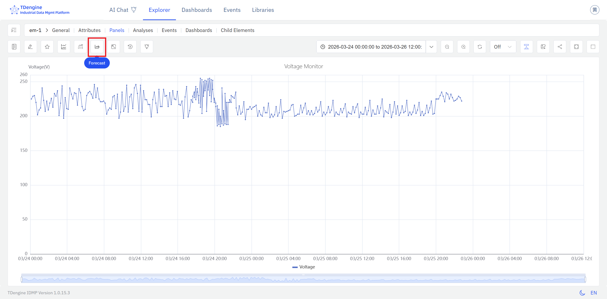
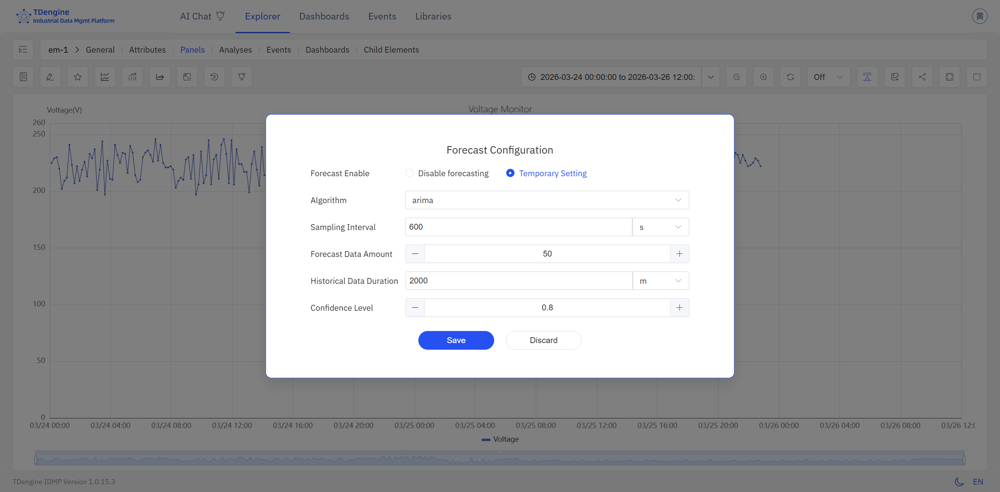
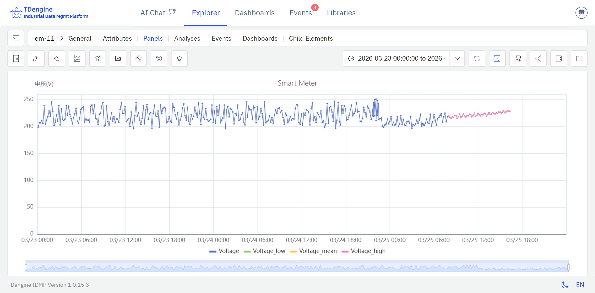

# 9.1 时序预测

时序预测是工业数据分析中应用最广的能力之一。IDMP 支持由 **TDgpt** 驱动的 AI 预测，帮助用户基于历史数据对未来趋势做出定量估算，从而实现从被动响应到主动运营的转变。

## 9.1.1 预测原理

时序预测的基本逻辑是：**观察历史，外推未来**。

预测算法首先对一段历史时序数据进行分析，从中提炼出数据的变化规律——包括趋势方向、周期性波动、季节性模式、噪声水平等特征。在此基础上，算法假定这些规律在未来一段时间内仍然成立，并据此对未来的数据点进行估算，生成预测值序列。

这一过程并不是简单的直线外推。现代时序预测算法能够捕捉复杂的非线性规律，例如每日的用电峰谷、设备随运行时间的渐进老化、季节性的生产负荷变化等。预测结果的准确性取决于历史数据的质量、数据量以及所选算法与数据规律的匹配程度。

## 9.1.2 适用场景

时序预测在工业领域有广泛的应用场景：

**能源与电力**

- 预测未来 24 小时或更长周期的电力消耗，辅助电力调度和负荷平衡
- 预测光伏或风电的发电量，提前安排储能或备用电源

**设备工况指标**

- 预测温度、振动、压力等关键指标的趋势，提前判断何时可能突破报警阈值
- 预测设备能耗或效率指标的变化趋势，辅助节能优化与绩效管理

**生产与供应链**

- 预测储罐液位或仓库库存，提前安排补货或调拨
- 预测生产线的产出速率和产量，辅助排产计划

**环境与公用事业**

- 预测污水处理厂的进水量，提前调节处理能力
- 预测工厂内的温湿度变化，提前启动空调或除湿设备

**流程工业**

- 预测化工反应过程中的关键参数变化
- 预测锅炉、压缩机等设备的运行参数趋势

## 9.1.3 支持算法

TDgpt 内置了丰富的预测算法，覆盖统计模型、机器学习、深度学习与基础模型，适用于不同类型的时序数据：

| 算法 | 类型 | 特点 |
|---|---|---|
| **HoltWinters** | 统计模型 | 带趋势和季节性分解的指数平滑，对规律性周期模式表现优秀，计算开销低（默认算法） |
| **ARIMA** | 统计模型 | 经典的差分自回归移动平均模型，适用于具有趋势和季节性成分的时间序列，可解释性强 |
| **CES** | 统计模型 | 复指数平滑（Complex Exponential Smoothing），对含有复杂季节性模式的序列有较好表现 |
| **ETS** | 统计模型 | 误差—趋势—季节性模型，自动选择最优的趋势和季节性组合 |
| **Prophet** | 统计模型 | Meta 开源的加法模型，对节假日效应和缺失数据有较强的鲁棒性 |
| **XGBoost** | 机器学习 | 基于梯度提升树，适合特征工程后的多变量预测场景 |
| **LSTM** | 深度学习 | 长短期记忆神经网络，能捕获复杂的非线性时序依赖关系，适合规律复杂的信号 |
| **N-BEATS** | 深度学习 | 纯神经网络架构，无需特征工程，在多个基准数据集上表现优秀 |
| **PatchTST** | 深度学习 | 基于 Transformer 的分段时序模型，擅长捕获长程依赖关系 |
| **TDtsfm** | 基础模型 | TDengine 时序基础模型，在多样化工业时序数据上预训练，支持零样本预测和协变量输入，适合历史数据量不足的场景 |

### 算法选择建议

- 对于具有明显周期性（如每日、每周）且历史较规律的指标，优先选择 **HoltWinters** 或 **ARIMA**
- 对于含有节假日、异常中断等特殊事件的序列，选择 **Prophet**
- 对于模式复杂、非线性特征明显的指标，选择 **LSTM**、**N-BEATS** 或 **PatchTST**
- 对于历史数据量不足或需要快速上线的场景，选择 **TDtsfm**（零样本，无需训练）
- 对于需要同时利用多个相关变量辅助预测的场景，选择支持协变量的算法（见下节）

## 9.1.4 单变量预测与协变量预测

TDgpt 支持两种预测模式：

**单变量预测：** 默认模式，仅使用目标属性自身的历史数据进行预测，适合大多数场景。

**协变量预测：** 允许引入与目标变量相关的其他时序数据作为辅助输入，从而提升预测精度。协变量分为两类：

- **历史协变量：** 与目标变量同时段的历史数据，例如用环境温度辅助预测设备能耗。
- **未来协变量：** 已知的未来数据，例如已排定的生产计划、天气预报数值，用于辅助预测未来的生产消耗或负荷。

:::note
协变量预测需要部署 **TDtsfm** 时序基础模型，且目前仅支持历史协变量和未来协变量，暂不支持静态协变量。每次预测最多允许输入 10 列历史协变量数据。
:::

## 9.1.5 使用入口

趋势图和分析面板在查看模式下的操作栏提供**预测**图标，用户可在浏览数据时按需启用时序预测。

点击操作栏中的预测图标，可在当前图表上叠加或隐藏预测值，方便在浏览历史数据时快速对比实测值与预测值。

若尚未配置预测参数，点击**预测**图标后系统会弹出预测配置窗口，用户可在其中选择要预测的属性，并配置预测算法与模型超参数。

保存预测配置后，系统将自动运行预测算法，并将预测结果以彩色曲线叠加显示在图表中。

## 9.1.6 使用示例

**场景背景**

某市政污水处理厂日均处理量约 15 万吨，进水量受城市用水规律影响，呈现明显的工作日与节假日差异。处理能力不足会导致超标排放风险，而长时间过量投药又造成运营成本浪费。厂方希望在每天早上提前掌握未来 24 小时的进水量预测，以便合理安排鼓风机组的启停计划和药剂投加量。

**操作过程**

1. 打开包含 `日进水量` 属性的趋势图面板，点击操作栏中的**预测**图标。
2. 在弹出的预测配置窗口中，算法选择 **Prophet**——进水量不仅有每日和每周的周期规律，还受节假日影响显著，Prophet 对这类含有节假日效应的序列有较强的适应能力；**预测行数**设置为 `24`，覆盖未来 24 小时。
3. 确认后，图表上即叠加显示进水量预测曲线，运营人员每日交班时可直接参考。

**分析效果**

某个"五一"假期前夕，预测曲线显示假期首日的进水量将比平日低约 22%，但假期结束后的工作日第一天会出现明显的回升峰值。运营团队据此提前将两台备用鼓风机的启动时间推后，并在节后第一个工作日提前预热备机。

实际进水量与预测值误差在 5% 以内，当日处理能力平稳过渡，药剂消耗同比节约约 8%，未出现超标排放记录。
