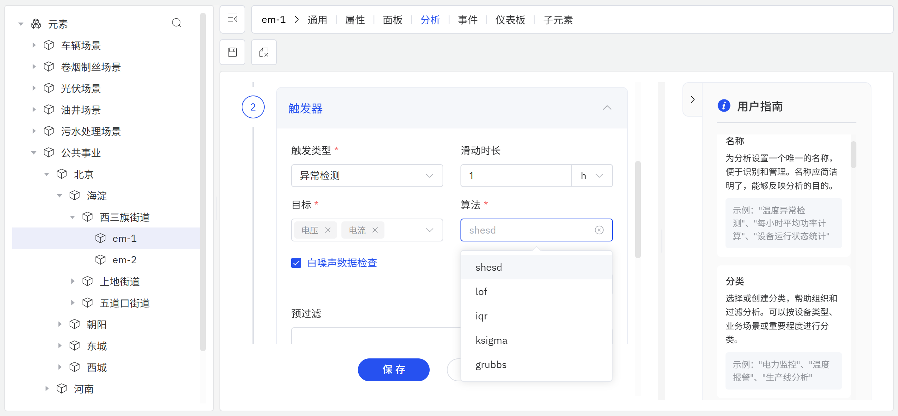

# 9.2 异常检测

异常检测是工业数据分析中的核心能力之一。IDMP 支持由 **TDgpt** 驱动的 AI 异常检测，帮助用户从海量时序数据中自动识别偏离正常规律的数据片段，从而实现异常事件的早期预警与快速定位。

## 检测原理

异常检测本质上是一种**无监督学习**任务。与有监督的分类算法不同，异常检测无需预先标注样本，而是通过对数据整体分布规律的建模，自动找出那些”与大部分数据不一样”的数据点或数据段。

在时序数据场景中，异常通常表现为以下几种形式：

- **点异常（Point Anomaly）：** 某个时刻的数值突然大幅偏离正常范围，例如设备电流瞬间飙升
- **上下文异常（Contextual Anomaly）：** 某个值在全局看来正常，但在特定时段或上下文中却是异常的，例如深夜时段的生产线异常启动
- **集体异常（Collective Anomaly）：** 单个数据点看似正常，但连续的一段数据组合起来呈现出异常模式，例如设备振动信号的持续低频漂移

TDgpt 的异常检测引擎通过 `ANOMALY_WINDOW()` SQL 函数对外提供服务，返回检测到的异常时间窗口，可直接用于告警触发、事件生成或进一步分析。

当前版本的异常检测针对单条时序数据进行分析，即对某一属性的历史数据序列独立建模并识别异常。这一模式已能覆盖大多数工业监控场景中的异常发现需求。

在即将发布的版本中，IDMP 将进一步扩展异常检测的边界，支持跨设备和跨指标的异常发现。**多指标异常定位**能够在数百条同类时序中自动找出行为最偏离的少数序列，例如从 100 台风机的功率曲线中识别出运行异常的风机；**多元时序异常检测**则基于元素多个属性的联合分布建模，捕获单变量分析无法识别的复合型异常模式，例如温度单独看来正常、但振动与电流同时出现协同偏差的复合故障。

## 支持的算法

TDgpt 内置了多种异常检测算法，涵盖统计学、密度分析、机器学习、深度学习和基础模型等多个类型：

| 算法 | 类型 | 特点 |
|---|---|---|
| **IQR** | 统计学 | 基于四分位距的经典箱线图方法，将 Q1−1.5×IQR 至 Q3+1.5×IQR 范围之外的数据点判定为异常；无需参数，计算极快（默认算法） |
| **LOF** | 密度分析 | Local Outlier Factor，局部离群因子算法，基于数据点周围的局部密度计算离群程度，适合不同密度区域共存的复杂数据分布 |
| **Isolation Forest** | 机器学习 | 隔离森林算法，通过随机递归分割将异常点从正常点中孤立出来；对高维数据和不同密度区域的异常具有较强鲁棒性 |
| **LSTM-AD** | 深度学习 | 基于长短期记忆神经网络的序列异常检测，捕获时序数据中的复杂依赖关系，适合具有周期性或趋势性规律的信号 |
| **TDtsfm** | 基础模型 | TDengine 时序基础模型，在多样化工业时序数据上预训练，支持零样本异常检测，适合规律复杂或历史数据量有限的场景 |

### 算法选择建议

- 对于大多数工业指标，优先使用默认算法 **IQR**，无需参数配置，速度快、稳健性好
- 对于数据分布复杂、局部密度差异显著的场景，选择 **LOF**
- 对于高维数据或异常密度不均匀的场景，选择 **Isolation Forest**
- 对于含有明显周期性或趋势性规律的信号，选择 **LSTM-AD**
- 对于规律复杂或历史数据量不足、需要快速上线的场景，选择 **TDtsfm**（零样本，无需训练）

## 使用入口

异常检测通过**元素分析**进行配置。

配置步骤：

1. 导航到元素的**分析**标签页，点击 **+** 创建新分析。
2. 填写**基本信息**，包括分析名称和类别。
3. 在**触发**步骤中，选择**异常检测**作为触发类型，并配置以下参数：

| 字段 | 说明 |
|---|---|
| **属性** | 要监控异常的元素属性 |
| **算法** | 选择异常检测算法（见上文支持的算法） |
| **窗口** | 算法评估每个数据段的时间窗口大小 |

4. 在**计算**步骤中，配置异常检测结果的输出属性和存储对象。
5. 按需配置**事件**步骤，决定检测到异常时是否生成事件记录。
6. 点击**保存**。

配置完成后，系统将持续对所选属性进行实时异常检测。当 TDgpt 识别到异常窗口时，分析触发，并将异常时段的开始和结束时间作为计算结果写入输出属性；如已启用事件生成，还会同步创建记录该异常时段的事件。

:::note
分析的完整配置说明（包括触发类型参数、计算配置等）请参阅[实时分析](../07-real-time-analysis/02-creating-analysis.md)章节。
:::

## 应用场景

异常检测在工业领域有广泛的落地价值：

**能源与电力**

- 检测变压器电流、电压信号中的突变和持续漂移，提前发现绝缘老化或短路隐患
- 识别光伏、风电等新能源设备的发电功率异常，判断组件故障或遮挡异常

**设备工况监测**

- 检测旋转设备（电机、泵、压缩机）的振动和温度信号异常，判断轴承磨损或失衡
- 识别液压系统压力波动中的异常模式，发现阀门或管路泄漏

**生产制造**

- 检测生产线速度、节拍、良品率等指标的异常波动，及时发现工艺偏差
- 识别注塑、冲压等过程参数中的异常，辅助质量控制与根因分析

**流程工业**

- 检测化工反应温度、压力、流量的异常组合，提前预警工艺异常
- 识别锅炉燃烧效率曲线中的异常下降段，辅助节能诊断

**环境与公用事业**

- 检测污水处理进水水质指标的异常突变，判断工业废水偷排事件
- 识别建筑能耗数据中的异常高峰，定位空调、照明等设备的异常运行

**IT 基础设施**

- 检测服务器 CPU、内存、网络流量的异常，辅助运维告警和容量管理
- 识别工业网关、边缘节点数据上报频率的异常，发现通信故障

### 示例：识别注塑机料筒温度异常，辅助质量管控

**场景背景**

某塑料制品厂有 20 台注塑机，料筒温度是影响产品成型质量的关键参数。温度偏低导致熔体流动性不足，产品易出现短射、缩痕；温度偏高则引发降解变色，增加废品率。目前的固定阈值报警方式对渐进式漂移不敏感，往往要等到产品缺陷出现后才能追溯到温度问题。

**操作过程**

1. 导航到注塑机元素的**分析**标签页，点击 **+** 创建新分析，填写分析名称“料筒温度异常检测”。
2. 在**触发**步骤中，选择**异常检测**作为触发类型，**属性**选择 `料筒温度`，算法选择 **LSTM-AD**——料筒温度在正常工况下随生产节拍呈现规律性波动，LSTM-AD 能有效学习这一周期性规律，对渐进漂移和模式突变均具有较强的识别能力；**窗口**设置为 `60` 分钟。
3. 在**事件**步骤中，启用事件生成，配置为检测到异常时自动创建“工艺异常”类型的事件记录。
4. 点击**保存**，分析开始持续运行。

**效果**

系统在某个夜班期间连续检测到一台注塑机的料筒温度出现异常窗口。查看事件记录发现，异常时段内温度波动幅度较正常工况扩大约 40%，但始终未触及固定阈值报警。操作员介入检查，发现加热圈接触不良导致温控不稳定，及时修复后异常消失。

追溯发现，该异常时段内生产的制品中有约 12% 出现轻微缩痕，均在后续全检中被拦截。此次检测使设备故障在产生大量废品前得到及时处置。
