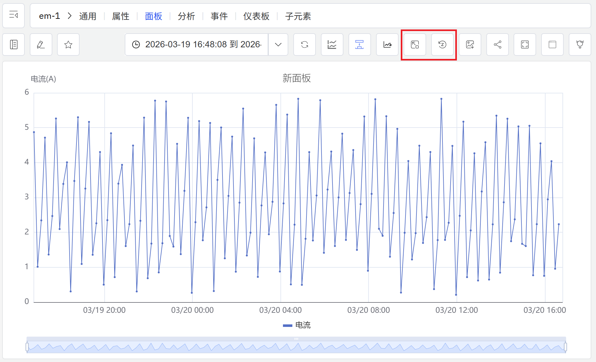

# 9.3 缺失数据填补

工业环境中的时序数据难以避免出现数据缺口——传感器离线、网络中断、硬件故障或数据传输延迟，都可能导致特定时间段内的测量值缺失。IDMP 支持由 **TDgpt** 驱动的 AI 缺失数据填补，利用信号的历史规律对缺口期间的数值进行智能估算，确保下游分析、均值计算和 KPI 统计不因数据缺失而产生偏差。

## 填补原理

缺失数据填补的核心思路是：**以已知推未知**。填补算法在缺口周围的历史数据窗口上运行，分析信号的变化规律，估算缺失时刻最可能出现的数值，并将这些估算值写回数据中。填补结果在视觉上与实际测量值可区分，不会覆盖原始数据。

TDgpt 的填补能力通过 `IMPUTATION()` SQL 函数对外提供服务。该函数要求输入数据具有严格等间隔的时间戳；对于生产环境中间隔不均匀的数据，建议先通过窗口聚合（如 `INTERVAL`）将数据规整后再进行填补。

TDgpt 填补是对 TDengine 原生插值函数（`INTERP`、`FILL`）的能力延伸。原生插值使用线性、前值、后值等简单策略，适合短小且规律可预期的缺口；TDgpt 填补基于学习到的信号规律，更适合较长的缺口、不规则信号，或简单插值会产生不真实数值的场景。

## 支持的算法

TDgpt 内置了多种缺失数据填补算法，涵盖统计学、深度学习与基础模型：

| 算法 | 类型 | 特点 |
|---|---|---|
| **Mean** | 统计学 | 使用缺口周围数据的局部均值进行填补，计算极快，对平稳信号效果良好（默认算法） |
| **IEM** | 统计学 | 迭代期望最大化（Iterative Expectation-Maximization），适用于具有相关性的多变量信号 |
| **LSTM** | 深度学习 | 基于长短期记忆神经网络，捕获复杂非平稳信号中的时序依赖关系，适合规律复杂的长缺口 |
| **TDtsfm / Moment** | 基础模型 | TDengine 时序基础模型，在多样化工业时序数据上预训练，支持自动识别信号频率并进行高质量填补 |

:::note
当前版本中，通过 `IMPUTATION()` SQL 函数调用时，仅支持 **Moment**（TDtsfm 系列）算法。通过趋势图面板操作栏触发填补时，算法选项涵盖上述全部算法；每次填补最多可处理 2048 条缺失记录，输入数据不少于 10 条、不超过 8192 条。
:::

## 使用入口

缺失数据填补通过**趋势图面板**的操作栏进行触发和配置，支持查看模式和编辑模式两种场景下使用。

### 在查看模式下执行填补

操作步骤：

1. 打开包含缺失数据的属性所在的**趋势图面板**。
2. 点击查看模式操作栏中的**填补**图标，进入填补模式。
3. 在图表上**点击并拖动**，框选需要填补的缺口区域；IDMP 将调用 TDgpt 对所选时间段进行 AI 估算并填充数值。
4. 如需撤销已应用的填补，点击操作栏中的**重置填补**图标，可移除当前图表上所有已填补的内容。

填补结果以有别于实测数据的样式叠加显示在趋势图中，便于直观对比原始数据（含缺口）与填补后的完整视图。

### 在编辑模式下预览填补效果

在面板编辑模式下，操作栏同样提供**填补**控件，可在面板预览中进入填补模式，对图表效果进行实时预览，辅助判断填补配置是否符合预期，无需切换至查看模式。

## 应用场景

缺失数据填补在以下场景中有重要价值：

- **连续性指标的统计完整性：** 对能耗、产量、流量等需要累计或平均计算的指标，缺口会直接影响统计结果的准确性；填补后可得到完整的数据序列，避免偏差
- **趋势分析与预测的输入质量：** 时序预测和趋势分析算法通常对数据完整性有较高要求；填补缺口可提升模型输入质量，改善预测效果
- **设备运行记录的审计追溯：** 在需要保留完整设备运行日志的场景（如法规合规、质量追溯），填补可提供合理的估算值以维持记录连续性
- **多属性对齐分析：** 当多条时序数据需要联合分析时，某条数据的缺口会影响整体的对齐和计算；填补可确保各属性数据在相同时间轴上对齐

### 示例：修复天然气流量计通信中断导致的数据缺口

**场景背景**

某化工厂依靠天然气流量数据进行每日能耗统计和燃料费用结算。某次网络设备更换导致流量计通信中断约 3 小时，导致该时段内流量数据全部缺失。由于能耗统计按日累计，这段缺口直接导致当日用量数据偏低，影响成本核算和能效考核结果。

**操作过程**

1. 打开包含 `天然气流量` 属性的**趋势图面板**，在查看模式下可以清晰看到缺口时段内数据中断。
2. 点击操作栏中的**填补**图标，进入填补模式。
3. 在图表上框选数据缺失的时间区域，IDMP 调用 TDgpt 分析缺口前后的流量规律，对缺失时段进行智能估算并填充数值。
4. 填补结果以不同样式叠加显示，与实测数据可视觉区分；确认估算结果合理后，完成本次填补操作。

**分析效果**

TDgpt 基于缺口前后各 2 小时的流量历史，识别出该时段处于工厂正常生产时段，流量应维持在稳定区间内，据此生成了平滑连续的估算值序列。

填补后当日天然气累计用量与相邻工作日相比误差在 1.5% 以内，能耗统计恢复正常，结算数据得以完整提交。
