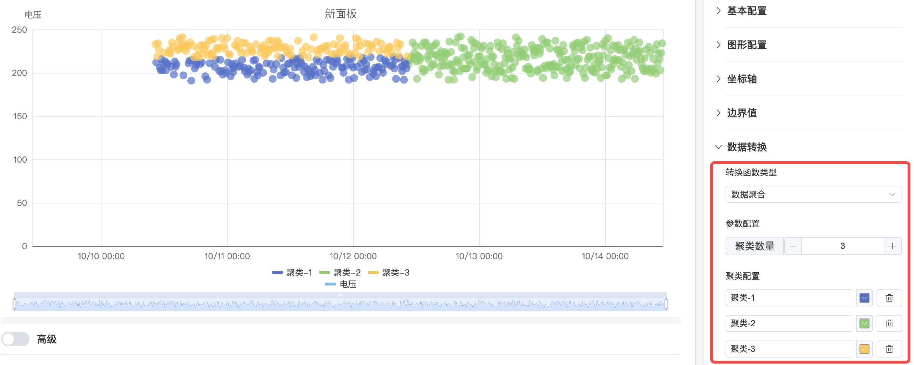

# 9.4 聚类

聚类是工业数据分析中应用广泛的探索性分析手段。IDMP 支持在散点图面板中对多维属性数据执行聚类分析，帮助用户在无需预先标注的前提下，自动发现设备运行状态、工况模式或时段特征的自然分组，从而为状态识别、故障归因和优化决策提供数据依据。

## 聚类原理

聚类是一种**无监督学习**方法，其核心目标是：**在没有类别标签的情况下，将数据集中的样本自动划分为若干个组（簇），使得同一簇内的样本彼此相似度高，不同簇之间的样本差异性大。**

从数学角度来看，聚类的优化目标可以表述为：最小化簇内离散度（Intra-cluster Variance），同时最大化簇间距离（Inter-cluster Distance）。算法将样本映射到特征空间，通过距离度量（如欧氏距离、余弦相似度等）衡量样本间的相似程度，并以迭代或层次化的方式寻找使上述目标函数达到最优的划分方案。

与分类任务不同，聚类无需提前定义类别体系，也无需标注样本——算法完全从数据的内在分布结构中发现潜在的规律和分组。这一特性使聚类特别适合工业场景中“我们知道状态是多样的，但不确定有几类、每类特征如何”的探索性分析需求。

在工业时序数据分析中，聚类通常以多维特征向量为输入——将每个样本（设备、时段、工况片段等）的多个属性值组合为坐标，在多维特征空间中寻找自然聚集的样本群。聚类结果不仅揭示了数据的内在分组结构，也为后续的状态建模、异常基线设定和模式对比奠定基础。

## 应用场景

聚类在工业领域具有广泛的实用价值，典型场景包括：

- **设备工况识别：** 对旋转设备的振动、温度和电流进行多维聚类，自动区分正常运行、轻微磨损、严重异常等工况区间，为预测性维护建立状态基准
- **生产工艺分组：** 对工艺过程参数进行聚类，识别与良品率相关的优质工艺区间与问题工艺区间，辅助工艺优化和质量管控
- **用能模式发现：** 对电力负荷或能耗数据按时段聚类，识别工作日、节假日、高峰期等典型用能模式，支持需求响应和节能策略制定
- **设备健康分级：** 对同类设备的多维运行指标进行聚类，将设备群体自动分为健康、亚健康、异常等层级，辅助资产管理决策

## 支持的算法

工业数据聚类领域有多种经典与现代算法，各自适应不同的数据结构和应用需求：

| 算法 | 类型 | 特点 |
|---|---|---|
| **K-Means** | 基于质心 | 将数据划分为 K 个簇，以各簇均值为质心迭代优化；计算效率高，适合大数据量、近似球形分布的场景；需预设簇数 K |
| **K-Medoids** | 基于质心 | 以实际数据点作为簇中心，对异常值的鲁棒性优于 K-Means；适合含噪声的工业数据 |
| **DBSCAN** | 基于密度 | 无需预设簇数，通过核心点与邻域半径自动发现任意形状的簇；能将低密度区域的点识别为噪声，适合异常检测与形状不规则的聚类 |
| **层次聚类（Hierarchical）** | 基于层次 | 自底向上（凝聚）或自顶向下（分裂）地构建聚类树（树状图）；无需预设簇数，可通过截断树状图灵活选择粒度，适合需要探索多层级分组结构的场景 |
| **GMM（高斯混合模型）** | 基于概率 | 假设数据由多个高斯分布混合生成，通过期望最大化（EM）算法估计参数；支持软分配（样本属于各簇的概率），适合边界模糊、分布重叠的工况数据 |
| **Spectral Clustering** | 基于图论 | 将数据映射到图拉普拉斯矩阵的特征向量空间后再聚类，能够处理复杂的非线性流形结构；适合拓扑形状复杂的高维数据 |

### 算法选择建议

- 对于大多数工业多维属性数据，优先选择 **K-Means**，计算高效，结果易于解释
- 对于含有噪声点或异常样本的数据，选择 **DBSCAN** 或 **K-Medoids** 以提高鲁棒性
- 对于不确定分组数量、需要探索数据层级结构的场景，选择**层次聚类**
- 对于簇边界模糊、工况状态有重叠过渡的场景，选择 **GMM**
- 对于高维、非线性特征分布的场景，选择 **Spectral Clustering**

## 使用入口

聚类分析当前通过**散点图面板**中的数据转换功能进行访问。

操作步骤：

1. 打开或创建一个**散点图面板**，配置 X 轴和 Y 轴属性，使面板显示多维属性数据的散点分布。
2. 进入面板的**数据转换设置**。
3. 将数据转换模式切换为**数据聚合**。
4. IDMP 将自动对当前图表中的数据点执行聚类，并以**不同颜色**区分不同的簇，直观呈现数据的自然分组结构。

聚类结果叠加在原始散点分布之上，不同颜色代表不同的数据簇，使分组结构一目了然。结合 X 轴和 Y 轴所代表的物理量含义，可以直接读取各簇对应的工况区间范围，为状态标记和进一步分析提供直观的参考视图。

:::note
当前版本中，聚类分析的使用入口为散点图面板的数据转换设置。未来版本将持续扩展使用方式，包括支持更多聚类算法，以及通过正在研发中的**模型开发管理**模块直接调用聚类算法，构建面向具体工业场景的复杂分析模型。

散点图面板的数据转换设置还提供**回归分析**选项，可对散点数据拟合线性、指数或多项式曲线。关于散点图面板的完整配置说明，请参阅[散点图](../04-visualization/02-chart-types/12-scatter-chart.md)章节。
:::
