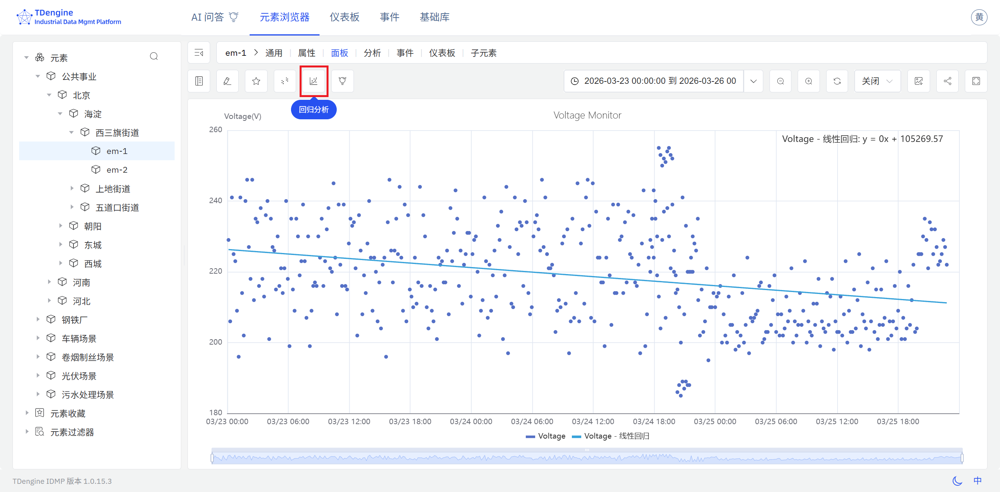

# 9.5 回归

回归分析是工业数据分析中用于建立变量间定量关系的核心方法。IDMP 支持在散点图面板中对两个属性的数据执行回归分析，帮助用户发现并量化两个属性之间的函数关系，为工艺建模、性能基准建立和影响因素量化提供数据支撑。

## 回归原理

回归分析的核心目标是：**在给定自变量（输入变量）的条件下，建立一个能够最优拟合观测数据的数学函数，以描述自变量与因变量之间的定量关系，并据此对新的输入值进行预测或推断。**

从优化角度来看，回归算法通过最小化预测值与实测值之间的误差（通常以残差平方和衡量，即最小二乘法）来确定最佳拟合参数。不同的回归模型对数据关系的形态做出不同的假设——线性回归假设变量间呈直线关系，而指数回归和多项式回归则能捕捉更复杂的非线性变化规律。

与聚类等无监督方法不同，回归是一种**有监督**的统计建模方法：需要明确指定自变量和因变量，模型在数据上拟合后即可定量描述两者之间的关系强度和变化规律。拟合优度（如 R²）是衡量回归模型解释能力的经典统计量，R² 越接近 1，表示所选函数形态对数据的拟合程度越高。

在工业场景中，回归分析通常以散点图为载体：将 X 轴设为自变量属性，Y 轴设为因变量属性，在二维特征空间中观察数据点的分布形态，并拟合相应的回归曲线，从而直观呈现变量间的定量依赖关系。

## 支持的算法

IDMP 支持三类经典回归曲线，覆盖线性与常见非线性函数形态：

| 算法 | 函数形式 | 特点 |
|---|---|---|
| **线性回归（Linear）** | y = ax + b | 最简单的回归形式，假设因变量与自变量呈线性比例关系；计算解析可解，结果高度可解释，适合趋势单调且近似线性的场景 |
| **指数回归（Exponential）** | y = ae^(bx) | 适合描述随自变量增大而加速增长或衰减的关系，如设备老化、电池容量衰退等指数型变化规律 |
| **多项式回归（Polynomial）** | y = a₀ + a₁x + a₂x² + … + aₙxⁿ | 通过提高多项式阶数（n）拟合更复杂的非线性曲线；阶数可配置，阶数越高拟合灵活性越强，但过高的阶数会导致过拟合，应结合数据量和先验知识选取合适的阶数 |

### 算法选择建议

- 对于近似线性的单调关系，优先选择**线性回归**，结果简洁且易于解释
- 对于呈指数增长或衰减形态的关系，选择**指数回归**
- 对于具有局部峰谷、S 形或其他复杂曲线形态的关系，选择**多项式回归**，并根据曲线复杂度选择合适的阶数（通常 2～4 阶可覆盖大多数工业场景）

## 使用入口

回归分析当前通过**散点图面板**中的数据转换功能进行访问，与聚类分析共用同一入口。

操作步骤：

1. 打开或创建一个**散点图面板**，将 X 轴配置为自变量属性、Y 轴配置为因变量属性，使面板以散点形式呈现两个变量的联合分布。
2. 进入面板的**数据转换设置**。
3. 将数据转换模式切换为**回归分析**。
4. 选择回归类型（线性、指数或多项式），如选择多项式回归，还需配置多项式的阶数。
5. IDMP 将自动对当前图表中的数据点拟合回归曲线，并将拟合曲线叠加显示在散点图上。

回归曲线叠加在原始散点分布之上，直观呈现两个属性之间的函数关系形态。结合 X 轴和 Y 轴所代表的物理量含义，可以直观读取关系的方向（正相关/负相关）、斜率和非线性程度，为工艺优化和性能基准建立提供定量参考。

:::note
当前版本中，回归分析的使用入口为散点图面板的数据转换设置。未来版本将持续扩展使用方式，包括支持更多回归算法，以及通过正在研发中的**模型开发管理**模块直接调用回归算法，构建面向具体工业场景的复杂分析模型。

散点图面板的数据转换设置还提供**数据聚合**选项，可对散点数据执行聚类分析，识别数据的自然分组结构。关于散点图面板的完整配置说明，请参阅[散点图](../04-visualization/02-chart-types/12-scatter-chart.md)章节。
:::

## 应用场景

回归分析在工业领域有广泛的落地价值，典型场景包括：

- **能耗建模：** 建立生产负荷与电力消耗之间的回归模型，量化单位产量的能耗系数，为能耗基准线设定和节能效果评估提供依据
- **设备性能曲线拟合：** 拟合泵或压缩机的流量与功耗之间的特性曲线，识别运行效率的偏离，辅助设备状态诊断
- **工艺参数影响量化：** 建立工艺参数（如模温、注射压力）与产品质量指标之间的回归模型，量化各参数对质量的影响程度，辅助工艺优化
- **寿命预测：** 建立设备运行时长与磨损指标（如振动幅值、温升）之间的回归模型，预测剩余使用寿命，辅助预测性维护决策

### 示例：拟合冷机冷冻水出水温度与功率的关系曲线

**场景背景**

某办公楼的中央空调冷机在不同负荷下运行时，冷冻水出水温度设定值越高，压缩机做功越少、能耗越低。设施管理团队希望直观了解这两个变量之间的关系，判断当前冷机的运行效率是否正常，并为节能调优提供参考依据。

**操作过程**

1. 打开或新建一个**散点图面板**，将 X 轴配置为 `冷冻水出水温度设定值`，Y 轴配置为 `冷机实时功率`，数据源选择近 30 天的历史数据。
2. 进入面板的**数据转换设置**，将模式切换为**回归分析**，选择**线性回归**。
3. IDMP 对散点数据拟合线性曲线，并叠加显示在散点图上。

**分析效果**

拟合结果清晰呈现出负相关关系：出水温度设定值每提高 1°C，冷机功率平均下降约 15 kW。散点整体贴合拟合线分布，说明两者关系稳定。

设施管理团队将此曲线作为节能调优的参考基准，在室外温度允许的条件下适度提高出水温度设定值，实测冷机能耗每月下降约 6%。
