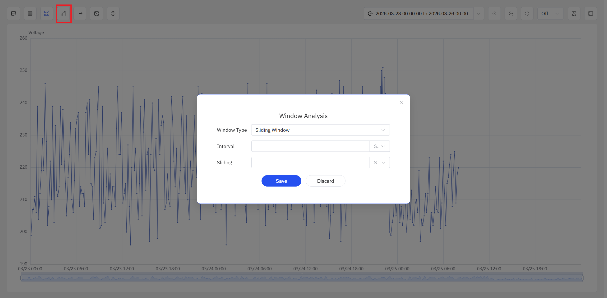

---
title: 窗口分析
sidebar_label: 窗口分析
---

# 9.5 窗口分析

窗口分析是 IDMP 提供的交互式历史数据回溯工具，用于在大量历史时序数据中按需搜索有意义的时间片段。用户选择一种窗口策略并配置参数，系统即在指定时间范围内扫描数据，将符合条件的时间段以高亮窗口的形式叠加显示在分析面板的图表上，帮助用户快速定位关注的运行区间。

这一能力在定位上类似 Seeq 的 Value Search：它面向工程师的交互式历史数据搜索场景，用户无需编写 SQL 或其他查询语句，只需通过条件配置，即可从海量历史数据中筛选出感兴趣的时间片段。

## 9.5.1 窗口分析原理

窗口分析的核心思想是：**用窗口策略将连续的时序数据切分为离散的时间片段，筛选出满足条件的片段并高亮显示，辅助用户发现数据中的规律、异常和模式。**

具体流程如下：

1. 用户在分析面板中选择一种窗口类型（如事件窗口、状态窗口、异常检测等），并配置该窗口类型对应的参数（如阈值条件、状态属性、时间间隔等）。
2. 系统在当前图表的时间范围内对历史数据执行一次性扫描，按照窗口规则找出所有匹配的时间段。
3. 找到的窗口以高亮时段的形式叠加在属性趋势曲线上，用户可以直观地观察每个窗口内的数据表现。

**窗口分析不会创建事件。** 它是一种纯粹的可视化探索手段，不会写入数据、不会生成系统事件、也不会触发告警或处置流程。窗口分析的定位是"先看再定"——帮助用户在历史数据中快速定位感兴趣的时段，在此基础上再决定是否需要配置持续运行的实时分析规则。

### 窗口分析与实时分析触发器的区别

窗口分析支持的六种窗口类型与[实时分析触发类型](../07-real-time-analysis/03-trigger-types.md)共享相同的窗口语义，但使用场景和目的不同：

| | 实时分析触发器（第 7 章） | 窗口分析（本节） |
|---|---|---|
| **运行方式** | 持续运行，面向实时数据流 | 交互式，面向历史数据，按需一次性执行 |
| **输出** | 创建事件 + 写入计算结果 | 在图表上生成高亮窗口 |
| **是否创建事件** | 是 | 否 |
| **使用入口** | 元素 → 分析 → 配置触发器 | 分析面板查看模式 → 窗口分析图标 |

简言之，实时分析触发器像"监控摄像头"——配置一次后持续运行；窗口分析像"回放录像"——按需在历史数据中搜索特定画面。

## 9.5.2 适用场景

窗口分析在工业领域具有广泛的应用价值，典型场景包括：

**条件搜索与异常时段定位**

- 搜索"温度超过 85°C 的所有时段"，快速定位设备过热区间，评估过热频率和持续时长
- 搜索"振动幅值连续 10 分钟高于正常基线"的时段，定位设备机械异常的时间分布

**异常检测与探索**

- 对目标属性运行 AI 异常检测算法，无需设定阈值，自动发现偏离正常行为的数据段
- 在探索阶段快速了解数据中潜在的异常模式，为后续配置实时异常检测规则提供参考

**运行模式与状态回顾**

- 按设备运行状态（运行/空闲/故障）切分窗口，统计各状态的持续时长和分布规律
- 按批次号切分窗口，快速回顾每个批次的时间边界和数据表现

**周期性分析与对比**

- 按固定时间间隔（如每小时、每班次）切分窗口，对比不同时段的指标表现，发现周期性规律
- 按设备启停周期切分窗口，分析每个运行周期内的数据趋势

**数据质量审查**

- 利用会话窗口识别数据上报中断时段，辅助评估传感器和通信链路的可靠性
- 利用计数窗口按固定样本量切分数据，发现采样频率异常的区间

## 9.5.3 支持的窗口类型

IDMP 窗口分析提供六种窗口类型，覆盖从简单时间切分到 AI 异常发现的多种需求：

- **滑动窗口（Sliding Window）：** 基于事件时间，按固定滑动时间间隔切分数据。适合需要滚动回顾的场景，例如"每小时为一段，看看哪段能耗最高"。
- **状态窗口（State Window）：** 当整型属性的值从一个状态切换到另一个状态时切分窗口。适合按设备运行模式（运行/空闲/故障）或批次号切段回顾。
- **事件窗口（Event Window）：** 基于用户定义的开始条件和结束条件表达式切分窗口，条件针对元素属性计算。适合寻找"温度超过 85°C 的所有时段"等自定义条件。支持设置最短持续时长以过滤噪声。
- **异常检测（Anomaly Detection）：** 对目标属性运行 TDgpt 异常检测算法，无需人工设定阈值，系统自动识别偏离正常行为的数据段并以窗口形式标出。适合在探索阶段快速发现数据中的异常模式，也可为后续配置实时异常检测规则提供参考。
- **会话窗口（Session Window）：** 当元素在指定的不活动时间内没有新数据时切分窗口，覆盖此前活跃期间的数据。适合数据天然有间断的场景，如设备开停机、车辆行驶/停车。
- **计数窗口（Count Window）：** 当元素属性写入的新记录数达到指定数量时切分窗口。适合数据到达间隔不规律、但需要按固定样本量分析的场景。

这六种窗口类型与[实时分析触发类型](../07-real-time-analysis/03-trigger-types.md)共享相同的窗口语义，各窗口类型的参数配置详情请参阅该章节。

## 9.5.4 使用入口

窗口分析通过分析面板在查看模式下的操作栏中的**窗口分析**图标进行访问。

步骤：

1. 点击操作栏中的**窗口分析**图标，弹出窗口分析配置框。用户可在其中选择窗口类型，并配置对应参数（如条件表达式、状态属性、时间间隔等）。

2. 确认窗口配置后，系统对当前时间范围内的历史数据执行窗口搜索，并将找到的窗口以高亮时段显示在分析面板中。此时，用户可以：

- 在同一面板中同时运行多种窗口策略的搜索，对结果进行交叉比对。
- 直观观察每个窗口内的数据表现，判断是否需要进一步分析。
- 结合事件对比、时间对齐、归一化、包络线等分析能力，对感兴趣的窗口做更深入的探索。

## 9.5.5 使用示例

**场景背景**

某化工厂的乙烯裂解炉在正常运行时，出口温度稳定在 830～850°C 之间。近期运维团队收到反馈称部分产品的转化率偏低，怀疑裂解炉在某些时段出现了温度异常。工艺工程师希望在不翻阅大量历史数据的前提下，快速定位过去 30 天内所有温度偏离正常范围的时段，并评估异常的频率和时间分布。

**操作过程**

1. 在分析面板中打开裂解炉的出口温度趋势，将时间范围设置为近 30 天。
2. 点击操作栏中的**窗口分析**图标，选择**事件窗口**，开始条件设为 `outlet_temp < 830`，结束条件设为 `outlet_temp > 835`，最短持续时长设为 5 分钟（过滤短暂波动）。
3. 系统扫描 30 天数据，找到 12 个温度偏低时段，高亮显示在图表上。
4. 切换窗口类型为**异常检测**，选择默认算法，对同一时间范围再次执行搜索。系统除了找到上述温度偏低时段外，还标识出 3 个温度虽在 830～850°C 范围内、但波动模式明显异于正常时段的数据段。

**分析效果**

工程师观察到 12 个低温时段主要集中在周末夜班，进一步检查运行日志发现与操作员手动调整燃料流量有关。异常检测额外标识的 3 个时段虽然温度绝对值正常，但温度波动频率和幅度异常增大，经排查确认为温控回路的 PID 参数漂移所致。两类问题分别安排了操作规范修订和控制参数校准，后续产品转化率恢复正常水平。
