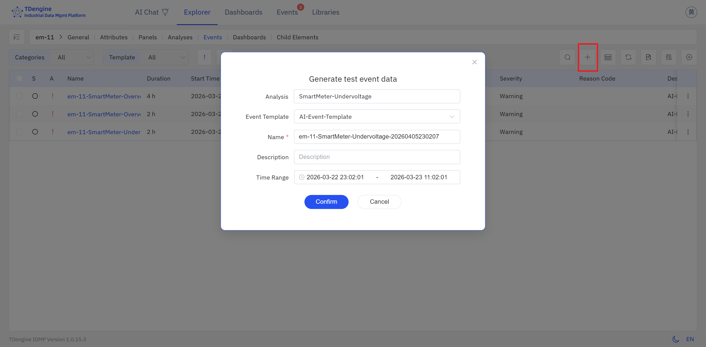
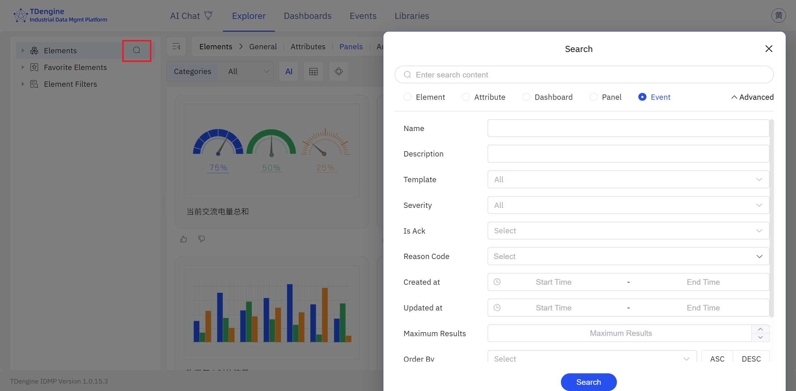
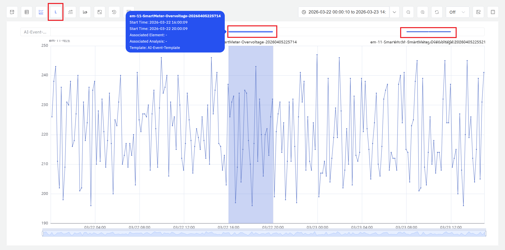
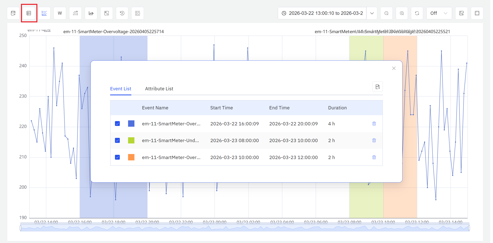
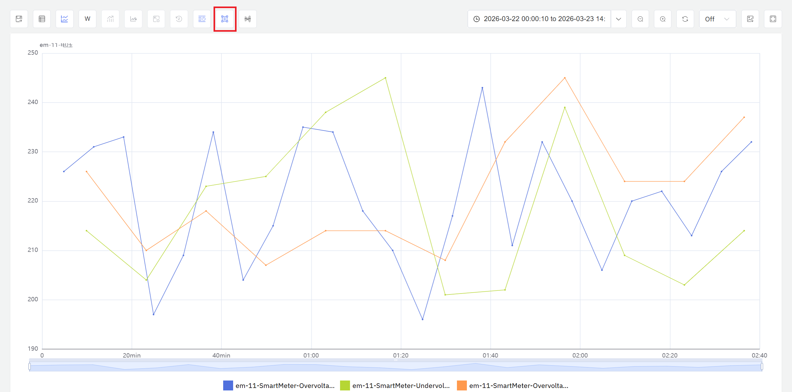

---
title: 事件、批次分析
sidebar_label: 事件、批次分析
---

# 9.6 事件、批次分析

批次分析是工业数据分析中针对离散生产过程的重要方法。**IDMP 将产品批次定义为一类特殊事件**——具有明确起止时间的离散运营记录。平台并未提供独立的批次分析模块，而是将批次作为事件的一种特殊类型，借助灵活的事件分析能力完成批次的全生命周期管理与深度分析。

IDMP 通过事件分析实现了对批次生产、化工反应、加工制造等场景下全过程数据的对比分析，帮助用户识别影响产品质量的关键工艺因素，发现批次间的规律与异常，为工艺优化和质量管控提供数据支撑。

**分析面板（Analysis Chart）是事件、批次分析的主要入口。** 分析面板是 IDMP 中唯一以独立窗口形式运行的分析工作区，用户可以在其中完成窗口分析、事件对比、相关分析等多种过程分析任务。本节所述的事件分析与探索等功能均在分析面板的查看模式下进行。

## 9.6.1 事件、批次分析原理

事件、批次分析的核心思想是：**将每一段具有明确起止时间的生产、反应或加工过程视为一个独立的分析单元（即事件/批次），通过对多个事件的全过程数据进行对比、统计和溯源，发现规律、定位差异、查找异常。**

与连续生产过程的分析不同，事件、批次分析关注的是每个事件从开始到结束的完整生命周期——包括整个批次内工艺参数的变化趋势、关键指标的统计汇总，以及与其他批次之间的横向对比。一个好的批次往往体现为工艺参数稳定、关键指标在目标范围内、与历史优秀批次的曲线高度一致；而问题批次则可能在某个阶段出现参数偏移、异常峰值或与标准曲线的明显背离。

事件、批次分析通常围绕以下目标展开：

- **批次对比：** 将当前批次与历史批次、黄金批次或标准批次进行曲线叠加对比，直观呈现工艺参数的一致性与差异点
- **质量溯源：** 对质量合格与不合格的批次分组对比，识别与质量结果相关的工艺参数差异，定位根因
- **异常批次识别：** 在大量历史批次中筛选出工艺参数偏离正常范围的批次，辅助质量管控和工艺审计
- **趋势监控：** 追踪批次间关键指标（如产率、周期时长、能耗）的长期变化趋势，发现工艺漂移或设备老化信号

## 9.6.2 适用场景

事件、批次分析在离散生产和流程工业中有广泛的应用场景：

**制药与生物制药**

- 对发酵、结晶、纯化等批次工艺的全过程数据进行对比，识别影响收率和纯度的关键工艺参数
- 将每批次的完整工艺数据归档为电子批记录，支持 GMP 合规审计和偏差调查

**化工与精细化工**

- 对合成反应、聚合、蒸馏等批次过程进行参数汇总与批次间对比，优化反应条件和投料配比
- 追踪批次间产率和产品质量指标的变化趋势，及时发现原料变化或催化剂失活等因素的影响

**半导体与电子制造**

- 对刻蚀、镀膜、扩散等工艺批次的腔室参数进行对比，识别影响良品率的关键工艺变量
- 通过批次间参数一致性分析监控设备状态漂移，辅助预防性维护决策

**注塑与成型加工**

- 对每模次或每批次的注射温度、保压时间、冷却速率等参数进行汇总统计，建立工艺窗口基准
- 将不良品批次的工艺数据与合格批次对比，快速定位参数异常阶段

## 9.6.3 事件的定义与实现

IDMP 中的 **事件 (Event)** 是具有明确开始时间、结束时间和持续时长的离散运营记录。每个事件均会记录该事件的起止时间，并可携带自定义属性（如批次 ID、产品型号、操作员、质量结论等）。事件与元素及其属性的时序数据关联，使得对任意时间范围内的完整过程数据进行提取和分析成为可能。

事件的起止时间可以通过以下两种方式定义：

**手动标记：** 由操作人员在生产结束后，在事件管理界面手动创建事件，填写开始和结束时间。这适合生产节奏不固定、批次边界需人工判断的场景。

**自动生成（推荐）：** 在生产流程中，为设备属性添加**批次号**字段——设备的时序数据中输出当前正在生产的批次号。每当批次号发生变化（即一个新批次开始），IDMP 的**状态窗口**触发器自动检测到这一状态切换，触发分析汇总上一批次的完整统计数据，并自动生成对应的批次事件记录。系统实时、准确地维护每个批次的完整记录，无需操作人员手动标记。

### 事件配置与自动生成

通过元素分析的状态窗口触发器，可以实现事件的自动生成。配置步骤如下：

1. **准备批次号属性：** 确保设备属性中已包含**批次号**字段（整型属性），且批次号在每个新批次开始时更新。
2. **创建分析：** 导航到元素的**分析**标签页，点击 **+** 创建新分析，填写分析名称（如"批次过程汇总"）。
3. **配置触发器：** 在**触发**步骤中，选择**状态窗口**作为触发类型，将**状态**属性设置为批次号字段。
4. **定义汇总指标：** 在**计算**步骤中，配置需要汇总的批次统计指标（如平均温度、最大压力、总时长、产率等），将计算结果写入对应的输出属性。
5. **启用事件生成：** 在**事件**步骤中，启用事件生成，选择批次对应的**事件模板**，配置命名规则和自定义属性（如批次 ID、产品型号等）。
6. **保存并运行：** 点击**保存**，分析开始持续运行。

配置完成后，每当批次号发生变化，系统将自动完成上一批次的数据汇总并生成事件记录。这种自动化方式确保了批次事件的实时性和准确性，无需人工干预。

:::note
批次号属性的类型应为整型（Integer），以便 IDMP 状态窗口触发器识别批次切换。每个新批次可使批次号自增，也可使用其他整型编码方式区分不同批次。

对于批次边界由数据静默间隙自然定义的场景（如设备完成一批后停止上报数据），也可使用**会话窗口**触发器，在数据流中断后自动完成批次汇总。
:::

### 临时事件

除了由系统自动生成或手动录入的事件之外，IDMP 还支持用户直接创建**临时事件**——无需预先配置模板或触发规则，用户可以灵活组合时间范围与属性条件，即时定义并生成所关注的事件。具体而言，用户可以在元素的事件列表页点击 **+**，并在弹出的**生成测试事件数据**窗口中配置个性化事件规则，生成临时事件。

临时事件可以像正式事件一样参与分析，与系统已有事件叠加在同一图表中进行对比。这一功能特别适合以下场景：

- **探索性分析：** 在尚未建立完整批次管理体系时，通过灵活的条件组合快速定义感兴趣的时段，立即开展对比分析
- **补充比较：** 发现某次设备运行异常时，结合时间范围与参数条件精确锁定该时段，与附近的正常批次或黄金批次并列对比，快速定位差异
- **假设验证：** 在调整工艺参数后，即时定义若干调整后时段的临时事件，与调整前的批次进行对比，验证改进效果

## 9.6.4 将事件添加到分析面板

事件生成后，需要将其添加到分析面板（Analysis Chart）中才能开展深度对比分析。IDMP 提供以下两种方式。

### 方式一：从事件列表添加

IDMP 提供了强大的事件搜索与过滤能力，帮助用户快速定位需要分析的事件并将其直接添加到分析面板。批次事件作为一种特殊的事件类型，同样可以利用完整的搜索功能体系进行查询。

**搜索入口**

点击顶部导航栏中的**事件**，或在元素详情页面切换到**事件**标签页，即可进入事件列表视图。点击搜索图标（放大镜）打开搜索弹窗。

**基础搜索**

在搜索框中输入关键词（如批次 ID、产品型号、操作员姓名等），按回车或点击**搜索**按钮。系统将在事件名称、描述和自定义属性中进行匹配，返回符合条件的批次事件列表。

**高级过滤**

点击**高级**展开更多过滤条件，可以按以下维度精确筛选批次事件：

- **时间范围：** 按批次开始时间或结束时间筛选，快速定位特定时间段内的批次
- **事件模板：** 按批次对应的事件模板筛选，区分不同产品线或工艺类型的批次
- **元素路径：** 限定搜索范围到特定设备或生产线下的批次
- **自定义属性：** 按批次的自定义属性（如质量等级、操作班次、产品规格等）进行筛选
- **严重程度：** 如果批次事件配置了严重程度，可按此筛选异常批次或关键批次

**保存过滤器**

对于常用的筛选条件（如"近 30 天不良批次"、"A 产品线所有批次"等），可以点击**另存为**按钮，将过滤条件保存为命名过滤器。保存后的过滤器会出现在侧边栏的**元素过滤器**列表中，点击即可快速重新执行。

**添加到分析面板**

在事件列表中找到目标事件后，可以通过以下方式将其添加到分析面板：

- 点击事件行末尾的**更多操作**菜单（⋮），选择**添加到分析面板**
- 勾选多个事件后使用批量操作，一次性将选中事件添加到分析面板
- 点击事件进入详情页面后，从详情页直接跳转到分析面板

通过灵活的搜索与过滤，用户可以从海量历史事件中快速定位重点事件，并将其添加到分析面板开展对比分析、质量溯源和工艺优化。

### 方式二：即席窗口分析

分析面板集成了窗口分析能力，用户无需离开分析面板即可通过即席窗口搜索，从历史数据中发现感兴趣的时间片段并用于分析。点击操作栏的**窗口分析**图标，选择窗口类型并配置参数，系统即在当前时间范围内扫描数据，将匹配的时间段以高亮窗口叠加显示在图表上。窗口分析的详细原理、窗口类型和使用说明请参阅[窗口分析](./05-window-analysis.md)。

事件添加到分析面板后，以下展示与对比功能可帮助用户直观把握事件全貌：

### 事件趋势叠加对比

在分析面板中，将事件时间范围叠加在工艺参数曲线上，可以直观呈现该事件期间各参数的变化过程。选择多个事件后，可将它们的曲线叠加在同一图表中进行对比，快速识别事件间的工艺差异、参数偏移和异常波动。

上图展示了多个事件的曲线叠加对比。通过将不同事件的完整过程曲线绘制在同一时间轴上，可以清晰看出各事件在不同时间段的参数表现，识别出偏离正常范围的异常事件。

### 事件线展示模式

当分析面板中的事件数量较大时，默认的底色叠加方式可能导致图表难以阅读。此时可点击操作栏的**启用事件线模式**，事件会以不同颜色的线条形式展示在属性趋势图的上方，鼠标悬停即可查看对应事件的关键信息。这种展示方式能够在事件密度较高时保持图表清晰，更容易发现事件间的分布规律。

## 9.6.5 事件分析与探索

事件添加到分析面板后，IDMP 提供了多种对比与可视化方式，帮助用户从不同维度理解事件间的差异与规律。

### 事件、属性列表

点击分析面板操作栏的**事件、属性列表**图标，系统会弹出汇总窗口，展示当前分析范围内的事件列表、属性列表以及关键统计指标（如事件数量、持续时间统计、属性均值/极值等），帮助用户在开展深入分析前快速掌握数据全貌。

### 时间对齐

时间对齐功能将多个事件的起始时间点对齐到同一时刻（如 t=0），使得不同事件在相同相对时间点上的工艺参数可以直接对比。这种对齐方式消除了事件实际发生时间的差异，聚焦于事件内部的工艺过程本身。时间对齐特别适合分析"从开始到第 2 小时"、"反应中期阶段"等相对时间段内的参数表现。

如图所示，所有事件的起点对齐到 t=0，横轴表示事件开始后的相对时间。通过这种方式，可以清晰对比各事件在相同相对时间点的参数表现，识别过程执行的一致性。

### 时间归一化

时间归一化将不同持续时长的事件统一映射到相同的时间尺度（如 0% 到 100%），使得长短不一的事件可以在同一坐标系中进行对比。归一化后，横轴不再表示绝对时间或相对时间，而是事件进度百分比。这种方式特别适合对比周期差异较大的事件（如 6 小时批次与 8 小时批次），聚焦于工艺各阶段的相对表现而非绝对时长。

图中所有事件的时间轴被压缩或拉伸到 0%–100% 的统一尺度，横轴表示事件完成进度。通过归一化，可以对比不同时长事件在"前 25%"、"中期 50%"、"收尾阶段"等相对进度点的参数表现，识别过程执行节奏的差异。

### 包络线分析

包络线功能基于多个事件的历史数据，自动计算并绘制参数的上下边界曲线（如最大值、最小值、均值±标准差等）。包络线定义了正常事件的工艺参数波动范围，形成一个"安全通道"。将新事件的曲线与包络线对比，可以快速判断该事件是否在正常范围内运行，或在哪个时间段偏离了历史模式。

橙色区域表示由历史参考批次构建的参数正常波动范围（如均值±2 倍标准差），彩色曲线表示当前被评估事件的实际参数走势。当曲线超出包络线范围时，说明该事件在该时间段的参数异常，需要进一步调查原因。包络线为批次质量判定提供了量化的参考基准。

通过以上多种分析方式的组合使用，用户可以从不同角度深入理解事件间的差异，识别影响质量的关键工艺因素，为工艺优化和质量管控提供数据支撑。

:::note
事件模板的创建与管理（包括自定义属性的定义、命名规则和严重程度配置）在**基础库 → 事件模板**中进行。分析的完整配置说明请参阅[实时智能分析与响应](../07-real-time-analysis/02-creating-analysis.md)章节，事件的完整使用说明请参阅[事件](../../events/)章节。
:::

## 9.6.6 使用示例

**场景背景**

某汽车零部件厂的注塑车间使用 8 台注塑机生产精密塑料外壳，每批次生产约 1000 件，周期 6～8 小时。注射温度、保压压力和冷却时间是影响外壳尺寸精度和表面质量的关键参数。近期部分批次的不良率明显偏高，工艺团队希望通过分析面板利用事件对比能力定位问题所在。

**操作过程**

1. **配置批次自动生成：** 注塑机设备属性中已配置 `批次号` 整型属性，每批次生产开始时由 MES 系统自动写入新批次号。在注塑机元素的**分析**标签页创建"注塑批次汇总"分析，触发类型选择**状态窗口**，状态属性选择 `批次号`；在计算步骤配置平均注射温度、平均保压压力、平均冷却时间、批次总时长四个汇总指标；在事件步骤启用事件生成，选择"注塑批次"事件模板。保存后，系统自动生成近 3 个月全部批次的事件记录。
2. **事件对比定位根因：** 在事件视图中筛选出近 40 个批次事件，按不良率高低分为两组，使用趋势叠加对比和时间对齐功能，将两组事件的注射温度曲线叠加在同一图表中。分析确认高不良率批次在生产后半段（约第 5～8 小时）注射温度持续低于 220°C，而低不良率批次全程稳定在 225～235°C。
3. **包络线验证：** 选取历史合格批次构建包络线，将近期高不良率批次与包络线对比，清晰看到温度曲线在第 5 小时后偏离正常通道，进一步确认了温度衰减的时间规律。

**分析效果**

经排查，原因是料筒加热元件老化导致夜班产能下降后无法维持设定温度。事件对比确认了温度偏低与不良率的直接关联，包络线分析精准定位了温度衰减的起始阶段。更换加热元件并调整工艺参数后，后续 15 个批次的不良率从平均 4.2% 降至 1.1%，注射温度曲线趋于一致。
