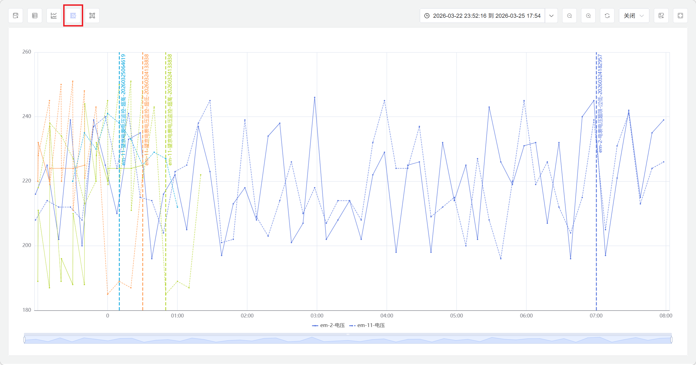
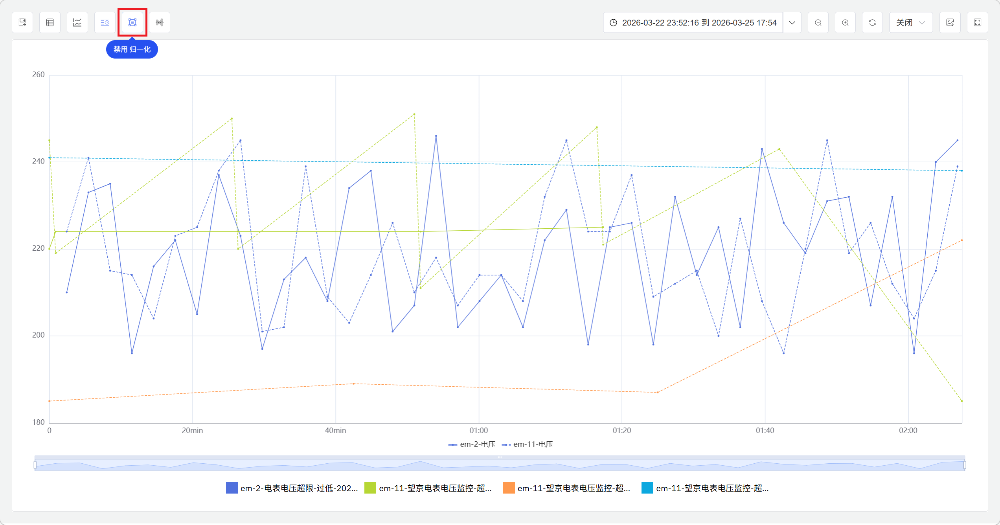
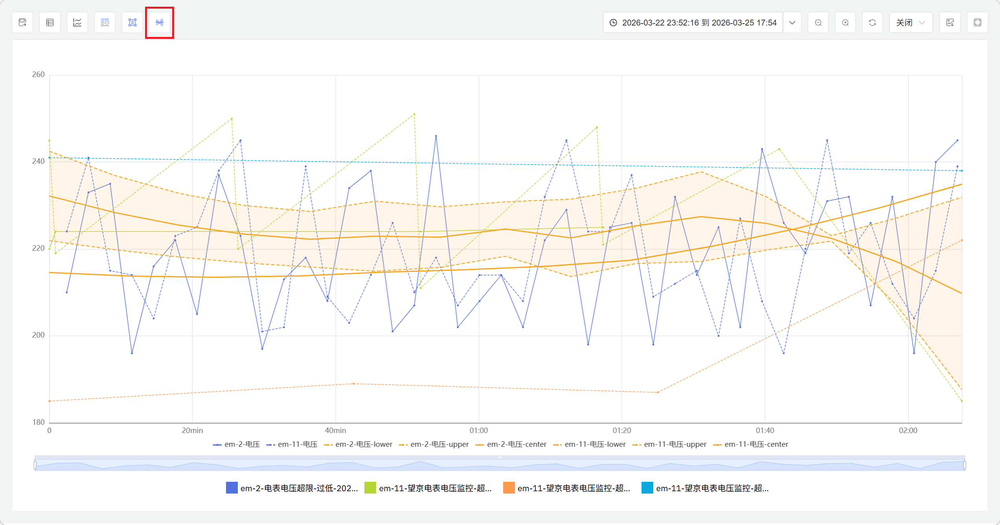

# 9.7 批次事件分析

批次分析是工业数据分析中针对离散生产过程的核心方法。IDMP 支持对批次生产、化工反应、加工制造等场景下的全过程数据进行系统性对比与分析，帮助用户识别影响产品质量的关键工艺因素，发现批次间的规律与异常，为工艺优化和质量管控提供数据依据。

**IDMP 将产品批次定义为一种特殊事件**，并通过 IDMP 强大、灵活的事件分析能力来实现批次分析场景。在 IDMP 平台中，并没有一个独立的批次分析模块，而是将批次作为事件的一种特殊类型，利用事件分析的完整功能体系来完成批次的全生命周期管理与深度分析。

## 批次分析原理

批次分析的核心思想是：**将每一段具有明确起止时间的生产、反应或加工过程视为一个独立的分析单元（批次），通过对多个批次的全过程数据进行对比、统计和溯源，发现规律、定位差异、查找异常。**

与连续生产过程的分析不同，批次分析关注的是每个批次从开始到结束的完整生命周期——包括整批次内工艺参数的变化趋势、关键指标的统计汇总，以及与其他批次之间的横向对比。一个好的批次往往体现为工艺参数稳定、关键指标在目标范围内、与历史优秀批次的曲线高度一致；而问题批次则可能在某个阶段出现参数偏移、异常峰值或与标准曲线的明显背离。

批次分析通常围绕以下目标展开：

- **批次对比：** 将当前批次与历史批次、黄金批次或标准批次进行曲线叠加对比，直观呈现工艺参数的一致性与差异点
- **质量溯源：** 对质量合格与不合格的批次分组对比，识别与质量结果相关的工艺参数差异，定位根因
- **异常批次识别：** 在大量历史批次中筛选出工艺参数偏离正常范围的批次，辅助质量管控和工艺审计
- **趋势监控：** 追踪批次间关键指标（如产率、周期时长、能耗）的长期变化趋势，发现工艺漂移或设备老化信号

## 适用场景

批次分析在离散生产和流程工业中有广泛的应用场景：

**制药与生物制药**

- 对发酵、结晶、纯化等批次工艺的全过程数据进行对比，识别影响收率和纯度的关键工艺参数
- 将每批次的完整工艺数据归档为电子批记录，支持 GMP 合规审计和偏差调查

**化工与精细化工**

- 对合成反应、聚合、蒸馏等批次过程进行参数汇总与批次间对比，优化反应条件和投料配比
- 追踪批次间产率和产品质量指标的变化趋势，及时发现原料变化或催化剂失活等因素的影响

**半导体与电子制造**

- 对刻蚀、镀膜、扩散等工艺批次的腔室参数进行对比，识别影响良品率的关键工艺变量
- 通过批次间参数一致性分析监控设备状态漂移，辅助预防性维护决策

**注塑与成型加工**

- 对每模次或每批次的注射温度、保压时间、冷却速率等参数进行汇总统计，建立工艺窗口基准
- 将不良品批次的工艺数据与合格批次对比，快速定位参数异常阶段

## 批次的定义与实现

在 IDMP 中，批次被定义为一种**事件（Event）**——具有明确开始时间、结束时间和持续时长的离散运营记录。每个批次事件记录该批次的起止时间，并可携带自定义属性（如批次 ID、产品型号、操作员、质量结论等）。批次事件与元素及其属性的时序数据关联，使得对任意批次时间范围内的完整过程数据进行提取和分析成为可能。

批次的起止时间可以通过以下两种方式定义：

**手动标记：** 由操作人员在生产结束后，在事件管理界面手动创建批次事件，填写开始和结束时间。适合生产节奏不固定、批次边界需人工判断的场景。

**自动生成（推荐）：** 在生产流程中，为设备属性添加**批次号**字段——设备的时序数据中输出当前正在生产的批次号。每当批次号发生变化（即一个新批次开始），IDMP 的**状态窗口**触发器自动检测到这一状态切换，触发分析汇总上一批次的完整统计数据，并自动生成对应的批次事件记录。无需操作人员手动标记，系统实时、准确地维护每个批次的完整记录。

### 批次配置与自动生成

通过元素分析的状态窗口触发器，可以实现批次事件的自动生成。配置步骤如下：

1. **准备批次号属性：** 确保设备属性中已包含**批次号**字段（整型属性），且批次号随每个新批次的开始而更新。
2. **创建分析：** 导航到元素的**分析**标签页，点击 **+** 创建新分析，填写分析名称（如"批次过程汇总"）。
3. **配置触发器：** 在**触发**步骤中，选择**状态窗口**作为触发类型，将**状态**属性设置为批次号字段。
4. **定义汇总指标：** 在**计算**步骤中，配置需要汇总的批次统计指标（如平均温度、最大压力、总时长、产率等），将计算结果写入对应的输出属性。
5. **启用事件生成：** 在**事件**步骤中，启用事件生成，选择批次对应的**事件模板**，配置命名规则和自定义属性（如批次 ID、产品型号等）。
6. **保存并运行：** 点击**保存**，分析开始持续运行。

配置完成后，每当批次号发生变化，系统将自动完成上一批次的数据汇总并生成批次事件记录。这种自动化方式确保了批次事件的实时性和准确性，无需人工干预。

:::note
批次号属性的类型应为整型（Integer），以便 IDMP 状态窗口触发器识别批次切换。每个新批次可使批次号自增，也可使用其他整型编码方式区分不同批次。

对于批次边界由数据静默间隙自然定义的场景（如设备完成一批后停止上报数据），也可使用**会话窗口**触发器，在数据流中断后自动完成批次汇总。
:::

## 批次事件分析入口

批次事件的查看与分析在 IDMP 中通过**事件**功能进行，批次事件的自动生成通过**元素分析**进行配置。

### 批次事件的查询与过滤

IDMP 提供了强大的事件搜索与过滤能力，帮助用户快速定位需要深入分析的批次事件。批次事件作为一种特殊的事件类型，可以利用 IDMP 的完整搜索功能体系进行查询。

**搜索入口**

点击顶部导航栏中的**事件**，或在元素详情页面切换到**事件**标签页，即可进入事件列表视图。点击搜索图标（放大镜）打开搜索弹窗。

**基础搜索**

在搜索框中输入关键词（如批次 ID、产品型号、操作员姓名等），按回车或点击**搜索**按钮。系统将在事件名称、描述和自定义属性中进行匹配，返回符合条件的批次事件列表。

**高级过滤**

点击**高级**展开更多过滤条件，可以按以下维度精确筛选批次事件：

- **时间范围：** 按批次开始时间或结束时间筛选，快速定位特定时间段内的批次
- **事件模板：** 按批次对应的事件模板筛选，区分不同产品线或工艺类型的批次
- **元素路径：** 限定搜索范围到特定设备或生产线下的批次
- **自定义属性：** 按批次的自定义属性（如质量等级、操作班次、产品规格等）进行筛选
- **严重程度：** 如果批次事件配置了严重程度，可按此筛选异常批次或关键批次

**保存过滤器**

对于常用的筛选条件（如"近 30 天不良批次"、"A 产品线所有批次"等），可以点击**另存为**按钮，将过滤条件保存为命名过滤器。保存后的过滤器会出现在侧边栏的**元素过滤器**列表中，点击即可快速重新执行。

**从事件列表到深度分析**

在事件列表中找到目标批次后，点击批次事件可查看其详细信息（开始/结束时间、持续时长、汇总统计指标、自定义属性等）。从批次详情页面，可以直接跳转到该批次的趋势图分析、多批次对比等深度分析场景。

通过灵活的搜索与过滤，用户可以从海量历史批次中快速定位关注的批次子集，为后续的对比分析、质量溯源和工艺优化奠定基础。

### 批次事件分析与探索

批次事件生成后，可通过事件视图进行深度分析与探索。IDMP 提供了多种批次对比与可视化方式，帮助用户从不同维度理解批次间的差异与规律。

**批次列表与详情**

在元素的**事件**标签页，可以查看该设备的全部历史批次记录，支持按时间范围、事件类型等条件过滤筛选。点击单个批次事件，查看该批次的完整信息——开始/结束时间、持续时长、汇总统计指标和自定义属性值。

**趋势图叠加对比**

在趋势图面板中，将批次时间范围叠加在工艺参数曲线上，可以直观呈现该批次期间各参数的变化过程。选择多个批次后，可将它们的曲线叠加在同一图表中进行对比，快速识别批次间的工艺差异、参数偏移和异常波动。

上图展示了多个批次事件的曲线叠加对比。通过将不同批次的完整过程曲线绘制在同一时间轴上，可以清晰看出各批次在不同时间段的参数表现，识别出偏离正常范围的异常批次。

**多泳道分析**

多泳道视图将多个批次的曲线分别绘制在独立的子图中，每个批次占据一个"泳道"。这种布局方式避免了曲线重叠造成的视觉混乱，特别适合同时对比大量批次（如 10 个以上）的整体趋势。用户可以快速浏览每个批次的完整过程，识别出明显偏离群体模式的异常批次。

上图展示了多泳道布局下的批次对比。每个批次独占一行，纵向排列，便于逐一检视各批次的过程曲线形态，快速发现异常批次的特征模式。

**时间对齐**

时间对齐功能将多个批次的起始时间点对齐到同一时刻（如 t=0），使得不同批次在相同相对时间点上的工艺参数可以直接对比。这种对齐方式消除了批次实际发生时间的差异，聚焦于批次内部的工艺过程本身。时间对齐特别适合分析"从开始到第 2 小时"、"反应中期阶段"等相对时间段内的参数表现。

上图展示了时间对齐后的批次对比。所有批次的起点对齐到 t=0，横轴表示批次开始后的相对时间。通过这种方式，可以清晰对比各批次在相同相对时间点的参数表现，识别过程执行的一致性。

**时间归一化**

时间归一化将不同持续时长的批次统一映射到相同的时间尺度（如 0% 到 100%），使得长短不一的批次可以在同一坐标系中进行对比。归一化后，横轴不再表示绝对时间或相对时间，而是批次进度百分比。这种方式特别适合对比周期差异较大的批次（如 6 小时批次与 8 小时批次），聚焦于工艺各阶段的相对表现而非绝对时长。

上图展示了时间归一化后的批次对比。所有批次的时间轴被压缩或拉伸到 0%-100% 的统一尺度，横轴表示批次完成进度。通过归一化，可以对比不同时长批次在"前 25%"、"中期 50%"、"收尾阶段"等相对进度点的参数表现，识别过程执行节奏的差异。

**包络线分析**

包络线功能基于多个批次的历史数据，自动计算并绘制参数的上下边界曲线（如最大值、最小值、均值±标准差等）。包络线定义了正常批次的工艺参数波动范围，形成一个"安全通道"。将新批次的曲线与包络线对比，可以快速判断该批次是否在正常范围内运行，或在哪个时间段偏离了历史模式。

上图展示了包络线分析。灰色区域表示历史批次的参数波动范围（如均值±2 倍标准差），彩色曲线表示当前批次的实际参数。当曲线超出包络线范围时，说明该批次在该时间段的参数异常，需要进一步调查原因。包络线为批次质量判定提供了量化的参考基准。

通过以上多种分析方式的组合使用，用户可以从不同角度深入理解批次间的差异，识别影响质量的关键工艺因素，为工艺优化和质量管控提供数据支撑。

:::note
事件模板的创建与管理（包括自定义属性的定义、命名规则和严重程度配置）在**基础库 → 事件模板**中进行。分析的完整配置说明请参阅[实时分析](../07-real-time-analysis/02-creating-analysis.md)章节，事件的完整使用说明请参阅[事件](../06-events/)章节。
:::

## 使用示例

**场景背景**

某汽车零部件厂的注塑车间使用 8 台注塑机生产精密塑料外壳，每批次生产约 1000 件，周期 6～8 小时。注射温度、保压压力和冷却时间是影响外壳尺寸精度和表面质量的关键参数。近期部分批次的不良率明显偏高，工艺团队希望通过批次分析定位问题所在。

**操作过程**

1. 注塑机设备属性中已配置 `批次号` 整型属性，每批次生产开始时由 MES 系统自动写入新批次号。
2. 在注塑机元素的**分析**标签页创建"注塑批次汇总"分析，触发类型选择**状态窗口**，状态属性选择 `批次号`；在计算步骤配置平均注射温度、平均保压压力、平均冷却时间、批次总时长四个汇总指标；在事件步骤启用事件生成，选择"注塑批次"事件模板，配置批次 ID 和操作员作为自定义属性。
3. 保存后，系统对历史数据回算，自动生成近 3 个月全部批次的事件记录；此后每批次结束时自动更新。

**分析效果**

工艺团队在事件视图中筛选出近 40 个批次，按不良率高低分为两组，在趋势图中叠加对比两组批次的注射温度曲线。

分析发现，高不良率批次在生产后半段（约第 5～8 小时）注射温度持续低于设定值（低于 220°C），而低不良率批次全程温度稳定在 225～235°C。经排查，原因是料筒加热元件老化导致夜班产能下降后无法维持设定温度。更换加热元件并调整工艺参数后，后续 15 个批次的不良率从平均 4.2% 降至 1.1%，注射温度曲线趋于一致。
