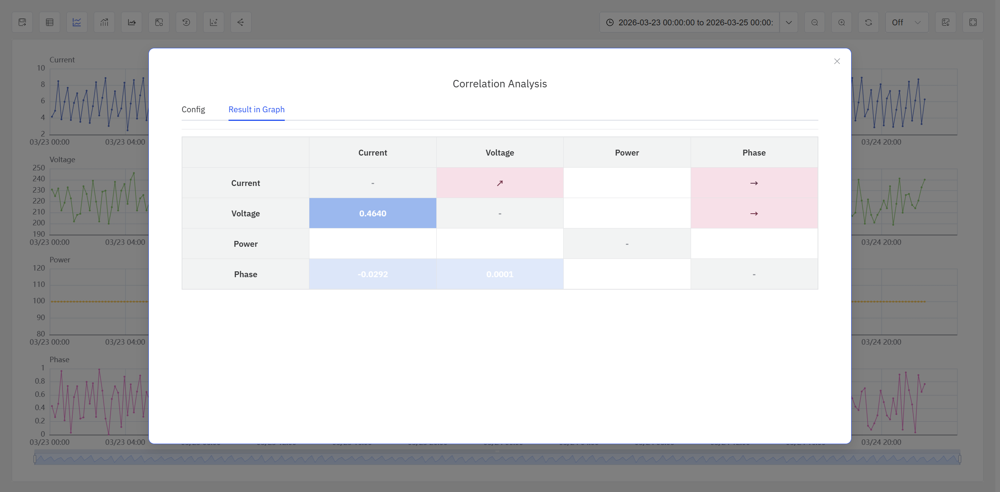

# 9.7 相关分析

相关分析是工业数据分析中用于量化变量间统计依赖关系的核心方法。IDMP 支持由 **TDgpt** 驱动的时序相关分析，帮助用户快速定位影响因素、缩小分析范围、验证分析假设，并为后续深入分析提供定量依据。

## 9.7.1 分析原理

相关分析的核心问题是：**当一个变量发生变化时，另一个变量是否表现出协同变化的趋势，以及这种协同变化的方向（正相关/负相关）和强度如何。**

对于两组时序数据 X 和 Y ，相关分析通过统计方法计算出一个相关系数，用以量化两者之间的统计关联程度。相关系数的绝对值越大，通常表明两个变量的协同变化趋势越明显。

需要注意以下几点：

- **相关不等于因果。** 相关分析只能说明两个变量之间存在协同变化的趋势，但并不能证明两者之间存在因果传导关系。数据相关性有可能来自偶然或混杂因素。为了更科学地判断相关性的可靠程度，IDMP 会在相关分析的基础上进行统计检验，计算 P 值，帮助用户评估结论的可信度。
- **相关不等于相似。** 相似是指两个序列具有相同的变化模式（Pattern）。相似的序列一定相关，但相关的序列不一定相似——例如两个序列可能存在线性关系但整体形态完全不同。
- **相关分析的对象是时序数据。** 相关分析需要两条或多条时序数据在一定时间范围内的观测值，对单点数据的相关分析没有统计意义。

## 9.7.2 适用场景

相关分析在工业领域具有广泛的应用价值，典型场景包括：

- **故障归因分析：** 设备指标异常时，快速锁定与之协同变化的参数，缩小排查范围
- **工艺优化：** 对工艺参数进行两两相关分析，发现强相关关系，为联动调节提供依据
- **设备健康评估：** 监测多指标间的相关性变化，当原本高度相关的指标出现相关性下降时，提示设备运行状态可能发生变化
- **能耗分析：** 分析能耗与环境温度、产量等变量的相关性，识别主要的能耗驱动因素
- **质量管控：** 对质量指标与上游工艺参数进行相关分析，识别影响良品率的关键因素

## 9.7.3 支持算法

IDMP 的相关分析能力由 TDgpt 提供支持，目前支持三种分析算法，适用于不同的分析需求：

| 算法 | 取值范围 | 特点 |
|---|---|---|
| **CORR（皮尔森相关系数）** | [-1, 1]  | 衡量两个序列的**线性相关性**，绝对值越大相关性越强；正值表示正相关，负值表示负相关。计算效率高，结果易于解释，适合大多数场景（默认算法） |
| **DTW（动态时间规整）** | [0, +∞) | 通过非线性时域对准计算两个序列的**相似度**，值越接近 0 表示越相似；适合存在时间偏移或速率差异的序列比较，如不同设备的相同工况数据对比 |
| **TLCC（时延互相关）** | [-1, 1]  | 计算两个序列在不同时间**滞后步数**下的相关系数，用于识别一个序列的变化是否会对另一个序列产生延迟影响，以及影响的方向和程度 |

### 算法选择建议

- 对于判断两个指标是否随时间同步变化，优先选择 **CORR**，计算高效，结果直观
- 对于比较两条形态相似但存在时间偏移的曲线，选择 **DTW**
- 对于分析"A 变量变化后，B 变量滞后多久才会响应"的探索分析场景，选择 **TLCC**

### 显著性判定

用户可结合分析场景与数据特征，建立显著性判断标准。以下为基于相关系数和 P 值组合的常用判定规则：

| 相关程度 | 相关系数 | P 值 |
|---|---|---|
| 极强相关 | ≥ 0.6     | < 0.05 |
| 显著相关 | ≥ 0.6     | < 0.1  |
| 中等相关 | [0.3, 0.6) | < 0.1  |
| 弱相关   | [0.1, 0.3) | < 0.1  |
| 不相关   | < 0.1      | < 0.1  |
| 不可信   | —         | ≥ 0.1 |

当 P 值 ≥ 0.1 时，结论通常标记为"不可信"，表示无法排除偶然因素的影响。

## 9.7.4 使用入口

在**分析面板**（Analysis Chart）的查看模式下，点击操作栏中的**相关分析**图标即可使用相关分析功能。只有已添加到分析面板中的时序属性才能参与相关分析。

步骤：

1. 打开或创建一个**分析面板**，添加需要分析的时序属性（至少两个）。
2. 在面板的**查看模式**下，点击操作栏中的**相关分析**图标，系统弹出相关分析配置窗口。
3. 在配置窗口中选择分析属性，设置分析参数（详见下文），点击**计算**按钮。
4. 系统对所选属性进行两两相关分析，结果展示在 **图形展示（Result in Graph）** 页签中。

### 配置参数

配置窗口包含以下设置项：

| 配置项 | 说明 |
|---|---|
| **相关算法** | 选择 CORR、DTW 或 TLCC 三种算法之一 |
| **算法参数** | CORR 无需额外参数；DTW 可配置邻域半径（Radius），默认为 1；TLCC 可配置滞后窗口的起止步数（Lag Start / Lag End），默认为 0 |
| **属性列表** | 显示当前分析面板中已添加的所有属性，用户可选择哪些属性参与分析 |
| **时间范围** | 开始时间和结束时间，默认为当前图表的时间范围，用户可自行调整 |

### 结果展示

计算完成后，IDMP 在 **图形展示（Result in Graph）** 页签中以矩阵热力图的形式展示所有属性对的相关分析结果：

- 蓝色区域显示相关系数值，相关性越强颜色越深
- 粉色区域显示相关系数的正负方向，以箭头方向标识正相关或负相关

:::note
如果已经执行过相关分析，再次点击**相关分析**图标时将直接显示上次的计算结果。用户可切换到配置页签调整参数后重新计算。
:::

## 9.7.5 使用示例

某化工厂精馏塔塔底纯度出现间歇性波动，分析团队希望快速定位与塔底纯度最相关的生产参数。

1. 打开分析面板，添加 `塔底纯度`、`回流比`、`进料温度`、`塔顶压力`、`再沸器热负荷` 五个属性，时间范围设为过去 7 天。
2. 点击**相关分析**，选择 **CORR** 算法，点击**计算**。
3. 查看结果：

| 属性对 | 相关系数 | 方向 | P 值 | 结论 |
|---|---|---|---|---|
| 塔底纯度 & 回流比       | 0.87     | 正   | 0.002 | 极强相关 |
| 塔底纯度 & 再沸器热负荷 | 0.72     | 正   | 0.018 | 极强相关 |
| 塔底纯度 & 进料温度     | -0.65    | 负   | 0.041 | 极强相关 |
| 塔底纯度 & 塔顶压力     | 0.21     | 正   | 0.35  | 不可信   |

结果表明纯度与回流比正相关最强（0.87），与进料温度负相关（-0.65），而与塔顶压力的关联不可信（P = 0.35）。团队据此聚焦排查，发现进料温度波动源于原料罐加热系统故障，修复后纯度恢复稳定。
