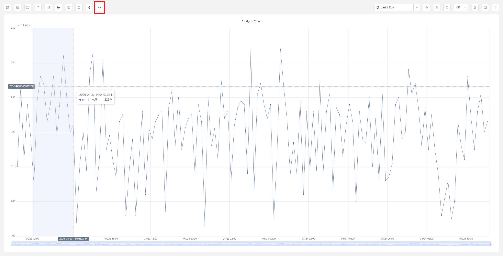
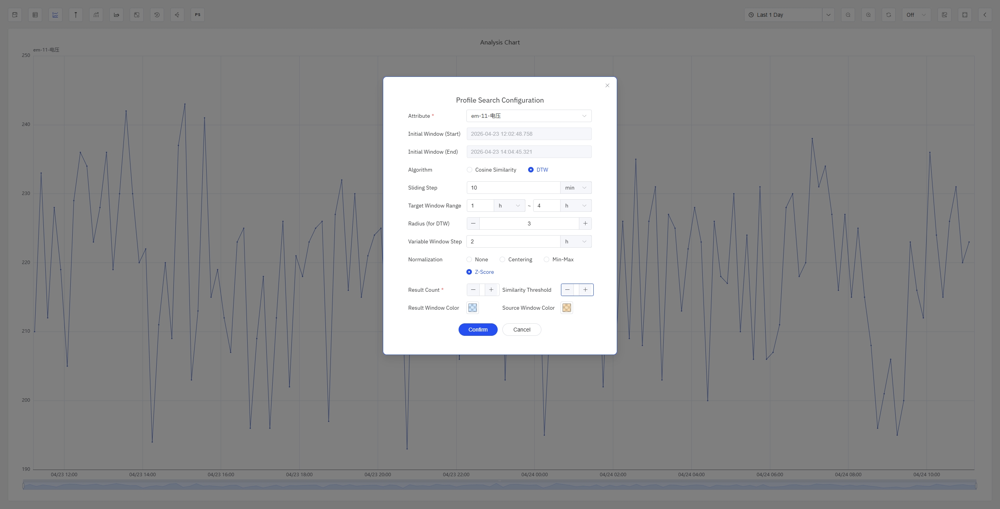

# 9.9 相似度分析

相似度分析用于在历史时序数据中搜索与用户指定的目标波形最相似的时间片段。用户在分析面板中框选某个属性的一段时间窗口作为参考模式，系统在整个可见时间范围内滑动扫描，计算每个候选片段与参考模式之间的相似度，并将最匹配的结果以高亮窗口的形式叠加展示在图表上。

这一能力适用于工业场景中常见的"找到类似工况"需求：工程师发现一段异常或典型运行曲线后，希望系统自动在历史数据中找到所有形态相近的片段，以便进行横向对比、频率统计或归因分析。

## 9.9.1 分析原理

相似度分析的核心思路是：**以用户选定的一段时间窗口内的属性波形作为参考模式，通过滑动窗口遍历历史数据，逐一计算每个候选窗口与参考模式之间的相似度，最终筛选出最接近的片段。**

具体流程如下：

1. 用户在分析面板中用鼠标框选某个属性的一段时间范围，该区域即为**初始窗口**。
2. 系统在当前分析面板的整个时间范围内，以滑动窗口方式生成一系列候选窗口。
3. 对初始窗口与每一个候选窗口的数据，先按用户选定的量纲处理方式进行预处理，再使用所选算法计算窗口相似度。
4. 根据用户设定的阈值或 Top N 条件，筛选出符合要求的相似窗口，高亮显示在图表上，并在结果表格中按相似度排序展示。

### 量纲处理

在实际工业数据中，同一个属性在不同时段的运行均值和波动幅度往往不同。例如，同一台电机在不同负载下的振动信号，波形形状可能非常相似，但均值水平（Level）和波动幅度（Size）存在明显差异。如果直接用原始数值计算相似度，这些差异会干扰判断，使得形状相似但数值不同的片段被错误地判定为不相似。

量纲处理的作用就是在计算相似度之前，对窗口内的数据进行预处理，有选择地消除均值水平或波动幅度的影响，让相似度计算聚焦于用户真正关心的特征。

用户可在配置中选择以下四种量纲处理方式之一：

| 量纲处理方式 | 说明  | 效果  |
| --- | --- | --- |
| **原始值（Raw）**       | 不做任何预处理，直接使用原始数值   | 保留所有原始信息。只有数值范围和波形形状都接近的片段才会被判定为相似   |
| **中心化（Centering）** | 每个窗口内的数值减去该窗口的均值                    | 消除均值水平（Level）差异，保留波动幅度（Size）差异。适合关注"波动幅度和形状是否相似，但不关心整体运行在什么水平"的场景 |
| **幅值归一（Min-Max）** | 将每个窗口内的数值线性缩放到 [0, 1] 范围            | 同时消除均值水平和波动幅度差异，仅保留波形形状。缩放由窗口内的最大值和最小值决定，对个别极端尖峰较为敏感  |
| **无量纲化（Z-Score）** | 对每个窗口执行 Z-Score 标准化（减均值后除以标准差） | 同时消除均值水平和波动幅度差异，仅比较波形形状。适合只关注"曲线的升降节奏是否一致"的场景 |

:::tip 幅值归一与无量纲化的区别
幅值归一和无量纲化都能消除均值水平和波动幅度差异、聚焦于波形形状比较，但两者的缩放依据不同。幅值归一由窗口内的最小值和最大值决定，单个异常尖峰即可显著改变缩放结果；无量纲化由均值和标准差决定，受个别极端值的影响较小。如果数据中可能存在偶发的传感器尖峰或毛刺，建议优先选择无量纲化。
:::

**如何选择：** 如果不确定应使用哪种方式，建议从 **无量纲化（Z-Score）** 开始——它对极端值鲁棒且只关注波形形状，最能反映曲线变化趋势的相似性。如果需要同时匹配波形和数值范围（例如搜索"温度在同一区间内且走势一致"的片段），则选择**原始值**。如果只想消除均值偏移但仍关注波动幅度的差异，选择**中心化**。

## 9.9.2 适用场景

相似度分析在工业领域具有广泛的应用价值，典型场景包括：

- **异常模式搜索：** 发现一段异常运行曲线后，搜索历史数据中是否出现过类似波形，评估异常的复发频率和时间分布
- **典型工况匹配：** 选定一段理想运行区间的波形，在历史数据中找到所有运行状态相近的时段，用于工艺优化对比
- **故障前兆回溯：** 以设备故障前的传感器波形为参考，在更长的历史数据中搜索类似模式，判断该故障是否存在可预测的前兆信号
- **批次一致性分析：** 选定一个标准批次的加工曲线，搜索其他批次中与该标准最接近和最偏离的片段，辅助质量管控
- **设备对比：** 以一台设备的运行波形为参考，在另一台同型号设备的历史数据中搜索相似片段，分析两者的性能差异

## 9.9.3 支持算法

IDMP 的相似度分析支持两种算法，分别适用于不同的分析场景：

| 算法  | 说明 | 取值范围 |
| --- | --- | --- |
| **动态时间规整（Dynamic Time Warping，DTW）** | 比较两段波形的形状相似度，支持不同长度的序列比较。DTW 通过动态规整在窗口约束范围内寻找最优对齐路径，值越接近 0 表示越相似。适合工业场景中长度不一致的波形对比，但计算量较大 | [0, +∞) |
| **余弦相似度（Cosine Similarity）**   |  将每段数据视为高维向量，计算两个向量之间夹角的余弦值。绝对值越接近 1 表示越相似。计算速度快，但要求两个窗口的长度和数据点数量完全一致  | [-1, 1] |

### 算法选择建议

- 如果初始窗口和候选窗口的长度不一致（即需要在不同长度的片段中搜索相似波形），只能选择 **DTW**
- 如果窗口长度固定且一致，优先选择**余弦相似度**，计算效率更高
- 对于需要兼顾形变容忍和匹配精度的场景，选择 **DTW** 并适当调整窗口约束参数

### 算法参数说明

**DTW 参数：**

| 参数  | 说明  | 默认值  |
| --- | --- | --- |
| **领域半径（radius）** | 即 Sakoe-Chiba Band 宽度，限制对齐路径偏离对角线的最大步数。DTW 在代价矩阵中寻找最优对齐路径时，该参数约束路径上任意匹配点 (i, j) 必须满足\|i − j\| ≤ w。半径越小，对齐越严格、计算越快，但对时间偏移的容忍度越低；半径越大，允许更大的时间伸缩，但计算复杂度随之增加 | 默认 3 |
| **目标窗口长度范围（Min / Max）** | 候选窗口的最小长度和最大长度，DTW 会在此范围内搜索不同长度的片段 | 默认与初始窗口等长 |
| **可变窗口步长** | 从最小长度的候选窗口开始，每次可延长的窗口长度，直到达到候选窗口的最大长度 | 默认为 1 分钟 |
| **滑动步长** | 候选窗口每次沿着时间轴往前滑动的距离，用于遍历历史数据寻找相似窗口 | 默认为 1 分钟 |

**余弦相似度参数：**

余弦相似度要求候选窗口与初始窗口的长度完全一致，无需配置候选窗口的长度范围。

余弦相似度算法与 DTW 算法均需要指定滑动时长。和 DTW 算法类似，滑动时长越大，数据遍历就越快，分析计算量也越小，但可能会错过某些窗口长度较小的历史片段。

## 9.9.4 使用入口

在**分析面板**（Analysis Chart）的查看模式下，点击操作栏中的**相似度分析**按钮即可使用。

### 操作步骤

1. 打开或创建一个**分析面板**，添加需要分析的元素属性。
2. 在面板的**查看模式**下，点击操作栏中的**相似度分析**按钮。
3. 在图表中用光标框选目标属性的一段时间范围，作为初始窗口。
4. 系统弹出相似度分析**配置**弹出框，此时可以进行相似度分析的参数配置。
5. 点击确定后，系统开始执行候选窗口的遍历搜索与相似度分析
6. 分析完成后，初始窗口与找到的相似窗口在分析面板高亮显示

### 配置参数

在**配置**页签中设置以下参数：

| 配置项  | 说明  |
| --- | --- |
| **目标属性**  | 选择相似度分析的目标属性  |
| **初始窗口范围**  | 显示用户光标框选的时间范围，用户可进一步调整  |
| **相似度算法**  | 选择 DTW 或余弦相似度，二选一  |
| **滑动时长** | DTW 与余弦相似度均需指定，即候选窗口每次往前滑动的时间长度 |
| **目标窗口长度范围（Min / Max）** | 仅 DTW 算法可用，设置候选窗口的最小长度和最大长度 |
| **领域半径（Radius）** | 仅 DTW 算法可用，用于控制时间偏移容忍度，默认 3 |
| **可变窗口步长** | 仅 DTW 算法可用，即最小长度候选窗口每次可延长的窗口长度，直到达到候选窗口的最大长度 |
| **量纲处理** | DTW 与余弦相似度均需指定，选择原始值、中心化、幅值归一或无量纲化  |
| **输出条件** | 指定相似度阈值，或指定只返回 Top N 个最相似的窗口 |
| **窗口颜色** | 指定初始窗口与目标窗口在分析面板中的高亮背景颜色 |

点击**确定**后，系统开始执行窗口搜索与相似度计算。相似度计算涉及滑动窗口下的多轮迭代，执行需要一定时间。任务执行期间该分析面板不可执行其他分析操作。后台执行过程中用户可随时取消当前任务。

### 结果展示

相似度分析完成后，结果以两种形式呈现：

**窗口高亮：** 在分析面板中，初始窗口和相似度分析找到的目标窗口将叠加显示在分析面板中。初始窗口与相似窗口均使用上一步用户定义的背景颜色高亮区别显示。此时，用户可以调用分析面板的事件分析功能，对这些窗口事件进行深入分析，如事件线、开始时间对齐、归一化等。

**结果表格：** 点击分析面板操作栏的**事件、属性列表**图标，将弹框展示所有相似窗口的详细信息，相似窗口将作为一类事件展示，并按窗口相似度从高到低排序。弹框窗口右上角提供**导出**按钮，可以将当前列表结果导出为 CSV 文件。

在事件、属性列表页面，用户可以查看所有窗口的关键信息，如开始与结束时间、窗口持续时间、窗口相似度数值等，并且支持对这些事件进行删除处理。

:::note
初始窗口和相似度分析找到的目标窗口在分析面板中均被视为一种自定义事件，这些窗口均可以与其他系统事件一起，调用分析面板中的事件分析能力进行深入分析，这极大方便了用户的探索过程。
:::

## 9.9.5 使用示例

**场景背景**

某汽车零部件工厂的注塑机在生产过程中出现了一次注射压力曲线异常，导致该批次产品废品率升高。工艺工程师希望了解这种异常压力波形在过去 30 天内是否反复出现，以及出现的频率和分布规律。

**操作过程**

1. 在分析面板中打开注塑机注射压力趋势数据，时间范围设为近 30 天。
2. 点击操作栏中的**相似度分析**按钮，在图表中框选最近异常时段的压力曲线，作为初始窗口。
3. 在配置页签中选择 **DTW** 算法，领域半径设为 3，量纲处理选择**无量纲化（Z-Score）**（只关注波形形状），输出条件设为 Top 10。
4. 点击**确定**，系统在 30 天数据范围内执行滑动扫描。

**分析结果**

系统找到 7 个与初始异常波形高度相似的时段。工程师观察到这些相似窗口集中出现在每周一早班的前两个批次，进一步检查发现周末停机后的首次升温阶段料筒温度未达到稳定，导致注射压力曲线出现与异常模式一致的偏移。据此，团队调整了周一开机后的预热等待时间，后续批次的废品率恢复到正常水平。
