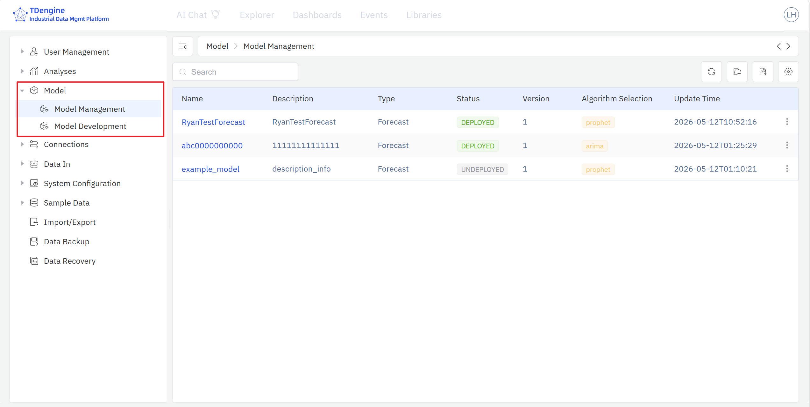
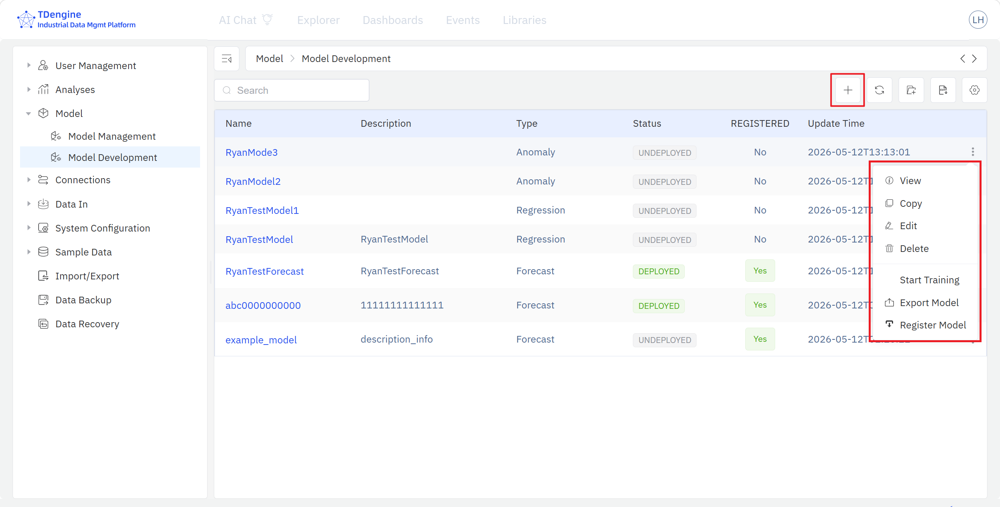
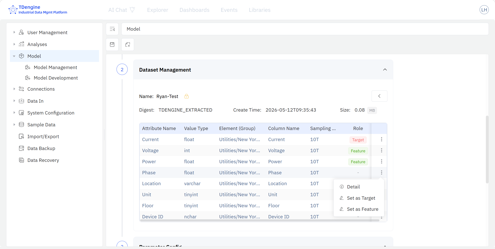
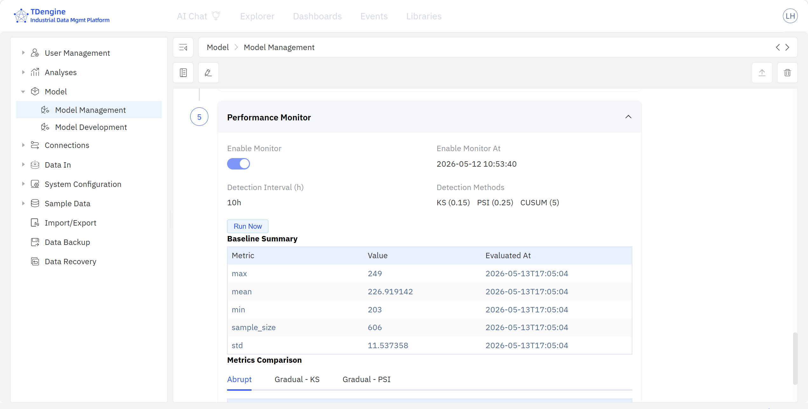

# 9.10 模型开发与管理

模型开发与管理模块是 IDMP 内置的轻量级**机器学习建模工具集**，依托 **TDgpt** 的数据分析与建模能力，让用户在 IDMP 平台内直接完成工业场景下机器学习模型的**训练、评估、注册、部署与监控**全过程，并构建覆盖模型全生命周期的**模型资产管理**体系。

该模块的定位是**工业场景下快速、简易、低门槛的机器学习建模工具集**——不是大而全的机器学习平台。模型输入数据当前仅支持 TDengine TSDB，模型训练与评分计算发生在 TDgpt 分析智能体，IDMP 前端提供模型的训练配置与部署管理界面。

本模块的最大优势是与 TDengine 生态的深度融合：**用户在 IDMP 中训练好的模型，可一键发布到 TDgpt，并以 SQL 函数的形式在 TDengine TSDB 中直接调用执行**—— 可视化面板、仪表盘、实时分析、事件过程分析均无需引入任何额外的 ML 推理服务，用一行 SQL 即可完成模型评分。

:::note 持续完善中
本模块当前版本已支持时序预测与异常检测两类建模场景；聚类、分类、回归三类场景正在开发中，将在后续版本陆续发布，敬请期待。
:::

## 9.10.1 模块原理

模型开发与管理模块的核心思路是：把机器学习模型的整个生命周期统一管理到 IDMP ，通过前端界面实现零代码的模型配置与开发，把模型训练与评分的算力实现交给 TDgpt ，最后把模型作为 SQL 函数发布到 TDengine TSDB。

模型生命周期整体可以划分为**模型开发**与**模型管理**两个阶段，每个阶段各拥有一个独立的模型库：

| 阶段               | 模型库     | 主要环节                                                     | 模型状态                   |
| ------------------ | ---------- | ------------------------------------------------------------ | -------------------------- |
| **模型开发** | 模型训练库 | 数据接口 → 数据变量管理 → 算法参数配置 → 模型训练性能比较 | 未训练 / 训练中 / 训练完成 |
| **模型管理** | 模型资产库 | 模型注册 → 模型部署 → 模型监控 → 模型下线 / 重训练        | 未部署 / 已部署            |

模型训练库与模型资产库是**完全独立**的——对任一库内模型的操作不会影响另一库。两个库之间有两条受控的信息交换通道：

- **模型注册（训练库 → 资产库）**： 训练完成且性能被用户认可的模型快照由训练库到复制到资产库，纳入更加严格的企业级模型资产管理体系；
- **模型打回（资产库 → 训练库）**： 模型管理员对资产库中的模型表现不满意时，可将该模型快照打回到训练库，并附上**修改意见**——要求补充模型文档、增加数据变量、调整算法参数或提升性能指标等；分析建模人员在训练库内完成模型迭代后可以再次发起注册。

部署阶段是本模块与 TDengine 生态的关键集成点：**模型部署到 TDgpt 后，模型评分代码以 SQL 函数的形式自动注册到 TDengine TSDB**——之后用户在 TSDB 中可以用普通 SQL 函数直接调用该模型进行评分（例如 `SELECT bottling_anomaly(pressure, valve_time, co2) FROM ...`），无需任何额外的推理服务或 API 网关。模型的执行与任务调度均在 TSDB 中完成，模型结果可以无缝集成到 IDMP 的面板、仪表盘、实时分析、事件触发和其他的过程分析能力中。

## 9.10.2 适用场景

模型开发与管理模块面向以工业时序数据为主要数据源的机器学习建模场景，典型分析场景包括：

- **关键指标预测**： 针对能耗、产量、负荷、库存等业务指标训练时序预测模型，输出未来若干步的预测值供运营决策参考
- **设备故障预警**： 基于历史运行数据训练异常检测模型，对设备的振动、温度、电流等关键指标进行持续打分，提前发现潜在故障
- **质量异常识别**： 针对生产批次的关键工艺参数训练异常检测模型，自动识别偏离正常工况的批次
- **运行工况识别**： 对设备运行状态数据进行聚类，将连续的运行过程划分为若干典型工况，辅助工艺分析
- **缺陷分类与原因归类**： 基于历史缺陷数据训练分类模型，对新的产品质量样本自动给出缺陷类别
- **指标拟合与虚拟测量**： 用回归模型从多个易测变量拟合难以直接测量的关键指标，实现虚拟测量

无论上述哪类场景，模型一旦部署，下游的业务系统、数据可视化、实时分析都通过同一条路径调用——**在 TSDB 里用 SQL 函数访问模型**。

## 9.10.3 支持的机器学习模型类型

模型开发与管理模块覆盖工业场景下最常用的五大类机器学习模型，每类模型包含一组由 TDgpt 提供的建模算法：

| 模型类型           | 说明                                           | 代表算法                                      |
| ------------------ | ---------------------------------------------- | --------------------------------------------- |
| **时序预测** | 基于历史时序数据预测未来值                     | ARIMA、Holt-Winters、Prophet、LSTM、TDtsfm 等 |
| **异常检测** | 基于无监督学习发现异常值 / 异常曲线 / 异常元素 | Shesd、LOF、IQR、KSigma、Grubbs 等            |
| **聚类**     | 对样本进行无监督群类划分                       | KNN、K-Means、DBSCAN、GMM 等                  |
| **分类**     | 以树类算法为核心的样本分类                     | Random Forest、XGBoost、GBDT、LightGBM 等     |
| **回归**     | 用多个自变量拟合因变量/输出因变量的估计值      | 线性回归、逻辑回归、广义线性模型 GLM 等       |

## 9.10.4 使用入口

进入 **管理后台 → 模型** 菜单即可使用，该菜单下包含两个子栏目：

- **模型开发** ：展示训练库内的模型列表，提供机器学习模型的配置与训练功能。
- **模型管理**： 展示模型资产库的模型列表，提供机器学习模型的部署与监控功能。

模型开发页面集中展示训练库内模型的名称、描述、分类、状态、是否注册与更新时间，可对特定模型执行**创建、查看、搜索、编辑、删除、启动训练、导出、注册**等操作。

模型管理页面集中展示已注册到模型资产库的模型列表，包括模型名称、描述、类型、状态、版本、算法以及更新时间，支持对已注册模型的**查看、搜索、编辑、导出、删除、部署、下线、打回**等操作。

### 建模步骤

在模型开发页面点击右上角操作栏的 + 号，生成新的模型编辑页面，也可以直接点击当前训练库中的具体模型，进入模型编辑状态。

模型编辑采用统一的"多段式"配置结构，分步骤完成一次机器学习模型的配置与训练过程：

1. **模型基本信息**： 填写模型名称、描述，选择**模型分类**（5 类建模场景之一），补充模型的必要信息项，上传文档等模型附件。

2. **数据变量管理**： 从 IDMP 元素目录树中筛选元素与属性，添加到模型。同一模型可以加入多个元素的多个属性，并对每个属性定义在本模型中的建模角色（ 因变量/自变量/不使用），可以对属性进行简单加工，如**增加计算项、数据过滤、数据补缺**等。

3. **算法参数配置**： 按比例将模型输入数据集拆分为训练 / 测试集，从当前建模场景的内置算法下拉框中选择分析算法。一个模型项目，可以添加多个分析算法，并为每个算法配置不同的模型超参数。

4. **模型训练**： 点击模型算法列表的**开始训练**按钮可以启动该算法的训练任务，任务由 TDgpt 在后台执行；也可以在模型开发首页通过三个点菜单一键启动该模型项目包含的多个训练任务。

5. **模型性能**： 模型训练完成后可在训练结果栏比较不同算法模型的性能参数，查看不同算法模型的评价指标，选择**冠军模型**。

模型训练完成后，可以对模型执行**模型注册**—— IDMP 系统将训练模型快照完整复制到模型资产库，此后即可在模型管理库内看到该注册模型。如果资产库管理员认为模型不达预期，可对其执行**打回**操作，附上意见把模型送回训练库；建模人员根据反馈意见在训练库内迭代模型后，可以再次启动模型注册。

对于符合部署条件的模型，可以在资产库中点击**模型部署**，系统将模型评分代码自动推送到 TDgpt 并注册为 TDengine TSDB 的 SQL 函数，模型状态变为**已部署**。之后，用户可以在 TSDB 中用普通 SQL 调用模型进行评分，也可对已部署模型执行**模型下线**，使相关 SQL 调用函数从 TSDB 注销。

对已部署模型，TDgpt 在每次评分完成后将模型性能指标回传到 IDMP，模型详情页将展示**模型部署后监控**栏目，展示模型训练阶段的 Baseline 与近期模型评分结果的实际表现，监控的性能指标包括 CUSUM、KS、PSI 等。

## 9.10.5 使用示例

**场景背景**

某市政污水处理厂日均处理量约 15 万吨，调度团队希望基于历史进水量数据训练一个时序预测模型，每日提前给出未来 24 小时的进水量预测，用于鼓风机组排班与药剂投加。由于进水量同时受日内规律、周内规律与节假日影响，团队希望同时尝试多个算法建模并挑选冠军模型，找到对未来进水量的最佳预测模型。

**操作过程**

1. 在 **管理后台 → 模型 → 模型开发** 点击右上角 **+** 新建模型。
2. **模型基本信息**： 模型名称填写 `进水量 24 小时预测`，模型分类选择 **时序预测**；在数据接口部分，根路径选择"污水处理厂 / 进水系统"，勾选 `日进水量`、`降雨量`、`上游泵站流量` 三个属性。其中 `日进水量` 是预测目标，另两个属性作为协变量。
3. **数据变量管理**： `日进水量` 标记为**因变量**，`降雨量`、`上游泵站流量` 标记为**自变量**，时间戳标记为**主键**；对 `上游泵站流量` 上 0.9% 的零星缺失值启用**数据补缺**做线性插值。
4. **算法参数配置**： 取最近 180 天数据作为训练集、最近 14 天作为测试集；从时序预测算法下拉框中多选**ARIMA**、**Prophet** 两个算法，分别配置周期参数、季节性参数与节假日开关；其中 **Prophet** 同时启用降雨量与上游泵站流量作为协变量。
5. 点击**立刻开始训练**——TDgpt 在后台并行训练这些算法。训练完成后在性能页面比较 MAPE、RMSE 指标，**Prophet** 在测试集上 MAPE 最低（3.8%），点选为**冠军模型**。
6. 对该模型执行**模型注册**进入资产库，再点击**模型部署**——系统在 TDengine TSDB 中注册 SQL 函数 `inflow_forecast_24h()`。
7. 调度系统每天凌晨在 TSDB 中执行 `SELECT inflow_forecast_24h(rainfall, upstream_flow) FROM …` 一行 SQL，即可拿到后续 24 小时的进水量预测；预测结果直接进入可视化面板与监控规则中。

**分析效果**

模型上线后的"五一"假期，预测曲线显示假期首日进水量将比平日低约 22%，假期结束后的工作日第一天会出现明显回升峰值。调度团队据此推后两台备用鼓风机的启动时间，并在节后首个工作日提前预热备机。实际进水量与预测值误差在 5% 以内，当日处理能力平稳过渡，药剂消耗同比节约约 8%，未出现超标排放记录。

模型部署 6 周后，资产库的模型监控页面显示 MAPE 从训练值 3.8% 上升到 6.5%，触发监控告警；建模人员在资产库对该模型执行**重训练**，用最新 8 周数据更新模型版本，MAPE 恢复到 4.1%，新版本自动重新部署到 TDgpt，调度系统中的 SQL 调用方式保持不变。
