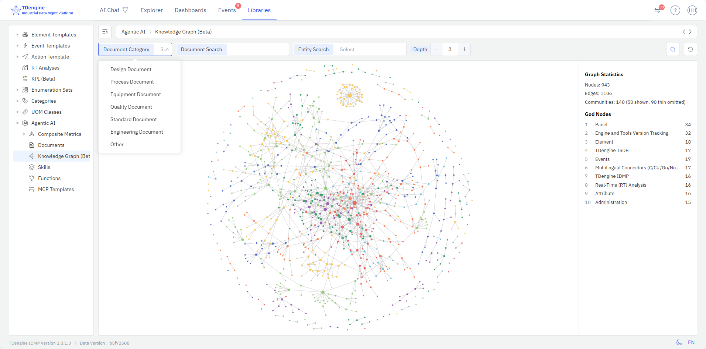

# 13.6 知识图谱

**知识图谱**（Knowledge Graph）是一种把文档内容和知识组织成网络结构的技术：系统从文档中抽取实体与实体之间的关系，形成一张可查询、可沿关系扩展的知识网络，回答"文档里有哪些知识、知识之间是什么联系、由什么推导出什么、知识之间的逻辑关系是什么"。知识图谱中的实体与关系全部来自文档内容，由系统自动抽取，不需要人工建模。

## 13.6.1 知识图谱的定位

IDMP 系统中与"图"相关的概念有三个：工业本体、图 / 网络分析、知识图谱。三者都用点和边来描述对象，名称与形态相近，很容易混在一起；但它们回答的业务问题、对节点和边的定义、信息来源与使用方式完全不同——把物理世界建模成对象与关联的是工业本体，计算网络结构规律的是图 / 网络分析，把文档里的知识组织成可推导网络结构的是知识图谱。

知识图谱、工业本体和图 / 网络分析有内在关联与相似之处，但属于不同层面的技术概念。下表是这三者的对比分析。

| 对比项       | 知识图谱                                                                         | 工业本体                                                 | 图 / 网络分析                              |
| -------------- | ---------------------------------------------------------------------------------- | ---------------------------------------------------------- | -------------------------------------------- |
| **业务问题** | 文档里有哪些知识，知识之间有什么联系、如何传导                                   | 真实物理世界有哪些对象，它们之间是什么关联               | 网络结构有什么规律与特征                   |
| **节点**     | 实体，即知识点：概念、原理、方法、规则、操作、事实、场景、要点等                 | 业务对象：元素、属性、模板、面板、规则、实时分析、事件等 | 任意对象                                   |
| **边**       | 实体之间的关系：依据、归属、组成、前置、解决、导致、限制、顺序、推导、适用、影响 | 对象之间的物理联系：上下游、测量、联锁等                 | 任意连接                                   |
| **信息来源** | 文档，完全来自对已上传文档的解析与抽取                                           | 物理世界，需要用户配置与维护                             | 用户定义                                   |
| **业务用途** | 知识的查询、使用与验证，让业务人员与 AI 遵循同一套知识逻辑推理与分析             | 对物理世界做数字化建模                                   | 结构发现、社群分析、关键节点与边的量化评估 |

**工业本体与知识图谱是两个并行的语义模型。** 两者都由"语义模型 + 事实 + 推理"构成，区别在于描绘的对象：工业本体描绘的是真实的物理世界，节点与边来自用户基于真实世界的建模配置；知识图谱描绘的对象是知识，节点与边来自文档内容。落到使用场景上，工业本体告诉用户和 AI "这台设备是什么、有哪些属性、当前数据如何"，知识图谱告诉用户和 AI "手册里怎么规定、为什么这样规定、理论依据是什么"。

**图分析与图数据库不是同一层面的技术概念。** 图 / 网络分析是通用的分析算法，工业本体与知识图谱都会使用到——网络结构中的实体按社区分群着色，就是社区检测算法（一种图分析技术）的分析结果。图数据库是网络数据存储与查询的载体，用于更方便地保存网络结构，更高效的执行图挖掘算法。二者都不等同于业务语义模型本身。

## 13.6.2 技术实现方式

知识图谱的业务价值取决于实体与关系的定义与抽取方法。IDMP 的做法不是让大模型自由发挥，而是先定义一套业务 Schema，再把它作为抽取规则注入知识抽取过程，最后由预先定义的工作流合并成图谱结构。知识图谱的 Schema 由两部分组成：实体类型与关系类型。

**实体的业务定义。** IDMP 定义的知识图谱实体（Entity），就是对知识点的业务定义：**实体是知识图谱中最小的、可独立标识的知识单元，即一个相对独立的知识点。** 它可以是物理对象，也可以是抽象概念，还可以是标准化的现象、事件或方法——只要这个对象需要被独立关联与复用，就可以被定义为一个实体，而每个实体均带有名称、别名、定义、类型、来源等描述属性。

| 实体类型           | 定义                             | 示例（IDMP 用户手册）                    |
| -------------------- | ---------------------------------- | ------------------------------------------ |
| **概念 Concept**   | 有明确定义的术语、对象或抽象概念 | 元素、属性、模板、面板、实时分析、事件   |
| **原理 Principle** | 机理知识与底层逻辑               | 液位与容积利用率是同一物理量的换算       |
| **方法 Method**    | 一套可执行的做法或方案           | 根因分析、面板解读、流式计算             |
| **规则 Rule**      | 条件、前提或判断规则             | AI 功能需要有效的 AI 连接配置            |
| **操作 Procedure** | 多步骤的执行方案                 | 点击 AI 图标 → 选择函数 → 查看结果     |
| **事实 Fact**      | 客观数值、边界或默认值           | 量程、限值、采样频率                     |
| **场景 Scenario**  | 业务场景的描述                   | 质量分析、异常初筛、SPC 监控             |
| **要点 Keypoint**  | 结论或关键论点                   | 通用分析不创建资源；AI Function 会话独立 |
| **文档 Document**  | 实体的信息来源                   | IDMP 用户手册 8.11                       |

**关系的业务定义。** 关系描述的是知识点之间的内在联系，IDMP 系统中共定义了十一类知识关系，按用途分为三组：

- **描述实体自身的含义与范围：** **依据**（为什么成立）、**归属**（属于哪一类）、**组成**（由哪些部分组成）、**适用**（用在什么对象或场景）、**限制**（有哪些边界与约束）。
- **描述操作与因果：** **前置**（做之前需要满足什么）、**顺序**（多个步骤的先后次序）、**解决**（能解决什么问题）、**导致**（会带来什么结果）。
- **支撑推导与传播：** **推导**（由什么可以推出什么）、**影响**（会影响什么）。

以 IDMP 用户手册包含的知识点为例：**SPC 监控**通过**组成**关系包含八条控制图判异规则（Nelson 规则），通过**前置**关系依赖属性的限制配置，如 CL、Sigma、USL、LSL 四类极限值，并通过**适用**关系关联到制造与质量管控场景，通过**导致**关系产生对应的设备异常事件。

**实体与关系的抽取更新。** IDMP 系统内置了一整套实体与关系的抽取提炼工作流。用户只需上传文档，而文档的切分、抽取、去重与合并全部由系统在后台自动完成，无需人工干预；文档新增或修改后，其知识将被抽取并合并进现有网络，文档删除后对应的实体与关系也会从知识网络中移除。

## 13.6.3 知识图谱的数据来源

**IDMP 系统预先注入了 TDengine IDMP 与 TSDB 的用户手册，作为知识图谱模块的初始文档。** 这些文档内容是知识图谱模块的初始信息来源，系统安装完成即可查询，不需要用户做任何配置。

在此基础上，用户上传到系统中的任何文档均会被补充进当前的知识网络，来源有两处：

- **全局文档**：在**基础库 → Agentic AI → 文档**中上传、不属于具体元素的文档。
- **元素文档**：在元素详情页**通用**标签页的[关联文档](../03-data-modeling/01-elements.md#3111-关联文档)中上传的文档，如设备手册、校准报告、报警代码表。

当前系统支持的文档类型包括 PDF、Word、PowerPoint、Excel、Markdown 与纯文本、HTML、RTF、EPUB 等常见格式。

文档上传后由系统后台进行异步处理：先转换为 Markdown 并建立检索索引，再从文档内容中抽取实体与关系、合并进图谱。文档列表的**状态**列显示处理进度，取值为**已上传**、**处理中**、**索引完成**或**处理失败**；状态为**索引完成**时，该文档的实体才可被图谱查询。

文档被删除后，系统会异步移除该文档在图谱中的实体与关系。移除失败时，图谱中可能暂时保留该文档的实体，直到下一次图谱更新。

:::note
知识图谱模块按语言分别构建：中文文档进入中文图谱，其他语言的文档进入英文图谱。图谱页面查询与当前界面语言对应的图谱网络，切换界面语言会切换到另一张图谱。
:::

## 13.6.4 知识图谱的访问入口

在当前系统中，知识图谱有三类访问方式和入口：

| 访问方式                   | 说明                                                                                               |
| ---------------------------- | ---------------------------------------------------------------------------------------------------- |
| **图谱页面**               | **基础库 → Agentic AI → 知识图谱**，浏览整张图谱，或按文档分类、文档名、实体、关系层数查询子图。 |
| **文档入口**               | 文档列表或元素**关联文档**中的 **⋮** 菜单 → **知识图谱**，直接查看某篇文档的知识网络。           |
| **AI 问答与 AI Functions** | 不打开图谱页面，AI 在回答文档知识相关的问题时可调用图谱查询。                                        |

**知识图谱页面**是使用知识图谱的主要入口。页面顶部为筛选栏，下方左侧为图谱画布，右侧为信息面板；筛选条件均为可选，全部为空时默认展示整张图谱网络。

| 筛选项       | 说明                                                                                                     |
| -------------- | ---------------------------------------------------------------------------------------------------------- |
| **文档分类** | 按文档分类筛选，取值来自基础库中的**文档分类**枚举集，例如设计、工艺、设备、质量、标准、工程文档、其他。 |
| **文档搜索** | 按文档名筛选，支持多选，候选范围仅包含用户上传的文档。                                                   |
| **实体搜索** | 按实体名称筛选，从匹配的候选中选择一个实体，图谱以该实体为中心展开。                                     |
| **层级设定** | 从命中的实体出发向外扩展的关系层数，可设置 0～10，默认 3。数值越大，返回的实体与关系越多。               |

选择条件后点击**搜索**，图谱按条件重新查询；点击**重置**清空全部条件并恢复整张图谱。

**图谱画布**以网络结构布局展示知识实体与关联关系：每个节点是一个知识实体，每条连线表示两个实体之间存在一种关系。节点越大，表示该实体关联的关系越多；节点颜色区分实体所属的社区，即关系较为紧密的一组实体。画布支持缩放与拖动，节点位置可手动调整。

选中节点后，右侧信息面板显示该实体的信息：

| 字段         | 说明                                                               |
| -------------- | -------------------------------------------------------------------- |
| **名称**     | 实体名称。                                                         |
| **类型**     | 该实体在抽取时归入的类型，如概念、方法、规则等。                   |
| **关联文档** | 该实体来源的文档名。                                               |
| **关系说明** | 该实体与相邻实体之间的每条关系，逐条列出关系两端的实体与关系类型。 |

未选中实体时，右侧面板显示图谱统计：**节点数**、**边数**、**社区数**与**核心节点**（按关系数量排序，列出连接最多的若干实体）。**社区数**同时给出已显示与已省略的社区数量——节点较少的稀疏社区不绘制在画布上，以保持图面可读。点击画布空白处取消选中，面板恢复为图谱统计。

:::tip
系统文档较多且包含海量知识点时，知识图谱的网络节点会非常密集。可以先用**文档搜索**或**实体搜索**把范围缩小到一篇文档或一个实体，再调整**层级设定**，比直接浏览整张图谱更容易定位到需要的知识。
:::

## 13.6.5 应用场景

**知识图谱把文档从"给人读的文本"变成"可被系统推理的知识资产"。**

它的业务价值集中在三件事上：**知识提炼**——从长篇文档中提炼出可独立复用的知识点；**知识关联**——把分散在不同文档、不同章节的知识点按业务语义连接起来；**知识复用**——让一条已经沉淀下来的知识跨文档、跨设备复用。

仅基于文档片段检索的技术（如 RAG）只能回答"哪一段文字与问题最相似"：它不产生实体，也不产生实体之间的关系，因此单轮检索无法把散落在不同章节的知识点连成一条链；即使通过多轮检索临时拼出线索，也留不下来、审计不了，下次还得从头再来。

知识图谱的典型应用场景包括：

- **知识提炼：** 从长篇手册、规程、标准中提炼出可独立复用的知识点（报警含义、处置步骤、限值、所需备件），不必通读全文即可掌握要点。
- **同类设备的知识复用：** 一台设备的维护经验关联到设备类型实体后，同类型的其他设备可以复用同一套知识，这类跳转需要显式的实体与关系结构才能稳定建立、可审计、可回退。
- **故障处置的知识汇集：** 从一个报警或现象实体出发，沿**导致、顺序、限制、组成**等关系逐跳展开，把散落在不同章节的原因、步骤、限值与备件汇集到一条链路上。
- **跨文档的依据核对：** 设备手册、工艺规程、点检标准之间的依据与影响关系被显式记录下来，结论可以顺着关系回到源头核对，而不只是"某份文档里提到过"。
- **AI 分析的知识注入：** AI 问答与 AI Functions（根因分析、面板解读、通用分析）在分析过程中查询图谱，把相关的实体与关系作为上下文，回答中可给出所引用的知识点与来源文档，便于核对。

**使用示例：同类设备之间的维护知识复用**

**场景背景**

某水泥厂有 6 台同型号的辊压机，在 IDMP 中按同一元素模板建为元素。5 号辊压机曾因液压系统压力波动停机，这次处置的过程与结论被整理成《液压系统故障处置记录》，上传为 5 号辊压机的关联文档。

**知识如何被提炼处理**

知识图谱模块从这份上传记录中抽取出"液压系统压力波动""密封件磨损""处置步骤""压力限值""所需备件"等实体，以及它们之间的**导致、顺序、限制、组成**关系。5 号辊压机与其余 5 台设备同属辊压机这一类型，这些知识实体通过**适用**关系关联到"辊压机"类型实体上，成为该类型设备共有的知识，而不只是 5 号设备的一篇普通文档。

**其他设备如何复用**

3 号辊压机一段时间后出现同样的压力波动报警，运维人员在 AI 问答中询问处置方法。AI 沿"3 号辊压机 → 归属 → 辊压机 → 液压系统压力波动 → 导致 → 密封件磨损 → 顺序 → 处置步骤 → 限制 → 压力限值"这条链路取到 5 号辊压机沉淀的知识，给出该型号规定的处置顺序与判断限值，并标明依据来自 5 号辊压机的处置历史记录；此外，根因分析智能体也可以引用这条知识链路，把"密封件磨损"作为候选原因，而不只是从数据上看到压力在波动，让根因分析更有针对性。

如果系统只做文档片段和关键词检索，针对 3 号辊压机的提问既不会命中 5 号辊压机的处置记录，也无法把"压力波动"与"密封件磨损""压力限值"串成一条处置链路——两台设备的文档之间没有任何字面联系。

**应用结果**

一台设备某次历史处置经验记录，由此变成 6 台同类设备共有的知识资产，而不是留在某台设备的文档里或某个工程师的记忆中。
