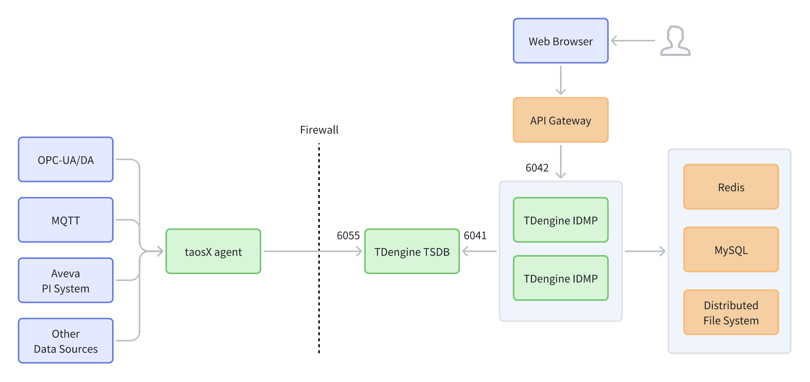
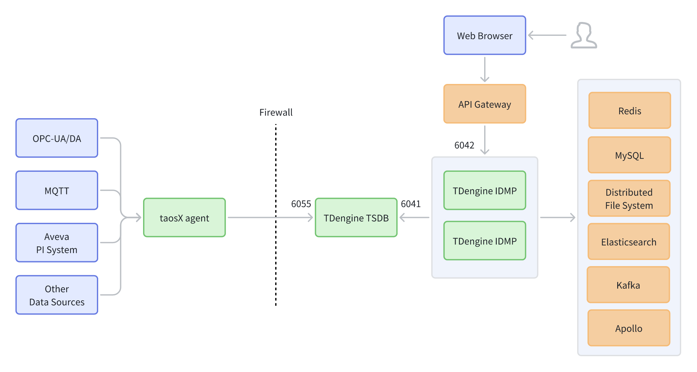

# 14.1 部署架构

TDengine IDMP 支持三种典型部署拓扑：**单实例**、**最小高可用（HA Minimal）**和**复杂高可用（HA Complex）**。每种拓扑适用于不同的规模与可用性需求。

## 14.1.1 概述

TDengine IDMP 的部署通常由以下层次构成：

- **数据采集层：** taosX 代理连接 OPC-UA/DA、MQTT、Aveva PI 等数据源，采集数据并转发至 TDengine TSDB。
- **服务层：** TDengine IDMP（单实例或多实例）提供业务逻辑；TDengine TSDB 负责存储和服务时序数据。
- **访问与治理层（可选）：** API 网关作为统一的外部入口，提供路由、认证和流量管理。
- **外部依赖（按场景）：** Redis、MySQL、分布式文件系统，以及可选的 Elasticsearch、Kafka 和 Apollo。
- **网络边界：** 防火墙将数据采集侧与服务侧隔离。跨边界通信应仅开放最小所需端口。

## 14.1.2 单实例

单实例拓扑面向快速交付和低运维复杂度的场景，适用于 PoC 验证、演示、小规模部署或离网（air-gapped）环境。

TDengine IDMP 以单进程运行，同时提供 Web UI 和 REST API。taosX 代理采集数据并通过防火墙写入 TDengine TSDB；IDMP 在内部访问 TSDB 进行数据管理与查询。

**连接关系：**

- Web 浏览器 → **TDengine IDMP（端口 6042）**
- taosX 代理 → （穿越防火墙）→ **TDengine TSDB（端口 6055）**
- **TDengine IDMP → TDengine TSDB（端口 6041）**

**特点：**

- 组件最少、路径最短，部署与运维成本最低。
- 浏览器直接连接 IDMP——认证、限流和审计须在服务层处理。
- 扩展到多实例通常需要添加 API 网关或负载均衡器。
- 使用内嵌 H2 数据库、本地文件系统和内部缓存，不依赖外部 MySQL、DFS 和 Redis。

## 14.1.3 最小高可用（HA Minimal）

最小高可用拓扑面向可管理复杂度下的生产就绪基线。它引入 API 网关作为统一外部入口，只有网关对外暴露。IDMP 可在网关后方扩展为多实例。

**连接关系：**

- Web 浏览器 → **API 网关** → **TDengine IDMP（端口 6042）**
- taosX 代理 → （穿越防火墙）→ **TDengine TSDB（端口 6055）**
- **TDengine IDMP ↔ TDengine TSDB（端口 6041）**
- IDMP 依赖：**Redis / MySQL / 分布式文件系统**

**特点：**

- 通过网关提供单一外部入口，IDMP 不直接暴露。
- 包含三种最常见的基础设施依赖，构成生产基线。
- 适合希望在扩展能力前先实现标准化网关治理的部署。
- 使用内部 Lucene 替代 Elasticsearch；使用 Redis 消息队列替代 Kafka；使用内部服务配置替代 Apollo。

## 14.1.4 复杂高可用（HA Complex）

复杂高可用拓扑面向具有企业集成需求的中大型生产环境。IDMP 在 API 网关后以高可用多实例集群方式运行。引入完整的外围依赖以支持异步解耦、集中式检索、动态配置和服务治理。

**连接关系：**

- Web 浏览器 → **API 网关** → **TDengine IDMP（多实例）**
- taosX 代理 → （穿越防火墙）→ **TDengine TSDB（端口 6055）**
- **TDengine IDMP → TDengine TSDB（端口 6041）**
- IDMP 依赖：**Redis、MySQL、分布式文件系统、Elasticsearch、Kafka、Apollo**

**特点：**

- 多实例 IDMP 提升吞吐量与可用性。
- 完整外围栈支持集中式检索（Elasticsearch）、异步消息（Kafka）和动态配置（Apollo）。
- 部署与运维复杂度更高，适用于对可靠性、审计和可扩展性有严格要求的环境。

## 14.1.5 关键组件

### 14.1.5.1 API 网关

API 网关是外部客户端与内部服务之间的统一入口。

<table>
<colgroup><col style="width:10em"/><col/></colgroup>
<thead><tr><th>职责</th><th>说明</th></tr></thead>
<tbody>
<tr><td><strong>统一入口</strong></td><td>对外暴露单一地址/端口，后端服务不直接暴露</td></tr>
<tr><td><strong>路由与负载均衡</strong></td><td>将请求分发至 IDMP 和 TSDB 实例</td></tr>
<tr><td><strong>安全</strong></td><td>TLS 终止、统一认证（Token/SSO）、IP 访问控制</td></tr>
<tr><td><strong>流量治理</strong></td><td>限流、熔断、重试、超时、灰度发布</td></tr>
<tr><td><strong>可观测性</strong></td><td>集中访问日志、指标和分布式追踪</td></tr>
</tbody>
</table>

### 14.1.5.2 外部依赖

<table>
<colgroup><col style="width:10em"/><col/><col/></colgroup>
<thead><tr><th>组件</th><th>作用</th><th>单实例替代方案</th></tr></thead>
<tbody>
<tr><td><strong>Redis</strong></td><td>缓存、短生命周期状态、分布式锁</td><td>内部缓存与锁</td></tr>
<tr><td><strong>MySQL</strong></td><td>关系型元数据（用户、权限、任务、配置）</td><td>内嵌 H2 数据库</td></tr>
<tr><td><strong>分布式文件系统</strong></td><td>文件/对象持久化（元数据、图形、导入/导出文件）</td><td>本地文件系统</td></tr>
<tr><td><strong>Elasticsearch</strong></td><td>集中式索引管理和全文检索</td><td>内部 Lucene</td></tr>
<tr><td><strong>Kafka</strong></td><td>异步消息与事件总线（解耦、任务编排、通知）</td><td>内部消息队列（单实例）或 Redis MQ（最小高可用）</td></tr>
<tr><td><strong>Apollo</strong></td><td>配置中心（动态配置、版本管理）</td><td>内部服务配置</td></tr>
</tbody>
</table>

## 14.1.6 部署建议

1. **PoC 使用单实例，生产使用高可用。** 先用单实例快速验证；生产环境优先选择最小高可用，随需求增长演进为复杂高可用。

2. **最小化外部暴露。** 仅将网关对外暴露，内部端口（如 6041）保持在内网中。

3. **按需水平扩展 IDMP。** 使用多个 IDMP 实例提升高可用性和吞吐量；在网关处配置会话处理和负载均衡。

4. **为外部依赖规划高可用。** 为 Redis、MySQL 和分布式文件系统配置备份和高可用。启用后，将 Kafka、Elasticsearch 和 Apollo 纳入监控和容量规划。

5. **集中可观测性。** 从网关、IDMP、TSDB 和关键依赖收集日志与指标，建立告警和分布式追踪以简化故障排查。
