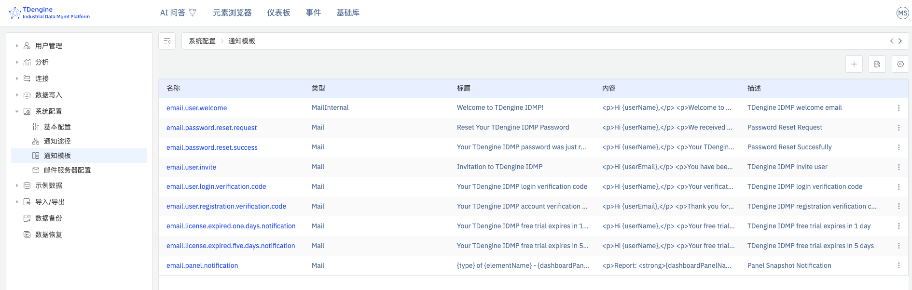

# 14.5 系统配置

系统配置通过**管理控制台 → 系统配置**访问，包含四个部分：基本配置、通知联系人、通知模板和邮件配置。

## 14.5.1 基本配置

基本配置包含系统级设置：

| 设置项 | 说明 |
|---|---|
| **语言** | 界面的默认显示语言 |
| **启用用户行为采集** | 是否收集匿名使用数据以改进产品 |
| **上传崩溃报告** | 是否自动上传崩溃报告 |
| **自动刷新资源浏览器** | 元素变化时，资产浏览器是否自动刷新 |

点击编辑（铅笔）图标可修改这些设置。

## 14.5.2 通知联系人

**通知联系人**定义 IDMP 发送通知的目标地址，可配置多个联系人。首位激活系统的用户的电子邮件地址将自动添加为联系人。

创建联系人时，点击 **+** 并填写以下信息：

| 字段 | 说明 |
|---|---|
| **名称** | 该联系人的唯一名称 |
| **通知类型** | 发送渠道：`邮件`、`飞书` 或 `Webhook` |
| **地址** | 目标地址——电子邮件地址、飞书 Webhook URL 或 HTTP 端点 |
| **描述** | 可选描述 |

由于支持 Webhook，几乎任何通知目标均可配置，包括 Teams、钉钉、PagerDuty 以及其他接受 HTTP 回调的系统。

## 14.5.3 通知模板

通知模板定义系统生成消息的内容，适用于用户邀请、密码重置和告警通知等场景。

IDMP 内置了常见通知场景的模板。点击模板名称可查看或编辑内容。模板支持变量替换，可包含用户名、URL 和事件详情等动态值。



## 14.5.4 邮件配置

邮件配置定义 IDMP 用于发送外发邮件的 SMTP 服务器。点击编辑（铅笔）图标更新设置。

| 字段 | 说明 |
|---|---|
| **主机** | SMTP 服务器主机名或 IP 地址 |
| **端口** | SMTP 服务器端口（如：465 用于 TLS，587 用于 STARTTLS，25 用于非加密） |
| **用户名** | SMTP 认证用户名 |
| **密码** | SMTP 认证密码 |
| **发件人** | 外发邮件使用的"发件人"电子邮件地址 |
| **启用 TLS** | 是否对 SMTP 连接使用 TLS 加密 |
| **启用认证** | 是否需要 SMTP 认证 |

IDMP 在多种场景下发送邮件：系统激活（验证码）、用户邀请、密码重置和事件告警通知。默认情况下，IDMP 使用涛思数据提供的邮件服务。

### 14.5.4.1 离网环境使用 MailHog

若 IDMP 服务器无法访问互联网，可在内网部署 [MailHog](https://github.com/mailhog/MailHog) 作为开发和测试用的轻量级 SMTP 中继：

```bash
docker run -d -p 1025:1025 -p 8025:8025 --name mailhog mailhog/mailhog:v1.0.1
```

启动 MailHog 后，按以下信息配置邮件配置：

| 字段 | 值 |
|---|---|
| 主机 | 宿主机 IP（或同一 Docker Compose 网络中的服务名） |
| 端口 | `1025` |
| 用户名 / 密码 | 任意值（MailHog 默认禁用认证） |
| 启用 TLS / 启用认证 | 不勾选 |
| 发件人 | 任意有效邮件格式（如 `support@example.com`） |

在 `http://<服务器IP>:8025` 访问 MailHog Web 界面以查看捕获的邮件。
