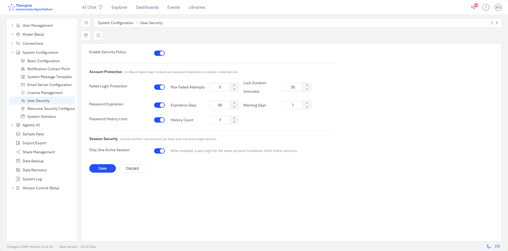
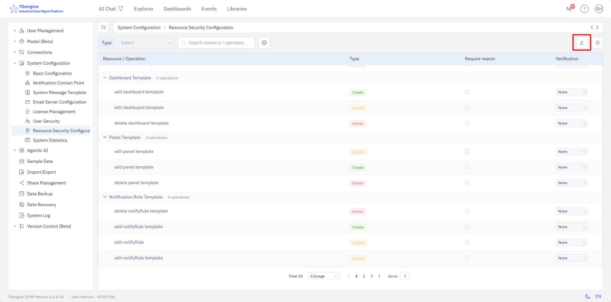
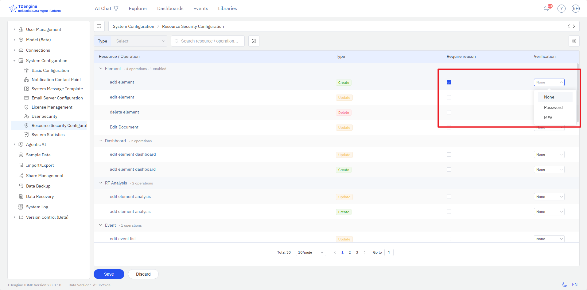
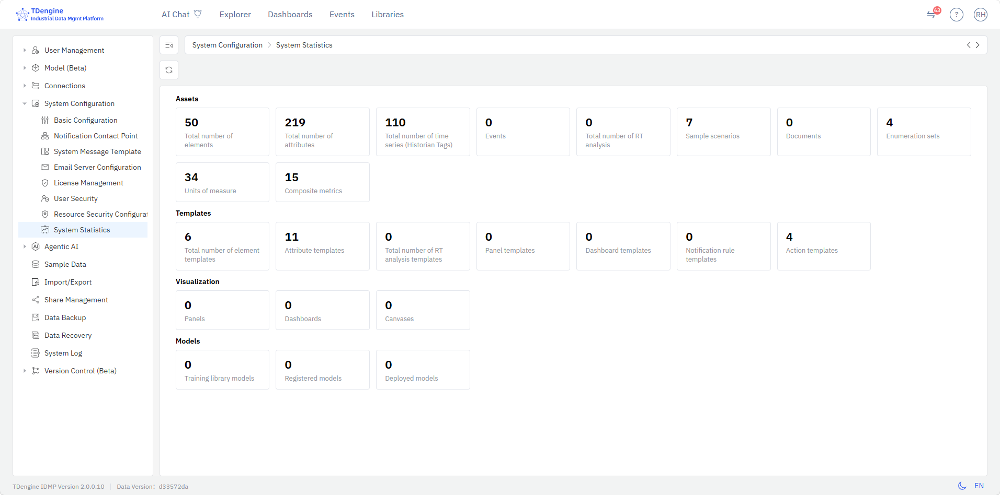

# 14.5 系统配置

系统配置通过**管理控制台 → 系统配置**访问，包含 8 个部分：基本配置、通知途径、系统消息模板、邮件服务器配置、许可管理、用户安全配置、资源安全配置与系统统计，其中许可管理部分请单独参考 [第 14.12 章节](./30-activate.md)。

## 14.5.1 基本配置

基本配置包含系统级的全局基础设置：

| 设置项                       | 说明                                                               |
| ---------------------------- | ------------------------------------------------------------------ |
| **语言**               | 界面的默认显示语言                                                 |
| **启用用户行为采集**   | 是否收集匿名使用数据以改进产品                                     |
| **上传崩溃报告**       | 是否自动上传崩溃报告                                               |
| **自动刷新资源浏览器** | 元素变化时，资产浏览器是否自动刷新                                 |
| **系统日志**           | 是否开启生成不可修改的系统操作日志，以及相关日志的筛选、查询与导出 |
| **质量分析菜单**           | 是否开启独立的质量分析菜单 |
| **公网访问地址**           | 当前系统的公网访问地址 |
| **周开始**           | 当前系统每周的第一天是周日或周一 |
| **元素排序规则**           | 全局默认的元素排序规则：系统默认、元素名称或创建时间 |
| **系统颜色**           | 系统默认颜色的配置 |

点击编辑（铅笔）图标即可修改这些设置。

### 元素排序规则详细说明

元素排序规则用于定义元素树与子元素列表在未单独指定排序方式时采用的默认顺序，可选值如下：

| 选项 | 排序依据 |
| --- | --- |
| **系统默认** | 按元素的 `element_order` 字段排序。该字段在元素创建时自动生成，并随用户对元素执行**上移**、**下移**、**置顶**等操作动态调整，因此「系统默认」本质上是「创建顺序叠加用户自定义顺序」——新元素按创建先后排列，用户可在此基础上手动调整相对位置。 |
| **元素名称** | 按元素名称的字典序（升序）排序。 |
| **创建时间** | 按元素的创建时间排序（最新创建在前）。 |

:::info
该设置仅作为**全局默认值**。在元素树中，用户可通过元素节点旁的「排序」按钮为单个节点覆盖此默认规则；在子元素列表中，也可通过表头排序单独指定排序方式。
:::

## 14.5.2 通知途径

**通知途径**定义 IDMP 发送通知的目标地址，可配置多个联系人。首位激活系统的用户的电子邮件地址将自动添加为联系人。

创建联系人时，点击 **+** 并填写以下信息：

| 字段               | 说明                                                                                                |
| ------------------ | --------------------------------------------------------------------------------------------------- |
| **名称**     | 该联系人的唯一名称                                                                                  |
| **通知类型** | 发送渠道：`邮件`、`飞书`、`企业微信`、`钉钉`、`Slack`、`Microsoft Teams` 或 `Webhook` |
| **地址**     | 目标地址——电子邮件地址、飞书 Webhook URL 或其他 HTTP 端点            |
| **描述**     | 可选描述                       |

除上述内置通知类型外，还可通过 `Webhook` 配置其他接受 HTTP 回调的系统，例如 PagerDuty 等。

## 14.5.3 系统消息模板

系统消息模板定义系统生成消息的内容，适用于用户邀请、密码重置和告警通知等场景。

IDMP 内置了常见通知场景的模板。点击模板名称可查看或编辑内容。模板支持变量替换，可包含用户名、URL 和事件详情等动态值。


## 14.5.4 邮件服务器配置

邮件服务器配置定义 IDMP 发送**事件告警邮件**和**面板定时通知**所用的 SMTP 服务器。点击编辑（铅笔）图标更新设置。

:::note
系统激活（验证码）、用户邀请、密码重置、License 到期通知等事务类邮件由涛思数据提供的共享邮件服务（Capability Gateway）发送，
不使用本页配置，也无需在 `application.yml` 中设置任何 SMTP 参数。
本页配置**仅**影响事件告警邮件与面板定时通知：未配置时这两类通知无法送达，界面会在「通知途径」处
对邮件类型的联系点标记为不可用。
:::

| 字段               | 说明                                                                  |
| ------------------ | --------------------------------------------------------------------- |
| **主机**     | SMTP 服务器主机名或 IP 地址                                           |
| **端口**     | SMTP 服务器端口（如：465 用于 TLS，587 用于 STARTTLS，25 用于非加密） |
| **用户名**   | SMTP 认证用户名                                                       |
| **密码**     | SMTP 认证密码                                                         |
| **发件人**   | 外发邮件使用的"发件人"电子邮件地址                                    |
| **启用 TLS** | 是否对 SMTP 连接使用 TLS 加密                                         |
| **启用认证** | 是否需要 SMTP 认证                                                    |

IDMP 的邮件投递分两条链路：

| 邮件类型                            | 投递链路                             | 是否需要本页配置 |
| ----------------------------------- | ------------------------------------ | ---------------- |
| 系统激活（验证码）、用户邀请、密码重置、License 到期通知 | 涛思数据共享邮件服务（Capability Gateway） | 否               |
| 事件告警邮件、面板定时通知           | 本页配置的 SMTP 服务器               | **是**           |

### 14.5.4.1 离网环境使用 MailHog

若 IDMP 服务器无法访问互联网，可在内网部署 [MailHog](https://github.com/mailhog/MailHog) 作为开发和测试用的轻量级 SMTP 中继：

```bash
docker run -d -p 1025:1025 -p 8025:8025 --name mailhog mailhog/mailhog:v1.0.1
```

启动 MailHog 后，按以下信息配置邮件配置：

| 字段                | 值说明      |
| ------------------- | ------------------------------------------------- |
| 主机                | 宿主机 IP（或同一 Docker Compose 网络中的服务名） |
| 端口                | `1025`                                          |
| 用户名 / 密码       | 任意值（MailHog 默认禁用认证）                    |
| 启用 TLS / 启用认证 | 不勾选                                            |
| 发件人              | 任意有效邮件格式（如 `support@example.com`）    |

在 `http://<服务器IP>:8025` 访问 MailHog Web 界面以查看捕获的邮件。

## 14.5.5 用户安全配置

点击**系统配置**-**用户安全配置**，可以进入用户安全配置页面。用户安全策略默认为关闭状态，可以点击启动安全策略，即可启用系统级的用户安全策略管理。


启动用户安全策略管理后，可以对账户保护、会话安全等进行配置，保存后即刻生效。

| 安全配置项               | 配置说明           |
| ------------------- | ------------------------------------------------- |
| 登录失败保护                | 设置最大失败次数，以及失败后的登录锁定时长 |
| 密码有效期                | 设置账户密码的有效天数，以及过期提醒天数，当开启此项配置后，用户必须在指定时间范围内修改账户的密码 |
| 历史密码限制       | 设定历史密码限制次数，即当前设置密码必须和之前几次的密码不一样     |
| 会话安全 | 当开启后，同一账号的新登录会自动让其他在线会话失效，即统一账户只允许一个有效在线会话   |



## 14.5.6 资源安全配置

点击**系统配置**-**资源安全配置**，可以进入资源安全配置页面。资源安全配置覆盖当前系统内的所有资源类型，具体包括：

| 资源类型               | 安全配置项           |
| ------------------- | ------------------------------------------------- |
| 元素                | 增加、编辑、删除，以及文档修改 |
| 仪表板              | 编辑、增加 |
| 实时分析       | 编辑、增加    |
| 事件       | 编辑、删除   |
| 元素模板       | 增加、编辑、删除   |
| 事件模板       | 增加、编辑、删除   |
| 仪表板模板       | 增加、编辑、删除   |
| 面板模板       | 增加、编辑、删除   |
| 通知规则模板       | 增加、编辑、删除   |

此时用户可以对系统内的所有关键资源，设置全局性的安全管理策略。



在资源安全配置页面，点击右上角的编辑按钮，即可进入编辑状态，此时用户可以针对每一项资源类型，设置差异化的安全策略，包括是否需要输入变更原因，以及当执行变更操作时，是否需要再次输入密码，或者执行更加安全等级的多因素身份认证，即 MFA。



## 14.5.7 系统统计

点击**系统配置**-**系统统计**，可以进入系统统计页面。该页面会一站式展示当前系统的各种关键统计信息，包括：

| 类型               | 统计项           |
| ------------------- | ------------------------------------------------- |
| 资产                | 元素数、属性数、测点数、事件数、实时分析数、实例场景数、文档数、枚举集数、 UOM数、复合指标数|
| 模板              | 元素模板数、属性模板数、实时分析模板数、面板模板数、仪表板模板数、通知规则模板数、动作模板数 |
| 可视化       | 面板数、仪表板数、组态数    |
| 模型       | 训练库模型数、管理库模型数、已部署模型数   |


