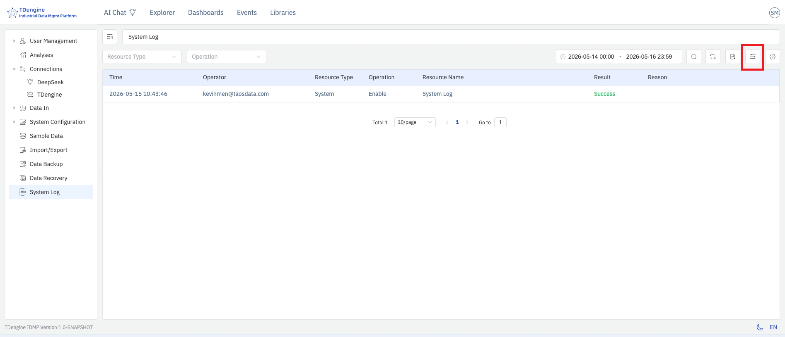
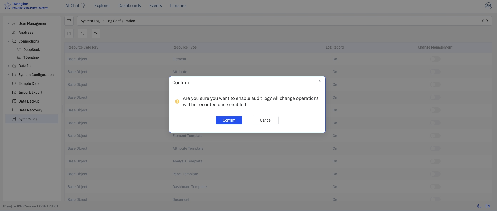
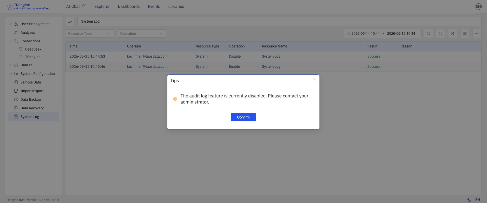

# 14.7 系统日志

系统日志用于记录用户对 IDMP 系统对象的所有修改操作。启用该功能后，IDMP 会自动生成**不可修改**的操作日志，完整保留每一次变更的执行人、时间、对象与前后内容，并提供查询、筛选和导出接口，便于合规审计和安全追溯。

该功能参考 `21 CFR Part 11` 等行业规范对电子记录的可追溯性要求设计，适用于医药、食品、能源、重工等对操作留痕有严格要求的行业场景。

系统日志菜单对所有具有相应权限的用户**持续可见**；功能的启用、关闭与管控级别配置，均统一在 **管理控制台 → 系统日志** 页面内完成。

## 14.7.1 主要特点

- **全量记录：** 覆盖所有系统对象（元素、模板、数据源、用户、角色、权限、系统配置等）的创建、修改、删除以及登录登出等关键操作
- **不可修改：** 日志一经写入即无法编辑或删除，任何用户（包括超级管理员）均不具备修改权限
- **完整上下文：** 每条日志包含操作人、操作时间、操作类型、对象类型、对象标识、变更前后的关键字段值以及来源 IP 等信息
- **可查询、可导出：** 具有查看权限的用户可按时间、用户、对象类型、操作类型等维度筛选查询，并将结果导出为 CSV 文件，供审计人员离线分析或归档

## 14.7.2 权限管理

系统日志功能设有独立的专属权限，分为以下两个层级：

- **查看系统日志：** 具有该权限的用户可查看、筛选、搜索并导出系统日志
- **配置系统日志：** 具有该权限的用户可修改系统日志配置，包括开启、关闭，以及各管控级别（如变更管理等）的设置

各角色的默认权限如下，超级管理员可按需为其他用户调整权限：

| 角色             | 查看系统日志 | 配置系统日志 |
| ---------------- | :----------: | :----------: |
| 工厂经理与主管   |      ✓      |      —      |
| IT/OT 系统管理员 |      ✓      |      —      |
| 维护人员         |      —      |      —      |
| 数据分析师       |      —      |      —      |
| 运营人员         |      —      |      —      |
| 工艺工程师       |      —      |      —      |
| 超级管理员       |      ✓      |      ✓      |

:::note
日志的开启、关闭及配置修改操作均需拥有**配置系统日志**权限，相关操作本身也会被写入审计日志。
:::

## 14.7.3 管控级别

系统日志分为以下四个管控级别，级别由低到高逐步增强审计与合规能力：

|       级别       | 名称                       | 说明                                                                                        |
| :--------------: | -------------------------- | ------------------------------------------------------------------------------------------- |
| **第一级** | Baseline 基础防护          | IDMP 的初始默认状态，不开启日志记录                                                         |
| **第二级** | Log & Audit 日志记录       | 开启系统日志，记录所有操作日志，对普通用户无其他影响                                        |
| **第三级** | Change Control 变更管理    | 开启变更管理，用户针对特定对象的修改需填写修改原因方可保存                                  |
| **第四级** | Review & Approval 复核管控 | 在变更管理基础上增加二次密码验证/电子签名，可选接入第三方审核（此级别功能规划中，暂未开放） |

在日志配置页面，可针对不同资源对象分别配置是否启用变更管理，保存后即刻生效。

## 14.7.4 启用系统日志

系统日志的启用入口统一在 **管理控制台 → 系统日志** 菜单下，无需进入系统配置页面。

### 首次启用

1. 进入 **管理控制台 → 系统日志**，右侧页面会提示当前日志功能尚未开启。
2. 具有**配置系统日志**权限的用户，在提示信息下方可看到**开启系统日志**按钮，点击后系统弹出二次确认对话框。
3. 再次点击**确认**后，系统将在 5 秒内自动刷新页面，日志功能即正式生效，后续所有被审计的操作均开始记录。

:::note
启用前发生的操作不会被追溯记录。建议在系统正式上线或有合规审计要求时尽早开启。
:::

### 日志配置

当日志开启后，用户点击系统日志，进入日志查询与筛选页面。

在该页面的右侧操作栏，有系统日志配置按钮，点击进入配置页面。

此时，具有配置权限的用户可以为每一类资源对象配置管理权限，即是否需要开通变更管理。变更管理一旦开通，这类资源对象的任意编辑操作必须提交变更原因。

请注意，日志一旦开启，所有资源对象的日志记录均会自动覆盖，不可调整。

### 关闭与重新配置

1. 进入 **管理控制台 → 系统日志**，点击操作栏右侧的**日志配置**按钮（仅具有**配置系统日志**权限的用户可见）。
2. 配置页面操作栏左侧提供**开启/关闭**切换按钮：
   - 点击**关闭**后，日志记录、变更管理等所有选项均切换为关闭状态。
   - 点击**开启**后，日志记录恢复为开启状态，变更管理各项默认为关闭，可按需手动开启。

3. 当系统日志关闭后，日志配置页面仍可访问，只是页面元素变灰。管理员用户可以在本页面再次打开系统日志功能。此时系统将有弹窗提示，点击确认后，系统日志生效。

### 日志关闭后的状态

- 系统日志菜单对具有查看或配置权限的用户**依然可见**。
- 进入日志页面时会出现提示弹框：**当前系统日志功能已关闭，请联系管理员。**
- 点击确认后，用户依然可以查询、浏览在日志功能关闭前已生成的历史日志记录。

## 14.7.5 保存修改原因

启用**变更管理**（第三级管控）后，用户对特定 IDMP 系统对象进行**创建、修改或删除**等关键操作并点击保存时，系统会弹出**修改说明**对话框，要求用户填写本次变更的原因后方可继续。

用户需要描述本次修改变更的业务背景或动因，如"工艺参数优化""设备更换""合规整改"等，并完整描述本次修改的具体对象和修改操作。

点击**确定**后，系统会在完成对象变更的同时，将本次操作写入审计日志。日志中除包含 [14.7.6 查看与查询](#1476-查看与查询) 列出的常规字段外，还会额外保存以下内容：

- **修改原因**：用户填写的修改原因全文
- **变更前状态快照**：对象在本次操作之前的完整属性值
- **变更后状态快照**：对象在本次操作之后的完整属性值

两份状态快照以 JSON 形式存储，必要时可用于对象的手动回滚。

:::note

- 只有在变更管理开启时，修改说明对话框才会出现；关闭变更管理后不会弹框，也不会保留状态快照。
- 对于批量操作（如批量删除元素），修改原因会通过操作接口统一应用到批量操作涉及的所有对象日志。

:::

## 14.7.6 查看与查询

具有**查看系统日志**权限的用户可通过 **管理控制台 → 系统日志** 访问日志列表。页面以表格形式展示所有已记录的操作日志，按时间倒序排列。

具有**配置系统日志**权限的用户，在操作栏右侧还会显示**日志配置**入口按钮。

日志列表包含以下字段，可以通过操作栏最右侧的设置按钮对显示列进行调整：

| 字段               | 说明                                                       |
| ------------------ | ---------------------------------------------------------- |
| **操作时间** | 操作发生的服务器时间，精确到秒                             |
| **操作用户** | 执行操作的登录用户名                                       |
| **来源 IP**  | 发起请求的客户端 IP 地址                                   |
| **操作类型** | 创建、修改、删除、登录、登出等                             |
| **对象类型** | 被操作对象的类别，如元素、模板、用户、角色、系统配置等     |
| **对象标识** | 被操作对象的名称或唯一标识                                 |
| **操作详情** | 本次操作涉及的具体字段变更，包含变更前后的值               |
| **操作结果** | 成功或失败；失败时附带错误信息                             |
| **数据指纹** | 对该日志关键信息摘要的加密储存，确保原始信息完整且未被修改 |

### 筛选与搜索

日志展示与查询页面提供筛选栏，支持按以下维度组合进行筛选，点击某条日志可查看详情信息。

- **时间范围：** 选择起止时间，快速定位特定时段的操作
- **操作用户：** 按用户名精确匹配
- **对象类型：** 下拉选择，如元素、模板、用户等
- **操作类型：** 下拉选择，如创建、修改、删除等
- **关键字：** 在对象标识或操作详情中模糊搜索

## 14.7.7 导出日志

在日志列表页面点击右上角的**导出**按钮，系统会将**当前筛选条件下**的全部日志导出为 CSV 文件。导出内容包含列表中展示的所有字段，并附带变更详情的完整 JSON 信息，便于导入第三方审计工具进一步分析。

:::tip
若日志数据量较大，建议在导出前通过时间范围和对象类型进行筛选，以缩小导出规模，提升处理效率。
:::

## 14.7.8 日志保留与存储

系统日志存储在 IDMP 系统后台配置的 TSDB 数据库中，默认保留 10 年的历史日志。

## 14.7.9 安全与合规说明

- 具有**查看系统日志**权限的用户可访问日志列表页面并执行导出操作；
- 具有**配置系统日志**权限的用户可进行日志的开启、关闭及管控级别设置
- 系统日志的写入由后端服务直接完成，任何前端接口均不提供修改或删除日志的能力
- 日志的开启、关闭及配置变更操作本身均会被记录在审计日志中，确保配置变更可追溯
- 针对合规审计场景，建议结合 [14.4 用户管理](./04-user-management.md) 的角色与权限控制，确保系统操作人可追溯到唯一自然人账号，避免共享账号
