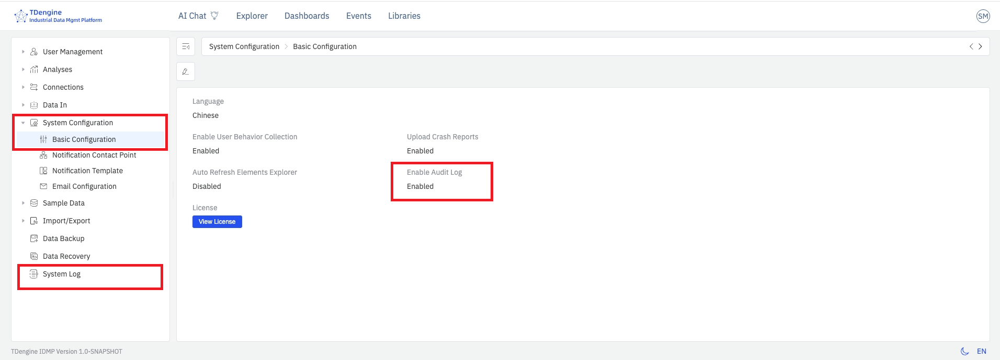
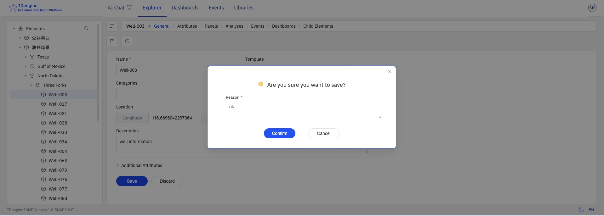

# 14.7 系统日志

系统日志用于记录用户对 IDMP 系统对象的所有修改操作。当管理员在系统配置中启用该功能后，IDMP 会自动生成**不可修改**的操作日志，完整保留每一次变更的执行人、时间、对象与前后内容，并提供查询、筛选和导出接口，便于合规审计和安全追溯。

该功能参考 `21 CFR Part 11` 等行业规范对电子记录的可追溯性要求设计，适用于医药、食品、能源、重工等对操作留痕有严格要求的行业场景。

## 14.7.1 主要特点

- **全量记录：** 覆盖所有系统对象（元素、模板、数据源、用户、角色、权限、系统配置等）的创建、修改、删除以及登录登出等关键操作
- **不可修改：** 日志一经写入即无法编辑或删除，任何用户（包括超级管理员）均不具备修改权限
- **完整上下文：** 每条日志包含操作人、操作时间、操作类型、对象类型、对象标识、变更前后的关键字段值以及来源 IP 等信息
- **可查询、可导出：** 管理员可按时间、用户、对象类型、操作类型等维度筛选查询，并将结果导出为 CSV 文件，供审计人员离线分析或归档

## 14.7.2 启用系统日志

系统日志默认关闭，启用步骤如下：

1. 进入**管理控制台 → 系统配置 → 基本配置**。
2. 打开 **系统日志** 开关。
3. 保存配置后，不需要重启，IDMP 即开始记录后续所有被审计的操作。
4. 左侧管理控制台出现**系统日志**菜单项

:::note
启用前发生的操作不会被追溯记录。建议在系统正式上线或有合规审计要求时尽早开启。
:::

## 14.7.3 保存修改原因

启用系统日志后，用户在对 IDMP 系统对象进行**创建、修改或删除**等关键操作并点击保存时，系统会弹出**修改说明**对话框，要求用户填写本次变更的原因后方可继续。

修改原因是必填项，用户需要描述本次修改变更的业务背景或动因，如"工艺参数优化""设备更换""合规整改"等，并完整描述本次修改的具体对象和修改操作。

点击**确定**后，系统会在完成对象变更的同时，将本次操作写入审计日志。日志中除包含 [14.7.4 查看与查询](#1474-查看与查询) 列出的常规字段外，还会额外保存以下内容：

- **修改原因**的全文
- **变更前状态快照**：对象在本次操作之前的完整属性值
- **变更后状态快照**：对象在本次操作之后的完整属性值

两份状态快照以 JSON 形式存储，必要时可用于对象的手动回滚。

:::note

- 只有在系统日志开关开启时，修改说明对话框才会出现；关闭系统日志后不会弹框，也不会保留状态快照。
- 对于批量操作（如批量删除元素），修改原因会通过操作接口统一应用到批量操作涉及的所有对象日志。

  :::

## 14.7.4 查看与查询

启用系统日志后，可通过 **管理控制台 → 系统日志** 访问日志列表。页面以表格形式展示所有已记录的操作日志，按时间倒序排列。

日志列表包含以下字段，可以通过操作栏最右侧的设计按钮对显示列进行调整：

| 字段               | 说明                                                   |
| ------------------ | ------------------------------------------------------ |
| **操作时间** | 操作发生的服务器时间，精确到秒                         |
| **操作用户** | 执行操作的登录用户名                                   |
| **来源 IP**  | 发起请求的客户端 IP 地址                               |
| **操作类型** | 创建、修改、删除、登录、登出等                         |
| **对象类型** | 被操作对象的类别，如元素、模板、用户、角色、系统配置等 |
| **对象标识** | 被操作对象的名称或唯一标识                             |
| **操作详情** | 本次操作涉及的具体字段变更，包含变更前后的值           |
| **操作结果** | 成功或失败；失败时附带错误信息                         |
| **数据指纹** | 对该日志关键信息摘要的加密储存，确保原始信息完整且未被修改         |

### 筛选与搜索

日志展示与查询页面提供筛选栏，支持按以下维度组合进行筛选，点击某条日志可查看详情信息。

- **时间范围：** 选择起止时间，快速定位特定时段的操作
- **操作用户：** 按用户名精确匹配
- **对象类型：** 下拉选择，如元素、模板、用户等
- **操作类型：** 下拉选择，如创建、修改、删除等
- **关键字：** 在对象标识或操作详情中模糊搜索

## 14.7.5 导出日志

在日志列表页面点击右上角的**导出**按钮，系统会将**当前筛选条件下**的全部日志导出为 CSV 文件，文件名格式为 `audit-trail-YYYYMMDD-HHmmss.csv`。

导出内容包含列表中展示的所有字段，并附带变更详情的完整 JSON 信息，便于导入第三方审计工具进一步分析。

:::tip
若日志数据量较大，建议在导出前通过时间范围和对象类型进行筛选，以缩小导出规模，提升处理效率。
:::

## 14.7.6 日志保留与存储

系统日志存储在 IDMP 系统后台配置的 TSDB 数据库中，默认保留 10 年的历史日志。

## 14.7.7 安全与合规说明

- 只有**系统管理员**用户才能访问系统日志页面并执行导出操作
- 系统日志的写入由后端服务直接完成，任何前端接口均不提供修改或删除日志的能力
- 针对合规审计场景，建议结合 [14.4 用户管理](./04-user-management.md) 的角色与权限控制，确保系统操作人可追溯到唯一自然人账号，避免共享账号
