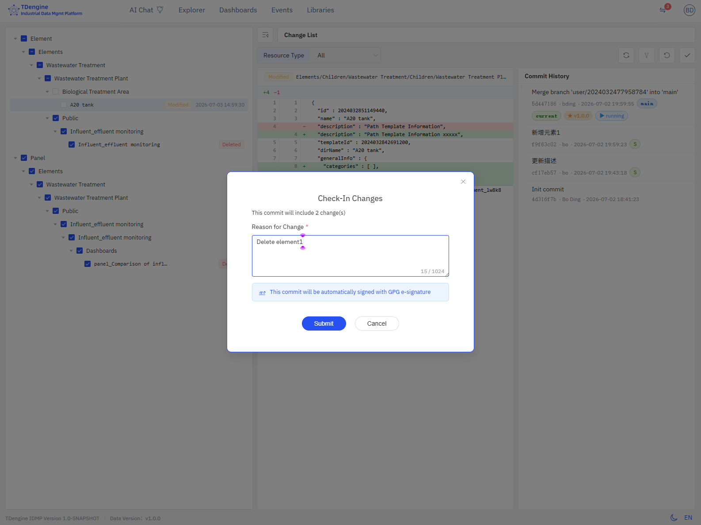

# 14.11.6 变更列表与日常操作

变更列表是用户管理未提交修改的核心页面。每当用户修改受版本控制的数据后，
右上角徽标会显示未提交变更数，点击即可进入变更列表。

## 变更徽标

修改数据后，右上角头像旁边会出现红色徽标，显示未提交变更的数量。

- 数字实时更新（通过 SSE 推送）
- 超过 99 时显示 "99"
- 点击徽标直接跳转到变更列表页

## 变更列表页

变更列表页采用三栏布局：左侧变更树、中间变化详情面板、右侧提交历史面板。

### 左侧：变更树

变更树按资源类型分组显示所有未提交的变更：

- **变更类型**：添加、修改、删除、重命名、未跟踪
- **资源类型**：元素、元素模板、事件模板、仪表板、面板、分析、连接、分类、单位、枚举等
- **勾选框**：支持单选和全选
- **三点菜单**：每行支持单独 Check-In 或 Undo

### 顶部工具栏

- **资源类型过滤**：按资源类型筛选变更
- **撤销按钮**：批量撤销选中的变更
- **签入按钮**：批量提交选中的变更
- **同步按钮**（Review Required / E-Signature 模式）：从 main 分支同步最新内容

### 中间：变化详情面板

选中某条变更后，中间显示详细信息：

- **Diff 对比**：HEAD 版本与工作区版本的并排对比
- **变更详情**：资源路径、变更类型、修改时间

### 右侧：提交历史面板

提交历史面板以泳道图形式展示当前分支的提交历史，每个提交节点附带标记说明其在版本控制流程中的角色：

| 标记 | 含义 |
|------|------|
| **main** | main 分支的 HEAD（公共主分支最新提交） |
| **current** | 当前用户分支的 HEAD（个人工作空间最新提交） |
| **★ v1.0.0** | 已发布的版本标签（管理员在版本管理中发布） |
| **▶ running** | 当前正在运行的版本（系统当前使用的数据版本） |
| **MR !2** | 与该提交关联的 Merge Request，点击可跳转到 GitLab/GitHub |
| **S** | GPG 签名标记，表示该提交已通过 GPG 电子签名验证 |

泳道图左侧用不同颜色区分 main 分支线与用户分支线，节点之间用连线表示父子关系。

## Check-In（签入）

Check-In 将选中的变更提交到 Git 仓库。

### 操作步骤

1. 在变更列表中勾选要提交的变更行
2. 点击 **签入** 按钮
3. 在弹出的对话框中填写**变更原因**（必填）
4. 点击 **提交**

### 变更原因

- 变更原因是必填项，会作为 Git commit message
- 同时记录到审计日志中
- 建议填写清晰的业务原因，便于后续追溯

### E-Signature 模式

在 E-Signature 模式下，签入对话框会显示提示："此提交将使用 GPG 电子签名自动签署"。

## Undo（撤销）

Undo 将选中的变更恢复到上一个版本（HEAD）。

### 操作步骤

1. 在变更列表中勾选要撤销的变更行
2. 点击 **撤销** 按钮
3. 确认撤销操作

:::warning 注意
撤销操作不可逆。撤销后，工作区文件恢复到 HEAD 版本，所有未提交的修改将丢失。
:::

## 变更类型说明

| 类型 | 说明 |
|------|------|
| **添加（Added）** | 新创建的资源，尚未提交到 Git |
| **修改（Modified）** | 已有资源的内容发生了变化 |
| **删除（Deleted）** | 资源已被删除，但未提交 |
| **未跟踪（Untracked）** | 工作区中的新文件，未被 Git 追踪 |
| **重命名（Renamed）** | 资源被重命名，显示新旧路径 |
