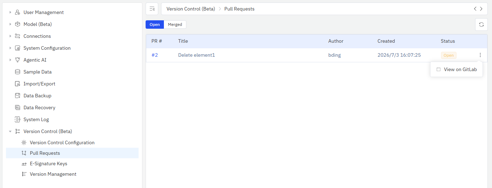

# 14.11.7 Pull Request 管理

在 **Review Required** 或 **E-Signature** 模式下，管理员可以在
「管理控制台 → 版本控制 → Pull Requests」页面查看所有 MR/PR。

## 进入 PR 列表

点击左侧菜单 **管理控制台 → 版本控制 → Pull Requests**。

## PR 列表

列表显示所有 MR/PR，支持按状态筛选：

- **待合并（Opened）**：正在等待审核的 MR/PR
- **已合并（Merged）**：已经合并到 main 分支的 MR/PR

### 列表字段

| 列 | 说明 |
|----|------|
| PR # | MR/PR 编号 |
| 标题 | MR/PR 的标题（即 Check-In 时填写的变更原因） |
| 作者 | 提交者名称 |
| 创建时间 | MR/PR 创建时间 |
| 状态 | 待合并 / 已合并 |

### 查看 PR 详情

点击行末的三点菜单 → **在 GitLab 查看**（或 **在 GitHub 查看**），
跳转到 Git 服务器上的 MR/PR 页面查看详细 diff 和评论。

## 审核流程

1. 用户在 IDMP 中修改数据并 Check-In
2. 系统自动创建 MR/PR 到 Git 服务器
3. Reviewer 在 GitLab/GitHub 中查看 diff、写评论
4. Reviewer 批准并合并 MR/PR
5. IDMP 通过 Webhook 收到合并通知：
   - **自动发布模式**：自动拉取最新版本并更新运行系统
   - **人工管理模式**：向提交者推送 SSE 通知，告知 MR 已被合入
6. 所有用户看到更新后的数据

## 合并后自动同步

:::info 仅自动发布模式生效
以下自动同步流程仅在 **自动发布（Auto-Push）** 模式下生效。在 **人工管理（Manual）** 模式下，
合并后需要管理员到「版本管理」页面手动发布新版本。
:::

MR/PR 合并后，IDMP 通过 Webhook 收到通知，自动执行以下操作：

1. 拉取 main 分支最新内容
2. 重建数据库缓存
3. 刷新搜索索引
4. 更新 TDengine 虚拟表（如有）
5. 向提交者推送 SSE 通知（"MR 已合并"）

:::warning 自动发布失败的处理
如果自动发布过程中出现错误，系统不会在版本列表中记录该版本，本地仓库会回退到发布前的状态。
管理员在「版本管理」页面仍可看到待发布 PR 计数 > 0，点击发布按钮即可手动重试发布。
详见 [版本发布管理](./08-version-management.md)。
:::

:::info 个人分支保留
合并后不会自动清理用户的个人分支。用户可以继续在自己的工作空间中做其他修改，
后续 Check-In 时会在同一个个人分支上创建新的 MR/PR。如需回到公共视图，
可手动删除个人工作空间（详见 [个人工作空间](./03-personal-workspace.md)）。
:::

## 版本管理联动

在 **版本管理** 页面中，顶部显示"自上个版本以来已批准的 PR"计数。
管理员可以据此决定是否发布新版本。

