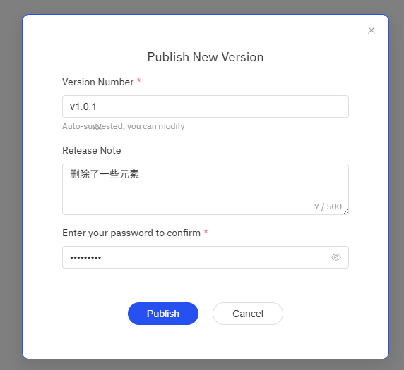

# 14.11.8 版本发布管理

管理员在「管理控制台 → 版本控制 → 版本管理」页面中查看已发布版本和管理版本发布。

## 进入版本管理

点击左侧菜单 **管理控制台 → 版本控制 → 版本管理**。

## 页面布局

### 顶部状态栏

- **版本发布模式**：显示当前的发布模式（自动推送 / 人工管理）
- **待发布 PR 计数**：自上个版本以来已批准的 PR 数量
- **发布按钮**（Manual 模式）：当有待发布 PR 时可用
- **刷新按钮**：刷新版本列表

### 版本列表

| 列 | 说明 |
|----|------|
| 版本号 | 版本标识（短 commit ID 或自定义版本号） |
| Release Note | 版本说明（Check-In 时填写的变更原因） |
| 包含的 PR | 该版本包含的 MR/PR 列表，可点击跳转 |
| 发布时间 | 版本发布时间 |
| 发布人 | 发布操作人 |
| 状态 | 运行中 / 已发布 |

### 状态说明

- **运行中（Running）**：当前正在运行的版本，绿色标签
- **已发布（Published）**：历史已发布版本，灰色标签

### 页脚数据版本

页面底部显示当前数据版本号：

- 有 tag 时显示 tag 名（如 `v1.0.0`）
- 无 tag 时显示 commit ID 的前 8 位
- 未生成时显示"未生成"

## 手动发布版本（Manual 模式）

在人工管理模式下，管理员手动发布新版本：

1. 确认"待发布 PR 计数"大于 0
2. 点击右上角 **+** 按钮
3. 在弹出的对话框中，系统自动生成版本号（可修改）
4. 输入管理员密码确认
5. 点击 **发布**

## 自动发布（Auto-Push 模式）

在自动推送模式下，MR/PR 合并后系统自动发布新版本，无需管理员介入。

:::info 自动发布失败的处理
如果自动发布过程中出现错误，系统不会记录该版本，本地仓库会回退到发布前的状态。
管理员在版本管理页面仍可看到待发布 PR 计数 > 0，点击发布按钮即可手动重试发布。
:::

## 版本回滚

:::warning 功能开发中
版本回滚功能正在开发中，当前版本暂不支持。
:::
