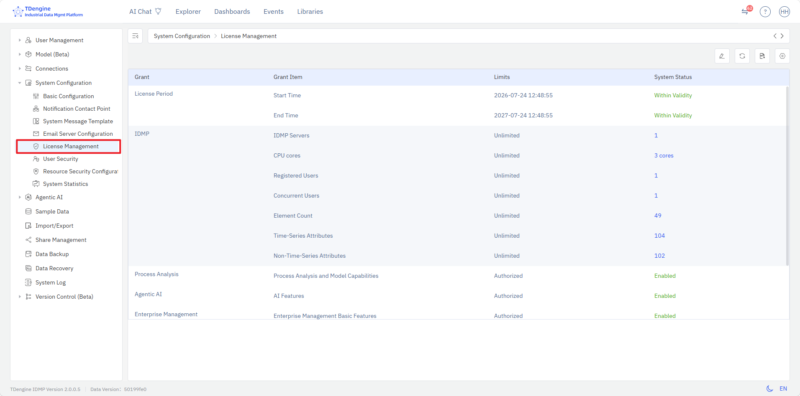
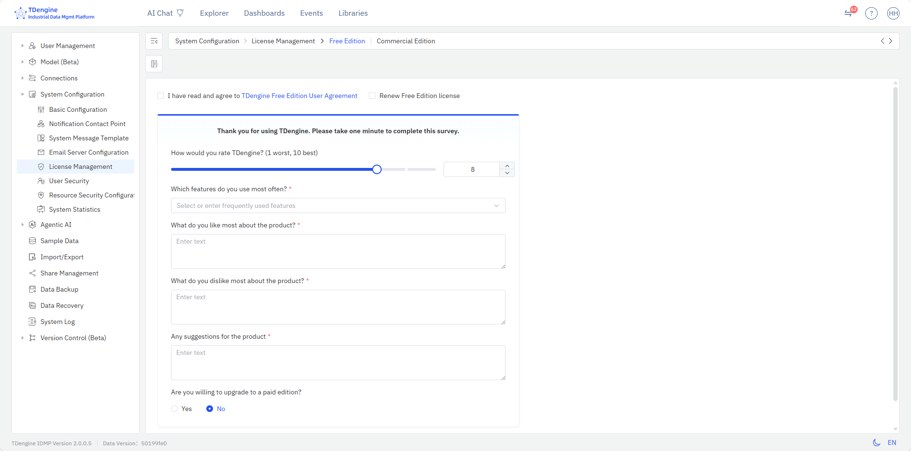

# 14.11 许可管理

## 14.11.1 IDMP 测点概述

**测点（Tag）** 是 IDMP 软件产品定价的核心变量之一。一个测点代表一个单一观测指标的时序数据流，通常包含 4 个信息项：时间戳、观测值、质量位和注释信息——例如一台设备的出口温度、一条产线的蒸汽压力、一台风机的轴承振动值等，每个观测指标计为一个测点。

IDMP 系统对测点的定义与 OSIsoft PI 系统的 PI Tag（也叫 PI Point）完全一致，遵循以下计算原则：

- **仅按观测指标计数**：一个观测指标流记为一个测点，质量位、注释等附属信息不纳入计算。
- **仅统计落地存储的数据**：只有保存在 TSDB 数据库中的时序数据流才计入测点。未入库保存的数据，如属性关联信息、计算表达式产生的衍生属性等，均不纳入测点统计范围。
- **静态描述信息不计入**：观测指标的静态元数据，如限值、类型、位置、标识等，均不纳入测点统计范围。
- **仅计算元素的时序数据**：IDMP 系统内部所有管理类时序数据（如审计日志与操作记录等）均不纳入测点统计范围。

**需要注意的是，IDMP 测点与 TSDB 时间线数量是两个完全独立的统计口径。** TSDB 从数据库层面统计时间线数量，将数据库内时序数据表非时间戳类型的所有列（包括质量位和描述信息等）均纳入计算范围，因此通常 TSDB 的时间线数量要显著大于 IDMP 测点数量。IDMP 支持两种软件许可管理模式：可以直接使用同一网段内 TSDB 系统的软件许可，也可以通过涛思公司 ECS 授权服务体系获取独立的 IDMP 软件许可。

## 14.11.2 许可管理页面

许可管理页面集中展示 TDengine IDMP 系统当前的软件授权内容及使用情况，并提供可选的 ECS（Enterprise Certificate Service）授权配置入口。

## 14.11.3 进入许可管理

在**管理控制台 → 系统配置**下方，有**许可管理**菜单项。点击即可进入 IDMP 的许可管理页面。

## 14.11.4 许可内容

许可管理页面以表格形式列出当前 IDMP 系统的所有授权项，每行包含以下 4 列：

| 列                     | 说明                                                                                                   |
| ---------------------- | ------------------------------------------------------------------------------------------------------ |
| **授权项**       | 受授权约束的功能或资源名称                                                                             |
| **当前是否可用** | 该授权项在当前系统中是否处于可用状态                                                                   |
| **过期时间**     | 该授权项的到期时间                                                                                     |
| **授权数量**     | 授权数量与当前使用量。形式为`<已用>/<授权上限>`——例如 `1/5` 表示授权 5 名用户、当前系统已有 1 名 |

当前列出的授权项包括：**用户**、**时序属性**、**非时序属性**、**元素**、**IDMP 集群**、**CPU**、**基础功能**、**版本控制**、**数据预测**、**数据异常检测**、**数据质量**、**Agentic AI** 等。

## 14.11.5 ECS 授权配置

许可管理页面右上角的操作栏提供**配置**按钮，点击后弹出 **授权服务配置**对话框。可配置以下选项：

| 字段                     | 说明                                      |
| ------------------------ | ----------------------------------------- |
| **启用 ECS 授权**  | 开关，控制是否启用 ECS 授权               |
| **刷新间隔**       | 客户端从 ECS 服务器拉取授权信息的时间间隔 |
| **授权服务器地址** | ECS 授权服务的服务端地址                  |
| **许可证 ID**      | ECS 颁发的许可证标识                      |
| **配额 ID**        | 与该许可证对应的配额标识                  |

## 14.11.6 授权模式说明

- **未启用 ECS 授权**（默认）：IDMP 系统自动从同一网段内的 TSDB 系统获取软件许可，这是当前 IDMP 大多数用户的软件许可模式。
- **启用 ECS 授权**：通过独立的 ECS 服务集中下发独立的 IDMP 软件许可，支持部署多套 IDMP 环境，支持不同 IDMP 环境的授权配额管理。

涛思公司已经推出独立的 IDMP 软件授权管理体系，包括 ECS（Enterprise Certificate Service）、CLS（Customer License Service）等授权服务。

如需了解独立 IDMP 软件许可的采购方式或有任何相关疑问，请联系涛思数据公司销售人员。

