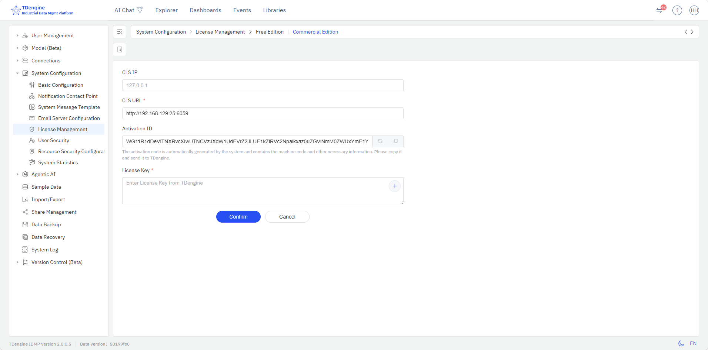

# 14.12 许可管理

## 14.12.1 IDMP 测点概述

**测点（Tag）** 是 IDMP 软件产品定价的核心变量之一。一个测点代表一个单一观测指标的时序数据流，通常包含 4 个信息项：时间戳、观测值、质量位和注释信息——例如一台设备的出口温度、一条产线的蒸汽压力、一台风机的轴承振动值等，每个观测指标计为一个测点。

IDMP 系统对测点的定义与 OSIsoft PI 系统的 PI Tag（也叫 PI Point）完全一致，遵循以下计算原则：

- **仅按观测指标计数**：一个观测指标流记为一个测点，质量位、注释等附属信息不纳入计算。
- **仅统计落地存储的数据**：只有保存在 TSDB 数据库中的时序数据流才计入测点。未入库保存的数据，如属性关联信息、计算表达式产生的衍生属性等，均不纳入测点统计范围。
- **静态描述信息不计入**：观测指标的静态元数据，如限值、类型、位置、标识等，均不纳入测点统计范围。
- **仅计算元素的时序数据**：IDMP 系统内部所有管理类时序数据（如审计日志与操作记录等）均不纳入测点统计范围。

**需要注意的是，IDMP 测点与 TSDB 时间线数量是两个完全独立的统计口径。** TSDB 从数据库层面统计时间线数量，将数据库内时序数据表非时间戳类型的所有列（包括质量位和描述信息等）均纳入计算范围，因此通常 TSDB 的时间线数量要显著大于 IDMP 测点数量。IDMP 支持两种软件许可管理模式：可以直接使用同一网段内 TSDB 系统的软件许可，也可以通过涛思公司 ECS 授权服务体系获取独立的 IDMP 软件许可。

## 14.12.2 许可管理页面

许可管理页面集中展示 TDengine IDMP 系统当前的软件授权内容及使用情况。

## 14.12.3 进入许可管理

在**管理控制台 → 系统配置**下方，有**许可管理**菜单项。点击即可进入 IDMP 的许可管理页面。

## 14.12.4 许可内容

许可管理页面以表格形式列出当前 IDMP 系统的所有授权项，每行包含以下 4 列：

| 列                     | 说明                                 |
| ---------------------- | ------------------------------------ |
| **授权类型**       | 受授权约束的功能或资源类型           |
| **授权项** | 受授权约束的功能或资源名称 |
| **授权数量**     | 授权数量                             |
| **系统现状**     | 当前系统的使用状态                   |

页面列出的软件授权信息包括：

- **许可时间**：当前许可的开始时间与结束时间
- **IDMP 基础功能**：服务器节点数、CPU 核数、注册用户数、并发用户数、元素数、时序测点数、非时序属性数
- **过程分析**：过程分析与模型能力
- **Agentic AI**：AI 智能体与内置 AI 应用
- **企业管理功能**：企业管理基础功能、版本控制与电子签名
- **业务应用**：产品质量分析
- **高可用**：高可用架构，如集群部署

## 14.12.5 ECS 授权配置

许可管理页面右上角的操作栏提供**配置**按钮，点击后进入 **授权服务配置**页面，可选择商业版或者免费版的许可配置操作：

对于使用 TDengine 免费版的用户，可以在免费许可临期前后申请许可延期。此时用户需要确认已经阅读并同意《TDengine 免费版用户协议》，勾选免费版许可延期，填写一个简短的调研问卷，点击确认后，系统即会自动生成新的免费许可，确保免费版用户可以持续使用。

对于使用 TDengine 商业版的用户，可以配置 CLS 访问地址，系统自动会刷新当前 IDMP 实例的激活码（用于申请商业版许可码），输入从涛思公司获取的商业版许可码，点击确认后，即完成许可更新操作。

完成许可更新操作后，请回到许可管理页面，点击右上交操作栏的刷新按钮，即可获得当前许可的最新状态。

## 14.12.6 授权模式说明

涛思公司已经推出全新的 TDengine 软件授权管理体系，覆盖 IDMP 与 TSDB。用户需要在 TDengine 部署环境安装 CLS，通过在线或离线文件的方式与云端的 ECS 进行交互，并对本地的 TDengine 实例进行许可激活与管理。这种模式支持多槽位，即可以用一套许可部署多套 IDMP 实例，并对不同 IDMP 实例的授权数量进行配额管理。

- ECS：即 Enterprise Certificate Service， 是涛思公司部署在云端的许可管理服务器。
- CLS：即 Customer License Service，安装 TDengine 软件会默认同时部署 CLS 模块，为本地的 TDengine 实例提供许可管理服务。CLS 提供网页版访问界面，帮助系统管理员对本地部署的多个 TDengine 实例进行许可激活与槽位管理。

TDengine CLS 可以部署于局域网，通过离线密钥文件的方式与云端的 ELS 进行信息交互。本地部署的 IDMP 需要定期与 CLS 进行交互，以确认当前系统的许可状态。CLS 是一个极为轻量的服务，建议将 CLS 模型部署在 IDMP 的同一环境内。

请注意，在这种授权模式下，IDMP 的软件授权与 TSDB 完全独立，两者分开管理，互不影响。对于 TDengine All-in-One 免费版部署场景下的许可管理与限制政策，请参考[免费版说明](https://www.taosdata.com/tdengine-free-edition)。
