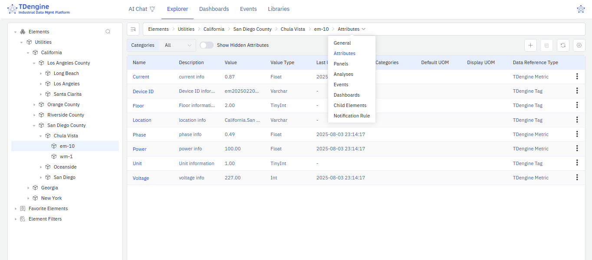
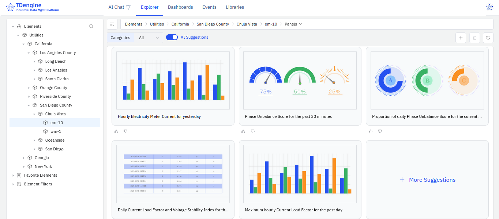

After activating TDengine IDMP, follow the steps in this section to familiarize yourself with the interface and explore the key features of the system.

## 2.4.1 UI Tour Guide

The Tour Guide opens automatically on your first login. It walks you through the main areas of the IDMP interface. Click **Next** to proceed through each step. You can close it at any time by clicking **X**. To restart the tour later, click your avatar in the top right and select **Tour Guide**.

The interface is organized into the following areas:

**1. Top Navigation Bar**

The top navigation bar spans the full width of the page. On the left is the TDengine logo. In the center are the five main modules:

- **AI Chat** — Ask questions about your industrial data in natural language.
- **Explorer** — Browse and manage your asset hierarchy, attributes, panels, analyses, and events.
- **Dashboards** — View and manage dashboards across all elements.
- **Events** — Browse, filter, and analyze events across the system.
- **Libraries** — Manage shared resources such as element templates, event templates, enumerations, units of measure, and more.

On the far right is your **avatar**. Click it to manage your profile, access system administration, or launch the Tour Guide.

**2. Left Panel**

The left panel shows the tree structure for the active module. In the **Explorer**, it displays three sections:

- **Elements** — The asset hierarchy. Click the arrow to expand a node; click the element name to select it. Use the search icon to find elements by name.
- **Favorite Elements** — Elements you have marked as favorites for quick access.
- **Element Filters** — Saved search filters that let you quickly recall a specific set of elements.

**3. Context Tab Bar**

The context tab bar appears to the right of the left panel. It shows the name of the currently selected object, followed by a set of tabs representing the available views for that object. When an element is selected, the tabs are: **General**, **Attributes**, **Panels**, **Analyses**, **Events**, **Dashboards**, and **Child Elements**. Click a tab to switch views. On the far left of the context tab bar is a collapse icon to hide the left panel and maximize the workspace.

:::note
The built-in Tour Guide refers to this area as the "Path Bar".
:::

**4. Action Bar**

Below the context tab bar is a row of controls. The left side typically shows filter dropdowns (such as **Categories**) and view toggle buttons (such as the **AI** suggestions button or grid/list view). The right side shows action icons including **+** to add a new item and a refresh button.

**5. Main Workspace**

The main area below the action bar displays the content for the currently selected tab — element details, attribute lists, panels, events, and so on. Content can be viewed and edited directly in this area.

**6. Status Bar**

The status bar runs along the bottom of the page. The left side shows the current IDMP version. The right side has a **theme toggle** (light/dark mode) and a **language toggle**.

## 2.4.2 View Element Information

The following steps use the **Utilities** scenario as an example. If you did not load it during activation, go to **Admin Console** > **Sample Data** and load it before continuing.

1. In the left panel, click **Elements**. The elements in the Utilities scenario appear in a tree hierarchy.
2. Select **Utilities** > **California** > **San Diego County** > **Chula Vista** > **em-10**. This element represents electricity meter number 10 in Chula Vista, California.
3. In the context tab bar, select **General** to view the description and basic information about this meter.
4. Select **Attributes** to view its attributes, such as current and voltage.

## 2.4.3 Try AI-Generated Panels

1. Select the element **Utilities** > **California** > **San Diego County** > **Chula Vista** > **em-10**.
2. In the context tab bar, select **Panels**. Five AI-recommended panels are displayed. Click **+ More Suggestions** to generate additional options.
3. You can also request a panel in natural language using the input box below the recommendations. For example:

   *"Show a line chart of the voltage and current changes every minute for electricity meter em-10 over the past 24 hours."*

   Click **Ask AI** to generate the panel.

## 2.4.4 Try AI-Powered Analysis

1. Select the element **Utilities** > **California** > **San Diego County** > **Chula Vista** > **em-10**.
2. In the context tab bar, select **Analyses**. Three AI-recommended questions are displayed.
3. Click a suggestion link to open the analysis creation page, where you can review and adjust the AI-generated configuration. Click **Save** to complete the setup.
4. You can also describe an analysis in natural language using the input box next to the recommendations. For example:

   *"If power fluctuation for electricity meter em-10 exceeds plus or minus 20% for 30 minutes, generate a 'warning' level alert and calculate the fluctuation range."*

   Press **Enter** to generate the analysis.

## 2.4.5 Next Steps

You have explored the IDMP interface and tried AI-generated panels and analyses. From here, you can:

- Proceed to **Chapter 3** to learn how to build your own asset model with elements and attributes.
- Proceed to **Chapter 12** to connect your own data sources and ingest real industrial data.
- Load additional sample scenarios to explore more industry use cases. Click your avatar in the top right, select **Admin Console**, and then click **Sample Data** in the left panel.
