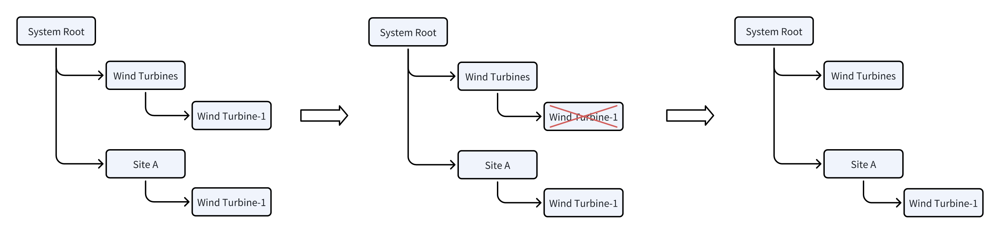

In TDengine IDMP, every physical or logical asset in your industrial environment — a factory, a production line, a machine, or a sensor — is represented as an **element**. Elements are the foundational building blocks of your asset model, giving raw time-series data a structured home and meaningful context.

## 3.1.1 What is an Element

An element is a digital representation of a real-world asset or logical grouping in your industrial environment. Elements make it possible to organize, search, and analyze data by asset rather than by raw data tables.


When you select an element in the asset tree, the **General** tab displays the following information:

| Field | Description |
|---|---|
| **Name** | The element's unique identifier within its parent scope |
| **Path** | The full hierarchical path to this element in the asset tree (for example, `/Elements/Utilities/California/San Diego County/Chula Vista/em-10`) |
| **Template** | The element template this element is based on. Click the template name to navigate to the template definition. |
| **Categories** | One or more user-defined category tags for grouping and filtering elements |
| **Default Attribute** | The attribute shown by default when this element is displayed in a summary view |
| **Description** | A free-text description of what this asset represents |
| **Location** | The GPS coordinates of the physical asset: Longitude, Latitude, and Altitude. Used for map-based visualizations. |
| **Additional Attributes** | Free-form key-value pairs for any custom metadata specific to this element, such as manufacturer, model number, serial number, installation date, or maintenance contact |

Below the main fields, the General tab contains the following expandable sections:

### Related Documents

Upload files — such as user manuals, engineering handbooks, P&ID drawings, calibration reports, or any domain-specific reference material — and attach them directly to the element. These documents are indexed and made available to TDengine IDMP's AI engine. When a user asks questions about an element through AI Chat, the AI can draw on these documents to provide more accurate, context-aware answers. For example, attaching a pump's operation manual allows the AI to answer questions about its expected operating range, maintenance intervals, and alarm thresholds.

To add a document: expand **Related Documents** and click **+ Add Document**.

### Annotation

Add free-text notes to the element. Annotations are useful for recording observations, maintenance history, or operational context that does not fit into structured attribute fields.

To add an annotation: expand **Annotation** and click **+ New Annotation**. See [Annotations](../11-collaboration/02-annotations.md) for details.

### Parents

Shows all parent elements in the asset hierarchy. An element can appear in multiple hierarchies simultaneously (for example, a pump may belong to both a geographic hierarchy and a functional equipment hierarchy). The Parents section lists each parent with its full path.

### Security *(coming soon)*

Role-based access control for this element. This feature is not yet implemented.

### Version *(coming soon)*

Version history and audit trail for changes to this element's configuration. This feature is not yet implemented.

## 3.1.2 Asset Tree and Child Elements

Elements are organized into a hierarchical **asset tree**, which mirrors the physical or logical structure of your industrial environment. A typical hierarchy might look like this:

```text
Enterprise
└── Plant
    └── Production Line
        └── Machine
            └── Sensor
```

Any element can have one or more **child elements**. This parent-child relationship allows you to:

- Browse your entire asset catalog from the top down
- Aggregate data across a branch of the tree (for example, total energy usage across all machines on a production line)
- Apply configurations at any level of the hierarchy

The root of the asset tree — the top-level element with no parent — typically represents an enterprise or site-level asset. You can create multiple root-level elements to represent separate sites or business units.

An element can also appear in more than one hierarchy at the same time — for example, a wind turbine may belong to both a geographic site tree and an equipment-type tree. This is achieved through *element references*. See [3.1.7 Element References](#317-element-references) for details.

## 3.1.3 Creating Elements

New elements are always created as children of an existing parent element. There are three ways to do this:

### Method 1: From the asset tree hover menu

1. In the asset tree, hover over the parent element to reveal the **⋮** icon next to its name.
2. Click **⋮** and select **New Child Element**.
3. Fill in the element details and click **Save**.

### Method 2: From the Child Elements tab toolbar

1. Select the parent element in the asset tree.
2. Click the **Child Elements** tab in the element detail pane.
3. Click the **+** icon in the toolbar (top right of the Child Elements tab).
4. Fill in the element details and click **Save**.

:::tip
Use a consistent naming convention across your organization. For example, prefix element names with a site code (such as `SF-Line-01`) to make large asset trees easier to navigate. Selecting a **Template** when creating an element will pre-populate a standard set of attributes for that asset class.
:::

## 3.1.4 Editing Elements

To edit an existing element:

1. Select the element in the asset tree.
2. In the General tab, click the **Edit** icon (pencil icon) in the toolbar.
3. Modify the fields as needed: Name, Description, Template, Categories, Default Attribute, Location, and Additional Attributes.
4. Click **Save** to apply your changes.

To add or update **Related Documents**, **Annotations**, or other sections, expand the relevant section directly in the General tab without entering edit mode.

:::note
Changing the parent element of an existing element will relocate it — and all its children — to the new position in the asset tree. This does not affect the underlying time-series data linked to its attributes.
:::

## 3.1.5 Deleting Elements

There are several ways to delete an element:

### Method 1: From the General tab toolbar

1. Select the element in the asset tree.
2. Click the **Delete** icon (trash icon) in the top-right corner of the General tab.
3. Confirm the deletion in the dialog box.

### Method 2: From the parent's Child Elements tab

1. Navigate to the parent element and click the **Child Elements** tab.
2. In the child elements list, click the **⋮** (three-dot) menu on the row of the element you want to delete.
3. Select **Delete** and confirm.

### Method 3: From the asset tree context menu

1. Hover over the element in the asset tree to reveal the **⋮** menu.
2. Select **Delete** and confirm.

:::warning
Deleting a parent element permanently deletes all of its child elements as well. This action cannot be undone. The underlying time-series data in TDengine TSDB is not deleted, but all element configurations, attribute mappings, related documents, annotations, and other metadata associated with the deleted elements will be permanently lost.
:::

## 3.1.6 Element Templates

In industrial environments, large numbers of assets are often of the same type — hundreds of electricity meters, dozens of pumps, or thousands of sensors. Creating each element individually is impractical and error-prone. **Element templates** solve this by defining a reusable blueprint for an asset class: its attributes, analyses, panels, dashboards, and notification rules are all specified once in the template and then automatically applied to every element created from it.

Element templates are managed under **Libraries** in the main navigation menu.

### Template Inheritance

Templates support inheritance. You can create a base template (for example, "Motor") and then derive more specialized templates from it (for example, "AC Motor", "DC Motor"). A template marked as **Base Template Only** can only be inherited — it cannot be used directly to create elements.

### Substitution Strings

Because a template is shared across many elements, field values inside a template cannot be hardcoded. IDMP provides **substitution strings** that are resolved to the actual values when an element is created. Common substitution strings include:

| Substitution string | Resolves to |
|---|---|
| `${Template#name}` | The template name |
| `${Element#name}` | The element name |
| `${Attribute#name}` | The attribute name |
| `${attributes["AttrName"]#value}` | The current value of the named attribute |
| `${startTime}` | The event start time |
| `${endTime}` | The event end time |

You do not need to memorize these — wherever substitution strings are valid, IDMP shows a **+** picker that lists all applicable strings for that field.

In addition to system-provided strings, you can define custom **KEYWORD** substitution strings on a template. A KEYWORD is a parameter you define — with a descriptive help text — that the user must supply at element creation time. For example, a KEYWORD named "Device ID" would prompt the user to enter the specific device ID when creating each element, allowing the template to automatically bind that element to the correct data source in TDengine TSDB.

### Key Template Settings

| Setting | Description |
|---|---|
| **Base Template Only** | If enabled, this template can only be used as a parent for other templates, not to create elements directly. |
| **Allow Extension** | If enabled, elements created from this template can have additional custom attributes, analyses, or panels added on top of the template-defined ones. If disabled, no customization is permitted. |
| **Element Naming Pattern** | A pattern — composed of fixed strings and substitution strings — that determines the auto-generated name for each element created from this template. For example, `DEV-${KEYWORD1}` would name elements like `DEV-smeter-1`. |

### General Tab Fields

When you open an element template, the **General** tab shows:

| Field | Description |
|---|---|
| **Template Name** | The name of the template |
| **Description** | Optional description |
| **Base Template** | The parent template this one inherits from, if any |
| **Categories** | Category tags |
| **Default Attribute** | The attribute shown by default when an element is displayed in summary views |
| **Element Naming Pattern** | The auto-generated name pattern using substitution strings (e.g., `${KEYWORD1}`) |
| **Base Template Only** | If true, this template cannot be used to create elements directly — only as a base for other templates |
| **Allow Extension** | If true, elements may have custom attributes, analyses, or panels added beyond what the template defines |
| **Location** | Default GPS coordinates (Altitude, Latitude, Longitude) inherited by elements |
| **Keywords** | Custom KEYWORD substitution strings defined for this template, each with a descriptive help text shown at element creation time |
| **Related Documents** | Files attached to the template, indexed by the AI engine |

### What an Element Template Contains

Once a template is created, its detail page shows the following tabs. Each tab manages one category of sub-template that is automatically instantiated for every element created from this template:

| Tab | Description |
|---|---|
| **General** | The element-level settings described above |
| **Attribute Template** | The standard set of attributes, including TDengine TSDB data reference bindings. See [Attribute Templates](./02-attributes.md#attribute-templates). |
| **Panel Template** | Standard panels (Trend Chart, Gauge, Table, etc.) auto-created for each element. See [Panel and Dashboard Templates](../04-visualization/07-panel-dashboard-templates.md). |
| **Analysis Template** | Reusable analysis rules that run on every element of this type. See [Analysis Templates](../07-real-time-analysis/07-analysis-templates.md). |
| **Dashboard Template** | Standard dashboards auto-associated with each element. See [Panel and Dashboard Templates](../04-visualization/07-panel-dashboard-templates.md). |
| **Notification Rule Template** | The default notification rule applied to elements created from this template, including contact point, resend interval, escalation settings, and message template. |

### Creating an Element Template

1. Navigate to **Libraries** in the main menu and select **Element Template**.
2. Click **+** to open the element template creation form.
3. Enter the template name, configure the key settings, define Keywords if needed, and click **Save**.
4. From the template detail page, click each tab (**Attribute Template**, **Panel Template**, **Analysis Template**, **Dashboard Template**, **Notification Rule Template**) to add the corresponding sub-templates.

### Example: Using KEYWORD to Map a TDengine Supertable

This example shows how KEYWORD substitution strings work in practice. Suppose your TDengine database `smdb` contains a supertable `SMeter` with two metric columns (`current`, `voltage`) and one tag column (`model`). The supertable has child tables named `smeter-1`, `smeter-2`, and so on. You want to create one IDMP element per child table, with each element automatically bound to its corresponding table.

#### Step 1 — Create the element template

Create a new element template named `Smart Meter`. In the **Element Naming Pattern** field, type `DEV-`, then click **+** and select **KEYWORD**. The system prompts you for a help text — enter something like `Child table name in supertable SMeter (e.g., smeter-1)`. The naming pattern becomes:

```text
DEV-${KEYWORD1}
```

#### Step 2 — Create attribute templates

Create three attribute templates on the `Smart Meter` template:

| Attribute | Data Reference Type | Data Reference Setting |
|---|---|---|
| Current | TDengine Metric | `TDengine/smdb/${KEYWORD1}/current` |
| Voltage | TDengine Metric | `TDengine/smdb/${KEYWORD1}/voltage` |
| Model | TDengine Tag | `TDengine/smdb/${KEYWORD1}/model` |

For each attribute, set the **Data Reference Type** to **TDengine Metric** or **TDengine Tag**, then open the Data Reference Setting dialog. Select the TDengine connection and database `smdb`. In the **Table Name Pattern** field, click **+** and select `KEYWORD1`. Enter the column name (`current`, `voltage`, or `model`). Click **Check** with a sample child table name to verify the binding.

#### Step 3 — Create elements from the template

When you create a new element using the `Smart Meter` template, IDMP prompts you to enter a value for `KEYWORD1`, displaying the help text you defined. Enter a child table name — for example, `smeter-1`. IDMP automatically:

- Names the element `DEV-smeter-1`
- Resolves all three attribute bindings:
  - Current: `TDengine/smdb/smeter-1/current`
  - Voltage: `TDengine/smdb/smeter-1/voltage`
  - Model: `TDengine/smdb/smeter-1/model`

Repeat for `smeter-2`, `smeter-3`, and so on. Each element is fully configured with a single input at creation time.

## 3.1.7 Element References

:::note
This is an advanced topic. Most users can skip this section and come back to it when they need to organize assets across multiple hierarchies.
:::

When an element is created under a parent, a **reference** is established between the two. An element can have multiple references — meaning it can appear in more than one place in the asset tree simultaneously, without being physically duplicated. This is similar to a symbolic link in a file system.

For example, a wind turbine might appear under a geographic hierarchy (`Site A → Wind Turbines → Wind Turbine-1`) and also under an equipment-type hierarchy (`All Turbines → Wind Turbine-1`). Both are views of the same element and its data.

The **Parents** section in an element's General tab lists all current references — every location in the asset tree where this element appears.

### Reference Types

IDMP defines three reference types that control what happens when an element or its parent is deleted.

### Strong Reference

The default reference type. An element with at least one strong reference always exists somewhere in the asset tree. Deleting it from one location only removes that reference — the element continues to exist wherever its other strong references are.


In the diagram above, Wind Turbine-1 has strong references under both Wind Turbines and Site A. Deleting Wind Turbine-1 from under Site A removes only that reference — Wind Turbine-1 still exists under Wind Turbines.

### Composition Reference

Used when an element is physically part of its parent — for example, a motor that is a component of a wind turbine. A composition reference is a stronger bond: if the parent element is deleted, the child is completely deleted from all locations, regardless of any other references it may have.


In the diagram above, Motor-A has a composition reference under Wind Turbine-1 and also appears elsewhere. When Wind Turbine-1 is deleted, Motor-A is permanently deleted from everywhere.

An element can have at most one composition reference.

### Weak Reference

Used when you want an element to appear in an additional hierarchy without affecting its lifecycle. Weak references are informational — deleting a weak reference has no effect on the element or its other references.



However, if all strong and composition references are removed, the element ceases to exist and all its weak references are automatically cleaned up.


### Reference Rules

The following rules govern element references:

1. When creating a child element, the reference type can be set to **Strong** or **Composition**.
2. An element can have any number of weak references; removing a weak reference has no effect on the element.
3. An element can have at most one composition reference.
4. If an element has no composition reference, it must have at least one strong reference to exist.
5. If a parent with a composition reference is deleted, the child element is completely deleted from all locations.
6. If after a deletion an element has zero strong and composition references, all its weak references are automatically removed and the element no longer exists.

Within a single asset tree, an element can appear only once. It can appear across multiple separate trees, but not in multiple paths within the same tree.
