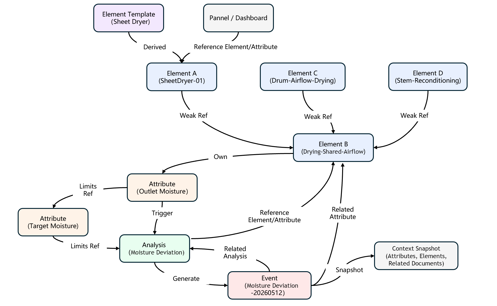

# 3.5 Relationships and Industrial Ontology

:::note
This is an advanced topic. Most users can skip this section on a first read and come back when they need to build a more sophisticated data model.
:::

The hardest part of industrial data modeling is not "collecting the data" — it is **managing the relationships between data**.

Which production line a piece of equipment comes from, what it feeds downstream, who is responsible for it, which business KPIs it influences, what events it has triggered, what analyses are attached to it, which shared airflow point it belongs to — all of these connections are usually scattered across operators' heads, SCADA / MES wiring tables, process manuals, and Excel sheets. As long as these connections stay scattered, no matter how much raw time-series data is collected, **the data remains a collection of islands** — people cannot search across it, applications cannot align it, and AI has nothing to reason on.

The core job of TDengine IDMP is to turn these connections from "tacit knowledge" into "explicit objects" and maintain them in a form that is unified, governable, queryable, and traversable by AI. IDMP organizes these objects and connections in a two-layer structure: **Tree + Network**:

- The **tree structure** carries the primary, most intuitive hierarchical relationships — this is the **asset tree** users see the moment they log in, and the modeling form that IDMP has matured most extensively and that users rely on day to day;
- The **network structure** sits on top of the tree and fills in the non-hierarchical relationships the tree cannot express — upstream / downstream, shared points, references from analyses and events, dynamic limit links and derivations between attributes, and so on.

Together they form what IDMP calls the **Industrial Ontology** — the semantic mirror of the real industrial world inside the digital space.

## 3.5.1 Objects and Relationships in Industrial Data Modeling

Before describing the "tree" and the "network", we first need to understand the **Object Types** and **Reference Types** in IDMP — they are the grammar on which all subsequent modeling work is based.

### 3.5.1.1 Object Types: Element, Attribute, Analysis, Event

IDMP abstracts every "entity" on an industrial site into four core object types. These four object types are the key nodes in the tree and the network described later.

| Object Type           | Meaning                                                                 | Real-World Correspondence                                                       |
| --------------------- | ----------------------------------------------------------------------- | ------------------------------------------------------------------------------- |
| **Element**           | The basic unit of the asset model, representing a physical or logical asset | Group, plant, workshop, line, process stage, equipment, sensor, shared point, business unit, etc. |
| **Attribute**         | A measurable dimension or descriptive characteristic of an element       | Temperature, pressure, flow rate, current, running state, KPI, etc.             |
| **Analysis**          | Real-time computation logic that runs by referencing elements and attributes | SPC monitoring, batch moisture analysis, energy comparison, root-cause analysis |
| **Event**             | An operational record generated by an analysis or rule, with start / end time and a context snapshot | Surge event, moisture deviation, batch start / stop, downtime event              |

Around these four core object types, IDMP also provides a set of **information-consumption objects**: **Panel**, **Dashboard**, **Machine Learning Model**, **Annotation**, **Related Information** (documents / images / videos / other files) — these are not industrial entities themselves but ways of presenting information from different perspectives.

In addition, for every kind of object, IDMP provides a **Template** — used to define reusable information structures in bulk, from which concrete instances are derived (see [3.1.6 Element Templates](./01-elements.md#316-element-templates) and [6.1 Event Templates](../06-events/01-event-templates.md)).

#### Independent Objects vs Dependent Objects

These objects all participate in data modeling, but they are **not equally independent** — and this is the key to understanding how the tree and the network organize them. By the criterion of "can it exist on its own, separate from other objects", IDMP objects fall into two categories:

| Category               | Meaning                                                                                                                                                                                              | Typical Objects                                                                                          |
| ---------------------- | ---------------------------------------------------------------------------------------------------------------------------------------------------------------------------------------------------- | -------------------------------------------------------------------------------------------------------- |
| **Independent Objects** | Do not depend on any other object to exist; they of course form **connections** with other objects, but those connections are merely "links", not what they rely on for their existence.            | **Elements**, **Events**, **Templates**                                                                  |
| **Dependent Objects**   | Cannot exist on their own; they must **be attached to** an independent object; when the host object is deleted, the dependent object goes with it.                                                  | **Attributes** (must be attached to an element or event), **Annotations** (must belong to a specific object) |

For example:

- An **element** is an independent object — it connects to parent elements, child elements, and upstream / downstream elements via references, and is also referenced by analyses and events; but removing a weakly-linked object does not make the element itself disappear;
- An **event** is also an independent object — it points to elements and analyses through fields like "related element" and "related analysis", but even if those linked elements or analyses are deleted, the event itself (as a historical record) can still be retained;
- An **attribute** is a typical dependent object — it must be attached to some element; an attribute without its element is meaningless; delete the element and its attributes disappear with it.

Once "independent vs dependent" is clear, the boundary between what the tree organizes and what the network organizes becomes clear: **the tree mainly organizes the hierarchical skeleton of independent objects** (most typically, the ownership hierarchy between elements), dependent objects naturally follow these independent objects, and **cross-hierarchy lateral references between objects** are expressed through the network.

### 3.5.1.2 Relationship Types: Reference and Reference Type

IDMP uses **Reference** to uniformly express the connections between objects.

> A Reference is a **directed triple**: `(Object A, Object B, Reference Type)` — meaning "there is a directed connection from A to B with some business semantics".

A Reference is not just "who connects to whom"; it also carries semantics — described by the **Reference Type**. **Strong**, **Weak**, **Composition**, **Derived**, **Triggered**, **Generated**, **Related Element**, **Dynamic Limit Reference**, and so on are all pre-defined Reference Types in IDMP.

This idea is in line with **OPC-UA**'s Reference / ReferenceType system: in OPC-UA, nodes are connected via named ReferenceTypes to express composition, attribute ownership, event triggering, and so on. IDMP extends this mechanism to industrial data as a whole.

With this "object + reference type" grammar, only one question remains: **how do we organize the abundant connections of the real world into a data structure that is both intuitive and complete?** IDMP's answer is "tree first, network second" — the tree carries the primary, most intuitive hierarchical skeleton, and the network sits on top of it to supplement the non-hierarchical relationships.

## 3.5.2 Tree-Based Modeling: The Foundation of IDMP

Industrial organizations are inherently hierarchical — **group → plant → workshop → line → equipment → measurement point** is the natural form of asset management for almost every manufacturing, energy, and utility enterprise. Around this, IDMP has built a **highly mature** tree-based modeling capability: the very first thing a user sees after logging in is the **asset tree**, and the overwhelming majority of day-to-day browsing, configuration, authorization, and data query happens around it (see [3.1.2 Asset Tree and Data Catalog](./01-elements.md#312-asset-tree-and-data-catalog)).

### 3.5.2.1 Three Reference Types Between Elements

There are only three reference types between elements in IDMP, and these three types are exactly what supports the flexible organization of multiple asset trees:

| Reference Type            | Semantics                                                                                  | Typical Scenario                                                              |
| ------------------------- | ------------------------------------------------------------------------------------------ | ----------------------------------------------------------------------------- |
| **Strong**                | Parent-child ownership; supports an element appearing under **multiple trees** at once     | The same wind turbine appears in both the "geographic tree" and the "operational responsibility tree" |
| **Composition**           | An inseparable "is-part-of" relationship; the child's lifecycle is fully governed by the parent | A wind turbine is composed of nacelle, tower, and blades; a motor belongs to a specific machine |
| **Weak**                  | An additional hierarchy or cross-cutting view; does not affect the element's lifecycle     | Pinning the same equipment additionally under "Equipment Type Library", "Watch List", "Inspection Plan", etc. |

With these three reference types, IDMP allows the same element to have **multiple parents** and **multiple children** — and **multiple asset trees** can be built simultaneously around different business perspectives (geographic, process, equipment-type, ownership, etc.), all while sharing a single underlying element instance and a single copy of the data. This independence-yet-sharing among multiple trees is one of the most distinctive features of IDMP's tree-based modeling.

For the detailed rules and UI operations of reference types, see [3.1.7 Element References](./01-elements.md#317-element-references).

### 3.5.2.2 Why the Tree Is the Best Starting Point for Industrial Modeling

Managing industrial organizations and assets as trees was not invented by IDMP — it is a best practice that industrial software has accumulated over decades (AVEVA PI System's AF asset framework and ABB / Siemens asset databases are all tree-based). The reason is that the **tree** form offers many advantages in industrial scenarios that other structures cannot easily replace:

- **Intuitive and easy to understand**: a tree is naturally isomorphic to enterprise org charts and workshop layouts — a shift supervisor, a process engineer, and an IT operator can all read it at a glance, with no training required;
- **Efficient navigation and addressing**: drill down to find any piece of equipment or any measurement point; the path itself is a business-semantic global identifier, for example `/Elements/Cigarette-Factory-1/Cut-Tobacco-Workshop/Line-A/Drying/SheetDryer-01`;
- **Simple permission setup**: subtree authorization on the tree is the most natural permission model for industrial systems — grant a node to a role and all descendants automatically inherit, with no item-by-item configuration (see [14.4 User Management](../14-administration/04-user-management.md));
- **Bulk-operation friendly**: templates, naming conventions, visual panels, analyses, and so on can all be attached to a node and automatically apply to all descendants;
- **Low maintenance and governance cost**: adding, removing, or re-organizing nodes is a local operation on the tree with a clearly contained blast radius;
- **Native fit for visualization**: from the asset tree sidebar in Web Explorer to the cascading selectors in panels and the filters in event browsing, almost every UI can reuse the same tree as its entry point;
- **AI-indexing friendly**: the path itself is a natural data-catalog index — AI can locate any asset or piece of data along the hierarchy with no additional structure.

IDMP has made tree-based modeling **work out of the box**: creating elements, applying element templates, binding attributes, setting permissions, browsing data — all happen around this asset tree; the same data can be presented through **multiple trees** from multiple business perspectives. **For the vast majority of industrial scenarios, once the tree is well built, more than half of the industrial-data-modeling job is already done.**

## 3.5.3 Trees Alone Are Not Enough: Completing Non-Hierarchical Relationships with the Network

The tree solves the most important problem — **hierarchical ownership** — but the connections between industrial objects are not only hierarchical. Some relationships are hard to express directly in a hierarchy, for example:

- **Lateral references** between elements — upstream / downstream, shared points, backup relationships, cross-line dependencies;
- **Functional references** between elements and other objects such as analyses, events, and panels;
- **References, computations, and limit dependencies** between attributes;
- **Derivation and extension** between templates and instances.

These relationships cross each other, span hierarchies, and forcing them into a single tree only deforms the tree. IDMP's approach is: **let these relationships exist as nodes and edges of a network on top of the tree**, rather than cramming them into the tree itself. In the current version of IDMP, these relationships may not be presented as visibly as the asset tree on the main UI, but they are fully modeled through references, the related-element / related-analysis fields of analyses and events, and the derivation and extension of templates.

Below are the most typical kinds of non-hierarchical relationships.

**Element ↔ Element (lateral references)**: in addition to the Strong / Weak / Composition references carried by the tree, there are also **lateral relationships** between elements — upstream / downstream, backup, cross-line dependencies, etc. — that do not fit a tree hierarchy. IDMP carries these via **object-typed attribute values**: set the value type of an element attribute to `Element` (element reference) or `Attribute` (attribute reference) so that one element's attribute points directly to another element or attribute. The benefit is that such lateral references share the same display, authorization, and AI-traversal facilities as regular attributes.

**Element ↔ Attribute**: an attribute has an **ownership** relationship — it cannot exist on its own and must belong to some object (most commonly an element, sometimes an event). An attribute may be **static** (such as rated power, installation date) or **dynamic** (bound to a metric column or tag in TDengine TSDB); its value type, in addition to numbers and enumerations / categories, can also be an **object type** (file, video, attribute reference, element reference, etc.) — the latter two being explicit cross-object references.

**Attribute ↔ Attribute**: one attribute on an element can reference other attributes in its formula; an attribute's high limit, low limit, target value, and other limits can be **dynamically linked** to another attribute, enabling limits that vary with real-time state.

**Element ↔ Analysis / Event / Panel / Dashboard**: elements and these data-consumption objects are not in a "mount" relationship — they are connected through **references**. The tree is a **shortcut entry and browsing index** for these consumption objects — from the element tree you can easily find all analyses, events, and panels related to an element, but the tree itself cannot manage or maintain these cross-object, cross-hierarchy connections:

- A real-time analysis **references** one or more elements and their attributes as its computation targets (see [7. Real-Time Analysis](../07-real-time-analysis/index.md));
- Changes in an element's or attribute's state **trigger** an analysis;
- When an analysis's trigger condition is met and event generation is configured, it **generates** an event (see [6. Events](../06-events/index.md));
- Events point to elements and analyses via the "related element" and "related analysis" fields, and record a context snapshot of relevant attributes at the time of occurrence (see [6.4 Event Detail](../06-events/04-event-detail.md));
- Panels and dashboards **reference** elements and their attributes to display trends and patterns (see [4. Visualization](../04-visualization/index.md)).

**Template ↔ Instance**: every kind of object in IDMP — elements, attributes, analyses, events, panels, dashboards, notification rules, etc. — has a corresponding template, and instances inherit the template definition through a **Derived** relationship. Templates support **inheritance** (base template → ordinary template) and **extension** (when "Allow extension" is enabled, instances can add content on top of the template). The "Derived" reference between a template and its instances is persistent — once the template definition is modified, the change automatically propagates along this reference to every instance derived from it, achieving "define once, take effect everywhere".

Taking all the above relationships together, you get a **directed network** that goes beyond a tree and carries business semantics.

## 3.5.4 Tree + Network = Industrial Ontology

Overlaying the "tree" and the "network" produces what IDMP calls the **Industrial Ontology**:

- The **tree** provides the primary hierarchical skeleton — enterprise, plant, workshop, line, equipment, measurement point, layer by layer — exactly the asset tree users see in Web Explorer every day;
- The **network** layers non-hierarchical references on top of the tree — analyses, events, panels, upstream / downstream links, shared points, dynamic limit references, template derivations, etc. — all cutting laterally across branches of the tree.

The combined **Tree + Network** structure is a digital mirror that comes from the real industrial world, faces industrial operational analysis and decision making, and can be operated jointly by AI and humans. The tree part is what users feel most strongly day to day and what IDMP has made most mature; the network part supplements the tree and lets AI answer questions like "why", "who affects whom", and "what comes next" — questions a hierarchy alone cannot answer.

### 3.5.4.1 An Example Tree: The Cut-Tobacco Workshop Asset Directory

Below is a fragment of an asset tree rooted at the "Cut-Tobacco Workshop". The same shared airflow measurement point appears under three different process stages via **weak references**, so each of the three subtrees can see this measurement point:

```text
/Elements/Cigarette-Factory-1
└── Cut-Tobacco-Workshop
    ├── Line-A
    │   ├── Vacuum-Reconditioning
    │   ├── Drying
    │   │   ├── SheetDryer-01            ← Composition / Strong reference
    │   │   │   ├── OutletMoisture        (attribute)
    │   │   │   ├── InletTemperature      (attribute)
    │   │   │   └── SteamPressure         (attribute)
    │   │   └── Drying-Shared-Airflow     ← Weak reference (appears under multiple stages)
    │   └── Flavoring
    ├── Line-B
    │   └── Drum-Airflow-Drying
    │       └── Drying-Shared-Airflow     ← Weak reference (same element, another path)
    └── Stem-Reconditioning-Line
        └── Drying-Shared-Airflow         ← Weak reference (same element, third path)
```

This tree is the view IDMP users are most familiar with — almost all entry points for browsing elements, creating analyses, viewing panels, and event investigation start from here.

### 3.5.4.2 An Example Network: Centered on SheetDryer-01

On top of the tree above, making explicit the references between elements, attributes, analyses, events, templates, and panels yields a relationship network of multiple industrial object types. It is no longer a tree but a directed graph carrying multiple kinds of business semantics:



This network has several key characteristics:

1. **Node homogeneity** — elements, attributes, analyses, and events are treated uniformly as network nodes, making "navigation and query starting from any node" possible.
2. **Explicit, specific relationships** — every edge has a Reference Type, so AI and applications can distinguish "is-part-of", "references", "triggers", "generates", "dynamic limit reference", and other semantics.
3. **Multiple perspectives coexist** — the same element can appear in multiple hierarchical trees, multiple groups, and multiple filters, but there is only one copy of the data and one copy of its semantics.
4. **Dynamic evolution** — as data is ingested, new equipment commissioned, and new processes brought online, the network expands; modifications to templates propagate along Derived references to all instances automatically.

## 3.5.5 The Business Value of the Industrial Ontology

By turning data-and-object relationships from "scattered / hidden" into "explicit / networked", the Industrial Ontology unlocks three capabilities that used to be hard to achieve — for AI, for the platform, and for the business.

### 3.5.5.1 For AI: Making Complex Tasks Automatable

The AI-powered insights built into IDMP (see [8. AI-Powered Insights](../08-ai-powered-insights/index.md)) today offer four representative AI scenarios. All of them are built on the "Tree + Network" Industrial Ontology — the tree tells the AI "what is this and where does it belong"; the network tells it "what is related to it, what affects it, and what does it affect".

- **Proactive Suggestions** (see [8.2 AI-Generated Panels](../08-ai-powered-insights/02-ai-generated-panels.md), [8.4 AI-Generated Analyses](../08-ai-powered-insights/04-ai-generated-analyses.md)): the moment a user opens any element's Panels or Analyses tab, AI has already pushed visualization-panel and analysis suggestions based on the element's template, attributes, ingested data, and the context of neighboring nodes. **Prerequisite**: AI must be able to follow Derived references on templates to recognize "what kind of equipment this is", and follow element ownership and attribute references to know "what measurable quantities it has" — exactly what Tree + Network provides.

- **Natural Language Queries** (see [8.6 AI Q&A](../08-ai-powered-insights/06-natural-language-queries.md)): users ask in natural language — "What was em-1's average current last week?", "What was the outlet-moisture pass rate of every SheetDryer in the cut-tobacco workshop yesterday?" — and AI translates the question into a query over the Industrial Ontology. **Prerequisite**: AI must resolve "em-1" via the asset-tree path to a specific element, expand "every SheetDryer in the cut-tobacco workshop" into a set of nodes, follow attribute references to the right metric columns, and then fetch data from TDengine. Without this tree, words like "it", "that one", "this line" in natural language have nothing concrete to bind to.

- **Panel Insights** (see [8.3 AI Panel Insights](../08-ai-powered-insights/03-ai-panel-insights.md)): click "Interpret Panel" on any panel and AI summarizes in natural language what the chart is saying right now — the value range, peaks and troughs, relation to normal operating limits, comparison with historical averages. **Prerequisite**: AI must know which elements and attributes the panel references, which template definition the engineering units and limits come from, and where the current value sits in its historical window — all clues pulled along the panel's "references element / attribute" edges and the attributes' ownership and limit relationships.

- **Root-Cause Analysis** (see [8.10 Root-Cause Analysis](../08-ai-powered-insights/10-root-cause-analysis.md)): after an event occurs, AI automatically searches related historical data, generates hypotheses, verifies them, and produces a structured investigation report. **Prerequisite**: AI walks along "event → related element / related analysis → triggering attribute → other attributes on the same element → upstream shared point → upstream element" step by step. **The more complete the network and the more solid the references, the further AI can walk and the more accurately it can pinpoint the root cause.** This is where the Industrial Ontology most directly delivers value in AI scenarios.

Looking at the four scenarios together, the pattern is clear: **every time AI "understands, answers correctly, finds the right thing, and pushes the work forward" on an industrial site, it is essentially traversing the Industrial Ontology**. The cleaner the asset tree and the more explicit the relationship network, the more complex the tasks AI can take on — moving from "describing the phenomenon" and "answering facts" to "judging anomalies", "locating root causes", "predicting impact", and "giving recommendations".

### 3.5.5.2 For the Platform: Guardrails for AI and Data Applications

Without security and governance, no enterprise dares let AI truly participate in production decisions. AI must operate inside a **trustworthy, controllable, auditable** space. Building a data model and explicitly managing objects and their references gives enterprise-grade data-asset governance and security a concrete handle:

- **Auditable assets**: every object and every reference has a creator, creation time, and version — who added it, when, and why is fully traceable. AI's every access and every reasoning path can also be logged and replayed, so after the fact you can explain "what AI based its conclusion on".
- **Authorizable objects**: fine-grained authorization at element, subtree, or reference granularity — which roles can see which assets, which AI Agents can traverse which network structures, which attributes can be read or written — can all be declared explicitly in IDMP. An AI Agent is no longer "indiscriminately accessing the whole database"; it is confined to a trusted sub-graph it has been authorized to use.
- **Controlled operating boundary**: even if AI can query, compute, and recommend, it can only do so within the objects and references it is authorized for; cross-domain traversal, unauthorized writes, and out-of-bounds access are rejected. This makes enterprises confident to let AI take on more complex tasks — from root-cause analysis and impact assessment, gradually moving toward operational recommendations and closed-loop control.
- **Reusable structure**: the network structure itself is one of the most valuable assets of the enterprise — when a new plant or a new line comes online, you can quickly replicate it along existing templates and reference types, reusing the authorization policy along with it, shrinking go-live time from months to weeks.

**With data-asset governance and security in place, AI in the Loop finally has a real foundation to land on.**

### 3.5.5.3 For the Business: Codifying Expert Experience

One of the most valuable assets on an industrial site is **the experience inside expert engineers' heads** — "when SheetDryer-01's outlet moisture deviates, which upstream measurement points to check, which process manual to consult, which historically similar event to compare against." Today, that judgment logic exists almost entirely as **tacit knowledge** — partly in process manuals, partly in Excel sheets, and mostly in the heads of senior engineers. The moment that expert leaves or rotates, a new engineer has to rediscover the same questions from scratch.

Once these connections are codified into the IDMP data model:

- **Tacit knowledge becomes explicit**: upstream / downstream, shared points, spare-part relations, related documents, events, and analyses are all connected to elements and attributes via references; "who affects whom" and "where to look first when something goes wrong" no longer depend on individual memory;
- **Faster onboarding**: when a shift supervisor opens an element page, they no longer see just a few curves — they see a pre-organized "operational portrait": this equipment's position, state, upstream / downstream, historical events, and related documents, all in one view. A new hire gets the view that used to require years of seniority, on day one;
- **Cross-shift / cross-site sharing**: experience an engineer at Plant A accumulates on one piece of equipment (for instance, "which attributes to check first when outlet moisture deviates") can be replicated in one shot to similar equipment at Plant B via the template — avoiding "the same pitfall hit many times";
- **Experts are freed**: instead of constantly "answering the same questions", they can focus on **improving how the system thinks** — refining templates, adding new references, training more accurate analyses — and their experience compounds, sedimenting into organizational capability.

The Industrial Ontology lets experience sediment from "people" into "the system" — a decisive step for an industrial organization to move from "depending on individuals" to "depending on a system".

---

The Industrial Ontology built through data modeling is not a standalone feature module — it is **the design philosophy that runs through the entire IDMP product**. That is exactly why IDMP becomes the industrial data foundation for the AI era and the prerequisite that lets AI truly land in industrial scenarios.
