# 4.2.1 Trend Chart

## 4.2.1.1 Overview

The Trend Chart is the core panel type in TDengine IDMP. It plots one or more time-series attributes against a time axis as lines, bars, or points so that value changes over time can be inspected directly. Whether the signal is temperature, pressure, flow, energy consumption, or vibration, the Trend Chart is designed to make time-dependent behavior visible.

Multiple metrics can be overlaid in the same chart, with each metric rendered independently so that correlation, lag, and divergence can be identified quickly. Beyond basic plotting, the Trend Chart also integrates advanced analysis capabilities: AI forecasting, missing-data imputation, time-shift comparison, window analysis, and multi-swimlane layout for parallel inspection of signals without scale interference.

## 4.2.1.2 When to Use

Use the Trend Chart when:

- You need to monitor how continuous measurements such as temperature, pressure, or flow evolve over time
- You want to compare multiple related metrics on the same asset and identify correlation or lag
- You need to detect anomalies, step changes, or gradual drift in a signal
- You want to overlay a current curve with a historical baseline using time-shift
- You need to display operating limits and see whether values remain inside a safe range
- You want to run AI forecasting, gap-filling, or window analysis on a time-series attribute

For discrete state signals such as on/off or running/stopped enumerations, use the State Timeline panel. For correlation analysis between two continuous variables where the comparison is X versus Y rather than both versus time, use the Scatter Chart panel.

## 4.2.1.3 Configuration

### View Mode Toolbar

The Trend Chart provides a set of chart-specific toolbar buttons in view mode (highlighted in the red box below) for quick analysis:

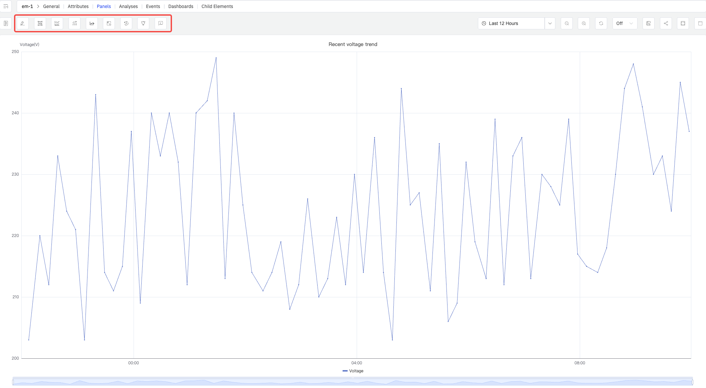

| Control | Description |
|---|---|
| **Multi-Swimlane** | Display each metric in its own horizontal lane instead of sharing a single Y axis |
| **Window Analysis** | Run a window analysis on the current time-series data. Supported types include sliding, state, event, anomaly detection, session, and count windows |
| **Forecast** | Run AI forecasting for the metrics and extend the chart with predicted values beyond the time range |
| **Imputation** | Enter imputation mode — drag across a data gap and the system fills it using AI-based trend estimation |
| **Reset Imputation** | Remove all imputation results currently applied to the chart |
| **Panel Insights** | Run AI interpretation on the current chart data and output a text summary |
| **Open as Analysis Panel** | Open the current trend chart in a new window as an analysis panel |

### Graph Settings

The Graph section determines rendering style and layout:

| Setting | Description |
|---|---|
| **Style** | Rendering mode: Lines, Bars, or Points |
| **Line Interpolation** | How data points are connected in line mode: Linear, Smooth, Step Start, Step Middle, Step End |
| **Line Style** | Stroke pattern: Solid, Dashed, or Dotted |
| **Line Opacity** | Line opacity (0–1) |
| **Line Width** | Stroke thickness (0–10) |
| **Fill Opacity** | Opacity of the area fill below the series (0–1, 0 = no fill) |
| **Connect null values** | How nulls are handled: Never, Always, or Threshold |
| **Gradient Mode** | Color gradient: None, Opacity, Hue, or Scheme |
| **Show points** | Point visibility: Auto, Always, or Never |
| **Show values** | Toggle to display value labels on the chart |
| **Point size** | Pixel size of data-point markers (1–40) |
| **Stack Series** | Stacking mode: None, Same Sign, All, Positive Only, Negative Only |
| **Multi-Swimlane** | Display each series in its own horizontal lane with an independent Y axis |

#### Stack Series

When Stack Series is enabled, multiple series accumulate vertically — useful for showing how components contribute to a total:

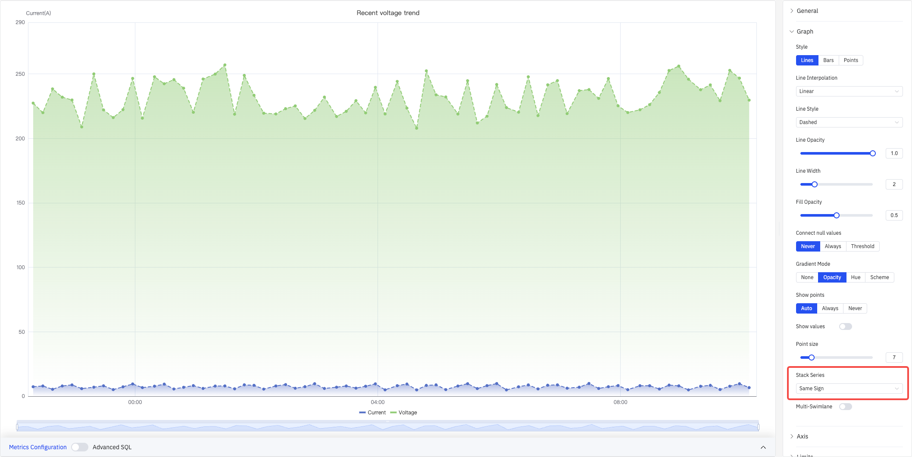

#### Multi-Swimlane

When Multi-Swimlane is enabled, each metric gets its own horizontal lane with an independent Y-axis scale, preventing small signals from being compressed when ranges differ:

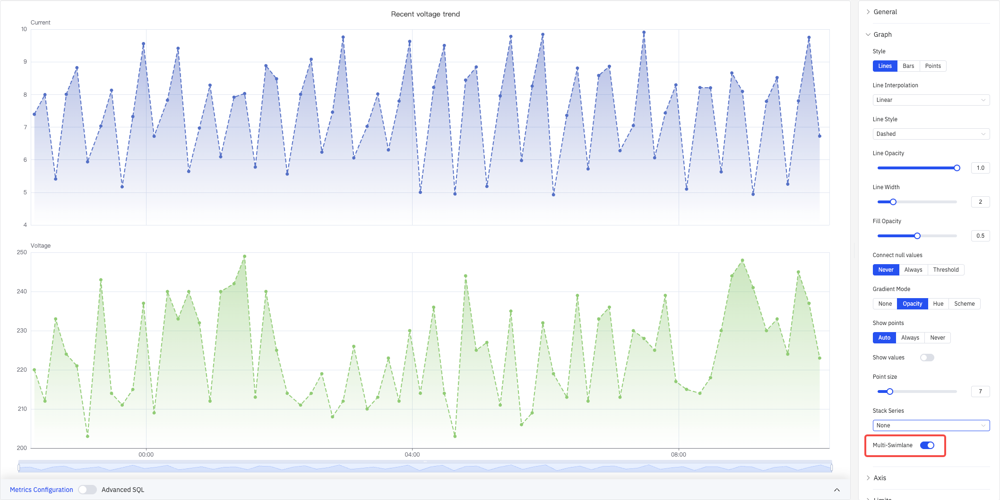

### Axis

The Axis section controls X-axis display format and Y-axis title, range, and dual-axis configuration:

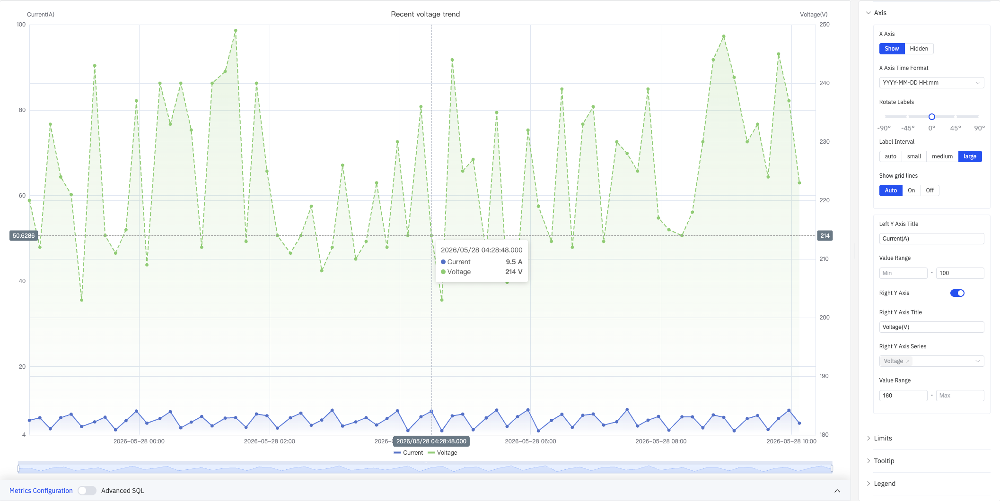

| Setting | Description |
|---|---|
| **X Axis** | Show or Hidden |
| **X Axis Time Format** | Display format for X-axis timestamps (e.g., YYYY-MM-DD HH:mm) |
| **Rotate Labels** | Rotation angle for X-axis labels (-90° to +90°, in 45° steps) |
| **Label Interval** | Label density: auto, small, medium, large |
| **Show grid lines** | Grid-line visibility: Auto, On, Off |
| **Left Y Axis Title** | Label text for the left Y axis |
| **Value Range** | Min and max for the left Y axis (leave blank to auto-scale) |
| **Right Y Axis** | Enable a secondary Y axis on the right (toggle) |
| **Right Y Axis Title** | Label text for the right Y axis (available when enabled) |
| **Right Y Axis Series** | Select which series are bound to the right Y axis (available when enabled) |
| **Value Range (Right)** | Min and max for the right Y axis (available when enabled) |

When two metrics differ by orders of magnitude (e.g., voltage 200+ V vs. current 4–10 A), enabling the right Y axis and binding the smaller signal to it lets both curves display clearly.

### Limits

Limits overlay horizontal reference lines or shaded regions on the chart so that out-of-range conditions are immediately visible:

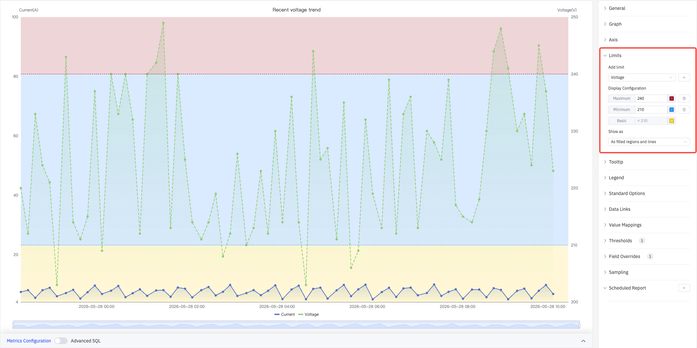

Select a metric source from the **Add limit** dropdown, then add predefined limit types: Maximum, HiHi, Hi, Target, Lo, LoLo, Minimum. Each limit supports a custom value and color.

| Setting | Description |
|---|---|
| **Add limit** | Select the metric source, then choose a limit type from the dropdown (can be added multiple times) |
| **Show as** | How limits are rendered: As lines, As filled regions, As filled regions and lines |

### Tooltip

Tooltip settings control what is shown on hover:

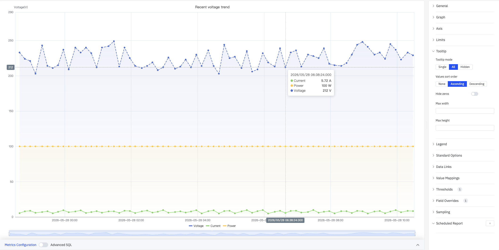

| Setting | Description |
|---|---|
| **Tooltip mode** | Hover display mode: Single, All, or Hidden |
| **Values sort order** | Sort order in the tooltip: None, Ascending, Descending |
| **Hide zeros** | Whether to hide values equal to 0 in the tooltip (toggle) |
| **Max width** | Maximum tooltip width in pixels |
| **Max height** | Maximum tooltip height in pixels |

### Legend

The legend supports list mode and table mode. In table mode, summary statistics (e.g., Count, Range, First) are displayed next to each series name for quick cross-metric comparison:

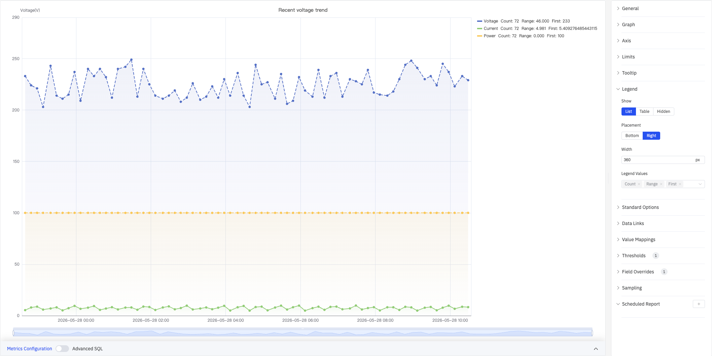

| Setting | Description |
|---|---|
| **Show** | Display mode: List, Table, or Hidden |
| **Placement** | Position: Bottom or Right |
| **Width** | Legend panel width in pixels (Right placement only) |
| **Legend Values** | Statistics shown in table mode (multi-select): Max, Min, Mean, Sum, Count, First, Last, Range, etc. |

### Standard Options

Standard Options provide global display and color settings:

| Setting | Description |
|---|---|
| **Decimals** | Number of decimal places for value display (leave blank for auto) |
| **Color Schema** | How series colors are assigned: Single Color, Shades of Color (by series), From thresholds (by value), Classic palette, Classic palette (by series name), Custom palette |
| **No Value** | Text to display when there is no data (default `-`) |

### Data Links

Data Links attach clickable URLs to data points. Once configured, a link entry appears at the bottom of the tooltip on hover:

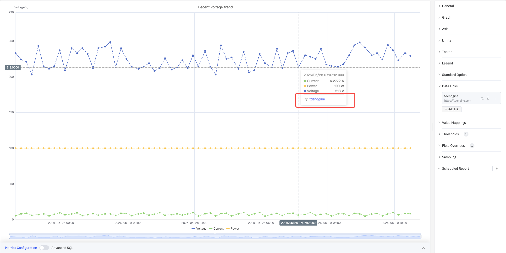

Click **+ Add link** to open the edit dialog:

| Setting | Description |
|---|---|
| **Title** | Display name for the link |
| **URL** | Target URL, supports variable interpolation |
| **Open in New Tab** | Whether to open the link in a new browser tab |
| **One-Click** | When enabled, clicking a data point immediately navigates (only one link per panel can use this) |

### Value Mappings

Value Mappings replace raw data values with custom display text and colors. Once configured, matching values are highlighted in the tooltip with the mapped color:

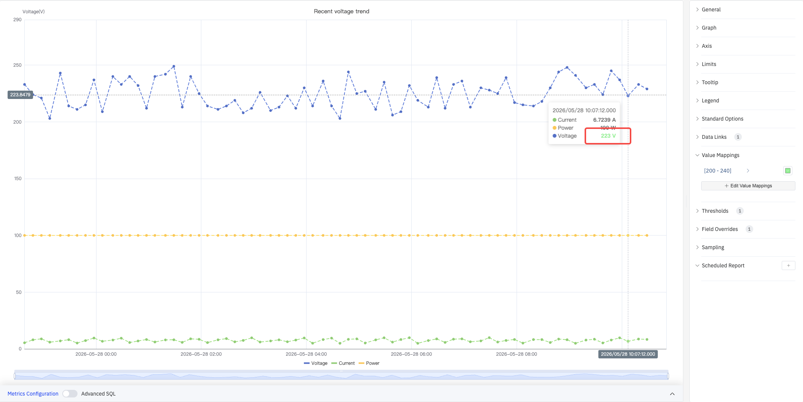

Click **+ Edit Value Mappings** to open the edit dialog, which supports the following mapping types:

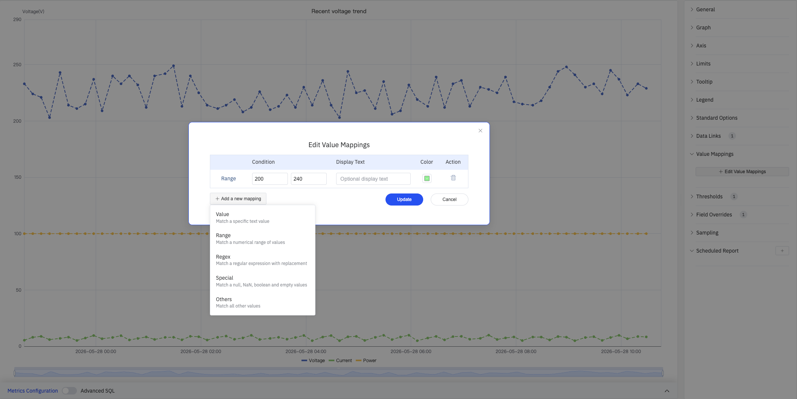

| Mapping Type | Description |
|---|---|
| **Value** | Exact match on a specific value or text |
| **Range** | Match a numeric range |
| **Regex** | Match using a regular expression with replacement |
| **Special** | Match null, NaN, booleans, empty strings, etc. |
| **Others** | Match all values not covered by preceding rules |

### Color Thresholds

Color thresholds dynamically change series color based on value, highlighting data that exceeds normal operating ranges:

| Setting | Description |
|---|---|
| **Thresholds Mode** | How threshold values are interpreted: Absolute or Percentage |
| **Add threshold** | Add a threshold rule consisting of a numeric boundary and a color |

Color thresholds take effect when the **Color Schema** in Standard Options is set to **From thresholds (by value)**.

### Overrides

Overrides let you apply style settings to individual series, overriding the global graph configuration:

Select a target metric by name (Fields with name), then add properties to override, including: Graph Style > Style, Fill Opacity, Value Mappings, and more.

### Downsampling

When query results contain too many data points, downsampling reduces the rendering load and improves display performance:

| Setting | Description |
|---|---|
| **Down Sampling** | Toggle, off by default |
| **Max Data Points** | Maximum number of data points retained after downsampling |
| **Aggregation Function** | Aggregation method used when downsampling (e.g., AVG, MAX, MIN) |

### Scheduled Report

Scheduled Reports automatically generate and push panel snapshots at a preset interval:

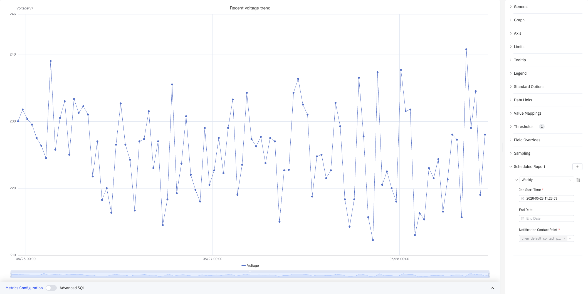

| Setting | Description |
|---|---|
| **Frequency** | Send interval: Weekly, Daily, etc. |
| **Job Start Time** | Date and time of the first execution |
| **End Date** | When the scheduled task stops (leave blank for no end) |
| **Notification Contact Point** | The contact point that receives the report |

## 4.2.1.4 Example Scenarios

**Energy monitoring with stacking.** An energy manager needs to see voltage and current together with the total load. Two metrics are added to the same trend chart, Stack Series is set to Same Sign, and Fill Opacity is set to 0.5. The combined area makes total demand variation obvious.

**Dual-signal monitoring with different ranges.** A process engineer needs to monitor voltage (200+ V) and current (4–10 A) on the same chart. With a shared Y axis the current line appears flat. Enabling the Right Y Axis and binding the current to it makes both curves readable.

**Real-time operating-limit monitoring.** An operations team monitors whether voltage exceeds the Maximum (240) or falls below the Minimum (210). After adding limits, the exceeding zones are shaded with limit colors (Show as: As filled regions and lines), making out-of-range periods instantly visible.

**Mixed-style overrides.** A maintenance engineer displays voltage as a line chart and current as a status history color band in the same panel. Using Overrides, the Current metric is set to Style = Status History, producing a hybrid view that shows continuous values alongside discrete intervals.
