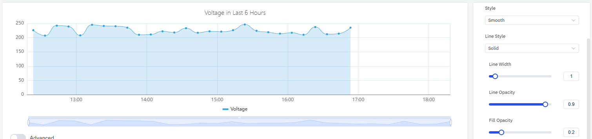
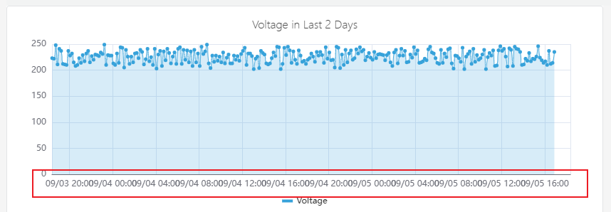
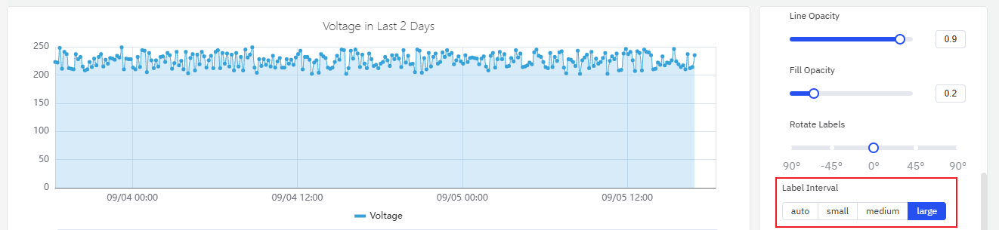
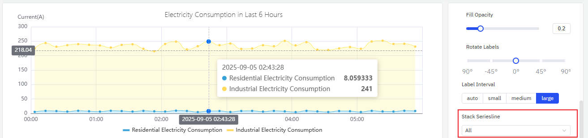
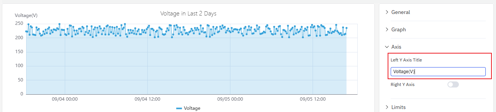
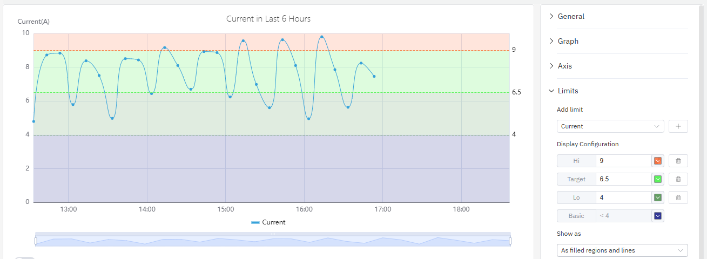

# 4.2.1 Trend Chart

## Overview

The Trend Chart renders one or more time-series metrics as lines plotted against a time axis. It connects data points to show how values change over time, built for continuous measurements — temperatures, pressures, flow rates, energy consumption, vibration levels — where the shape of the data over time carries meaning. Multiple metrics can be plotted on the same chart, each as a separate line, to reveal correlations and relative behavior at a glance.

Beyond basic plotting, the Trend Chart is the primary panel type in TDengine IDMP and the entry point for advanced analytics: forecasting future values with AI, filling data gaps with imputation, overlaying historical periods with time-shift, and comparing batch occurrences on a normalized time axis.

## When to Use

Use the Trend Chart when:

- You need to monitor how a continuous measurement changes over time
- You want to compare multiple related metrics side by side (e.g., inlet and outlet temperatures)
- You need to spot anomalies, step changes, or gradual drift in a signal
- You want to compare current behavior against a historical baseline using time-shift
- You need to overlay limit lines to see how a value relates to its operating envelope
- You are running forecasting or imputation analysis on a time-series attribute

For discrete state signals (on/off, running/stopped), use the State Timeline instead. For correlation between two continuous attributes (one vs. the other rather than both vs. time), use the Scatter Chart.

## Configuration

### View Mode Toolbar

In addition to the [common view mode controls](../01-panels.md#423-panel-view-mode), the Trend Chart adds:

| Control | Description |
|---|---|
| **Enable Multi-Swimlane** | Display each metric in its own horizontal band instead of sharing a single Y axis |
| **Disable Sampling** | Fetch raw data without downsampling. Use when you need to see every individual data point. |
| **Imputation** | Enter imputation mode. Click and drag to select a gap in the data; IDMP fills the gap using AI-based trend estimation. |
| **Reset Imputation** | Remove any imputation applied to the current chart |

### Edit Mode Toolbar

In addition to the [common edit mode controls](../01-panels.md#424-panel-edit-mode), the Trend Chart adds:

| Control | Description |
|---|---|
| **Disable Sampling** | Toggle raw data mode for the preview |
| **Show Forecast** | Overlay the AI forecast on the chart preview |
| **Imputation** | Enter imputation mode in the preview |
| **Reset Imputation** | Remove imputation from the preview |
| **Save as Image** | Download the current preview as a PNG image |
| **Full Screen** | Expand the editor preview to fill the browser window |
| **Panel Insights** | Run AI analysis on the current preview data |

### Graph Settings

#### Line Style

The **Style** setting controls how data points are connected. Three options are available: **Lines** (straight segments between points), **Smooth** (a curved spline), and **Step** (a staircase line that holds the value until the next point).

Step lines are well suited for signals that change discretely rather than continuously — for example, a setpoint, a mode code, or a price value that holds a constant level between changes.

The **Line Style**, **Line Width**, **Line Opacity**, and **Fill Opacity** settings let you adjust how each line is rendered:

**Fill Opacity** draws a shaded area under each line. This is particularly effective for cumulative quantities — energy consumption, production volume — where the filled area reinforces the sense of accumulation.

| Setting | Description |
|---|---|
| **Style** | Line rendering mode: Lines, Smooth, or Step |
| **Line Style** | Line pattern: Solid, Dashed, or Dotted |
| **Line Width** | Stroke width (slider) |
| **Line Opacity** | Transparency of lines, 0–1 |
| **Fill Opacity** | Area fill below each line, 0–1 (0 = no fill) |

#### Labels

When the time range is long or the chart is narrow, X-axis labels can overlap and become unreadable:

Two settings address this:

1. **Rotate Labels** — rotate the label text to reduce overlap:

2. **Label Interval** — reduce the number of labels shown:

| Setting | Description |
|---|---|
| **Rotate Labels** | Rotation angle for X-axis labels, –90° to +90° |
| **Label Interval** | Label density: Auto, Small, Medium, Large |

#### Data Stacking

When plotting multiple series that represent parts of a whole (for example, residential and industrial electricity consumption), **Stack Series** accumulates the values to reveal the total:

Enabling Fill Opacity alongside stacking makes the cumulative effect visually clear.

| Setting | Description |
|---|---|
| **Stack Series** | Stacking mode: None, Same Sign, All, Positive, Negative |
| **Multi-Swimlane** | Display each metric in its own horizontal band |

### Axis Settings

#### Axis Title

The left Y axis label can be configured with a title and unit:

#### Dual Y Axis

When two metrics have very different scales, plotting them on the same Y axis causes the smaller signal to appear flat and unreadable:

Enabling the **Right Y Axis** assigns the second metric to its own scale on the right side, making both signals readable:

| Setting | Description |
|---|---|
| **Left Y Axis Title** | Label for the left Y axis |
| **Value Range** | Min and Max for the left Y axis (blank = auto-scale) |
| **Right Y Axis** | Enable a secondary Y axis on the right |

### Limits Settings

Attribute-defined operating limits — LoLo, Lo, Target, Hi, HiHi — can be displayed as horizontal reference lines on the chart. This makes it immediately clear when a value is inside or outside its normal operating range:

Limits are defined on the attribute itself (in the element's attribute configuration) and are automatically available here without re-entry.

### Legend Settings

The legend can display summary statistics alongside each series name, including minimum, maximum, mean, and last value. This is useful for at-a-glance comparison across multiple metrics:

| Setting | Description |
|---|---|
| **Show** | Display mode: List, Table, or Hidden |
| **Placement** | Position: Bottom or Right |
| **Legend Values** | Statistics shown in Table mode: Last, Min, Max, Mean, Sum, etc. |

## Example Scenarios

**Energy monitoring with stacking.** An energy manager needs to track electricity consumption across residential and industrial customers. Two metrics — residential consumption and industrial consumption — are added to the same trend chart with Stack Series enabled and Fill Opacity set to 0.4. The result shows both the individual contributions and the total load on a single chart.

**Dual Y axis for mixed signals.** A process engineer is monitoring both voltage (hundreds of volts) and current (single-digit amps) on the same chart. With a shared Y axis, the current line is nearly flat. Enabling the Right Y Axis assigns voltage to the left scale and current to the right scale, making both trends visible.

**Limit line monitoring.** An operations team monitors a pump's discharge pressure against its defined Hi and HiHi limits. With Limits enabled on the trend chart, any exceedance is immediately visible as the pressure line crosses the reference lines. The chart color-codes the limit zones to match the alarm severity defined on the attribute.

**Shift comparison with time-shift.** A quality engineer compares today's batch temperature profile against yesterday's by adding the same temperature attribute twice — once without offset and once with a 24-hour time shift. The two lines overlay on the same time axis, highlighting where today's run deviates from the previous one.
