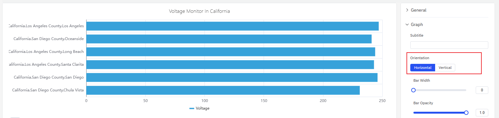
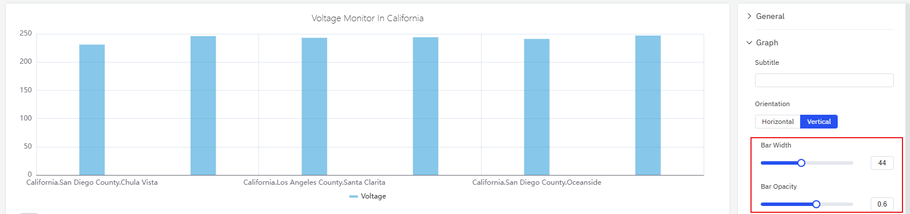
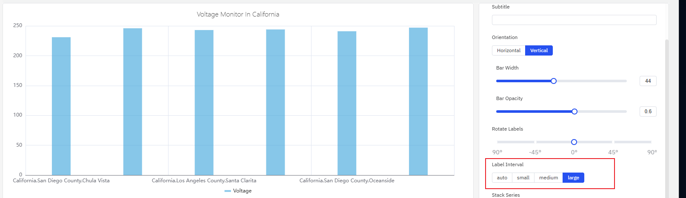
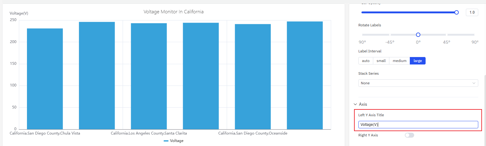
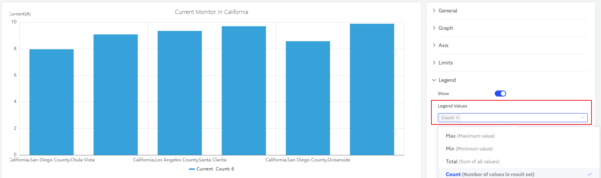

# 4.2.2 Bar Chart

## Overview

The Bar Chart represents values as vertical or horizontal bars, where bar height (or width) encodes the data value. It is designed for aggregated data — values grouped by time buckets or by categorical dimensions — making it ideal for comparison across periods or groups.

Each bar corresponds to one aggregated value: a sum, average, or count over a time window (e.g., hourly energy consumption) or over a category (e.g., output per production line). Multiple metrics can be shown as grouped or stacked bar sets.

## When to Use

Use the Bar Chart when:

- You are comparing discrete quantities across time periods (hourly, daily, monthly)
- You are comparing the same metric across multiple categories or sites
- You want to visualize the contribution of parts to a whole using stacked bars
- Your data is inherently aggregated rather than a continuous time-series

For continuous time-series data where the trend shape matters, use the Trend Chart instead. For a single summary value (e.g., total consumption today), use the Stat Value panel.

## Configuration

### Edit Mode Toolbar

In addition to the [common edit mode controls](../01-panels.md#424-panel-edit-mode), the Bar Chart adds:

| Control | Description |
|---|---|
| **Save as Image** | Download the current preview as a PNG image |
| **Full Screen** | Expand the editor preview to fill the browser window |
| **Panel Insights** | Run AI analysis on the current preview data |

### Graph Settings

#### Orientation

The Bar Chart supports **Vertical** (default) and **Horizontal** layouts. Horizontal bars work better when category labels are long or when comparing many groups side by side:

#### Bar Style

**Bar Width** and **Bar Opacity** control the appearance of individual bars:

If Bar Width is left unset, the chart automatically sizes bars based on the available width and the number of bars — this adaptive behavior works well in most cases. Only set a fixed width when displaying on a fixed-resolution screen where precise spacing is required.

| Setting | Description |
|---|---|
| **Orientation** | Vertical (bars extend up) or Horizontal (bars extend right) |
| **Bar Width** | Width of individual bars (slider; leave unset for auto) |
| **Bar Opacity** | Transparency of bars, 0–1 |
| **Stack Series** | Stack multiple metrics: None, Same Sign, All, Positive, Negative |

#### Labels

When category labels are long or numerous, they can overlap on the axis. Two settings address this:

1. **Rotate Labels** — tilt the label text to prevent overlap:

2. **Label Interval** — reduce the number of labels shown:

| Setting | Description |
|---|---|
| **Rotate Labels** | Rotation angle for axis labels |
| **Label Interval** | Label density: Auto, Small, Medium, Large |

### Axis Settings

#### Axis Title

The Y axis can be labeled with a name and unit:

#### Dual Y Axis

When two metrics with very different scales are plotted together, the smaller signal is compressed and unreadable on a shared axis. Enabling the **Right Y Axis** assigns each metric to its own scale:

| Setting | Description |
|---|---|
| **Left Y Axis Title** | Label for the left Y axis |
| **Value Range** | Min and Max for the Y axis (blank = auto-scale) |
| **Right Y Axis** | Enable a secondary Y axis on the right |

### Limits Settings

Limit lines from the attribute configuration — LoLo, Lo, Target, Hi, HiHi — can be displayed as horizontal reference lines across the bars, marking safe and alert zones:

### Legend Settings

In Table mode, the legend can display summary statistics alongside each series:

| Setting | Description |
|---|---|
| **Show** | Display mode: List, Table, or Hidden |
| **Placement** | Position: Bottom or Right |
| **Legend Values** | Statistics shown in Table mode: Last, Min, Max, Mean, Sum, etc. |

## Example Scenarios

**Daily energy consumption comparison.** An energy analyst needs to compare electricity consumption across each day of the past month. A bar chart with a 1-day sliding window shows one bar per day. The Hi limit line highlights days that exceeded the target consumption level.

**Site-by-site throughput.** A operations manager adds a Dimension grouping by site name. Each bar represents one site's total production output for the selected period. Switching to horizontal layout improves readability when site names are long.

**Residential vs. industrial load stacking.** Two metrics — residential consumption and industrial consumption — are added to the same bar chart with Stack Series enabled. Each bar shows the total load with the two components visually separated by color, making it easy to see which component dominates at each time bucket.
