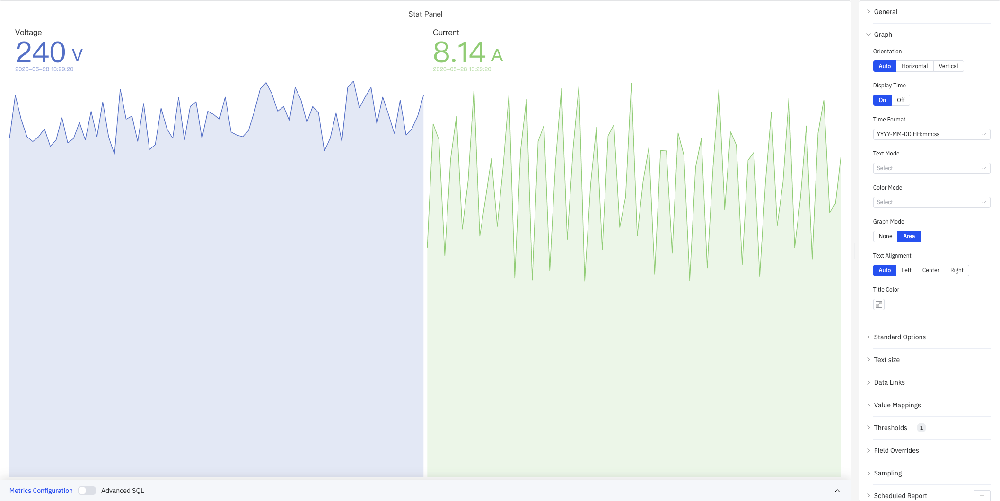
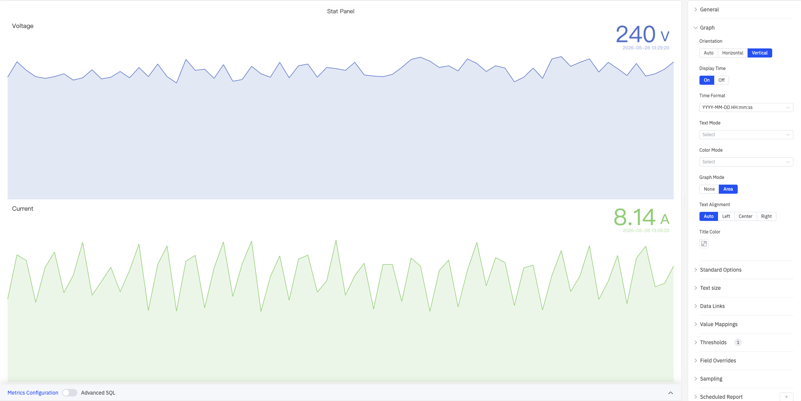
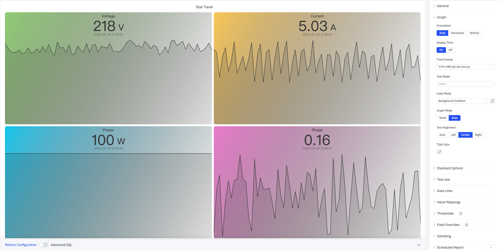
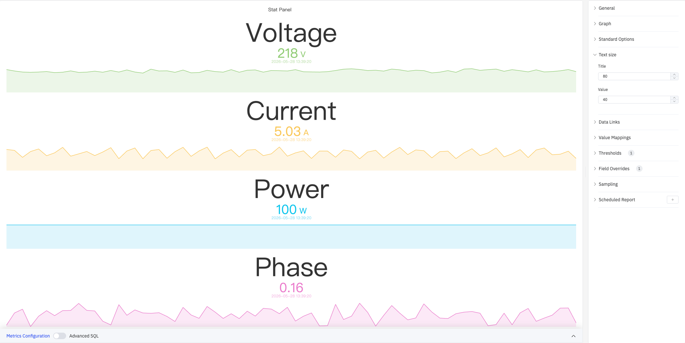
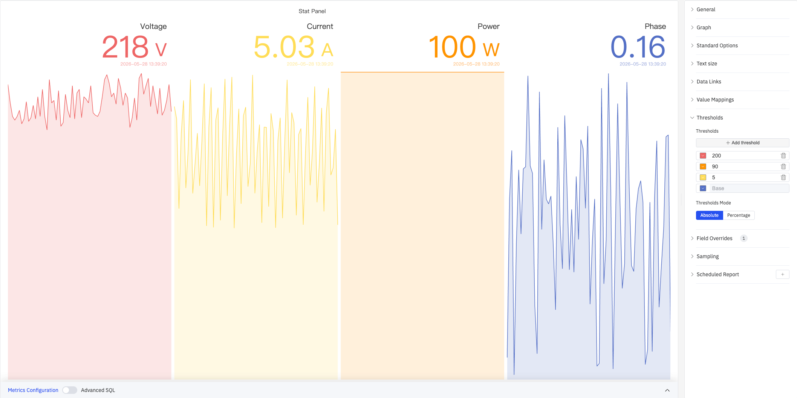

# 4.2.2 Stat Value

## 4.2.2.1 Overview

The Stat Value panel displays a single large numeric value with an optional metric name, timestamp, and sparkline. It is designed for dashboards and status boards where key figures need to be visible at a distance or in a summary view.

The value shown is the latest data point in the selected time range. Each metric occupies an independent cell containing the name label, numeric value, and timestamp. The cell background can optionally display an area sparkline showing how the value has changed within the time window.

## 4.2.2.2 When to Use

Use the Stat Value panel when:

- You need headline numbers on a dashboard — current voltage, current, power, and other real-time metrics
- You want a large, readable display for an operator screen viewed from a distance
- You are building a KPI summary panel combining several key figures side by side
- You need background colors that instantly reflect which operating range the value falls in

For values that need context against a scale or range, use the Gauge Chart or Bar Gauge. For detailed trend history, use the Trend Chart.

## 4.2.2.3 Configuration

### Graph Settings

The Graph section controls the visual layout and appearance of stat cells:

| Setting | Description |
|---|---|
| **Orientation** | How the label and value are arranged within each cell: Auto, Horizontal (side by side), Vertical (stacked top to bottom). Default is Auto |
| **Display Time** | Whether to show the data point's timestamp below the value: On or Off. Default is On |
| **Time Format** | Format for the timestamp display, e.g. `YYYY-MM-DD HH:mm:ss`. Available when Display Time is On |
| **Text Mode** | What each cell displays: Value (number only), Name (name only), or Value and Name (both) |
| **Color Mode** | Where the threshold color is applied: Value (colors the value text), Text (colors all text), Background Gradient (gradient fill), or Background Solid (solid fill). When a background mode is selected, a color picker appears for the background color |
| **Graph Mode** | Whether to render a sparkline in the cell background: None or Area. Default is Area |
| **Text Alignment** | Horizontal alignment of text within each cell: Auto, Left, Center, or Right. Default is Auto |
| **Title Color** | Color of the metric name label. Available when Text Mode includes the name |

#### Vertical Orientation

Setting Orientation to Vertical stacks each metric top-to-bottom, with the name above and the value below — suitable for portrait-mode screens or vertically arranged KPI lists:

#### Background Color Mode

Setting Color Mode to Background Gradient or Background Solid colors each cell's background based on threshold rules, creating an at-a-glance status display:

### Standard Options

| Setting | Description |
|---|---|
| **Decimals** | Number of decimal places for value display. Leave blank for automatic precision |
| **Color Schema** | How series colors are assigned: Single Color, Shades of Color (by series), From thresholds (by value), Classic palette, Classic palette (by series name), or Custom palette |
| **No Value** | Text to display when there is no data. Default is `-` |

### Text Size

Custom font sizes let you independently control the visual weight of the name label and the numeric value:

| Setting | Description |
|---|---|
| **Title** | Font size for the metric name label. Leave blank for automatic sizing |
| **Value** | Font size for the numeric value. Leave blank for automatic sizing |

### Data Links

Data Links attach clickable URLs to stat cells:

| Setting | Description |
|---|---|
| **Title** | Display name for the link |
| **URL** | Target URL, supports variable interpolation |
| **Open in New Tab** | Whether to open the link in a new browser tab |
| **One-Click** | When enabled, clicking a cell immediately navigates. Only one link per panel can have this enabled |

### Value Mappings

Value Mappings replace raw data values with custom display text and colors:

| Mapping Type | Description |
|---|---|
| **Value** | Exact match on a specific value or text string |
| **Range** | Match a numeric range |
| **Regex** | Match using a regular expression with replacement |
| **Special** | Match null, NaN, booleans, empty strings, and other special cases |
| **Others** | Match all values not covered by the preceding rules |

### Thresholds

Thresholds define numeric boundaries and their associated colors. Combined with **Color Mode**, the color is applied to the value text or the cell background:

| Setting | Description |
|---|---|
| **Thresholds Mode** | How threshold values are interpreted: Absolute (raw data values) or Percentage (percentage of the Min–Max range) |
| **+ Add threshold** | Add a threshold rule consisting of a numeric boundary and a color |

As shown above, with thresholds configured at 200 (red), 90 (orange), 5 (yellow), and Base (blue), each metric's value and sparkline color automatically maps to the corresponding threshold color. Thresholds take effect when the **Color Schema** in Standard Options is set to **From thresholds (by value)**.

### Field Overrides

Field Overrides let you apply settings to individual metrics, overriding the global configuration. Select a target metric by name (Fields with name), then add properties to override, including: Graph Style, Fill Opacity, Value Mappings, and more.

### Sampling

When query results contain too many data points, downsampling reduces the processing load:

| Setting | Description |
|---|---|
| **Down Sampling** | Toggle. Off by default |
| **Max Data Points** | Maximum number of data points retained after downsampling |
| **Aggregation Function** | Aggregation method used when downsampling (e.g., AVG, MAX, MIN) |

### Scheduled Report

Scheduled Reports automatically generate and push panel snapshots at a preset interval:

| Setting | Description |
|---|---|
| **Frequency** | Send interval: Weekly, Daily, etc. |
| **Job Start Time** | Date and time of the first execution |
| **End Date** | When the scheduled task stops (leave blank for no end) |
| **Notification Contact Point** | The contact point that receives the report |

## 4.2.2.4 Example Scenarios

**Dashboard headline metrics.** A plant manager's dashboard displays four stat panels in a row: Voltage, Current, Power, and Phase. Color Mode is set to Background Gradient, Text Alignment is Center, and each cell receives a different gradient color. The display is legible from across the control room.

**Threshold alert board.** An operations team configures multiple threshold zones (e.g., 200 red, 90 orange, 5 yellow). When voltage exceeds 200 V the cell turns red; when current is in the normal range it shows yellow. Value color changes provide an immediate visual alert without additional alarm rules.

**Portrait-mode vertical layout.** On a vertical large screen, Orientation is set to Vertical and Text Size is set to Title 80, Value 40, stacking each metric vertically. The name label is prominently displayed, values use threshold coloring, and the result is a compact, readable vertical KPI list.
