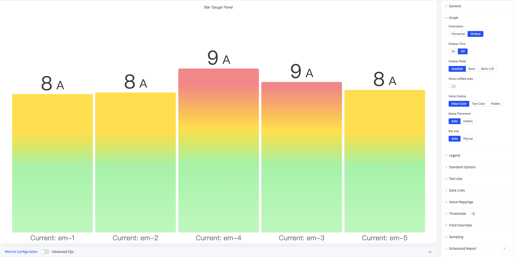
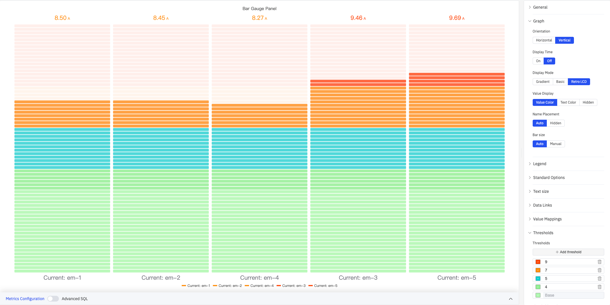

# 4.2.3 Bar Gauge

## 4.2.3.1 Overview

The Bar Gauge displays a value as a filled bar against a configurable scale, similar to a thermometer or progress bar. Color thresholds along the bar visually segment the scale into zones, making it easy to see at a glance where the value sits within the range.

Multiple metrics render as side-by-side bars in the panel, making the Bar Gauge effective for comparing several similar measurements simultaneously. Three display modes (Gradient, Basic, Retro LCD) and two orientation options (Horizontal, Vertical) let you adapt the panel to different dashboard styles.

## 4.2.3.2 When to Use

Use the Bar Gauge when:

- You want a linear fill metaphor rather than a circular dial
- You are showing capacity utilization, fill levels, or completion percentages
- You need to compare multiple similar measurements (e.g., current readings across several devices) in a compact layout
- A progress-bar visual is more intuitive for your audience than a needle gauge

For a single large numeric value without a scale reference, use the Stat Value panel. For a dial-style gauge, use the Gauge Chart.

## 4.2.3.3 Configuration

### Graph Settings

The Graph section controls bar orientation, display style, and labeling:

| Setting | Description |
|---|---|
| **Orientation** | Bar direction: Horizontal (fills left to right) or Vertical (fills bottom to top). Default is Vertical |
| **Display Time** | Whether to show the timestamp of the current data point: On or Off. Default is Off |
| **Time Format** | Format for the timestamp display. Available when Display Time is On |
| **Display Mode** | Visual style: Gradient (smooth color transition), Basic (solid fill), or Retro LCD (segmented display). Default is Gradient |
| **Show unfilled area** | Toggle to show the background of the unfilled portion of the bar. Not available in Retro LCD mode |
| **Value Display** | How the numeric value is shown: Value Color (matches threshold color), Text Color (plain text), or Hidden |
| **Name Placement** | Position of the metric name label: Auto, Top (horizontal layout), Left (horizontal layout), or Hidden |
| **Bar size** | Size mode for each bar: Auto or Manual |
| **Min Width** | Minimum bar width in pixels (Manual mode, Vertical orientation only) |
| **Min Height** | Minimum bar height in pixels (Manual mode, Horizontal orientation only) |
| **Max Height** | Maximum bar height in pixels (Manual mode, Horizontal orientation only) |

#### Display Mode Comparison

**Basic** mode uses solid color fill determined by the current threshold band — clean and minimal:

**Gradient** mode provides a smooth color transition from low to high, conveying both magnitude and threshold position:

**Retro LCD** mode splits the bar into discrete segments mimicking a liquid-crystal display, suited for industrial instrument dashboards:

#### Horizontal Layout

Setting Orientation to Horizontal fills bars from left to right. Combined with Retro LCD mode and Name Placement = Top, this creates a stacked-list style:

### Legend

| Setting | Description |
|---|---|
| **Show** | Display mode: List, Table, or Hidden |
| **Placement** | Position: Bottom or Right |
| **Width** | Legend panel width in pixels. Available when placement is Right |
| **Legend Values** | Statistics shown in table mode (multi-select): Max, Min, Mean, Sum, Count, First, Last, etc. |

### Standard Options

| Setting | Description |
|---|---|
| **Decimals** | Number of decimal places for value display. Leave blank for automatic precision |
| **Color Schema** | How series colors are assigned: Single Color, Shades of Color (by series), From thresholds (by value), Classic palette, Classic palette (by series name), or Custom palette |
| **No Value** | Text to display when there is no data. Default is `-` |

### Text Size

Custom font sizes let you independently control the visual weight of the name label and the numeric value:

| Setting | Description |
|---|---|
| **Title** | Font size for the metric name label. Leave blank for automatic sizing |
| **Value** | Font size for the numeric value. Leave blank for automatic sizing |

### Data Links

Data Links attach clickable URLs to bars:

| Setting | Description |
|---|---|
| **Title** | Display name for the link |
| **URL** | Target URL, supports variable interpolation |
| **Open in New Tab** | Whether to open the link in a new browser tab |
| **One-Click** | When enabled, clicking a bar immediately navigates. Only one link per panel can have this enabled |

### Value Mappings

Value Mappings replace raw data values with custom display text and colors:

| Mapping Type | Description |
|---|---|
| **Value** | Exact match on a specific value or text string |
| **Range** | Match a numeric range |
| **Regex** | Match using a regular expression with replacement |
| **Special** | Match null, NaN, booleans, empty strings, and other special cases |
| **Others** | Match all values not covered by the preceding rules |

### Thresholds

Thresholds define color bands along the bar — each threshold specifies a numeric boundary and a color; the bar changes color as the value crosses each boundary:

As shown above, with thresholds configured at 9 (red), 7 (orange), 5 (cyan), 4 (light green), and Base (green), the bar color for each metric automatically maps to the corresponding threshold zone.

| Setting | Description |
|---|---|
| **Thresholds Mode** | How threshold values are interpreted: Absolute (raw data values) or Percentage (percentage of the Min–Max range) |
| **+ Add threshold** | Add a threshold rule consisting of a numeric boundary and a color |

Thresholds take effect when the **Color Schema** in Standard Options is set to **From thresholds (by value)**.

### Field Overrides

Field Overrides let you apply settings to individual metrics, overriding the global configuration. Select a target metric by name (Fields with name), then add properties to override, including: Graph Style, Fill Opacity, Value Mappings, and more.

### Sampling

When query results contain too many data points, downsampling reduces the processing load:

| Setting | Description |
|---|---|
| **Down Sampling** | Toggle. Off by default |
| **Max Data Points** | Maximum number of data points retained after downsampling |
| **Aggregation Function** | Aggregation method used when downsampling (e.g., AVG, MAX, MIN) |

### Scheduled Report

Scheduled Reports automatically generate and push panel snapshots at a preset interval:

| Setting | Description |
|---|---|
| **Frequency** | Send interval: Weekly, Daily, etc. |
| **Job Start Time** | Date and time of the first execution |
| **End Date** | When the scheduled task stops (leave blank for no end) |
| **Notification Contact Point** | The contact point that receives the report |

## 4.2.3.4 Example Scenarios

**Multi-device current comparison.** Five devices' current readings are added to a single Bar Gauge panel using Vertical orientation with Gradient display mode. Thresholds are set at 9 A (red), 7 A (orange), and 5 A (cyan). Any device exceeding 9 A immediately shows a red bar, letting operators quickly identify overloaded equipment.

**Horizontal LCD dashboard.** Orientation is set to Horizontal, Display Mode to Retro LCD, and Name Placement to Top. Multiple metrics appear as a stacked list of segmented bars with threshold colors transitioning from green to red — mimicking a traditional industrial instrument panel.

**Large-screen readability.** On a control-room display, the Text Size Value is set to 80 so numbers are legible from a distance. Combined with Gradient mode and threshold color transitions, operators can judge the status of each metric without approaching the screen.
