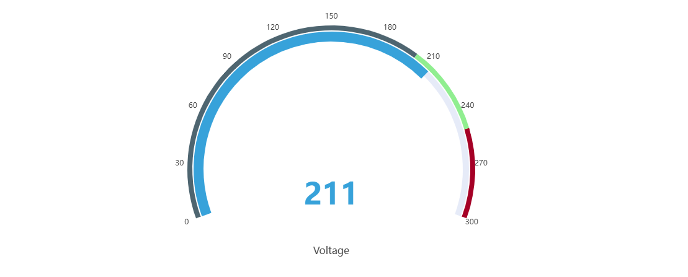

# 4.2.4 Gauge Chart

## Overview

The Gauge Chart displays a single current value on a semicircular dial, similar to an analog instrument panel gauge. The needle and colored arc segments show at a glance where the value stands within its operating range.

The gauge always shows the latest data point in the selected time range. Multiple gauges can be displayed in a single panel — one per metric — arranged horizontally or vertically.

## When to Use

Use the Gauge Chart when:

- You want to show a single real-time measurement in a format operators immediately understand
- You need to communicate whether a value is in a safe, warning, or alarm zone at a glance
- You are building operator displays or status boards where spatial metaphors (needle position) convey urgency

For multiple values compared across time, use the Trend Chart. For a plain numeric readout without the dial metaphor, use the Stat Value panel.

## Configuration

### Edit Mode Toolbar

In addition to the [common edit mode controls](../01-panels.md#414-panel-edit-mode), the Gauge Chart adds:

| Control | Description |
|---|---|
| **Save as Image** | Download the current preview as a PNG image |
| **Full Screen** | Expand the editor preview to fill the browser window |
| **Panel Insights** | Run AI analysis on the current preview data |

### Graph Settings

The gauge supports configuring the dial labels, title display, and font sizes:

| Setting | Description |
|---|---|
| **Title** | Chart title displayed above the panel |
| **Orientation** | Layout direction when multiple gauges are shown: Horizontal or Vertical |
| **Show threshold labels** | Toggle: display threshold values around the dial arc |
| **Show Title** | Toggle: display the metric name below the dial |
| **Title Text size** | Font size for the metric name label (default 16) |
| **Value Text size** | Font size for the numeric value at the center of the dial (default 48) |

### Limits Settings

Attribute-defined limits — LoLo, Lo, Target, Hi, HiHi — are rendered as colored arc segments on the dial. This visually divides the gauge face into safety zones, making it immediately clear when the needle is in a warning or alarm region:

Limits are inherited from the attribute configuration on the element and do not need to be re-entered here.

## Example Scenarios

**Pump discharge pressure.** A pump's discharge pressure attribute has Lo and Hi limits defined. The gauge chart shows the current pressure with the arc divided into green (normal), yellow (warning), and red (alarm) zones. The operator sees at a glance whether the pump is running within spec.

**Motor speed monitoring.** Three motors on a production line each contribute one gauge to the same panel with Horizontal orientation. The operator sees all three speeds side by side and immediately spots the one running outside the normal zone.

**Temperature watchpoint.** A furnace temperature is displayed on a gauge with the HiHi limit set to the maximum safe operating temperature. When the needle approaches the red zone, the operator knows to act before the alarm fires.
