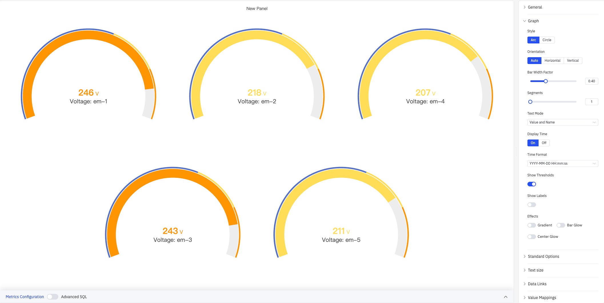
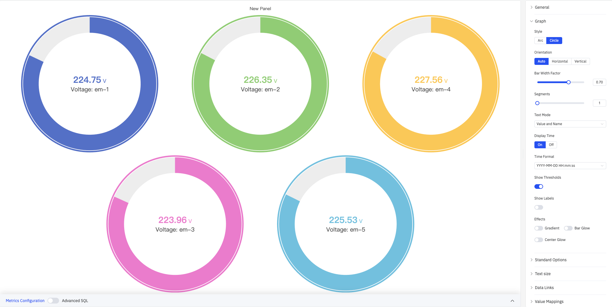
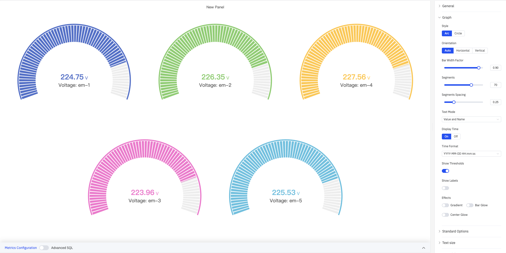
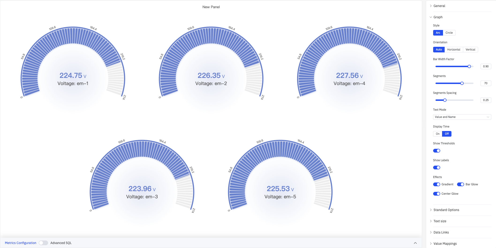

# 4.2.4 Gauge Chart

## 4.2.4.1 Overview

The Gauge Chart displays a single current value on an arc or circular dial, similar to an analog instrument panel. Colored arc segments show at a glance where the value stands within its operating range.

The gauge always shows the latest data point in the selected time range. Multiple gauges can be displayed in a single panel — one per metric — arranged automatically, horizontally, or vertically. It supports segmented display, scale labels, threshold color bands, and glow effects for rich visual customization.

## 4.2.4.2 When to Use

Use the Gauge Chart when:

- You want to show a single real-time measurement in a format operators immediately understand
- You need to communicate whether a value is in a safe, warning, or alarm zone at a glance
- You are building operator displays or status boards where spatial metaphors convey urgency
- You need to compare the same metric across multiple devices side by side (e.g., voltage across five meters)

For multiple values compared across time, use the Trend Chart. For a plain numeric readout without the dial metaphor, use the Stat Value panel. For a linear progress-bar visual, use the Bar Gauge.

## 4.2.4.3 Configuration

### Graph Settings

The Graph section controls gauge shape, segmentation, and visual effects:

| Setting | Description |
|---|---|
| **Style** | Dial shape: Arc (semicircular) or Circle (full ring) |
| **Orientation** | Layout when multiple gauges are shown: Auto, Horizontal, or Vertical |
| **Bar Width Factor** | Relative thickness of the arc or ring, range 0.1–1. Default is 0.70 |
| **Segments** | Number of discrete segments the arc is divided into, range 1–100. Default is 1 (continuous arc) |
| **Segments Spacing** | Gap between adjacent segments, range 0–1. Available when Segments is greater than 1 |
| **Text Mode** | Text shown on the gauge: Value and Name, Value, or Name |
| **Display Time** | Whether to show the timestamp below the gauge: On or Off |
| **Time Format** | Format for the timestamp display, e.g. `YYYY-MM-DD HH:mm:ss`. Available when Display Time is On |
| **Show Thresholds** | Toggle to display threshold value labels around the arc (switch) |
| **Show Labels** | Toggle to display scale tick labels on the dial (switch) |
| **Effects** | Visual effects (multi-select): Gradient, Bar Glow, Center Glow |

When Orientation is Horizontal or Vertical, a Gauge Size mode (Auto/Manual) becomes available, with min-height or min-width settings in Manual mode.

#### Circle Style

Setting Style to Circle renders gauges as full circular rings — useful for more compact layouts or a full-sweep visual:

#### Segmented Display

Setting Segments to a high value (e.g., 70) with Segments Spacing (e.g., 0.25) divides the arc into many discrete blocks, creating a classic instrument dial appearance:

#### Effects

Enabling all effects (Gradient + Bar Glow + Center Glow) gives the gauge a glowing gradient appearance. Combined with Show Labels, scale values are displayed around the arc:

### Standard Options

| Setting | Description |
|---|---|
| **Min** | Minimum value on the dial scale (leave blank for auto-calculation) |
| **Max** | Maximum value on the dial scale (e.g., 250) |
| **Decimals** | Number of decimal places for value display (leave blank for auto) |
| **Color Schema** | How series colors are assigned: Single Color, Shades of Color (by series), From thresholds (by value), Classic palette, Classic palette (by series name), or Custom palette |
| **No Value** | Text to display when there is no data. Default is `-` |

### Text Size

| Setting | Description |
|---|---|
| **Title** | Font size for the metric name label. Leave blank for automatic sizing |
| **Value** | Font size for the numeric value on the dial. Leave blank for automatic sizing |

### Data Links

Data Links attach clickable URLs to gauges:

| Setting | Description |
|---|---|
| **Title** | Display name for the link |
| **URL** | Target URL, supports variable interpolation |
| **Open in New Tab** | Whether to open the link in a new browser tab |
| **One-Click** | When enabled, clicking the gauge immediately navigates. Only one link per panel can have this enabled |

### Value Mappings

Value Mappings replace raw data values with custom display text and colors:

| Mapping Type | Description |
|---|---|
| **Value** | Exact match on a specific value or text string |
| **Range** | Match a numeric range |
| **Regex** | Match using a regular expression with replacement |
| **Special** | Match null, NaN, booleans, empty strings, and other special cases |
| **Others** | Match all values not covered by the preceding rules |

### Thresholds

Thresholds define color zones on the dial arc, making it visually clear which operating region the current value falls in.

As shown above, using Percentage mode with thresholds at 90% (dark red), 70% (orange), 60% (yellow), 50% (cyan), and Base (green), the arc displays a green → cyan → yellow → orange → red color band from low to high. The current value's position is immediately obvious.

| Setting | Description |
|---|---|
| **Thresholds Mode** | How threshold values are interpreted: Absolute or Percentage |
| **+ Add threshold** | Add a threshold rule consisting of a numeric boundary and a color |

Thresholds take effect when the **Color Schema** in Standard Options is set to **From thresholds (by value)**. Threshold colors are applied directly to the dial arc segments.

### Field Overrides

Field Overrides let you apply settings to individual metrics, overriding the global configuration. Select a target metric by name (Fields with name), then add properties to override, including: Graph Style, Fill Opacity, Value Mappings, and more.

### Sampling

When query results contain too many data points, downsampling reduces the processing load:

| Setting | Description |
|---|---|
| **Down Sampling** | Toggle. Off by default |
| **Max Data Points** | Maximum number of data points retained after downsampling |
| **Aggregation Function** | Aggregation method used when downsampling (e.g., AVG, MAX, MIN) |

### Scheduled Report

Scheduled Reports automatically generate and push panel snapshots at a preset interval:

| Setting | Description |
|---|---|
| **Frequency** | Send interval: Weekly, Daily, etc. |
| **Job Start Time** | Date and time of the first execution |
| **End Date** | When the scheduled task stops (leave blank for no end) |
| **Notification Contact Point** | The contact point that receives the report |

## 4.2.4.4 Example Scenarios

**Multi-device voltage monitoring.** Five devices' voltage readings are displayed in the same gauge panel using Arc style with Auto orientation. Each gauge is assigned a different color from the Classic palette so operators can compare voltage readings side by side.

**Percentage threshold color bands.** With Max set to 250 and Thresholds Mode set to Percentage, thresholds are configured at 90%/70%/60%/50%/Base with colors ranging from green to red. Combined with Show Thresholds and Show Labels, operators can not only see the current value but also judge how far it is from the alarm zone.

**Industrial instrument style.** Segments is set to 70, Segments Spacing to 0.25, Bar Width Factor to 0.90, and all Effects are enabled (Gradient + Bar Glow + Center Glow). The gauge presents a finely segmented, glowing industrial instrument look — ideal for control-room large-screen displays.
