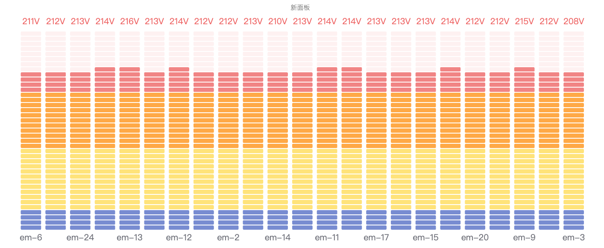
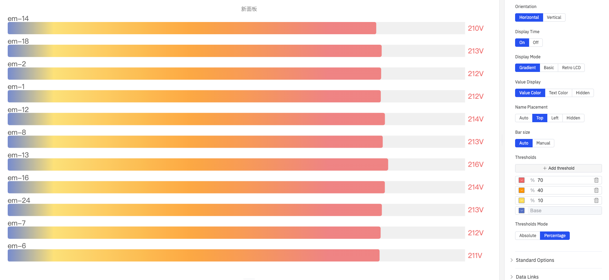

# 4.2.5 Bar Gauge

## Overview

The Bar Gauge displays a value as a filled bar against a configurable scale, similar to a thermometer or progress bar. Color thresholds along the bar visually segment the scale into zones, making it easy to see how far into a range a value has progressed.

Multiple metrics render as multiple bars stacked in the panel, making the Bar Gauge effective for comparing several similar measurements side by side.

## When to Use

Use the Bar Gauge when:

- You want a linear fill metaphor rather than a circular dial
- You are showing capacity utilization, fill levels, or completion percentages
- You need to compare multiple similar measurements (e.g., fill levels across several tanks) in a compact layout
- A progress-bar visual is more intuitive for your audience than a needle gauge

For a single large numeric value without a scale reference, use the Stat Value panel. For a dial-style gauge, use the Gauge Chart.

## Configuration

### Edit Mode Toolbar

In addition to the [common edit mode controls](../01-panels.md#414-panel-edit-mode), the Bar Gauge adds:

| Control | Description |
|---|---|
| **Save as Image** | Download the current preview as a PNG image |
| **Full Screen** | Expand the editor preview to fill the browser window |
| **Panel Insights** | Run AI analysis on the current preview data |

### Graph Settings

| Setting | Description |
|---|---|
| **Title** | Chart title |
| **Subtitle** | Secondary title |
| **Orientation** | **Horizontal** (bar fills left to right) or **Vertical** (bar fills bottom to top) |
| **Show Time** | **On** (display a timestamp on the bar) or **Off** |
| **Display Mode** | Visual style: **Gradient** (smooth color transition), **Basic** (solid fill), **Retro LCD** (segmented display) |
| **Value Display** | Numeric value color style: **Data Color** (overlaid on bar, colored to match threshold), **Text Color** (overlaid, plain text), **Hidden** |
| **Name Placement** | Metric name position: **Auto**, **Top**, **Left**, or **Hidden** |
| **Bar Size** | **Auto** (bar fills available space) or **Manual** (fixed pixel size) |
| **Min** | Minimum value of the scale (default 0) |
| **Max** | Maximum value of the scale (default 1) |
| **Decimals** | Number of decimal places shown |

#### Display Mode

**Basic** fills each bar with a single solid color determined by the current threshold band, resulting in a clean and minimal look.

**Gradient** renders a smooth color transition from the low end to the high end of the bar, simultaneously conveying both the value magnitude and its position relative to thresholds.

**Retro LCD** splits the bar into discrete segments that mimic the appearance of a liquid-crystal display, suited for dashboards with an industrial instrument aesthetic.

#### Thresholds

Thresholds define color bands along the bar. Each threshold specifies a value and a color; the bar changes color as the value crosses each boundary:

| Setting | Description |
|---|---|
| **Thresholds** | Click **+ Add threshold** to define a boundary value and its color |
| **Thresholds Mode** | **Absolute** (threshold values are raw data values) or **Percentage** (threshold values are percentages of the Min–Max range) |

## Example Scenarios

**Tank fill levels.** Five storage tanks each have a fill-level metric. All five are added to a single Bar Gauge panel with Horizontal orientation. Thresholds at 20% (red), 50% (yellow), and 80% (green) give operators an instant view of which tanks need attention.

**Capacity utilization comparison.** Three production lines contribute their hourly throughput as metrics. The Bar Gauge shows each line's utilization against a 100% maximum, with Gradient display mode providing a smooth color shift from green to red as utilization increases.

**Battery state of charge.** A battery storage system's state of charge is displayed with a Vertical bar gauge, Min 0% and Max 100%, with Percentage thresholds at 20% (red) and 50% (yellow). The visual immediately communicates how much reserve is available.
