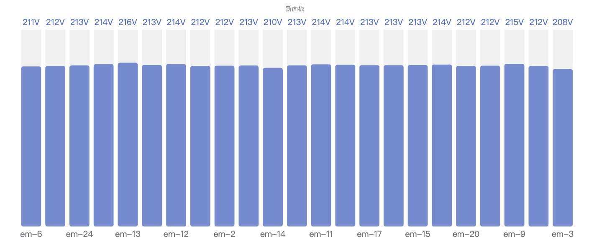

# 4.2.5 Bar Gauge

## 4.2.5.1 Overview

The Bar Gauge displays a value as a filled bar against a configurable scale, similar to a thermometer or progress bar. Color thresholds along the bar visually segment the scale into zones, making it easy to see how far into a range a value has progressed.

Multiple metrics render as multiple bars stacked in the panel, making the Bar Gauge effective for comparing several similar measurements side by side.

## 4.2.5.2 When to Use

Use the Bar Gauge when:

- You want a linear fill metaphor rather than a circular dial
- You are showing capacity utilization, fill levels, or completion percentages
- You need to compare multiple similar measurements (e.g., fill levels across several tanks) in a compact layout
- A progress-bar visual is more intuitive for your audience than a needle gauge

For a single large numeric value without a scale reference, use the Stat Value panel. For a dial-style gauge, use the Gauge Chart.

## 4.2.5.3 Configuration

### Edit Mode Toolbar

In addition to the [common edit mode controls](../01-panels.md#414-panel-edit-mode), the Bar Gauge adds:

<table>
<colgroup><col style="width:10em"/><col/></colgroup>
<thead><tr><th>Control</th><th>Description</th></tr></thead>
<tbody>
<tr><td><strong>Save as Image</strong></td><td>Download the current preview as a PNG image</td></tr>
<tr><td><strong>Full Screen</strong></td><td>Expand the editor preview to fill the browser window</td></tr>
<tr><td><strong>Panel Insights</strong></td><td>Run AI analysis on the current preview data</td></tr>
</tbody>
</table>

### Graph Settings

<table>
<colgroup><col style="width:10em"/><col/></colgroup>
<thead><tr><th>Setting</th><th>Description</th></tr></thead>
<tbody>
<tr><td><strong>Title</strong></td><td>Chart title</td></tr>
<tr><td><strong>Subtitle</strong></td><td>Secondary title</td></tr>
<tr><td><strong>Orientation</strong></td><td><strong>Horizontal</strong> (bar fills left to right) or <strong>Vertical</strong> (bar fills bottom to top)</td></tr>
<tr><td><strong>Show Time</strong></td><td><strong>On</strong> (display a timestamp on the bar) or <strong>Off</strong></td></tr>
<tr><td><strong>Display Mode</strong></td><td>Visual style: <strong>Gradient</strong> (smooth color transition), <strong>Basic</strong> (solid fill), <strong>Retro LCD</strong> (segmented display)</td></tr>
<tr><td><strong>Value Display</strong></td><td>Numeric value color style: <strong>Data Color</strong> (overlaid on bar, colored to match threshold), <strong>Text Color</strong> (overlaid, plain text), <strong>Hidden</strong></td></tr>
<tr><td><strong>Name Placement</strong></td><td>Metric name position: <strong>Auto</strong>, <strong>Top</strong>, <strong>Left</strong>, or <strong>Hidden</strong></td></tr>
<tr><td><strong>Bar Size</strong></td><td><strong>Auto</strong> (bar fills available space) or <strong>Manual</strong> (fixed pixel size)</td></tr>
<tr><td><strong>Min</strong></td><td>Minimum value of the scale (default 0)</td></tr>
<tr><td><strong>Max</strong></td><td>Maximum value of the scale (default 1)</td></tr>
<tr><td><strong>Decimals</strong></td><td>Number of decimal places shown</td></tr>
</tbody>
</table>

#### Display Mode

**Basic** fills each bar with a single solid color determined by the current threshold band, resulting in a clean and minimal look.

**Gradient** renders a smooth color transition from the low end to the high end of the bar, simultaneously conveying both the value magnitude and its position relative to thresholds.

**Retro LCD** splits the bar into discrete segments that mimic the appearance of a liquid-crystal display, suited for dashboards with an industrial instrument aesthetic.

#### Thresholds

Thresholds define color bands along the bar. Each threshold specifies a value and a color; the bar changes color as the value crosses each boundary:

<table>
<colgroup><col style="width:11em"/><col/></colgroup>
<thead><tr><th>Setting</th><th>Description</th></tr></thead>
<tbody>
<tr><td><strong>Thresholds</strong></td><td>Click <strong>+ Add threshold</strong> to define a boundary value and its color</td></tr>
<tr><td><strong>Thresholds Mode</strong></td><td><strong>Absolute</strong> (threshold values are raw data values) or <strong>Percentage</strong> (threshold values are percentages of the Min–Max range)</td></tr>
</tbody>
</table>

## 4.2.5.4 Example Scenarios

**Tank fill levels.** Five storage tanks each have a fill-level metric. All five are added to a single Bar Gauge panel with Horizontal orientation. Thresholds at 20% (red), 50% (yellow), and 80% (green) give operators an instant view of which tanks need attention.

**Capacity utilization comparison.** Three production lines contribute their hourly throughput as metrics. The Bar Gauge shows each line's utilization against a 100% maximum, with Gradient display mode providing a smooth color shift from green to red as utilization increases.

**Battery state of charge.** A battery storage system's state of charge is displayed with a Vertical bar gauge, Min 0% and Max 100%, with Percentage thresholds at 20% (red) and 50% (yellow). The visual immediately communicates how much reserve is available.
