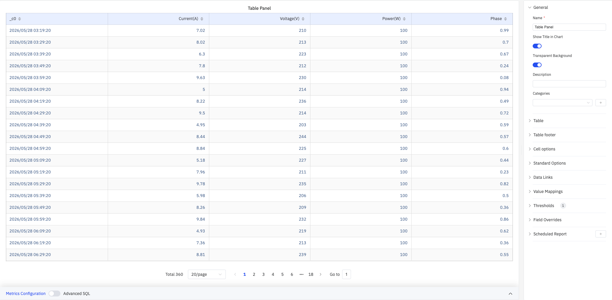
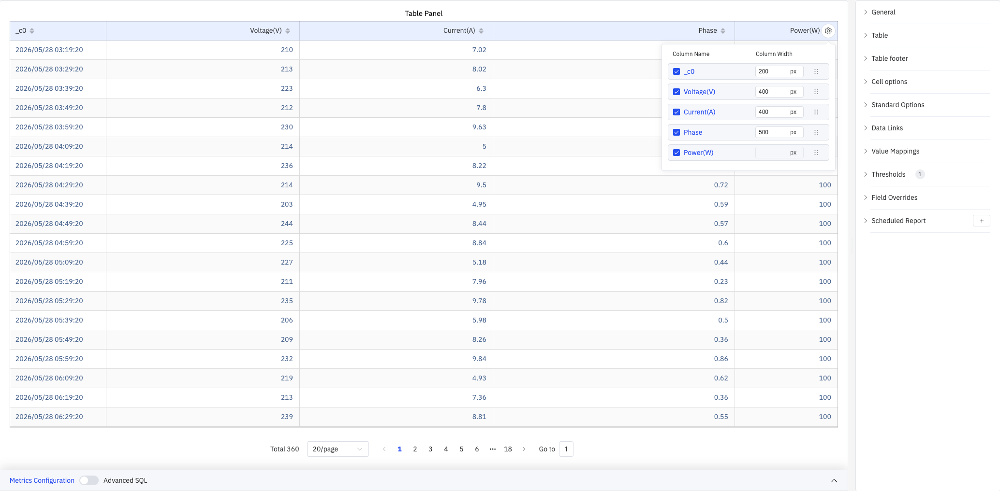
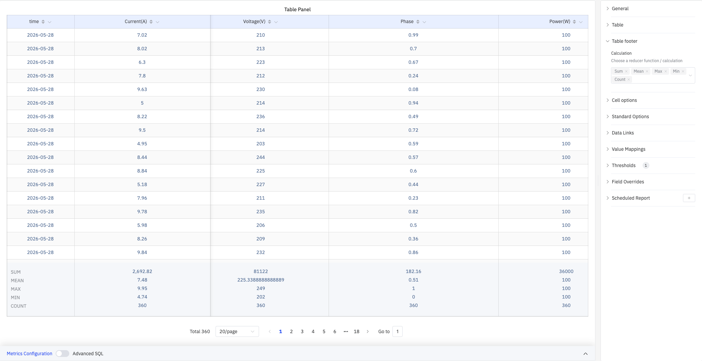
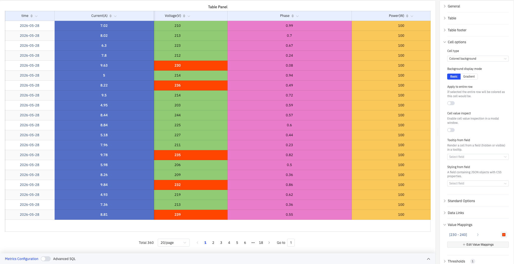

# 4.2.5 Table

## 4.2.5.1 Overview

The Table panel displays query results in a structured grid with one row per time point and one column per metric. It is the most direct way to read the exact values returned by a query — no aggregation, no visual encoding, just the numbers.

All configured metrics appear as columns, with the timestamp column always included. Pagination controls at the bottom let you navigate large result sets. Multiple cell rendering types (colored text, colored background, gauge bars, etc.) add visual cues while preserving exact values.

## 4.2.5.2 When to Use

Use the Table panel when:

- You need to inspect exact data values rather than visual trends
- You are verifying data quality or checking for missing values
- You want a summary report with footer statistics (sum, mean, etc.)
- You need color-coded cells to visually identify outliers within tabular data

For visual trend analysis, use the Trend Chart. For a single summary number, use the Stat Value panel.

## 4.2.5.3 Configuration

### Table Settings

The Table section controls column layout, pagination, and text display:

| Setting | Description |
|---|---|
| **Column Alias** | Map original column names to display names (e.g., `_c0` → `time`). Only affects the header |
| **Time Format** | Display format for the timestamp column (e.g., `YYYY-MM-DD`) |
| **Show table header** | Toggle the column header row (switch). On by default |
| **Frozen columns** | Number of columns frozen from the left edge, keeping them visible during horizontal scroll |
| **Cell height** | Row height size: Small, Medium, or Large. Default is Medium |
| **Max row height** | Maximum height of a single row in pixels. Set to None for no limit |
| **Enable pagination** | Split data across pages (switch). On by default |
| **Auto flip page** | When pagination is enabled, automatically advance pages at a configurable interval |
| **Minimum column width** | Minimum width in pixels for auto-sized columns (e.g., 400) |
| **Column width** | Fixed width in pixels applied to all columns. Set to Auto for automatic sizing |
| **Column alignment** | Cell content alignment: Auto, Left, Center, or Right. Default is Auto |
| **Wrap text** | Whether to wrap cell content that exceeds the column width (switch) |
| **Header wrap text** | Whether to wrap header text that exceeds the column width (switch) |
| **Column filter** | When enabled, each column header shows a filter icon for filtering values |

#### Column Management

Click the gear icon on a column header to open the column management popup:

- Toggle column visibility with checkboxes
- Set individual Column Width (in pixels) per column
- Drag to reorder columns

### Table Footer

The Table footer displays summary statistics at the bottom of the table:

| Setting | Description |
|---|---|
| **Calculation** | Display summary rows at the bottom. Multiple selections supported: Sum, Mean, Max, Min, Count, First, Last |

As shown above, selecting Sum, Mean, Max, Min, and Count produces footer rows showing the corresponding statistics for each column.

### Cell Options

Cell options control how data values are rendered:

| Setting | Description |
|---|---|
| **Cell type** | How cell values are rendered: Auto, Colored background, Colored text, Gauge, Sparkline, Image, JSON view |
| **Background display mode** | Fill style for Colored background cells: Basic (solid) or Gradient. Only available when Cell type is Colored background |
| **Apply to entire row** | When enabled, the entire row is colored using the cell's threshold color. Only available when Cell type is Colored background |
| **Cell value inspect** | When enabled, clicking a cell opens a modal showing the full value (switch) |
| **Tooltip from field** | Specify a field (visible or hidden) whose value renders as the cell tooltip |
| **Styling from field** | Specify a field containing JSON-formatted CSS properties applied as inline styles to the cell |

#### Colored Background Mode

Setting Cell type to Colored background colors each cell's background based on thresholds and value mappings — ideal for quickly spotting outliers:

#### Gauge Mode

Setting Cell type to Gauge renders a horizontal progress bar in each cell. Bar length and color are determined by the current value relative to thresholds:

### Standard Options

| Setting | Description |
|---|---|
| **Decimals** | Number of decimal places for value display. Leave blank for automatic precision |
| **Color Schema** | How colors are assigned: Single Color, Shades of Color (by series), From thresholds (by value), Classic palette, Classic palette (by series name), or Custom palette |
| **No Value** | Text to display when there is no data. Default is `-` |

### Data Links

Data Links attach clickable URLs to cells:

| Setting | Description |
|---|---|
| **Title** | Display name for the link |
| **URL** | Target URL, supports variable interpolation |
| **Open in New Tab** | Whether to open the link in a new browser tab |
| **One-Click** | When enabled, clicking a cell immediately navigates. Only one link per panel can have this enabled |

### Value Mappings

Value Mappings replace raw data values with custom display text and colors. As shown in the screenshots above, configuring a range mapping [230–240] highlights voltage values in that range with an orange-red color:

| Mapping Type | Description |
|---|---|
| **Value** | Exact match on a specific value or text string |
| **Range** | Match a numeric range |
| **Regex** | Match using a regular expression with replacement |
| **Special** | Match null, NaN, booleans, empty strings, and other special cases |
| **Others** | Match all values not covered by the preceding rules |

### Thresholds

Thresholds define numeric ranges and their associated colors. They take effect when cells use Colored background, Colored text, or Gauge cell types:

| Setting | Description |
|---|---|
| **Thresholds Mode** | How threshold values are interpreted: Absolute (raw data values) or Percentage (percentage of the Min–Max range) |
| **+ Add threshold** | Add a threshold rule consisting of a numeric boundary and a color |

Thresholds take effect when the **Color Schema** in Standard Options is set to **From thresholds (by value)**.

### Field Overrides

Field Overrides let you apply settings to individual columns, overriding the global configuration. Select a column by name (Fields with name), then add properties to override, including: Graph Style, Fill Opacity, Value Mappings, and more.

### Scheduled Report

Scheduled Reports automatically generate and push panel snapshots at a preset interval:

| Setting | Description |
|---|---|
| **Frequency** | Send interval: Weekly, Daily, etc. |
| **Job Start Time** | Date and time of the first execution |
| **End Date** | When the scheduled task stops (leave blank for no end) |
| **Notification Contact Point** | The contact point that receives the report |

## 4.2.5.4 Example Scenarios

**Data quality check.** A data engineer adds all meter attributes to a Table panel with a 3-hour time range. With readings every 10 minutes, 20 rows per page, and 360 total records, they verify row by row that data arrives at the expected interval with no missing or out-of-range values.

**Summary statistics report.** An operations manager selects Sum, Mean, Max, Min, and Count in the Table footer. The footer rows automatically show Current sum of 2,692.82 A, Voltage mean of 225.33 V, etc. — ready for shift-handover reporting.

**Outlier visualization.** Cell type is set to Colored background with a value mapping of [230–240] in orange-red. When voltage enters that range, the corresponding cell background changes color, letting operators instantly locate abnormal periods in a sea of numbers.
