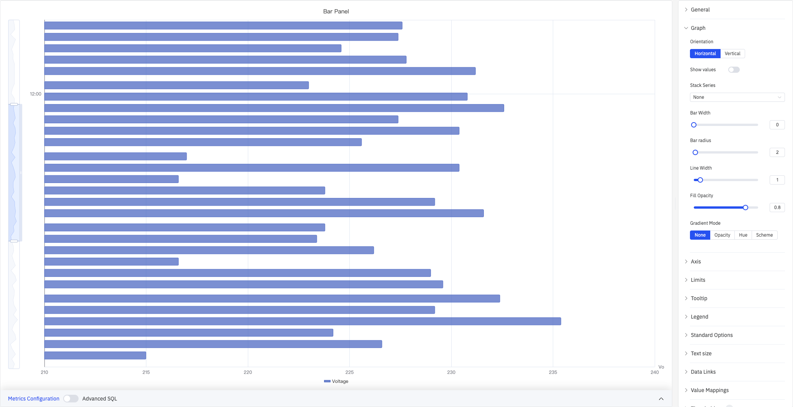
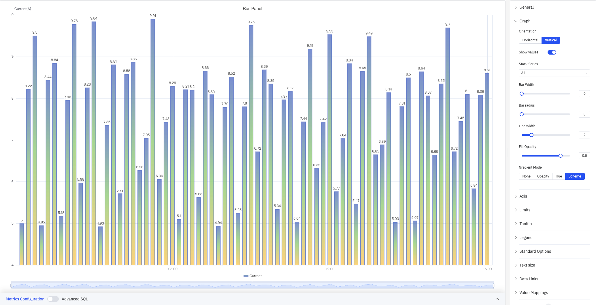
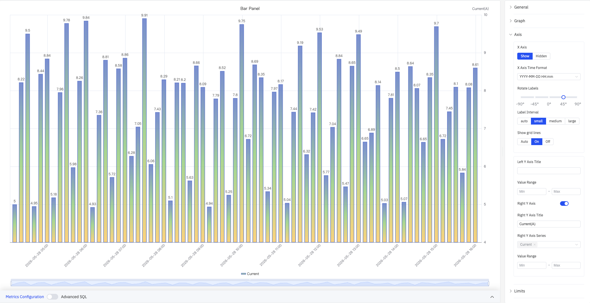
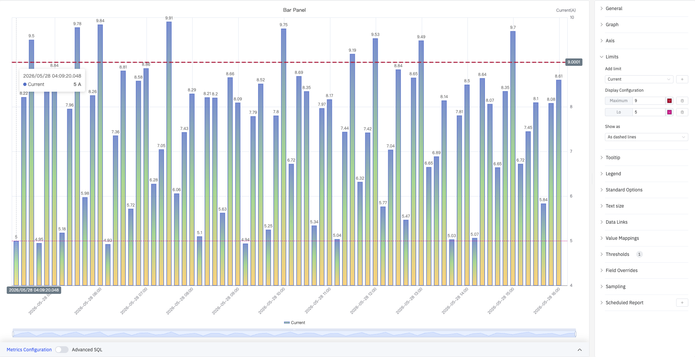
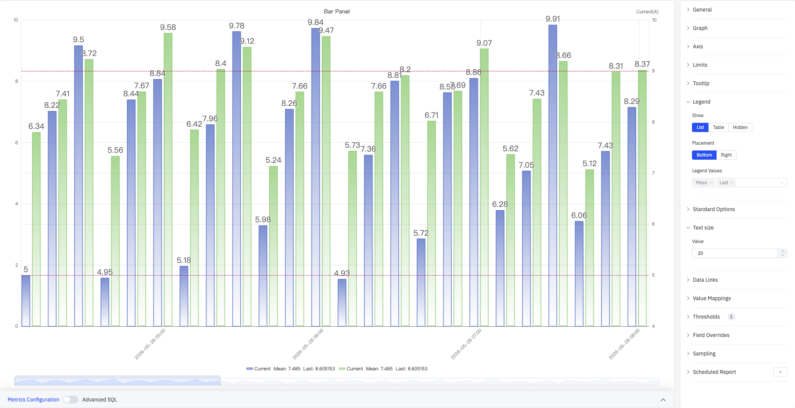

# 4.2.6 Bar Chart

## 4.2.6.1 Overview

The Bar Chart represents values as vertical or horizontal bars, where bar height (or width) encodes the data value. It is designed for aggregated data — values grouped by time buckets or categorical dimensions — making it ideal for comparison across periods or groups.

Each bar corresponds to one aggregated value: a sum, average, or count over a time window (e.g., hourly energy consumption) or over a category (e.g., output per production line). Multiple metrics can be displayed as grouped or stacked bar sets.

## 4.2.6.2 When to Use

Use the Bar Chart when:

- Comparing discrete quantities across time periods (hourly, daily, monthly)
- Comparing the same metric across multiple categories or sites
- Visualizing the contribution of parts to a whole using stacked bars
- The data is inherently aggregated rather than a continuous time-series

For continuous time-series trend analysis, use the Trend Chart. For a single summary value (e.g., total consumption today), use the Stat Value panel.

## 4.2.6.3 Configuration

### Graph Settings

#### Orientation and Stacking

The Bar Chart supports **Vertical** (default) and **Horizontal** layouts. Horizontal bars work better when category labels are long or when comparing many groups side by side:

Enabling **Stack Series** stacks multiple metrics within the same bar, making it easy to see each component's contribution to the total:

#### Bar Style

| Setting | Description |
|---|---|
| **Orientation** | Vertical (bars extend up) or Horizontal (bars extend right) |
| **Bar Alignment** | Position of the bar within its time bucket: Start, Middle, or End |
| **Show Values** | Toggle to display value labels directly on the bars |
| **Stack Series** | Stacking mode: No Stack, Same Sign, All, Positive Only, Negative Only |
| **Bar Width** | Percentage of available slot width filled by each bar, range 0–100 (0 = auto) |
| **Bar Corner Radius** | Rounded corner radius for bar tops, range 0–100 |
| **Line Width** | Border stroke thickness around each bar, range 0–10 (0 = no border) |
| **Fill Opacity** | Opacity of the bar fill color, range 0–1 |
| **Gradient Mode** | Color gradient applied to bars: None, Opacity, Hue, or Scheme |

**Gradient Mode** adds gradient fill effects to bars for enhanced visual depth:

#### Labels

When category labels are long or numerous, they can overlap on the axis. The following settings improve readability:

| Setting | Description |
|---|---|
| **Rotate Labels** | Rotation angle for axis labels, –90° to +90° (in 45° steps) |
| **Label Interval** | Label density: Auto, Small, Medium, Large |

### Axis Settings

The Y axis can be labeled with a name, and its range can be set manually. When plotting multiple metrics with very different scales, enable the **Right Y Axis** to assign each metric to its own scale:

| Setting | Description |
|---|---|
| **X Axis** | Show or hide the X axis |
| **X-Axis Time Format** | Display format for X-axis timestamps. Leave blank for automatic formatting |
| **Rotate Labels** | Rotation angle for X-axis labels, –90° to +90° |
| **Label Interval** | Label density: Auto, Small, Medium, Large |
| **Show Grid Lines** | Grid-line visibility: Auto, Show, or Hide |
| **Left Y Axis Title** | Label for the left Y axis |
| **Value Range** | Min and Max for the left Y axis (blank = auto-scale) |
| **Right Y Axis** | Enable a secondary Y axis on the right |
| **Right Y Axis Title** | Label for the right Y axis. Available when the right axis is enabled |
| **Right Y Axis Series** | Select which series are bound to the right Y axis |
| **Value Range (Right)** | Min and Max for the right Y axis. Available when enabled |

### Limits

Limit lines derived from attribute configuration — LoLo, Lo, Target, Hi, HiHi — can be displayed as horizontal reference lines across the bars, marking safe and alert zones:

| Setting | Description |
|---|---|
| **Add Limits** | Select the metric source, then choose a limit type from the dropdown. Multiple limits can be added |
| **Display As** | How limits are rendered: Line, Area, or Both |

### Tooltip

The tooltip appears when hovering over a bar, displaying detailed values for that data point. In "All" mode, the tooltip shows all series values at that time:

| Setting | Description |
|---|---|
| **Tooltip Mode** | Hover display mode: Single, All, or Hidden |
| **Value Sort** | Sort order for values when Tooltip Mode is All: None, Ascending, or Descending |
| **Hide Zero Values** | Whether to hide values equal to 0 from the tooltip when mode is All |
| **Max Width** | Maximum tooltip width in pixels |
| **Max Height** | Maximum tooltip height in pixels |

### Legend

In table mode, the legend displays summary statistics (max, min, mean, sum, etc.) alongside each series:

| Setting | Description |
|---|---|
| **Show** | Display mode: List, Table, or Hidden |
| **Placement** | Position: Bottom or Right |
| **Width** | Legend panel width in pixels. Available when placement is Right |
| **Legend Values** | Statistics shown in table mode. Multiple selections supported: Max, Min, Mean, Sum, Count, First, Last, and others |

### Standard Options

| Setting | Description |
|---|---|
| **Min** | Reference minimum value for display scaling. Leave blank for auto-calculation from data |
| **Max** | Reference maximum value for display scaling. Leave blank for auto-calculation from data |
| **Decimals** | Number of decimal places for value display. Leave blank for automatic precision |
| **Color Scheme** | How series colors are assigned: Single Color, Shades of Color (by series), From Thresholds (by value), Classic Palette, Classic Palette (by series name), or Custom Palette |

### Data Links

Data Links attach clickable URLs to data points, allowing navigation from the chart to related detail pages:

| Setting | Description |
|---|---|
| **Title** | Display name for the link |
| **URL** | Target URL, supports variable interpolation |
| **Open in New Tab** | Whether to open the link in a new browser tab |
| **One-Click** | When enabled, clicking a data point immediately navigates to the URL. Only one link per panel can have this enabled |

### Value Mappings

Value Mappings replace raw data values with custom display text and colors:

| Mapping Type | Description |
|---|---|
| **Value** | Exact match on a specific value or text string |
| **Range** | Match a numeric range |
| **Regex** | Match using a regular expression and replace with substituted text |
| **Special** | Match null, NaN, booleans, empty strings, and other special cases |
| **Other** | Match all values not covered by the preceding rules |

### Color Thresholds

Color thresholds dynamically change bar color based on value, highlighting data that exceeds normal operating ranges:

| Setting | Description |
|---|---|
| **Thresholds Mode** | How threshold values are interpreted: Absolute or Percentage |
| **Add Threshold** | Add a threshold rule consisting of a numeric boundary and a color |

Color thresholds take effect when the **Color Scheme** in Standard Options is set to **From Thresholds**.

### Overrides

Overrides let you apply style settings to individual series, overriding the global graph configuration for that metric only. Select a metric by name, then add properties to override: Series Style, Line Width, Fill Opacity, Line Opacity, Line Color, Point Size, Show Points, Connect Nulls, Stack, Gradient Mode, Show Values.

### Downsampling

When query results contain too many data points, downsampling reduces the number of rendered points to improve display performance:

| Setting | Description |
|---|---|
| **Enable Downsampling** | Toggle. Disabled by default |
| **Max Data Points** | Maximum number of data points retained after downsampling |
| **Aggregation Function** | Aggregation method applied during downsampling, such as AVG, MAX, or MIN |

### Scheduled Report

The bar chart panel supports scheduled reports, which periodically deliver the chart as an image to a specified email or Feishu group. Access the configuration from the panel's top-right menu.

## 4.2.6.4 Example Scenarios

**Daily energy consumption comparison.** An energy analyst compares electricity consumption across each day of the past month. A bar chart with a 1-day sliding window shows one bar per day, with the Hi limit line highlighting days that exceeded the target consumption level.

**Site-by-site throughput.** An operations manager adds a dimension grouping by site name, with each bar representing one site's total production output for the selected period. Switching to horizontal layout improves readability when site names are long.

**Residential vs. industrial load stacking.** Two metrics — residential consumption and industrial consumption — are added to the same bar chart with Stack Series enabled. Each bar shows the total load with the two components visually separated by color, making it easy to see which component dominates at each time bucket.
