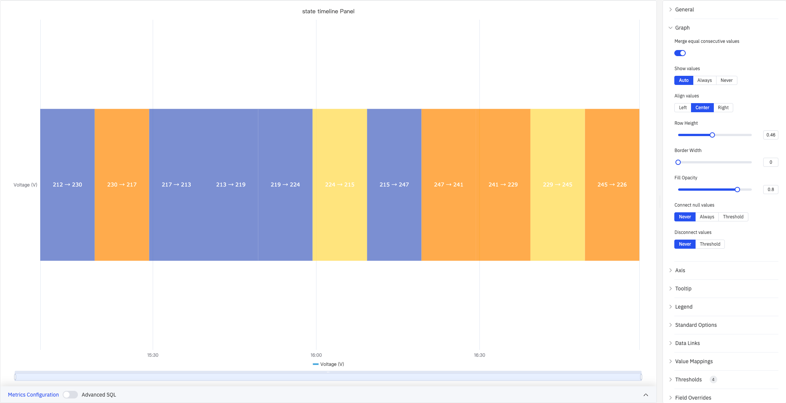
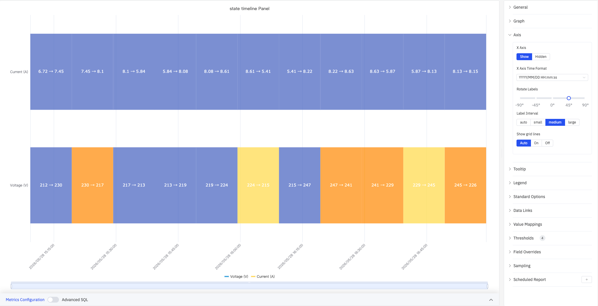

# 4.2.7 State Timeline

## 4.2.7.1 Overview

The State Timeline displays how a value changes over time as a horizontal colored band. Each segment of the band is colored and labeled according to the value it represents, making it easy to see at a glance how long a process was in each state and when transitions occurred.

Each segment shows the start and end values for that time interval (e.g., 212→230), with color determined by threshold or value mapping rules. Multiple metrics render as stacked horizontal bands, enabling side-by-side comparison of state histories across different signals.

## 4.2.7.2 When to Use

Use the State Timeline when:

- Your data represents discrete states rather than continuous measurements (on/off, running/idle/fault, open/closed)
- You want to see how long a process spent in each state and when transitions happened
- You need to compare state histories across multiple signals or equipment on the same time axis

For continuous numeric signals, use the Trend Chart. For a compact grid view of states bucketed by time interval across many metrics, use the Status History panel.

## 4.2.7.3 Configuration

### Graph Settings

Graph settings control the appearance and data-handling behavior of state bands:

The screenshot shows three stacked metrics: Power (W) is merged into a single band because its value is constant, while Current (A) and Voltage (V) each show individual segments.

| Setting | Description |
|---|---|
| **Merge Consecutive Values** | When enabled, adjacent segments with the same value are merged into a single band. Default is On |
| **Show Values** | Whether to display the value label inside each segment: Auto, Always, or Never |
| **Value Alignment** | Horizontal alignment of labels within segments: Left, Center, or Right. Default is Center |
| **Row Height** | Relative height of each band, range 0–1 |
| **Border Width** | Width of the border drawn around each segment in pixels (0 = no border), range 0–10 |
| **Fill Opacity** | Transparency of the state color fill, range 0–1 |
| **Connect Nulls** | How to handle null/missing data: Never (leave gaps), Always (extend previous state), or Threshold (connect if gap is smaller than specified duration). Default is Never |
| **Disconnect Values** | Break the band when the gap between adjacent data points exceeds a specified duration: Never or Threshold. Default is Never |

### Axis

The State Timeline uses the X axis only:

| Setting | Description |
|---|---|
| **X Axis** | Show or hide the X axis |
| **X Axis Time Format** | Display format for X-axis timestamps. Available when X Axis is shown |
| **Rotate Labels** | Rotation angle for X-axis time labels, range -90° to +90° |
| **Label Interval** | Density of X-axis labels: Auto, Small, Medium, or Large |
| **Show Grid Lines** | Whether to render X-axis grid lines: Auto, On, or Off |

### Tooltip

When hovering over a segment, the tooltip shows the segment's start time, end time, duration, and value:

| Setting | Description |
|---|---|
| **Tooltip Mode** | What is shown when hovering: Single (only the hovered metric) or Hidden |
| **Max Width** | Maximum width of the tooltip in pixels |

### Legend

| Setting | Description |
|---|---|
| **Show** | Display mode: List, Table, or Hidden |
| **Placement** | Position: Bottom or Right |
| **Width** | Legend panel width in pixels. Available when placement is Right |
| **Legend Values** | Statistics shown in table mode. Multiple selections supported: Max, Min, Mean, Sum, Count, and others |

### Standard Options

| Setting | Description |
|---|---|
| **Min** | Lower bound for values. Leave blank for auto-calculation from data |
| **Max** | Upper bound for values. Leave blank for auto-calculation from data |
| **Decimals** | Number of decimal places for value display. Leave blank for automatic precision |
| **Color Scheme** | How series colors are assigned: Single Color, Shades of Color (by series), From Thresholds (by value), Classic Palette, Classic Palette (by series name), or Custom Palette |

### Data Links

Data Links attach clickable URLs to state bands:

| Setting | Description |
|---|---|
| **Title** | Display name for the link |
| **URL** | Target URL, supports variable interpolation |
| **Open in New Tab** | Whether to open the link in a new browser tab |
| **One-Click** | When enabled, clicking a band immediately follows the link. Only one link per panel can have this enabled |

### Value Mappings and Color Thresholds

Value Mappings define the display color and text label for each state. Color Thresholds define numeric ranges and their associated colors. Used together, they provide flexible coloring and labeling for both discrete states and continuous values:

In the screenshot, a Value Mapping labels Current (A) values in the range [4, 6] as green "LOW". Thresholds divide Voltage (V) into four color zones at boundaries 220, 230, and 250.

**Value Mapping types:**

| Mapping Type | Description |
|---|---|
| **Value** | Exact match on a specific value or text string |
| **Range** | Match a numeric range |
| **Regex** | Match using a regular expression and replace with substituted text |
| **Special** | Match null, NaN, booleans, empty strings, and other special cases |
| **Other** | Match all values not covered by the preceding rules |

**Color Threshold settings:**

| Setting | Description |
|---|---|
| **Thresholds Mode** | How threshold values are interpreted: Absolute (raw data values) or Percentage (percentage of the Min–Max range) |
| **Add Threshold** | Add a threshold rule consisting of a numeric boundary and a color |

Color thresholds take effect when the **Color Scheme** in Standard Options is set to **From Thresholds**.

### Overrides

Overrides let you apply style settings to individual metrics, overriding the global graph configuration for that metric only. Select a metric by name, then add the properties to override. Supported properties include: Series Style, Line Width, Fill Opacity, Line Opacity, Line Color, Point Size, Show Points, Connect Nulls, Stack, Gradient Mode, Show Values.

### Downsampling

When query results contain too many data points, downsampling reduces the number of rendered points to improve display performance:

| Setting | Description |
|---|---|
| **Enable Downsampling** | Toggle. Disabled by default |
| **Max Data Points** | Maximum number of data points retained after downsampling |
| **Aggregation Function** | Aggregation method applied during downsampling, such as AVG, MAX, or MIN |

### Scheduled Report

The State Timeline panel supports scheduled reports, which periodically deliver the chart as an image to a specified email or Feishu group. Access the configuration from the panel's top-right menu.

## 4.2.7.4 Example Scenarios

**Equipment on/off history.** A pump's run state (0 = Off, 1 = Running) is mapped to gray and green using Value Mappings. The state timeline over a 24-hour period shows exactly when the pump was running and how long each run lasted.

**Multi-metric side-by-side comparison.** Voltage (V), Current (A), and Power (W) are added to the same panel as three stacked bands. Power remains constant and is automatically merged into a single segment, making it easy to contrast against the frequently changing Voltage and Current bands.

**Alarm active/inactive history.** Multiple alarm signals are stacked as separate bands. A maintenance engineer reviews a week of history to identify which alarms were most frequently active and whether they correlate in time.
