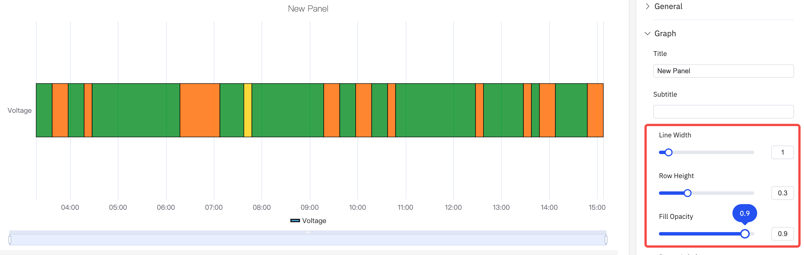
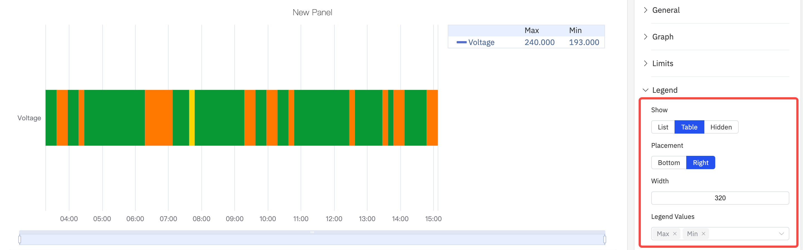

# 4.2.8 State Timeline

## Overview

The State Timeline displays how a value changes over time as a horizontal colored band. Each segment of the band is colored and labeled according to the value it represents, making it easy to see at a glance how long a process was in each state and when transitions occurred.

Multiple metrics render as multiple stacked horizontal bands, enabling side-by-side comparison of state histories across different signals.

## When to Use

Use the State Timeline when:

- Your data represents discrete states rather than continuous measurements (on/off, running/idle/fault, open/closed)
- You want to see how long a process spent in each state and when transitions happened
- You need to compare state histories across multiple signals or equipment on the same time axis

For continuous numeric signals, use the Trend Chart. For a compact grid view of states bucketed by time interval across many metrics, use the Status History panel.

## Configuration

### Edit Mode Toolbar

In addition to the [common edit mode controls](../01-panels.md#424-panel-edit-mode), the State Timeline adds:

| Control | Description |
|---|---|
| **Save as Image** | Download the current preview as a PNG image |
| **Full Screen** | Expand the editor preview to fill the browser window |
| **Panel Insights** | Run AI analysis on the current preview data |

### Graph Settings

The appearance of each state band is controlled by the following settings:

| Setting | Description |
|---|---|
| **Title** | Chart title |
| **Subtitle** | Secondary title |
| **Border Width** | Width of the border drawn around each state segment (0 = no border) |
| **Row Height** | Relative height of each band (default 0.3) |
| **Fill Opacity** | Transparency of the state color fill, 0–1 |
| **Rotate Labels** | Rotation of X-axis time labels |
| **Label Interval** | Density of X-axis labels |

State colors and labels are determined by the **Value Mapping** configuration, where you map each value (e.g., 0, 1, "Running") to a display color and text label.

### Limits Settings

Limit lines can be overlaid on the timeline to mark threshold values:

### Legend Settings

The legend identifies each state color. In Table mode it can also show summary statistics:

| Setting | Description |
|---|---|
| **Show** | Display mode: List, Table, or Hidden |
| **Placement** | Position: Bottom or Right |
| **Legend Values** | Statistics shown in Table mode |

## Example Scenarios

**Equipment on/off history.** A pump's run state (0 = Off, 1 = Running) is mapped to gray and green respectively. The state timeline over a 24-hour period shows exactly when the pump was running and for how long each run lasted.

**Multi-mode process timeline.** A batch reactor has four operating modes: Heating, Reaction, Cooling, Idle. Each mode is mapped to a distinct color. The timeline shows the full batch cycle from start to finish and makes it immediately visible if any phase ran longer than expected.

**Alarm active/inactive history.** Multiple alarm signals are stacked as separate bands. A maintenance engineer reviews a week of history to identify which alarms were most frequently active and whether they correlate in time.
