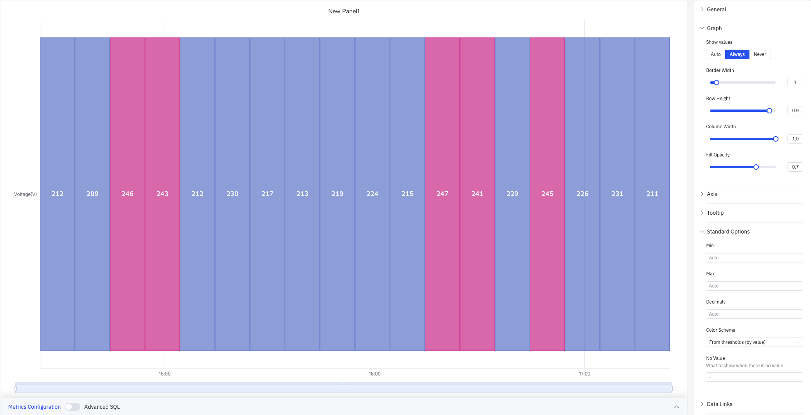
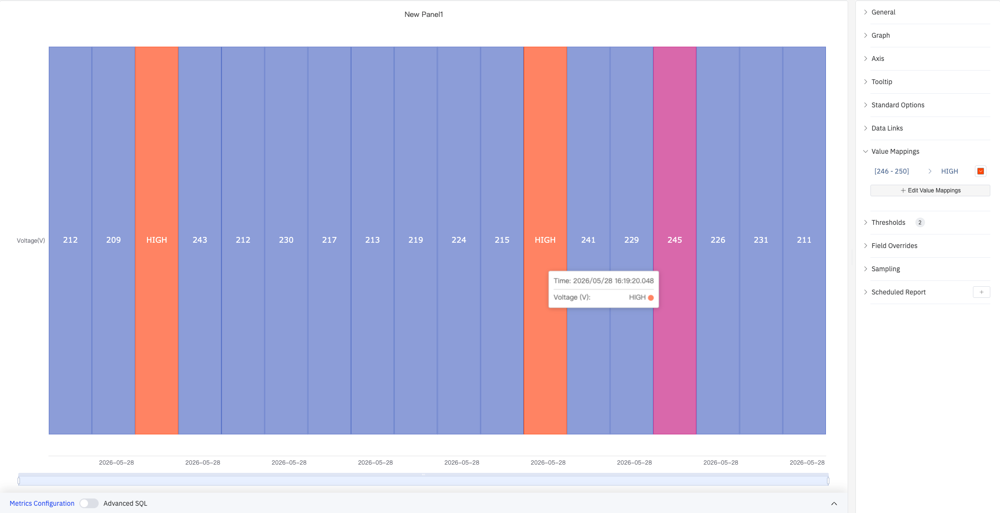
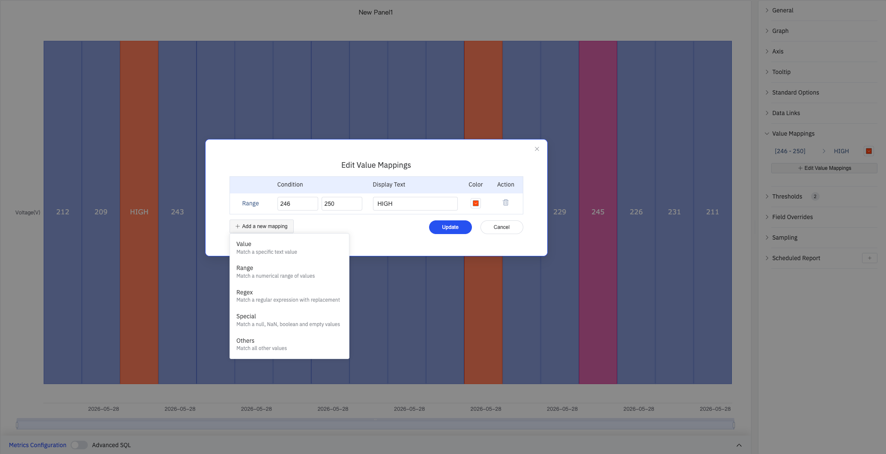

# 4.2.8 Status History

## 4.2.8.1 Overview

The Status History panel displays a grid of colored cells where each column represents a time bucket and each row represents a metric. It provides a compact, calendar-style view of state patterns across multiple dimensions simultaneously — ideal for spotting recurring patterns, shifts, or periods of abnormal behavior across a long time range.

The screenshot shows Current (A) and Voltage (V) displayed side by side, with each column representing one time bucket colored according to the configured color scheme or threshold rules.

## 4.2.8.2 When to Use

Use the Status History panel when:

- You want a high-level calendar-style overview of states across many time buckets (hours, days, shifts)
- You are comparing state patterns across multiple metrics or devices at the same time
- You need to answer questions like "which hours this week had out-of-limit conditions?" or "which devices were in alarm on Monday?"

For a continuous band showing every state transition in detail, use the State Timeline instead.

## 4.2.8.3 Configuration

### Graph Settings

Graph settings control the appearance of the grid cells:

| Setting | Description |
|---|---|
| **Show Values** | Whether to display a value label inside each cell: Auto, Always, Never |
| **Border Width** | Width of the border between cells (0–10) |
| **Row Height** | Relative height of each row (0–1) |
| **Column Width** | Relative width of each time-bucket column (0–1) |
| **Fill Opacity** | Transparency of the cell fill color (0–1) |

The time bucket size is controlled by the **Sliding Window** setting in the data configuration. For example, a 1-hour sliding window produces one column per hour.

### Axis

The Status History panel configures only the X axis:

| Setting | Description |
|---|---|
| **X Axis** | Show or hide the X axis |
| **X Axis Time Format** | Display format for X axis timestamps. Available when X axis is shown |
| **Rotate Labels** | Rotation angle for X axis time labels, -90° to +90° |
| **Label Interval** | Density of X axis labels: Auto, Small, Medium, Large |
| **Show Grid Lines** | Whether to display X axis grid lines: Auto, On, Off |

### Tooltip

When hovering over a cell, the tooltip shows the time bucket's timestamp and the metric value:

| Setting | Description |
|---|---|
| **Tooltip Mode** | Display mode on hover: Single (hovered metric only) or Hidden |
| **Max Width** | Maximum tooltip width in pixels |

### Standard Options

| Setting | Description |
|---|---|
| **Min** | Lower bound for values. Leave blank to auto-calculate from data |
| **Max** | Upper bound for values. Leave blank to auto-calculate from data |
| **Decimals** | Number of decimal places to display. Leave blank for auto |
| **Color Scheme** | How series colors are assigned: Single Color, Shades of Color (by series), From Thresholds (by value), Classic Palette, Classic Palette (by series name), or Custom Palette |

### Data Links

Data links attach clickable URLs to cells:

| Setting | Description |
|---|---|
| **Title** | Display name for the link |
| **URL** | Target URL, supports variable interpolation |
| **Open in New Tab** | Whether to open the link in a new browser tab |
| **One-Click** | When enabled, clicking a cell immediately navigates to the URL. Only one link per panel can have this enabled |

### Value Mappings

Value Mappings replace raw data values with custom display text and colors — this is the primary way to configure how states appear in the grid. The screenshot shows the range [246–250] mapped to an orange-red "HIGH" label:

Click **Edit Value Mappings** to open the mapping dialog, where you select a mapping type and configure the condition, display text, and color:

| Mapping Type | Description |
|---|---|
| **Value** | Exact match on a specific value or text string |
| **Range** | Match a numeric range |
| **Regex** | Match using a regular expression and replace with substituted text |
| **Special** | Match null, NaN, booleans, empty strings, and other special cases |
| **Others** | Match all values not covered by the preceding rules |

### Color Thresholds

Color Thresholds define numeric ranges and their associated colors, making them suitable for continuous metrics like voltage or temperature. The **Color Scheme** must be set to **From Thresholds (by value)** for thresholds to take effect:

The screenshot configures a threshold of 245 (pink) and a Base (blue). Time buckets where voltage exceeds 245 V are shown in pink; all others are shown in blue.

| Setting | Description |
|---|---|
| **Add Threshold** | Add a threshold rule consisting of a numeric boundary and a color |

### Overrides

Overrides let you apply style settings to individual metrics, overriding the global graph configuration for that metric only. Select a metric by name, then add the properties to override. Supported properties include: Series Style, Line Width, Fill Opacity, Line Opacity, Line Color, Point Size, Show Points, Connect Nulls, Stack, Gradient Mode, Show Values.

### Downsampling

When query results contain too many data points, downsampling reduces the number of rendered points to improve display performance:

| Setting | Description |
|---|---|
| **Enable Downsampling** | Toggle. Disabled by default |
| **Max Data Points** | Maximum number of data points retained after downsampling |
| **Aggregation Function** | Aggregation method applied during downsampling, such as AVG, MAX, or MIN |

### Scheduled Report

The Status History panel supports scheduled reports, which periodically deliver the chart as an image to a specified email or Feishu group. Access the configuration from the panel's top-right menu.

## 4.2.8.4 Example Scenarios

**Weekly alarm heatmap.** Ten alarm signals are added as rows with a 1-hour sliding window, producing 168 columns (one per hour over 7 days). Value mappings set 0 → gray and 1 → red. The resulting grid shows at a glance which devices were in alarm at which hours throughout the week.

**Shift-by-shift operating mode review.** An 8-hour sliding window across a month produces one column per shift. Each row represents a production line's operating mode. The operations manager can immediately see which shifts ran in the expected mode and which had unplanned stoppages.

**Out-of-limit condition calendar.** A quality engineer adds 12 process variables as rows with a 1-day sliding window. Value mappings color cells green (in-limit) or red (out-of-limit). The resulting calendar view highlights which days had quality issues across the process.

Use the Status History panel when:

- You want a high-level calendar-style overview of states across many time buckets (hours, days, shifts)
- You are comparing state patterns across multiple metrics or devices at the same time
- You need to answer questions like "which hours this week had out-of-limit conditions?" or "which devices were in alarm on Monday?"

For a continuous band showing every state transition in detail, use the State Timeline instead.

