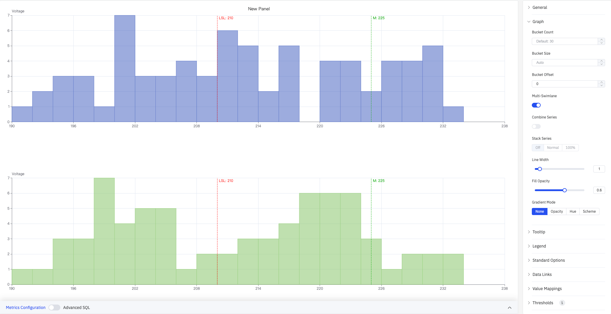
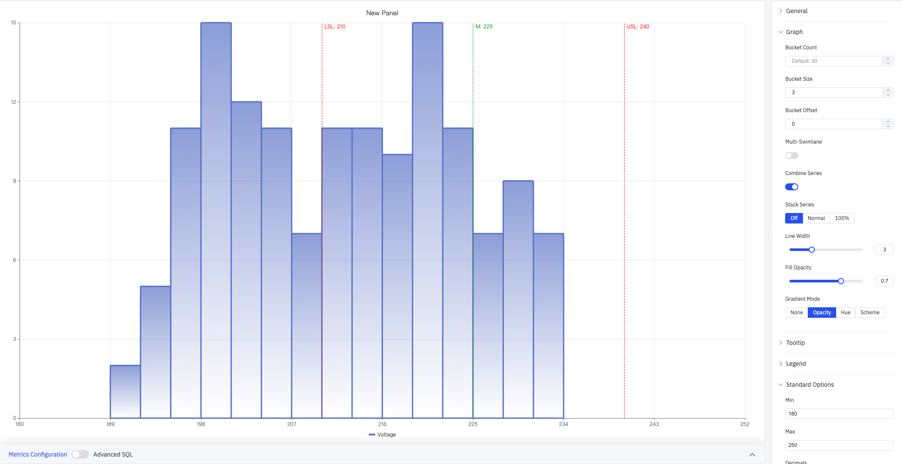

# 4.2.9 Histogram

## 4.2.9.1 Overview

The Histogram groups continuous numeric values into equal-width intervals (buckets) and uses bar height to show the count (frequency) of data points in each interval. It is the standard tool for analyzing the shape, central tendency, and spread of a single variable's distribution.

The screenshot shows a Voltage histogram (X axis 180–250 V, Y axis frequency count 0–15) with three reference lines overlaid: LSL:210 (red dashed, lower spec limit), M:225 (green dashed, mean/target), and USL:240 (red dashed, upper spec limit). The right panel lists all configuration sections: General, Graph, Tooltip, Legend, Standard Options, Data Links, Value Mappings, Thresholds(1), Field Overrides, Scheduled Report.

## 4.2.9.2 When to Use

Use the Histogram when:

- You need to understand the distribution shape of a process variable (normal, skewed, bimodal, etc.)
- You want to assess process capability by checking whether data concentrates within specification limits
- You want to compare distributions across multiple metrics or time periods
- You want to overlay USL/LSL reference lines on the distribution and view process capability indices

## 4.2.9.3 Configuration

### Graph Settings

Graph settings control how data is bucketed, how multiple series are displayed, and the visual style of bars:

The screenshot shows the Graph panel expanded with Bucket Size set to 3 (each interval spans 3 V), Gradient Mode set to None, and Stack Series set to Off. The tooltip shows the hovered bucket range (222–225) and its count (Voltage: 7).

| Setting | Description |
|---|---|
| **Bucket Count** | Number of equal-width intervals to divide the data range into (1–1000). Leave blank for the default of 30 |
| **Bucket Size** | Fixed width of each interval. Leave blank to auto-calculate from the data range and Bucket Count |
| **Bucket Offset** | Offset for interval boundaries, used to align buckets (default 0) |
| **Multi-Swimlane** | When enabled, each metric is displayed in its own lane with an independent Y axis. Disabled by default |
| **Combine Series** | When enabled, all metrics are merged into a single distribution. Not available when Multi-Swimlane is enabled |
| **Stack Series** | How multiple metric bars are stacked: Off (separate, default), Normal (absolute stacking), 100% (percentage stacking). Not available when Multi-Swimlane is enabled |
| **Line Width** | Width of bar borders (0–10) |
| **Fill Opacity** | Transparency of bar fill color (0–1) |
| **Gradient Mode** | Gradient applied to bar fill: None, Opacity, Hue, Scheme |

**Stack Series: Normal** (screenshot below) stacks bars from multiple metrics so each bucket's total height equals the combined count across all metrics:

**Stack Series: 100%** (screenshot below) normalizes each bucket to 100%, showing the relative proportion of each metric rather than absolute counts:

**Multi-Swimlane** (screenshot below) shows each metric in a separate horizontal lane with its own Y axis, making it easy to compare individual distribution shapes side by side:

**Combine Series** (screenshot below) merges data from all metrics into a single distribution. The Standard Options panel is also expanded in this screenshot, with Min set to 180 and Max to 250 to fix the X axis range:

### Tooltip and Legend

Tooltip and Legend work together to provide supplementary information for histogram buckets:

The screenshot shows the Tooltip panel with mode set to **All** and Values sort order set to Ascending, and the Legend panel with List mode and Right placement. The legend entries for the two Voltage series appear on the right side of the chart.

**Tooltip settings:**

| Setting | Description |
|---|---|
| **Tooltip mode** | Hover display mode: Single (hovered bucket only), All (all metrics), Hidden |
| **Values sort order** | Sort order for multiple metrics in the tooltip: None, Ascending, Descending |
| **Max width** | Maximum tooltip width in pixels |
| **Max height** | Maximum tooltip height in pixels |

**Legend settings:**

| Setting | Description |
|---|---|
| **Show** | Display mode: List, Table, or Hidden |
| **Placement** | Position: Bottom or Right |
| **Width** | Legend panel width in pixels. Available when placement is Right |
| **Legend Values** | Statistics shown in Table mode. Multiple selections supported |

### Standard Options

| Setting | Description |
|---|---|
| **Min** | Lower bound for the X axis value range (leave blank to auto-calculate from data) |
| **Max** | Upper bound for the X axis value range (leave blank to auto-calculate from data) |
| **Decimals** | Number of decimal places to display (leave blank for auto) |
| **Color Scheme** | How series colors are assigned: Single Color, Shades of Color (by series), From Thresholds (by value), Classic Palette, Classic Palette (by series name), or Custom Palette |

### Data Links

Data Links attach clickable URLs to bars:

| Setting | Description |
|---|---|
| **Title** | Display name for the link |
| **URL** | Target URL, supports variable interpolation |
| **Open in New Tab** | Whether to open the link in a new browser tab |
| **One-Click** | When enabled, clicking a bar immediately navigates to the URL. Only one link per panel can have this enabled |

### Value Mappings

Value Mappings translate raw data values into display text and colors:

| Mapping Type | Description |
|---|---|
| **Value** | Exact match for a specific number or text |
| **Range** | Match a numeric range |
| **Regex** | Match using a regular expression and replace display text |
| **Special** | Match null, NaN, booleans, empty strings, and other special cases |
| **Other** | Catch-all for any value not matched by earlier rules |

### Color Thresholds

Color Thresholds define value ranges and their associated colors:

| Setting | Description |
|---|---|
| **Add Threshold** | Add a threshold rule consisting of a numeric boundary and a color |

Color thresholds take effect when the **Color Scheme** in Standard Options is set to **From Thresholds (by value)**.

### Overrides

Overrides let you apply style settings to individual series, overriding global graph settings for that metric only. Select a metric by name, then add the properties to override. Supported properties include: Series Style, Line Width, Fill Opacity, Line Opacity, Line Color, Point Size, Show Points, Connect Nulls, Stack, Gradient Mode, Show Values.

### Scheduled Report

The Histogram panel supports scheduled reports, which periodically deliver the chart as an image to a specified email or Feishu group. Access the configuration from the panel's top-right menu.

## 4.2.9.4 Data Analysis

In edit mode, click the **Data Analysis** button to open the analysis dialog. It provides two tabs for overlaying reference lines on the distribution and viewing process capability indices.

### 4.2.9.4.1 Mark Line Config

Select the target metric in the **Attribute** dropdown. The table lists all configured limit lines. Each line can be independently toggled and styled:

| Setting | Description |
|---|---|
| **Attribute** | The target metric to apply mark lines to |
| **Show** | Whether to display this mark line on the chart |
| **Name** | Mark line name (e.g., USL, LSL, M) and its configured value |
| **Color** | Color of the mark line |
| **Type** | Line style: Dashed, Solid, or Dotted |

### 4.2.9.4.2 Process Capability Analysis

Once both USL and LSL are configured, the system automatically calculates and displays the following process capability indicators for each metric:

| Indicator | Description |
|---|---|
| **μ (Mean)** | Arithmetic mean of the dataset |
| **σ (Std Dev)** | Standard deviation of the dataset, reflecting spread |
| **Cp** | Process capability index: Cp = (USL − LSL) / (6σ). Reflects spread only |
| **Cpk** | Capability index accounting for mean offset: Cpk = min(Cpu, Cpl) |
| **Cpu** | Upper capability index: Cpu = (USL − μ) / (3σ) |
| **Cpl** | Lower capability index: Cpl = (μ − LSL) / (3σ) |

## 4.2.9.5 Example Scenarios

**Process capability analysis.** A quality engineer adds key voltage measurements from a production line over three months and sets Bucket Size to 3. The distribution centers around 212 V. After configuring USL=240 and LSL=210 in the Data Analysis dialog, the Process Capability Analysis tab shows a Cpk of about 0.06, indicating the process mean is shifted toward the lower limit and the process center needs adjustment.

**Multi-device distribution comparison.** A maintenance engineer adds voltage data from two devices as two separate metrics and switches to Multi-Swimlane mode. The two lanes show distinct distribution shapes — one device concentrates at 220–226 V while the other skews toward lower values, flagging a difference in device health.

**Fleet-wide aggregate distribution.** A data engineer adds measurements from multiple sites as separate metrics and enables Combine Series to merge all data into a single distribution. Combined with USL/LSL reference lines, this quickly shows the overall pass rate across the entire fleet.

