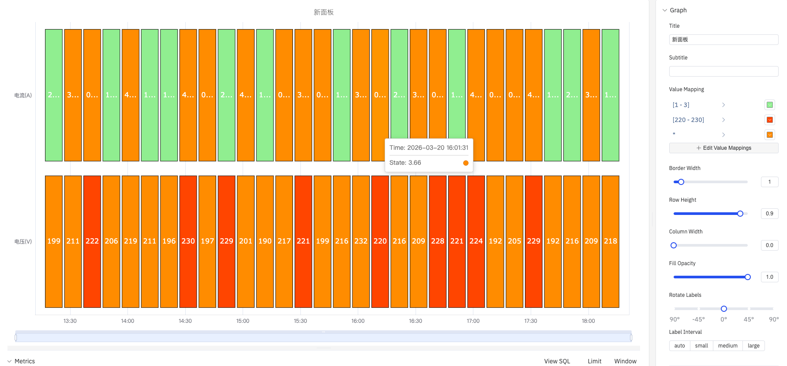
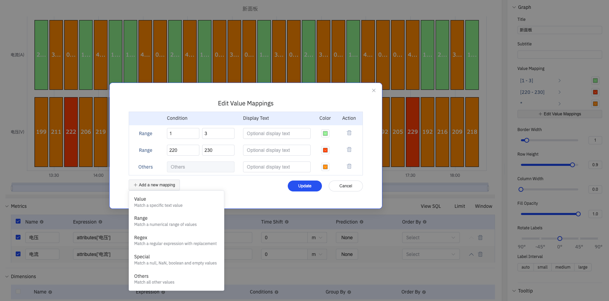

# 4.2.9 Status History

## 4.2.9.1 Overview

The Status History panel displays a grid of colored cells where each column represents a time bucket and each row represents a metric. It provides a compact, calendar-style view of state patterns across multiple dimensions simultaneously — ideal for spotting recurring patterns, shifts, or periods of abnormal behavior across a long time range.

## 4.2.9.2 When to Use

Use the Status History panel when:

- You want a high-level calendar-style overview of states across many time buckets (hours, days, shifts)
- You are comparing state patterns across multiple metrics or devices at the same time
- You need to answer questions like "which hours this week had out-of-limit conditions?" or "which devices were in alarm on Monday?"

For a continuous band showing every state transition in detail, use the State Timeline instead.

## 4.2.9.3 Configuration

### Edit Mode Toolbar

In addition to the [common edit mode controls](../01-panels.md#414-panel-edit-mode), the Status History adds:

<table>
<colgroup><col style="width:10em"/><col/></colgroup>
<thead><tr><th>Control</th><th>Description</th></tr></thead>
<tbody>
<tr><td><strong>Save as Image</strong></td><td>Download the current preview as a PNG image</td></tr>
<tr><td><strong>Full Screen</strong></td><td>Expand the editor preview to fill the browser window</td></tr>
<tr><td><strong>Panel Insights</strong></td><td>Run AI analysis on the current preview data</td></tr>
</tbody>
</table>

### Graph Settings

<table>
<colgroup><col style="width:10em"/><col/></colgroup>
<thead><tr><th>Setting</th><th>Description</th></tr></thead>
<tbody>
<tr><td><strong>Title</strong></td><td>Chart title</td></tr>
<tr><td><strong>Subtitle</strong></td><td>Secondary title</td></tr>
<tr><td><strong>Value Mapping</strong></td><td>Define how data values map to display colors and labels — see section below</td></tr>
<tr><td><strong>Border Width</strong></td><td>Width of the borders between cells (slider)</td></tr>
<tr><td><strong>Row Height</strong></td><td>Relative height of each row (slider)</td></tr>
<tr><td><strong>Column Width</strong></td><td>Width of each time-bucket column (slider)</td></tr>
<tr><td><strong>Fill Opacity</strong></td><td>Transparency of the cell fill color, 0–1</td></tr>
<tr><td><strong>Rotate Labels</strong></td><td>Rotation of X-axis time labels: -90°, -45°, 0°, 45°, or 90°</td></tr>
<tr><td><strong>Label Interval</strong></td><td>Display density of X-axis time labels: <strong>Auto</strong>, <strong>Small</strong>, <strong>Medium</strong>, <strong>Large</strong></td></tr>
</tbody>
</table>

The time bucket size is controlled by the **Sliding Window** setting in the data configuration. For example, a 1-hour sliding window produces one column per hour.

#### Value Mapping

Value mappings translate raw data values into display text and cell colors. Click **+ Edit Value Mappings** to open the mapping editor, which supports five condition types:

<table>
<colgroup><col style="width:10em"/><col/></colgroup>
<thead><tr><th>Condition Type</th><th>Description</th></tr></thead>
<tbody>
<tr><td><strong>Value</strong></td><td>Match a specific text or numeric value</td></tr>
<tr><td><strong>Range</strong></td><td>Match a numeric range by specifying upper and lower bounds</td></tr>
<tr><td><strong>Regex</strong></td><td>Match a regular expression and replace the displayed text</td></tr>
<tr><td><strong>Special Value</strong></td><td>Match special states such as null, NaN, boolean, or empty values</td></tr>
<tr><td><strong>Other Values</strong></td><td>Catch-all rule that matches any value not covered by earlier rules</td></tr>
</tbody>
</table>

Each mapping rule can specify an optional **Display Text** and a **Color**. Rules are evaluated top-to-bottom; the first match wins.

## 4.2.9.4 Example Scenarios

**Weekly alarm heatmap.** Ten alarm signals are added as rows. A 1-hour sliding window produces 168 columns (one per hour over 7 days). Value mappings set 0 → gray and 1 → red. The resulting grid shows at a glance which devices were in alarm and at what hours throughout the week.

**Shift-by-shift operating mode review.** An 8-hour sliding window across a month produces one column per shift. Each row represents a production line's operating mode. The operations manager can immediately see which shifts ran in the expected mode and which had unplanned stoppages.

**Out-of-limit condition calendar.** A quality engineer adds 12 process variables as rows with a 1-day sliding window. Value mappings color cells green (in-limit) or red (out-of-limit). The resulting calendar view highlights which days had quality issues across the process.
