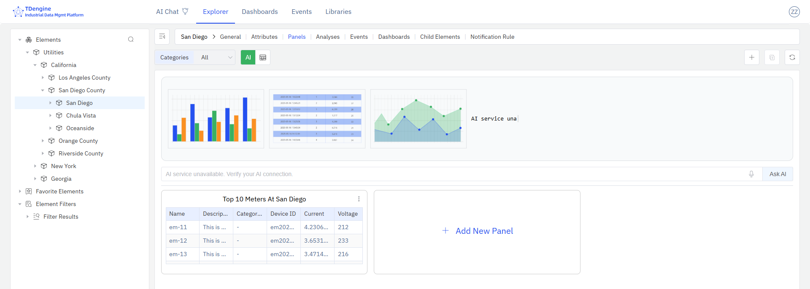
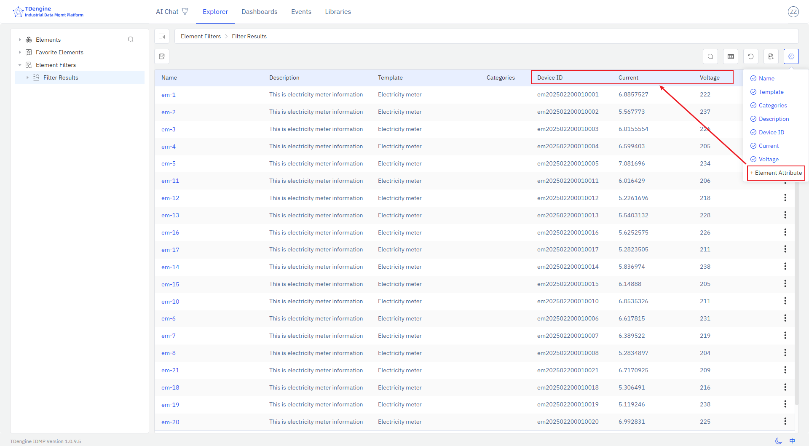
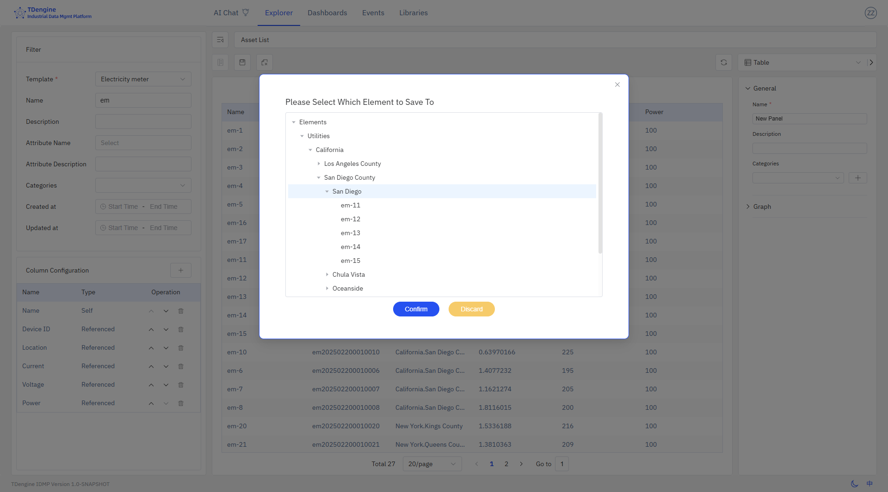
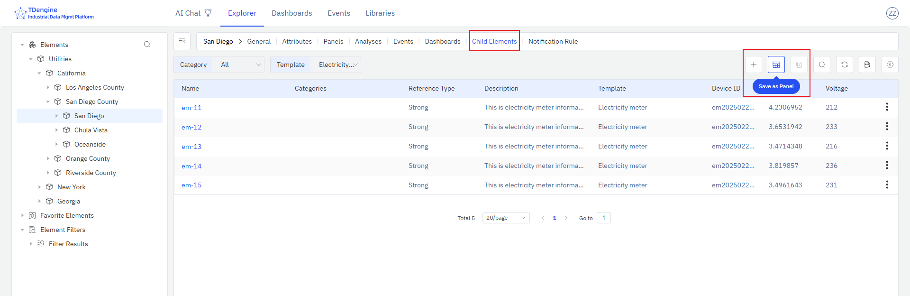
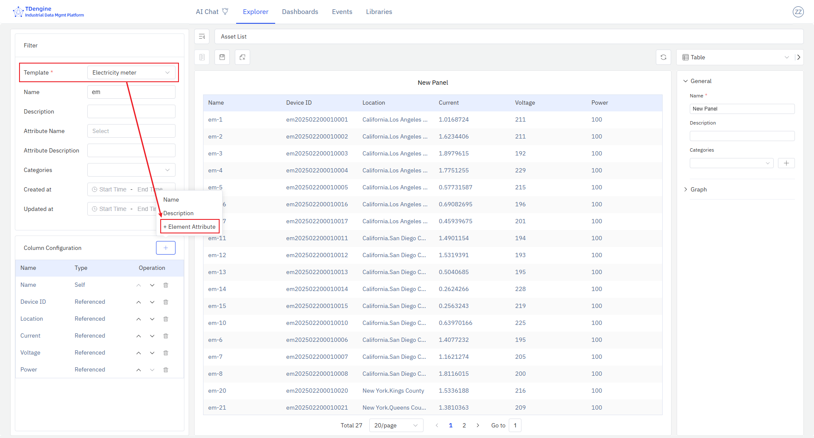

# 4.2.10 Asset List

## 4.2.10.1 Overview

The Asset List panel displays elements in a tabular grid, showing management attributes and the latest measurement values for each element. It is created by saving a filtered element search result or a parent element's child-element list, and can be placed on an element's panel list or added to a dashboard.

## 4.2.10.2 When to Use

Use the Asset List panel when:

- You need a real-time summary of a filtered set of assets and their key attributes on a dashboard
- You want to monitor current measurement values across multiple elements of the same template side by side
- You need a compact inventory or status board for a fleet of devices, meters, or machines

## 4.2.10.3 Configuration

### Saving an Asset List Panel

**From element search results:** Navigate to the element search page, configure your filter conditions, and optionally add attribute columns if all results share the same template. Click a column header to remove columns you do not need. Click **Save as Panel** to open the save dialog and choose where to save the panel.

**From child-element list:** Select a parent element in the asset tree and click the **Child Elements** action. If all child elements share the same template, attribute columns can be added. Click **Save as Panel** to save the current child-element list as an Asset List panel under the parent element. Switch to the **Panels** tab to confirm the new panel.

### Editing an Asset List Panel

Open the panel editor to configure:

| Setting | Description |
|---|---|
| **Asset Type (Template)** | Required. Filters the list to elements of the selected template. Only when a template is selected can template-specific attribute columns be added. |
| **Display Fields** | Configurable set of columns and their display order. Includes IDMP management attributes (Name, Path, Description, Template, Categories) and reference attributes (TDengine Tags and TDengine Metrics). |

## 4.2.10.4 Example Scenarios

**Fleet status board.** A site manager saves an Asset List panel showing all pumps at a site, with columns for operating status, flow rate, and last maintenance date. The panel is added to the site dashboard, giving the manager a live status board for the entire pump fleet without opening individual element pages.

**New-element onboarding check.** A data engineer saves an Asset List of all meters added in the last month, filtered by the Meter template, with columns for Name, Installation Date, and latest reading. The panel makes it easy to verify that all new meters are reporting data correctly.

**Child-equipment summary.** An operations manager navigates to a production line element and saves its child-element list — all machines on the line — as an Asset List panel with columns for current operating mode and output rate. The panel is pinned to the line's dashboard for shift monitoring.
