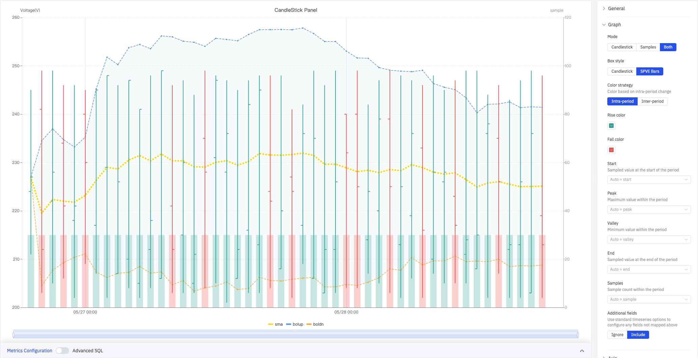
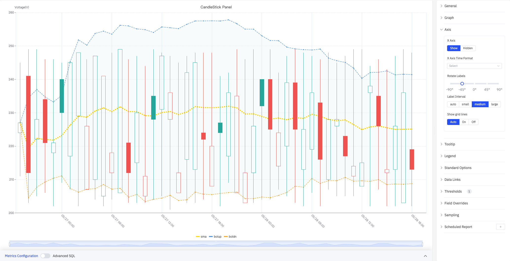
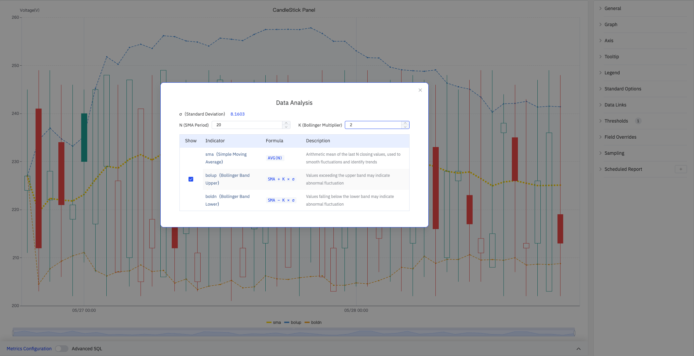

# 4.2.10 Candlestick Chart

## 4.2.10.1 Overview

The Candlestick Chart displays the statistical characteristics of a time series aggregated into fixed time windows. Each candle represents one window's start, peak, valley, and end values (OHLC). Originating from financial market analysis, it can be applied in industrial settings to analyze how equipment parameters fluctuate at the shift or batch level. The Candlestick Chart supports only a single metric.

The screenshot shows the CandleStick Panel in Both mode: the left Y axis is Voltage(V) (200–260) and the right Y axis is sample count (0–120). Green candles indicate the close value is higher than the open (rise); red candles indicate the opposite (fall). The chart overlays an SMA line (yellow dotted), a Bollinger upper band (blue shaded area with dashed line), and a Bollinger lower band (orange dotted line). The tooltip on hover shows the full stats for one candle: start 233, peak 246, valley 202, end 216, sample 30, sma 228.95, bolup 249.074, boldn 208.826.

## 4.2.10.2 When to Use

Use the Candlestick Chart when:

- You need to observe a sensor value's statistical distribution within fixed time windows (start, peak, valley, end)
- You want to quickly identify the range and extremes within each time period
- You want to overlay a Simple Moving Average (SMA) or Bollinger Bands to assist with trend and volatility analysis

## 4.2.10.3 Configuration

### Graph Settings

Graph settings control what the chart displays, how candles are drawn, and how they are colored.

**SPVE Bars** style (screenshot below) renders each candle as a thin vertical line with short horizontal tick marks. It is more compact and suits longer time ranges where many candles need to be shown simultaneously:

**Inter-period** color strategy (screenshot below) colors each candle by comparing its close value to the previous period's close. Hollow candle bodies indicate an intra-period rise (close > open within the same window):

**Mode settings:**

| Setting | Description |
|---|---|
| **Mode** | What to display: Candlestick (candles only), Samples (count bars only), Both (candles and count bars side by side) |
| **Box style** | How candles are rendered: Candlestick (traditional K-line) or SPVE Bars. Available when mode is not Samples |
| **Color strategy** | Candle coloring basis: Intra-period (close vs. open within the same window) or Inter-period (close vs. previous window's close). Available when mode is not Samples |
| **Rise color** | Color of rising candles (default green). Available when mode is not Samples |
| **Fall color** | Color of falling candles (default red). Available when mode is not Samples |

**Field mapping** assigns data source fields to candle attributes. Leave blank to let the system auto-match by keyword:

| Field | Description |
|---|---|
| **Start** | Sampled value at the start of the time window (auto-matches fields containing first / start) |
| **Peak** | Maximum value within the time window (auto-matches fields containing max / peak) |
| **Valley** | Minimum value within the time window (auto-matches fields containing min / valley) |
| **End** | Sampled value at the end of the time window (auto-matches fields containing last / end) |
| **Samples** | Number of data points within the time window. Available when mode is not Candlestick |
| **Additional fields** | How to handle unmapped fields: Ignore or Include (configured via standard time-series options) |

### Axis

The Candlestick Chart configures only the X axis:

The screenshot shows the Axis panel expanded with Label Interval set to medium and Show grid lines set to Auto. The right panel also lists all other configuration sections: Tooltip, Legend, Standard Options, Data Links, Thresholds(1), Field Overrides, Sampling, Scheduled Report.

| Setting | Description |
|---|---|
| **X Axis** | Show or hide the X axis |
| **X Axis Time Format** | Display format for X axis timestamps (available when X axis is shown) |
| **Rotate Labels** | Rotation angle for X axis time labels (-90° to +90°) |
| **Label Interval** | Density of X axis labels: auto, small, medium, large |
| **Show grid lines** | X axis grid line visibility: Auto, On, Off |

### Tooltip

The screenshot shows Tooltip mode set to **All** and Values sort order set to Ascending. The tooltip at 2026-05-28 04:00:00 shows the full candle data: start 239, peak 249, valley 203, end 225, boldn 207.993, sma 228.55, bolup 249.107.

| Setting | Description |
|---|---|
| **Tooltip mode** | Hover display mode: Single (hovered candle only), All (all fields), Hidden |
| **Values sort order** | Sort order for values in the tooltip: None, Ascending, Descending |
| **Hide zeros** | When enabled, items with a value of 0 are hidden in the tooltip |
| **Max width** | Maximum tooltip width in pixels |
| **Max height** | Maximum tooltip height in pixels |

### Legend

| Setting | Description |
|---|---|
| **Show** | Display mode: List, Table, or Hidden |
| **Placement** | Position: Bottom or Right |
| **Width** | Legend panel width in pixels. Available when placement is Right |
| **Legend Values** | Statistics shown in Table mode. Multiple selections supported: Max, Min, Mean, Sum, and others |

### Standard Options

| Setting | Description |
|---|---|
| **Min** | Lower bound for values (leave blank to auto-calculate from data) |
| **Max** | Upper bound for values (leave blank to auto-calculate from data) |
| **Decimals** | Number of decimal places to display (leave blank for auto) |
| **Color Scheme** | How series colors are assigned: Single Color, Shades of Color (by series), From Thresholds (by value), Classic Palette, Classic Palette (by series name), or Custom Palette |

### Data Links

Data Links attach clickable URLs to candles:

| Setting | Description |
|---|---|
| **Title** | Display name for the link |
| **URL** | Target URL, supports variable interpolation |
| **Open in New Tab** | Whether to open the link in a new browser tab |
| **One-Click** | When enabled, clicking a candle immediately navigates to the URL. Only one link per panel can have this enabled |

### Color Thresholds

Color Thresholds define value ranges and their associated colors:

| Setting | Description |
|---|---|
| **Add Threshold** | Add a threshold rule consisting of a numeric boundary and a color |

Color thresholds take effect when the **Color Scheme** in Standard Options is set to **From Thresholds (by value)**.

### Overrides

Overrides let you apply style settings to individual series, overriding global graph settings for that metric only. Select a metric by name, then add the properties to override. Supported properties include: Series Style, Line Width, Fill Opacity, Line Opacity, Line Color, Point Size, Show Points, Connect Nulls, Stack, Gradient Mode, Show Values.

### Downsampling

When query results contain too many data points, downsampling reduces the number of rendered points to improve display performance:

| Setting | Description |
|---|---|
| **Enable Downsampling** | Toggle. Disabled by default |
| **Max Data Points** | Maximum number of data points retained after downsampling |
| **Aggregation Function** | Aggregation method applied during downsampling, such as AVG, MAX, or MIN |

### Scheduled Report

The Candlestick Chart panel supports scheduled reports, which periodically deliver the chart as an image to a specified email or Feishu group. Access the configuration from the panel's top-right menu.

## 4.2.10.4 Data Analysis

In edit mode, click the **Data Analysis** button to open the analysis configuration dialog and overlay statistical indicators on the chart:

The dialog shows the current dataset's **σ (Standard Deviation)**, and lets you configure **N (SMA Period)** and **K (Bollinger Multiplier)**. Each indicator can be independently shown or hidden.

| Indicator | Formula | Description |
|---|---|---|
| **sma (Simple Moving Average)** | AVG(N) | Arithmetic mean of the last N closing values, used to smooth fluctuations and identify trends |
| **bolup (Bollinger Band Upper)** | SMA + K × σ | Values exceeding the upper band may indicate abnormal fluctuation |
| **boldn (Bollinger Band Lower)** | SMA − K × σ | Values falling below the lower band may indicate abnormal fluctuation |

## 4.2.10.5 Example Scenarios

**Shift-level voltage analysis.** A process engineer sets an 8-hour time window and generates a candlestick chart for substation voltage in Both mode, showing both candle bodies and per-shift sample counts. After overlaying the SMA curve and Bollinger Bands, a sustained downward SMA trend approaching the lower band over the past two days becomes visible, flagging a potential anomaly.

**Batch product quality tracking.** A quality engineer uses one batch per time window (one candle per batch) for a critical quality parameter. The candle body height (start-to-end range) shows how much the measurement shifted over the batch, and the wicks show the intra-batch extremes. An unusually wide candle body highlights a batch with poor process control stability.

**Cross-shift trend comparison.** An operations manager switches to the Inter-period color strategy to color candles based on close-to-close changes. Solid red candles (close below prior close) and hollow red candles (intra-period rise but inter-period fall) make it easy to spot consecutive declining shifts at a glance.

